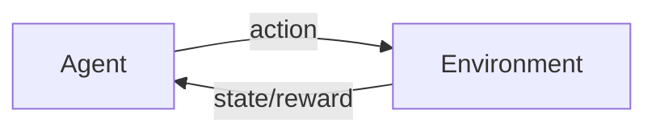

# 强化学习：基础概念解析

## 1.背景介绍

强化学习(Reinforcement Learning, RL)是机器学习的一个重要分支,它研究如何让智能体(agent)在与环境的交互中学习最优策略,以获得最大的累积奖励。与监督学习和非监督学习不同,强化学习不需要预先准备好标注数据,而是通过探索与利用(exploration and exploitation)来自主学习。

强化学习的思想最早可以追溯到1950年代,当时心理学家斯金纳提出了操作性条件反射理论,认为生物体的行为是由环境中的刺激和反馈所塑造的。到了1980年代,计算机科学家们开始将强化学习引入到人工智能领域。1989年,沃特金斯提出了著名的Q-learning算法,标志着现代强化学习的诞生。

近年来,随着深度学习的兴起,深度强化学习(Deep Reinforcement Learning, DRL)取得了长足的进展。2013年,DeepMind公司的研究人员提出了深度Q网络(Deep Q-Network, DQN),它将深度神经网络与Q-learning相结合,在Atari游戏中取得了超越人类的成绩。此后,DRL在围棋、德州扑克、星际争霸等领域都取得了令人瞩目的成就。

强化学习的应用领域非常广泛,包括:

- 游戏AI:如国际象棋、围棋、雅达利游戏等
- 自动驾驶:如无人车、无人机等  
- 机器人控制:如机械臂、四足机器人等
- 推荐系统:如电商推荐、新闻推荐等
- 网络优化:如路由选择、流量调度等

可以预见,随着强化学习理论和算法的不断发展,它将在更多领域发挥重要作用,推动人工智能的进一步发展。

## 2.核心概念与联系

要理解强化学习,需要掌握以下几个核心概念:

### 2.1 智能体(Agent)与环境(Environment)

智能体是强化学习的主体,它感知外部环境的状态(state),根据一定的策略(policy)采取行动(action),从而改变环境,并获得相应的奖励(reward)。环境则定义了智能体所处的世界,它接收智能体的行动,并返回新的状态和奖励。智能体与环境不断交互,形成了一个闭环反馈系统。



### 2.2 状态(State)、行动(Action)与轨迹(Trajectory) 

状态s表示环境在某一时刻的完整描述,包含了智能体做出决策所需的所有信息。行动a是智能体与环境交互的方式,一般分为离散和连续两种。一个轨迹τ则由一系列状态-行动对组成,记录了智能体与环境交互的完整过程:

$$\tau = (s_0,a_0,s_1,a_1,...,s_T,a_T)$$

### 2.3 策略(Policy)、价值函数(Value Function)与奖励(Reward)

策略π定义了智能体在每个状态下应该采取的行动,可以是确定性策略π(s),也可以是随机性策略π(a|s)。价值函数V^π(s)表示从状态s开始,遵循策略π能获得的期望累积奖励。奖励r是环境对智能体行动的即时反馈,决定了学习的目标。智能体的目标就是寻找一个最优策略π^*,使得价值函数最大化:

$$\pi^* = \arg\max_\pi V^\pi(s), \forall s$$  

### 2.4 探索(Exploration)与利用(Exploitation)

探索是指智能体尝试新的行动,获取对环境的新知识;利用则是执行已知的最优策略,获得稳定的奖励。两者存在矛盾,需要权衡。常见的探索策略有ε-greedy、Boltzmann探索等。

### 2.5 在线学习(Online)与离线学习(Offline)

在线学习是指智能体边与环境交互边学习,不断更新策略;离线学习则先收集数据,再用数据训练策略。前者适合环境变化快的情况,后者适合数据较难获取的情况。

### 2.6 基于模型(Model-based)与无模型(Model-free)

基于模型的方法需要学习环境的转移概率模型T(s'|s,a)和奖励函数R(s,a),再用规划的方法求解最优策略;无模型方法则直接学习策略或价值函数,不需要显式建模。前者更高效,但需要准确的模型;后者更通用,但样本复杂度高。

## 3.核心算法原理具体操作步骤

强化学习有三大类经典算法:值迭代(Value Iteration)、策略梯度(Policy Gradient)和演员-评论家(Actor-Critic)。下面以值迭代为例,介绍其原理和步骤。

值迭代的核心思想是:从任意一个价值函数V开始,通过贝尔曼最优方程迭代更新,最终收敛到最优价值函数V^*,再根据V^*得到最优策略π^*。

1. 初始化价值函数V(s)=0,∀s

2. 重复以下迭代,直到V收敛:
   
   对每个状态s,更新V(s)为:
   
   $$V(s) \leftarrow \max_a \sum_{s',r} p(s',r|s,a)[r+\gamma V(s')]$$
   
   其中,p(s',r|s,a)是在状态s下执行行动a,转移到状态s'并获得奖励r的概率,γ是折扣因子。

3. 根据收敛后的V,得到最优策略π^*:

   $$\pi^*(s) = \arg\max_a \sum_{s',r} p(s',r|s,a)[r+\gamma V(s')]$$

值迭代的优点是简单直观,容易实现;缺点是需要知道环境的转移概率,且每次迭代需要遍历所有状态,在状态空间很大时效率低下。

## 4.数学模型和公式详细讲解举例说明

强化学习可以用马尔可夫决策过程(Markov Decision Process, MDP)来建模。一个MDP由以下元素组成:

- 状态空间S:所有可能的状态s的集合
- 行动空间A:在每个状态下可以采取的行动a的集合  
- 转移概率T(s'|s,a):在状态s下采取行动a,转移到状态s'的概率
- 奖励函数R(s,a):在状态s下采取行动a,获得的即时奖励
- 折扣因子γ:未来奖励的衰减率,取值在[0,1]之间

MDP的目标是寻找一个最优策略π^*,使得期望累积奖励最大化:

$$\pi^* = \arg\max_\pi \mathbb{E}[\sum_{t=0}^{\infty} \gamma^t r_t | \pi]$$

其中,r_t是在时刻t获得的奖励。

MDP满足马尔可夫性质,即下一个状态只取决于当前状态和行动,与之前的历史无关:

$$p(s_{t+1}|s_t,a_t,s_{t-1},a_{t-1},...) = p(s_{t+1}|s_t,a_t)$$

基于MDP,我们可以推导出两个重要的公式:贝尔曼期望方程和贝尔曼最优方程。

贝尔曼期望方程表示在状态s下遵循策略π,可以获得的期望回报:

$$V^\pi(s) = \sum_a \pi(a|s) \sum_{s',r} p(s',r|s,a)[r + \gamma V^\pi(s')]$$

贝尔曼最优方程表示最优价值函数满足的条件:

$$V^*(s) = \max_a \sum_{s',r} p(s',r|s,a)[r + \gamma V^*(s')]$$

类似地,我们也可以定义基于行动价值(Q值)的贝尔曼期望方程和最优方程:

$$Q^\pi(s,a) = \sum_{s',r} p(s',r|s,a)[r + \gamma \sum_{a'} \pi(a'|s') Q^\pi(s',a')]$$

$$Q^*(s,a) = \sum_{s',r} p(s',r|s,a)[r + \gamma \max_{a'} Q^*(s',a')]$$

举个例子,考虑一个简单的网格世界环境,如下图所示:

```
+---+---+---+
| S |   |   |
+---+---+---+
|   |   | G |
+---+---+---+
```

其中,S表示起点,G表示终点,中间的空格表示可以移动的位置。智能体在每个位置都有4个可能的行动:上、下、左、右,每走一步获得-1的奖励,到达终点获得+10的奖励并结束游戏。折扣因子γ=0.9。

我们可以用值迭代算法求解这个问题的最优策略。初始化所有状态的价值为0,然后重复更新每个状态的价值,直到收敛:

```
+-------+-------+-------+
|   0   |   0   |   0   |
+-------+-------+-------+
|   0   |   0   |   0   |
+-------+-------+-------+

+-------+-------+-------+
|  7.29 |  8.10 |  9.00 |
+-------+-------+-------+
|  6.56 |  7.29 | 10.00 |
+-------+-------+-------+

+-------+-------+-------+
|  8.10 |  9.00 |  9.00 |
+-------+-------+-------+
|  7.29 |  8.10 | 10.00 |
+-------+-------+-------+
```

可以看到,最终收敛后,每个状态的价值等于从该状态开始获得的最大期望累积奖励。根据这个价值函数,我们就可以得到最优策略:在每个状态下选择使得下一个状态价值最大的行动。

## 5.项目实践：代码实例和详细解释说明

下面我们用Python实现一个简单的值迭代算法,并用它来求解上述网格世界问题。

首先定义MDP类,表示一个马尔可夫决策过程:

```python
class MDP:
    def __init__(self, states, actions, T, R, gamma):
        self.states = states  # 状态空间
        self.actions = actions  # 行动空间
        self.T = T  # 转移概率矩阵
        self.R = R  # 奖励函数
        self.gamma = gamma  # 折扣因子
        
    def value_iteration(self, eps=1e-6):
        V = {s: 0 for s in self.states}  # 初始化价值函数
        while True:
            V_new = {}
            for s in self.states:
                V_new[s] = max(sum(p * (r + self.gamma * V[s_]) for p, s_, r in self.T[s][a]) for a in self.actions)
            if max(abs(V_new[s] - V[s]) for s in self.states) < eps:
                break
            V = V_new
        return V
    
    def get_optimal_policy(self, V):
        pi = {}
        for s in self.states:
            pi[s] = max(self.actions, key=lambda a: sum(p * (r + self.gamma * V[s_]) for p, s_, r in self.T[s][a]))
        return pi
```

其中,`value_iteration`方法实现了值迭代算法,`get_optimal_policy`方法根据价值函数得到最优策略。

然后定义网格世界环境:

```python
states = [(i, j) for i in range(2) for j in range(3)]  # 状态空间
actions = ['u', 'd', 'l', 'r']  # 行动空间

# 转移概率矩阵
T = {s: {a: [] for a in actions} for s in states}
for i in range(2):
    for j in range(3):
        s = (i, j)
        T[s]['l'] = [(1.0, (i, max(j-1, 0)), -1)]
        T[s]['r'] = [(1.0, (i, min(j+1, 2)), -1)]
        T[s]['u'] = [(1.0, (max(i-1, 0), j), -1)]
        T[s]['d'] = [(1.0, (min(i+1, 1), j), -1)]
T[(0, 0)]['l'] = [(1.0, (0, 0), -1)]
T[(0, 0)]['u'] = [(1.0, (0, 0), -1)]
T[(1, 2)]['d'] = [(1.0, (1, 2), 10)]
T[(1, 2)]['r'] = [(1.0, (1, 2), 10)]

# 奖励函数
R = {s: {a: -1 for a in actions} for s in states}
R[(1, 2)] = {a: 10 for a in actions}

gamma = 0.9  # 折扣因子

mdp = MDP(states, actions