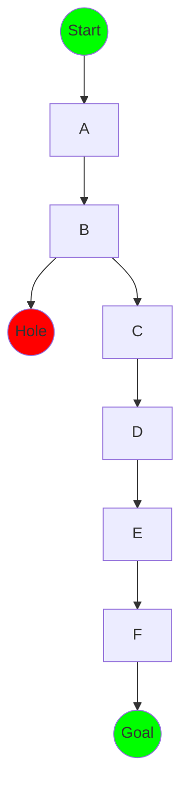

# 强化学习：策略迭代与价值迭代

## 1.背景介绍

### 1.1 什么是强化学习?

强化学习(Reinforcement Learning, RL)是机器学习的一个重要分支,它研究如何基于环境反馈来学习行为策略,以最大化长期累积奖励。与监督学习不同,强化学习没有给定的正确输入/输出对,而是通过与环境的交互来学习。

强化学习的核心思想是让智能体(Agent)通过尝试不同的行为,并根据环境的反馈(奖励或惩罚)来学习最优策略。这种学习过程类似于人类或动物通过反复试错来获取经验和技能。

### 1.2 强化学习的基本要素

强化学习系统由以下几个基本要素组成:

- **环境(Environment)**: 智能体所处的外部世界,智能体通过与环境交互来学习。
- **状态(State)**: 环境的当前情况,通常用一个向量表示。
- **行为(Action)**: 智能体在当前状态下可以采取的操作。
- **奖励(Reward)**: 环境对智能体当前行为的反馈,用一个数值表示。
- **策略(Policy)**: 智能体根据当前状态选择行为的规则或函数。
- **价值函数(Value Function)**: 评估当前状态或状态-行为对的长期累积奖励。

### 1.3 强化学习的应用场景

强化学习已广泛应用于多个领域,包括:

- 机器人控制
- 游戏AI
- 自动驾驶
- 资源管理
- 金融交易
- 自然语言处理
- 计算机系统优化

## 2.核心概念与联系

### 2.1 马尔可夫决策过程(MDP)

强化学习问题通常建模为**马尔可夫决策过程(Markov Decision Process, MDP)**。MDP由以下要素组成:

- 一组有限的状态集合 $\mathcal{S}$
- 一组有限的行为集合 $\mathcal{A}$  
- 状态转移概率 $\mathcal{P}_{ss'}^a = \mathcal{P}(s' | s, a)$,表示在状态 $s$ 采取行为 $a$ 后转移到状态 $s'$ 的概率
- 奖励函数 $\mathcal{R}_s^a$ 或 $\mathcal{R}_{ss'}^a$,定义了在状态 $s$ 采取行为 $a$ 获得的即时奖励

MDP的目标是找到一个最优策略 $\pi^*$,使得在任意初始状态 $s_0$ 下,按照该策略 $\pi^*$ 行动可获得最大的期望累积奖励。

### 2.2 贝尔曼方程

贝尔曼方程(Bellman Equation)是强化学习中的一个关键概念,用于描述最优价值函数与即时奖励和后继状态价值函数之间的关系。

对于任意策略 $\pi$,其状态价值函数 $V^\pi(s)$ 满足:

$$V^\pi(s) = \mathbb{E}_\pi\left[R_{t+1} + \gamma V^\pi(S_{t+1}) | S_t = s\right]$$

其中 $\gamma \in [0, 1)$ 是折扣因子,用于权衡即时奖励和未来奖励的重要性。

对于最优策略 $\pi^*$,其最优状态价值函数 $V^*(s)$ 满足:

$$V^*(s) = \max_a \mathbb{E}\left[R_{t+1} + \gamma V^*(S_{t+1}) | S_t = s, A_t = a\right]$$

同理,可以定义最优行为价值函数 $Q^*(s, a)$:

$$Q^*(s, a) = \mathbb{E}\left[R_{t+1} + \gamma \max_{a'} Q^*(S_{t+1}, a') | S_t = s, A_t = a\right]$$

求解最优价值函数和最优策略是强化学习的核心目标。

### 2.3 探索与利用权衡

在强化学习过程中,智能体需要权衡**探索(Exploration)**和**利用(Exploitation)**之间的平衡。

- 探索指的是尝试新的行为,以发现潜在的更优策略。
- 利用指的是根据当前已学习的知识选择目前认为最优的行为。

过多探索可能会浪费时间在次优行为上,而过多利用则可能无法发现真正的最优策略。合理平衡探索和利用对于学习高质量的策略至关重要。

### 2.4 策略迭代与价值迭代

策略迭代(Policy Iteration)和价值迭代(Value Iteration)是求解MDP最优策略和最优价值函数的两种基本算法框架。

- **策略迭代**包括两个阶段:策略评估和策略提升。首先评估当前策略的价值函数,然后基于该价值函数对策略进行提升,重复这个过程直到收敛。
- **价值迭代**则直接迭代更新价值函数,使其逐步逼近最优价值函数,最终从最优价值函数导出最优策略。

这两种算法框架是强化学习的基石,许多具体算法都是在这两种框架的基础上进行改进和扩展。

## 3.核心算法原理具体操作步骤

### 3.1 策略迭代算法

策略迭代算法由以下两个核心步骤交替进行,直至收敛:

1. **策略评估(Policy Evaluation)**:对于当前策略 $\pi$,计算其状态价值函数 $V^\pi$。这可以通过解析方法或迭代方法来实现。
2. **策略提升(Policy Improvement)**:基于当前策略 $\pi$ 的状态价值函数 $V^\pi$,构造一个新的改进策略 $\pi'$,使得 $V^{\pi'}(s) \geq V^\pi(s)$ 对所有状态 $s$ 成立。

具体操作步骤如下:

1. 初始化一个任意策略 $\pi_0$
2. 对于当前策略 $\pi_i$:
    a. 策略评估:计算 $V^{\pi_i}$,例如通过求解线性方程组 $V^{\pi_i} = R^{\pi_i} + \gamma P^{\pi_i} V^{\pi_i}$
    b. 策略提升:构造新策略 $\pi_{i+1}$,使得 $\pi_{i+1}(s) = \arg\max_a \sum_{s'} P_{ss'}^a (R_{ss'}^a + \gamma V^{\pi_i}(s'))$
3. 如果 $\pi_{i+1} = \pi_i$,则算法收敛,返回 $\pi^* = \pi_{i+1}$ 和 $V^* = V^{\pi_i}$;否则令 $i = i + 1$,返回步骤2继续迭代。

### 3.2 价值迭代算法

价值迭代算法通过直接迭代更新价值函数,使其逐步逼近最优价值函数 $V^*$,最终从 $V^*$ 导出最优策略 $\pi^*$。算法步骤如下:

1. 初始化价值函数 $V_0$,例如令所有状态的价值为0或任意值
2. 重复以下步骤直至收敛:
    a. $V_{k+1}(s) = \max_a \sum_{s'} P_{ss'}^a (R_{ss'}^a + \gamma V_k(s'))$
3. 从 $V_k$ 导出最优策略 $\pi^*$:
    $\pi^*(s) = \arg\max_a \sum_{s'} P_{ss'}^a (R_{ss'}^a + \gamma V_k(s'))$
4. 返回 $\pi^*$ 和 $V^* = V_k$

价值迭代算法的优点是相对简单,缺点是需要事先知道MDP的完整模型(状态转移概率和奖励函数)。

## 4.数学模型和公式详细讲解举例说明

### 4.1 马尔可夫决策过程的数学模型

马尔可夫决策过程(MDP)可以用一个五元组 $(\mathcal{S}, \mathcal{A}, \mathcal{P}, \mathcal{R}, \gamma)$ 来表示:

- $\mathcal{S}$ 是一个有限的状态集合
- $\mathcal{A}$ 是一个有限的行为集合
- $\mathcal{P}_{ss'}^a = \mathcal{P}(s' | s, a)$ 是状态转移概率,表示在状态 $s$ 采取行为 $a$ 后转移到状态 $s'$ 的概率
- $\mathcal{R}_s^a$ 或 $\mathcal{R}_{ss'}^a$ 是奖励函数,定义了在状态 $s$ 采取行为 $a$ 获得的即时奖励
- $\gamma \in [0, 1)$ 是折扣因子,用于权衡即时奖励和未来奖励的重要性

在MDP中,一个策略 $\pi$ 是一个从状态到行为的映射函数,即 $\pi: \mathcal{S} \rightarrow \mathcal{A}$。我们的目标是找到一个最优策略 $\pi^*$,使得在任意初始状态 $s_0$ 下,按照该策略 $\pi^*$ 行动可获得最大的期望累积奖励。

### 4.2 贝尔曼方程的数学表达

贝尔曼方程是强化学习中的一个关键概念,用于描述最优价值函数与即时奖励和后继状态价值函数之间的关系。

对于任意策略 $\pi$,其状态价值函数 $V^\pi(s)$ 满足:

$$V^\pi(s) = \mathbb{E}_\pi\left[R_{t+1} + \gamma V^\pi(S_{t+1}) | S_t = s\right] = \sum_{a} \pi(a|s) \sum_{s'} \mathcal{P}_{ss'}^a \left(R_{ss'}^a + \gamma V^\pi(s')\right)$$

其中 $\gamma \in [0, 1)$ 是折扣因子,用于权衡即时奖励和未来奖励的重要性。

对于最优策略 $\pi^*$,其最优状态价值函数 $V^*(s)$ 满足:

$$V^*(s) = \max_a \mathbb{E}\left[R_{t+1} + \gamma V^*(S_{t+1}) | S_t = s, A_t = a\right] = \max_a \sum_{s'} \mathcal{P}_{ss'}^a \left(R_{ss'}^a + \gamma V^*(s')\right)$$

同理,可以定义最优行为价值函数 $Q^*(s, a)$:

$$Q^*(s, a) = \mathbb{E}\left[R_{t+1} + \gamma \max_{a'} Q^*(S_{t+1}, a') | S_t = s, A_t = a\right] = \sum_{s'} \mathcal{P}_{ss'}^a \left(R_{ss'}^a + \gamma \max_{a'} Q^*(s', a')\right)$$

求解最优价值函数和最优策略是强化学习的核心目标。

### 4.3 例子:网格世界的价值迭代

考虑一个简单的网格世界环境,如下图所示:

在这个环境中,智能体的目标是从起点(Start)到达终点(Goal),同时避免掉入陷阱(Hole)。每一步行动都会获得-1的奖励,除非到达终点(获得+10的奖励)或陷阱(获得-10的奖励并重置)。我们使用折扣因子 $\gamma = 0.9$。

通过价值迭代算法,我们可以计算出每个状态的最优价值函数 $V^*(s)$。以状态 B 为例,其最优价值函数为:

$$V^*(B) = \max_a \sum_{s'} \mathcal{P}_{Bs'}^a \left(R_{Bs'}^a + \gamma V^*(s')\right)$$

其中 $a$ 可取的行为是上下左右四个方向,对应的状态转移概率和奖励如下:

- 向上: $\mathcal{P}_{BH}^{\text{up}} = 1, R_{BH}^{\text{up}} = -10$
- 向下: $\mathcal{P}_{BC}^{\text{down}} = 1, R_{BC}^{\text{down}} = -1$
- 向左: $\mathcal{P}_{BA}^{\text{left}} = 1, R_{BA}^{\text{left}} = -1$
- 向右: $\mathcal{P}_{BB}^{\text{right}} = 1, R_{BB}^{\text