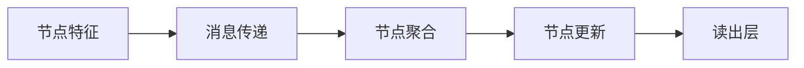

# 强连通分量算法与深度学习：图神经网络

## 1. 背景介绍

### 1.1 图数据结构的重要性

在现实世界中,许多复杂系统都可以用图的形式来表示和建模。图是一种非常通用和强大的数据结构,可以很好地描述事物之间的关系和相互作用。例如:

- 社交网络中的人际关系
- 蛋白质分子中原子的化学键
- 计算机网络中的节点和连接
- 世界各地的交通网络

因此,能够高效地处理和分析图数据结构对于众多领域都具有重要意义。

### 1.2 传统机器学习算法的局限性

传统的机器学习算法通常假设数据是独立同分布的(i.i.d),并且以向量或矩阵的形式进行建模。然而,对于具有复杂拓扑结构的图数据,这种假设和表示方式往往不够合适。因为图数据中的节点之间存在着复杂的相互依赖关系,无法简单地将其拆分为独立的实例。

为了更好地处理图数据,需要一种新的学习范式,能够直接对图进行建模和推理。这就催生了图神经网络(Graph Neural Networks, GNNs)的兴起。

### 1.3 图神经网络的崛起

图神经网络是一种将神经网络模型推广到处理图结构数据的新型深度学习架构。它通过在图上进行信息传播,直接对节点及其邻居节点的特征进行编码,从而学习图数据的表示。

图神经网络在诸多领域展现出卓越的性能,例如:社交网络分析、分子指纹预测、交通网络优化等。它为处理复杂关系数据提供了一种全新的有效方法,被誉为是深度学习在结构化数据上的一次重大突破。

## 2. 核心概念与联系

### 2.1 图的表示

在介绍图神经网络之前,我们先来了解一下图的基本表示形式。一个图 $G = (V, E)$ 由一组节点 $V$ 和一组边 $E \subseteq V \times V$ 组成。每条边 $e_{ij} \in E$ 连接两个节点 $v_i$ 和 $v_j$。

根据边的方向性,图可以分为无向图和有向图。无向图中的边没有方向,而有向图中的边是有方向的,即 $(v_i, v_j) \neq (v_j, v_i)$。

此外,每个节点和边还可以关联一些属性特征,用于描述它们的属性信息。

### 2.2 图的邻接矩阵表示

一种常用的图表示方法是邻接矩阵(Adjacency Matrix)。对于一个包含 $N$ 个节点的图 $G$,其邻接矩阵 $A \in \mathbb{R}^{N \times N}$ 是一个 $N$ 阶方阵,其中 $A_{ij}$ 表示节点 $v_i$ 和 $v_j$ 之间是否有边相连。

- 对于无权无向图,如果 $e_{ij} \in E$,则 $A_{ij} = A_{ji} = 1$,否则为 0。
- 对于有权无向图,如果 $e_{ij} \in E$,则 $A_{ij} = A_{ji} = w_{ij}$,其中 $w_{ij}$ 是边的权重。
- 对于有向图,如果有 $(v_i, v_j) \in E$,则 $A_{ij} = 1$,否则为 0。

邻接矩阵提供了一种紧凑的图表示方式,便于进行矩阵运算。但是,它也存在一些缺陷,例如对于稀疏图,会产生大量的空间浪费;另外,它只能表示静态图,无法高效地处理动态图结构。

### 2.3 图的邻接表示

另一种常用的图表示方法是邻接表(Adjacency List)。对于每个节点 $v_i$,我们使用一个链表 $\text{Neighbors}(v_i)$ 来存储与之相邻的节点。

这种表示方式更加紧凑,特别适合于稀疏图。同时,它也支持动态地添加或删除节点和边。但是,基于邻接表的图操作通常比基于邻接矩阵的操作更加低效。

### 2.4 图的拉普拉斯矩阵表示

拉普拉斯矩阵(Laplacian Matrix)是另一种常用的图表示方式,定义为:

$$L = D - A$$

其中 $A$ 是图的邻接矩阵, $D$ 是度矩阵(Degree Matrix),对角线元素 $D_{ii} = \sum_j A_{ij}$ 表示节点 $v_i$ 的度数(即邻居节点的数量)。

拉普拉斯矩阵常用于谱聚类、图切分等图分析任务。它的一个重要性质是,对于任意一个向量 $f \in \mathbb{R}^N$,都有:

$$f^TLf = \frac{1}{2}\sum_{i,j}A_{ij}(f_i - f_j)^2$$

这意味着,如果两个节点之间有边相连,那么它们对应的特征值就应该越相似。这为基于拉普拉斯矩阵的图卷积操作奠定了理论基础。

### 2.5 图神经网络与卷积神经网络的关系

图神经网络可以看作是将卷积神经网络(CNN)从规则的欧几里得数据(如图像、序列等)推广到了任意拓扑结构的图数据。

在CNN中,卷积操作在空间或时间维度上对数据进行局部邻域聚合。而在GNN中,聚合操作则是在图的拓扑结构上进行,对每个节点及其邻居节点的特征进行聚合。

这种思路使得GNN能够很自然地处理任意结构的图数据,并学习出每个节点的表示,从而解决许多传统方法难以有效处理的问题。

## 3. 核心算法原理具体操作步骤

### 3.1 图神经网络的基本架构

尽管不同的图神经网络模型在细节上有所区别,但它们都遵循一个基本的架构框架:

1. **节点特征(Node Features)**: 每个节点 $v_i$ 都有一个特征向量 $x_i$,用于描述该节点的属性信息。

2. **消息传递(Message Passing)**: 在每一层,每个节点会收集来自邻居节点的消息,并根据这些消息更新自身的表示。

3. **节点聚合(Node Aggregation)**: 节点需要对收集到的邻居消息进行聚合,合并成一个综合的特征表示。

4. **节点更新(Node Update)**: 节点将聚合后的邻居信息与自身的表示相结合,并通过一个更新函数(如神经网络)得到新的节点表示。

5. **读出层(Readout Layer)**: 最终,根据每个节点的表示及任务需求,通过读出层输出图级别或节点级别的预测结果。

这种消息传递-聚合-更新的过程在图神经网络的每一层中重复进行,直至收敛或达到指定的层数。通过这种方式,图神经网络能够逐步捕获图数据中节点之间的相互依赖关系,并学习出每个节点的表示。

### 3.2 图卷积网络(GCN)

图卷积网络(Graph Convolutional Networks, GCN)是一种广为人知的图神经网络模型,它提出了一种基于谱域的图卷积操作。

在GCN中,节点的更新规则为:

$$H^{(l+1)} = \sigma\left(\widetilde{D}^{-\frac{1}{2}}\widetilde{A}\widetilde{D}^{-\frac{1}{2}}H^{(l)}W^{(l)}\right)$$

其中:

- $H^{(l)} \in \mathbb{R}^{N \times D^{(l)}}$ 是第 $l$ 层的节点特征矩阵,每行对应一个节点的特征向量。
- $\widetilde{A} = A + I_N$ 是加入自环后的邻接矩阵,确保每个节点至少与自身相连。
- $\widetilde{D}_{ii} = \sum_j \widetilde{A}_{ij}$ 是新的度矩阵。
- $W^{(l)}$ 是第 $l$ 层的权重矩阵,用于线性变换节点特征。
- $\sigma(\cdot)$ 是一个非线性激活函数,如ReLU。

这个公式实现了"消息传递-聚合-更新"的基本操作:

1. 将每个节点的特征向量 $H^{(l)}$ 与权重矩阵 $W^{(l)}$ 相乘,得到线性变换后的特征。
2. 对每个节点,根据归一化的邻接矩阵 $\widetilde{D}^{-\frac{1}{2}}\widetilde{A}\widetilde{D}^{-\frac{1}{2}}$,聚合来自邻居节点的特征信息。
3. 通过非线性激活函数 $\sigma(\cdot)$,将聚合后的特征更新为新的节点表示 $H^{(l+1)}$。

通过堆叠多层这样的图卷积操作,GCN能够逐步整合更大范围的邻居信息,并最终学习出每个节点的表示。

### 3.3 图注意力网络(GAT)

图注意力网络(Graph Attention Networks, GAT)是另一种流行的图神经网络模型,它引入了注意力机制来指导邻居特征的聚合过程。

在GAT中,节点的更新规则为:

$$h_i^{(l+1)} = \sigma\left(\sum_{j \in \mathcal{N}(i) \cup \{i\}} \alpha_{ij}^{(l)}W^{(l)}h_j^{(l)}\right)$$

其中:

- $h_i^{(l)}$ 是第 $l$ 层的节点 $v_i$ 的特征向量。
- $\mathcal{N}(i)$ 表示节点 $v_i$ 的邻居节点集合。
- $W^{(l)}$ 是第 $l$ 层的权重矩阵,用于线性变换节点特征。
- $\alpha_{ij}^{(l)}$ 是注意力系数,它决定了节点 $v_i$ 对来自节点 $v_j$ 的特征信息的关注程度。

注意力系数 $\alpha_{ij}^{(l)}$ 是通过一个自注意力机制学习得到的,它考虑了节点 $v_i$ 和 $v_j$ 之间的特征相似性,以及两节点之间的结构关系:

$$\alpha_{ij}^{(l)} = \frac{\exp\left(\text{LeakyReLU}\left(a^{\top}[W^{(l)}h_i^{(l)} \| W^{(l)}h_j^{(l)}]\right)\right)}{\sum_{k \in \mathcal{N}(i) \cup \{i\}} \exp\left(\text{LeakyReLU}\left(a^{\top}[W^{(l)}h_i^{(l)} \| W^{(l)}h_k^{(l)}]\right)\right)}$$

其中 $a$ 是一个可学习的注意力向量,用于计算节点特征的加权和;$\|$ 表示向量拼接操作。

通过这种自适应的注意力机制,GAT能够自动地为不同的邻居节点分配不同的权重,从而更好地捕获图数据中的结构信息。

### 3.4 图同构网络(GIN)

图同构网络(Graph Isomorphism Networks, GIN)是一种具有理论保证的强大图神经网络模型。它能够学习出对图同构(isomorphism)的判别能力,从而在理论上具有最大的表达能力。

在GIN中,节点的更新规则为:

$$h_i^{(l+1)} = \text{MLP}^{(l)}\left((1 + \epsilon^{(l)}) \cdot h_i^{(l)} + \sum_{j \in \mathcal{N}(i)} h_j^{(l)}\right)$$

其中:

- $h_i^{(l)}$ 是第 $l$ 层的节点 $v_i$ 的特征向量。
- $\mathcal{N}(i)$ 表示节点 $v_i$ 的邻居节点集合。
- $\text{MLP}^{(l)}$ 是一个多层感知机,用于非线性变换节点特征。
- $\epsilon^{(l)}$ 是一个可