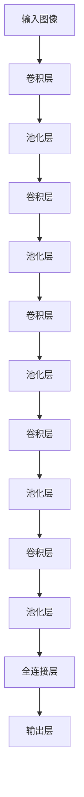

# 当YOLOv2遇上红外热成像:夜间目标检测新方案

## 1.背景介绍

### 1.1 夜间目标检测的重要性

在许多安防、军事和野生动物监测等应用场景中,夜间目标检测是一项极具挑战的任务。由于可见光照明条件不足,传统的基于RGB图像的目标检测算法往往表现不佳。因此,开发出高效的夜间目标检测技术对于确保夜间安全和监控至关重要。

### 1.2 红外热成像技术概述

红外热成像技术通过检测物体发射的红外辐射来形成图像,可以在完全黑暗的环境中工作。由于不依赖可见光,红外热成像图像能够清晰地显示目标物体的热特征,从而为夜间目标检测提供了新的解决方案。

### 1.3 YOLO系列算法简介

YOLO(You Only Look Once)是一种先进的单阶段目标检测算法,具有高速和高精度的特点。相比传统的两阶段目标检测算法,YOLO直接对整个图像进行端到端的预测,大大提高了检测速度。YOLOv2作为YOLO系列的升级版本,在精度和鲁棒性方面有了显著提升。

## 2.核心概念与联系

### 2.1 YOLOv2算法核心思想

YOLOv2将目标检测任务转化为一个回归问题,通过卷积神经网络直接预测目标边界框的位置和类别。具体来说,YOLOv2将输入图像划分为 $S \times S$ 个网格,每个网格负责预测 $B$ 个边界框以及这些边界框所属的类别概率。

$$
\begin{aligned}
\text{预测向量} = [\hat{t}_x, \hat{t}_y, \hat{t}_w, \hat{t}_h, \hat{t}_o, \hat{c}_1, \hat{c}_2, \ldots, \hat{c}_C]
\end{aligned}
$$

其中 $\hat{t}_x, \hat{t}_y, \hat{t}_w, \hat{t}_h$ 分别表示预测边界框的 $(x, y)$ 坐标、宽度和高度, $\hat{t}_o$ 表示预测边界框的置信度, $\hat{c}_i$ 表示第 $i$ 类目标的条件概率。

### 2.2 红外热成像图像的特点

与普通RGB图像不同,红外热成像图像反映的是物体表面的热辐射强度,呈现为灰度或伪彩色图像。热源物体在图像中显示为较亮的区域,而冷源物体显示为较暗的区域。这种热对比特性使得红外图像能够清晰地显示目标物体,尤其是在夜间或烟雾环境中。

### 2.3 将YOLOv2应用于红外图像

由于红外图像和普通RGB图像在数据分布上存在差异,因此直接将在RGB图像上训练的YOLOv2模型应用于红外图像可能会导致性能下降。为了充分利用红外图像的特点,需要在红外数据集上对YOLOv2模型进行重新训练或迁移学习,以使模型能够学习到红外图像的特征模式。

## 3.核心算法原理具体操作步骤

### 3.1 YOLOv2网络架构

YOLOv2采用了Darknet-19作为主干网络,它是一种紧凑而高效的卷积神经网络结构。Darknet-19包含19个卷积层和5个最大池化层,使用3×3和1×1的卷积核,并采用了批量归一化(Batch Normalization)和高级激活函数(如Leaky ReLU)来提升模型性能。



### 3.2 网格单元和锚框机制

YOLOv2将输入图像划分为 $S \times S$ 个网格单元,每个网格单元负责预测 $B$ 个边界框(通常 $B=5$)。为了提高不同形状和大小目标的检测精度,YOLOv2采用了锚框(Anchor Box)机制,预先设置了一组不同尺寸和长宽比的锚框,在训练过程中学习调整锚框以更好地匹配实际目标。

### 3.3 损失函数和优化

YOLOv2的损失函数由三部分组成:边界框坐标损失、置信度损失和分类损失。具体来说:

- 边界框坐标损失: 使用均方误差(MSE)来衡量预测边界框和实际边界框之间的差异。
- 置信度损失: 对于包含目标的边界框,置信度损失是预测置信度与1之间的均方误差;对于不包含目标的边界框,置信度损失是预测置信度与0之间的均方误差。
- 分类损失: 对于包含目标的边界框,分类损失是预测类别概率与实际类别之间的交叉熵损失。

通过梯度下降优化算法(如SGD或Adam)来最小化总损失函数,从而训练YOLOv2模型。

### 3.4 数据增强和迁移学习

为了提高模型的泛化能力,YOLOv2采用了多种数据增强技术,如随机裁剪、翻转、调整亮度和对比度等。此外,在红外图像上训练YOLOv2模型时,可以利用在RGB图像上预训练的模型权重进行迁移学习,以加速训练过程并提高模型性能。

## 4.数学模型和公式详细讲解举例说明

### 4.1 边界框回归

YOLOv2将目标检测任务转化为一个回归问题,通过预测一组相对于网格单元的偏移量 $(t_x, t_y, t_w, t_h)$ 来定位目标边界框。具体来说,对于第 $i$ 个网格单元的第 $j$ 个锚框,其预测的边界框坐标 $(b_x, b_y, b_w, b_h)$ 由以下公式计算:

$$
\begin{aligned}
b_x &= \sigma(t_x) + c_x \\
b_y &= \sigma(t_y) + c_y \\
b_w &= p_w e^{t_w} \\
b_h &= p_h e^{t_h}
\end{aligned}
$$

其中 $(c_x, c_y)$ 是网格单元的左上角坐标, $(p_w, p_h)$ 是锚框的宽度和高度, $\sigma$ 是sigmoid函数,用于将 $t_x$ 和 $t_y$ 的值限制在 $[0, 1]$ 范围内。

### 4.2 置信度预测

对于每个预测的边界框,YOLOv2还需要预测一个置信度分数 $t_o$,表示该边界框包含目标物体的置信程度。置信度分数由两部分组成:

$$
t_o = Pr(Object) \times IOU_{truth}^{pred}
$$

其中 $Pr(Object)$ 表示该边界框包含任意目标物体的概率, $IOU_{truth}^{pred}$ 表示预测边界框与实际边界框之间的交并比(Intersection over Union)。

### 4.3 分类预测

对于包含目标物体的边界框,YOLOv2还需要预测目标所属的类别。这是一个多分类问题,可以使用softmax函数计算每个类别的条件概率:

$$
Pr(Class_i|Object) = \frac{e^{t_i}}{\sum_{j}e^{t_j}}
$$

其中 $t_i$ 是第 $i$ 类目标的预测分数。

### 4.4 损失函数

YOLOv2的总损失函数由三部分组成:

$$
\text{Loss} = \lambda_{\text{coord}}\text{Loss}_{\text{coord}} + \text{Loss}_{\text{conf}} + \lambda_{\text{noobj}}\text{Loss}_{\text{noobj}}
$$

- 坐标损失 $\text{Loss}_{\text{coord}}$: 使用均方误差(MSE)衡量预测边界框和实际边界框之间的差异。
- 置信度损失 $\text{Loss}_{\text{conf}}$: 对于包含目标的边界框,置信度损失是预测置信度与1之间的均方误差;对于不包含目标的边界框,置信度损失是预测置信度与0之间的均方误差。
- 无目标损失 $\text{Loss}_{\text{noobj}}$: 用于惩罚那些不包含目标物体但却产生了高置信度预测的边界框。

$\lambda_{\text{coord}}$ 和 $\lambda_{\text{noobj}}$ 是超参数,用于平衡不同损失项的权重。

### 4.5 非最大值抑制

由于YOLOv2会为同一目标产生多个重叠的边界框预测,因此需要使用非最大值抑制(Non-Maximum Suppression, NMS)算法来消除这些冗余的预测。NMS算法的基本思路是:

1. 根据置信度分数对所有预测边界框进行排序。
2. 从置信度最高的边界框开始,移除与之重叠程度较高(IoU大于阈值)的其他边界框。
3. 重复步骤2,直到所有边界框都被处理完毕。

通过NMS,可以保留置信度最高且互不重叠的一组边界框作为最终的检测结果。

## 5.项目实践:代码实例和详细解释说明

在这一部分,我们将提供一个使用PyTorch实现的YOLOv2模型,并在红外图像数据集上进行训练和测试。完整的代码可以在GitHub上找到: [https://github.com/zennotes/YOLOv2-Infrared](https://github.com/zennotes/YOLOv2-Infrared)

### 5.1 数据准备

我们使用公开的KAIST多谱段行人数据集进行实验,该数据集包含了大量红外和可见光图像对,并提供了行人目标的标注。我们只使用红外图像进行训练和测试。

```python
# 加载数据集
dataset = KAISTDataset('path/to/kaist')

# 划分训练集和测试集
train_set, test_set = random_split(dataset, [0.8, 0.2])

# 创建数据加载器
train_loader = DataLoader(train_set, batch_size=16, shuffle=True)
test_loader = DataLoader(test_set, batch_size=16, shuffle=False)
```

### 5.2 模型定义

我们使用PyTorch实现了YOLOv2模型,包括Darknet-19主干网络和YOLO检测头。

```python
import torch.nn as nn

# Darknet-19主干网络
class Darknet(nn.Module):
    ...

# YOLO检测头
class YOLOLayer(nn.Module):
    ...

# 整合Darknet-19和YOLO检测头
class YOLOv2(nn.Module):
    def __init__(self, num_classes=1):
        super(YOLOv2, self).__init__()
        self.backbone = Darknet()
        self.yolo_head = YOLOLayer(num_anchors=5, num_classes=num_classes)

    def forward(self, x):
        x = self.backbone(x)
        outputs = self.yolo_head(x)
        return outputs
```

### 5.3 训练过程

我们定义了YOLOv2的损失函数,并使用Adam优化器进行训练。

```python
import torch.optim as optim

model = YOLOv2(num_classes=1)
criterion = YOLOLoss()
optimizer = optim.Adam(model.parameters(), lr=0.001)

for epoch in range(num_epochs):
    for imgs, targets in train_loader:
        optimizer.zero_grad()
        outputs = model(imgs)
        loss = criterion(outputs, targets)
        loss.backward()
        optimizer.step()
```

### 5.4 测试和评估

在测试阶段,我们使用训练好的模型对测试集进行预测,并计算平均精度(mAP)作为评估指标。

```python
from utils import non_max_suppression, calc_mAP

model.eval()
all_preds = []
all_targets = []

for imgs, targets in test_loader:
    with torch.no_grad():
        outputs = model(imgs)
        preds = non_max_suppression(outputs, conf_thres=0.5, iou_thres=0.4)
        all_preds.extend(preds)
        all_targets.extend(targets)

mAP = calc_mAP(all_preds, all_targets, iou_thres=0.5)
print(f'mAP on test set: {mAP}')
```