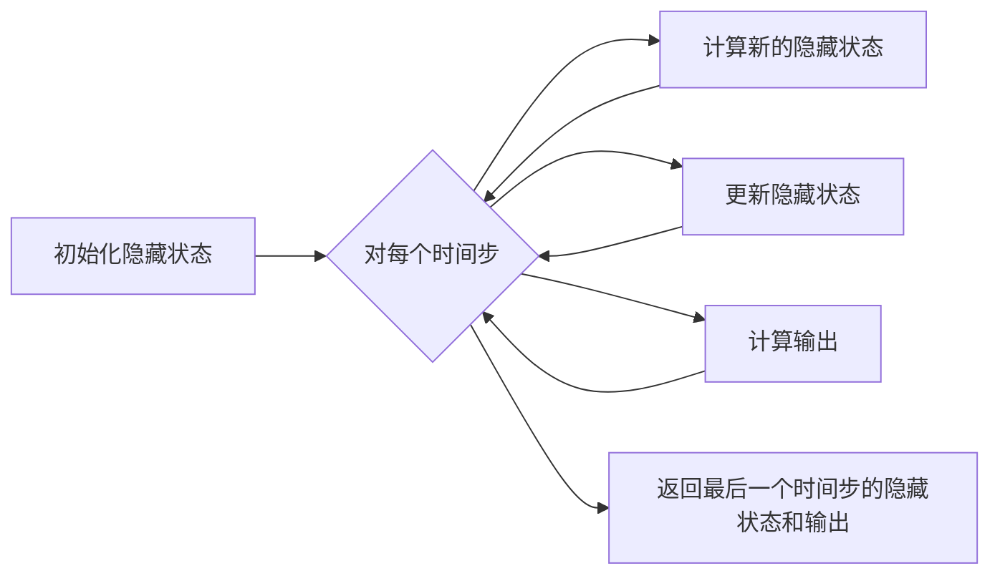

## 1.背景介绍

循环神经网络（Recurrent Neural Network，RNN）是一种适合于处理序列数据的神经网络，它在自然语言处理、语音识别、时间序列预测等领域都有广泛的应用。RNN的主要特点是具有记忆性，能够将过去的信息传递到未来，这使得它在处理序列数据时具有优越的性能。

## 2.核心概念与联系

在深入探讨RNN的工作原理之前，我们首先需要理解一些核心概念，包括隐藏状态、时间步、循环单元等。

### 2.1 隐藏状态

隐藏状态是RNN的核心组成部分，它是网络在每个时间步的内部状态。隐藏状态能够捕获到目前为止序列中的信息，它在每个时间步都会更新，新的隐藏状态是基于旧的隐藏状态和当前输入计算得到的。

### 2.2 时间步

时间步是指序列数据中的一个元素。例如，在处理文本数据时，一个时间步可能对应一个单词或一个字符。

### 2.3 循环单元

循环单元是RNN的基本组成部分，它负责在每个时间步更新隐藏状态。最简单的循环单元就是一个具有激活函数的全连接层。

## 3.核心算法原理具体操作步骤

RNN的工作原理可以分为以下几个步骤：

1. 初始化隐藏状态。
2. 对于每个时间步，执行以下操作：
   1. 计算新的隐藏状态：新的隐藏状态是基于旧的隐藏状态和当前输入计算得到的。具体的计算方法可以是一个线性变换加上一个非线性激活函数。
   2. 更新隐藏状态：将新计算出的隐藏状态作为下一个时间步的旧隐藏状态。
   3. 输出：根据当前的隐藏状态，计算网络的输出。
3. 返回最后一个时间步的隐藏状态和输出。

这个过程可以用下面的Mermaid流程图表示：



## 4.数学模型和公式详细讲解举例说明

RNN的工作原理可以用数学公式表示。设$x_t$为在时间步$t$的输入，$h_t$为在时间步$t$的隐藏状态，$o_t$为在时间步$t$的输出，那么RNN的工作原理可以表示为以下公式：

$$
h_t = f(W_hh_{t-1} + W_xx_t + b_h)
$$

$$
o_t = W_oh_t + b_o
$$

其中，$W_h$、$W_x$、$W_o$、$b_h$、$b_o$是网络的参数，$f$是非线性激活函数。

例如，假设我们有一个简单的RNN，输入是一个二维向量，隐藏状态是一个三维向量，输出是一个一维向量。设在时间步1的输入$x_1 = [1, 2]^T$，初始隐藏状态$h_0 = [0, 0, 0]^T$，则在时间步1的隐藏状态$h_1$和输出$o_1$可以通过上述公式计算得到。

## 5.项目实践：代码实例和详细解释说明

下面是一个使用Python和PyTorch实现的简单RNN的例子：

```python
import torch
import torch.nn as nn

class SimpleRNN(nn.Module):
    def __init__(self, input_size, hidden_size, output_size):
        super(SimpleRNN, self).__init__()
        self.hidden_size = hidden_size
        self.i2h = nn.Linear(input_size + hidden_size, hidden_size)
        self.i2o = nn.Linear(input_size + hidden_size, output_size)
        self.tanh = nn.Tanh()

    def forward(self, input, hidden):
        combined = torch.cat((input, hidden), 1)
        hidden = self.tanh(self.i2h(combined))
        output = self.i2o(combined)
        return output, hidden

    def initHidden(self):
        return torch.zeros(1, self.hidden_size)

rnn = SimpleRNN(10, 20, 1)
input = torch.randn(1, 10)
hidden = torch.zeros(1, 20)
output, next_hidden = rnn(input, hidden)
```

在这个例子中，我们首先定义了一个简单的RNN模型。模型的输入大小为10，隐藏状态大小为20，输出大小为1。在`forward`方法中，我们首先将输入和隐藏状态拼接起来，然后通过一个全连接层和tanh激活函数计算新的隐藏状态，接着通过另一个全连接层计算输出。

## 6.实际应用场景

RNN在许多实际应用中都发挥了重要的作用。例如，在自然语言处理中，RNN可以用于文本分类、情感分析、命名实体识别、机器翻译等任务；在语音识别中，RNN可以用于将语音信号转换为文字；在时间序列预测中，RNN可以用于预测股票价格、天气等。

## 7.工具和资源推荐

如果你对RNN感兴趣，以下是一些有用的工具和资源：

- [PyTorch](https://pytorch.org/)：一个用于深度学习的开源库，提供了丰富的神经网络组件和优化算法。
- [TensorFlow](https://www.tensorflow.org/)：一个用于机器学习和深度学习的开源库，提供了丰富的神经网络组件和优化算法。
- [Keras](https://keras.io/)：一个用于深度学习的高级API，可以运行在TensorFlow之上，提供了更简洁的接口。

## 8.总结：未来发展趋势与挑战

尽管RNN在处理序列数据上具有优越的性能，但它也存在一些问题和挑战。例如，RNN很难处理长序列数据，因为在长序列中，早期的信息往往会被遗忘；此外，RNN的训练过程中可能会遇到梯度消失或梯度爆炸的问题。

为了解决这些问题，研究人员提出了许多改进的RNN模型，如长短期记忆网络（LSTM）和门控循环单元（GRU）。这些模型通过引入门机制，使得网络能够根据需要记住或忘记信息，从而在处理长序列数据上表现更好。

未来，我们期待看到更多的创新和改进，以使RNN在更多的应用中发挥作用。

## 9.附录：常见问题与解答

1. **问题：为什么RNN可以处理序列数据？**

   答：RNN的关键特性是具有记忆性，能够将过去的信息传递到未来。这使得RNN在处理序列数据时可以考虑到序列中的历史信息，从而更好地理解序列的上下文。

2. **问题：RNN如何解决梯度消失和梯度爆炸的问题？**

   答：在RNN的训练过程中，可能会遇到梯度消失或梯度爆炸的问题。为了解决这些问题，可以使用一些技巧，如梯度裁剪、权重初始化、使用更复杂的RNN模型（如LSTM或GRU）等。

3. **问题：RNN和CNN有什么区别？**

   答：RNN和CNN都是神经网络的一种，但它们适用于不同类型的数据。RNN适用于处理序列数据，如文本、语音等；而CNN适用于处理网格型数据，如图像。

作者：禅与计算机程序设计艺术 / Zen and the Art of Computer Programming