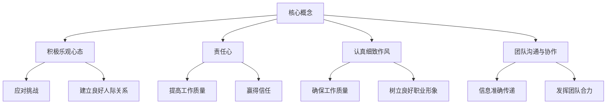

# 怎样培养积极乐观，责任心强，工作认真细致和良好的团队沟通与协作能力

## 1. 背景介绍

在当今快节奏的工作环境中，拥有积极乐观的心态、强烈的责任心、认真细致的工作作风以及出色的团队协作能力是非常宝贵的素质。这些素质不仅有助于个人事业发展,也是建立高效团队、创造卓越成就的关键因素。无论是在软件开发、产品设计还是其他领域,培养这些素质都将为你带来巨大的竞争优势。

### 1.1 积极乐观的重要性

积极乐观的心态可以帮助我们保持积极向上的情绪,更好地应对工作中的挑战和压力。当遇到困难时,乐观的人往往能够保持冷静,积极寻找解决方案,而不是陷入消极情绪。此外,乐观的人通常更容易获得他人的信任和支持,有利于建立良好的人际关系。

### 1.2 责任心的重要性

责任心是一种对自己工作负责的态度,它体现在对工作的主动性、主人翁意识和对结果的承担。拥有强烈的责任心可以确保工作质量,提高工作效率,并赢得他人的尊重和信任。在团队合作中,每个人都应该对自己的工作负起应有的责任,这是团队取得成功的基础。

### 1.3 工作认真细致的重要性

认真细致的工作作风是确保工作质量的关键。在软件开发、产品设计等领域,细节决定成败。忽视细节可能会导致严重的错误和漏洞,影响最终产品的质量。认真细致的工作作风不仅能够提高个人的工作水平,也能够树立良好的职业形象,赢得同事和客户的信任。

### 1.4 团队沟通与协作的重要性

在现代工作环境中,很少有人能够独立完成所有工作。大多数项目都需要团队合作,因此良好的沟通和协作能力至关重要。有效的沟通可以确保团队成员之间信息的准确传递,避免误解和冲突。良好的协作能力则有助于团队成员之间的配合默契,发挥每个人的长处,实现1+1>2的效果。

## 2. 核心概念与联系

培养积极乐观、责任心强、工作认真细致和良好的团队沟通与协作能力涉及多个核心概念,它们之间存在着密切的联系。



### 2.1 积极乐观心态

积极乐观的心态是应对挑战和压力的基础。它可以帮助我们保持积极向上的情绪,更好地解决问题。同时,乐观的人往往更容易获得他人的信任和支持,有利于建立良好的人际关系。

### 2.2 责任心

责任心体现在对工作的主动性、主人翁意识和对结果的承担。拥有强烈的责任心可以确保工作质量,提高工作效率,并赢得他人的尊重和信任。

### 2.3 认真细致作风

认真细致的工作作风是确保工作质量的关键。在软件开发、产品设计等领域,细节决定成败。忽视细节可能会导致严重的错误和漏洞,影响最终产品的质量。同时,认真细致的工作作风也能够树立良好的职业形象,赢得同事和客户的信任。

### 2.4 团队沟通与协作

在现代工作环境中,团队合作是不可或缺的。有效的沟通可以确保团队成员之间信息的准确传递,避免误解和冲突。良好的协作能力则有助于团队成员之间的配合默契,发挥每个人的长处,实现1+1>2的效果。

## 3. 核心算法原理具体操作步骤

培养积极乐观、责任心强、工作认真细致和良好的团队沟通与协作能力需要一个持续的过程,并且需要采取具体的策略和方法。以下是一些核心算法原理和具体操作步骤:

### 3.1 培养积极乐观心态

1. 保持积极的思维模式。注意识别并改变消极的想法和自我对话。
2. 专注于可控制的因素,而不是无法改变的事情。
3. 欣赏生活中的美好事物,培养感恩的心态。
4. 设立合理的目标,并为实现目标而努力。
5. 学会从失败中汲取经验教训,而不是自责或放弃。

### 3.2 培养责任心

1. 明确自己的职责和目标,制定详细的工作计划。
2. 主动承担工作任务,不推卸责任。
3. 对自己的工作结果负责,勇于承认错误并改正。
4. 积极学习新知识和技能,不断提高自己的能力。
5. 以身作则,成为团队中的表率。

### 3.3 培养认真细致的工作作风

1. 制定严格的工作流程和质量标准。
2. 养成良好的工作习惯,如做详细的笔记、检查清单等。
3. 在工作中保持高度的专注力,避免分心和草率。
4. 对工作结果进行彻底的审查和测试,确保无误。
5. 及时反馈和纠正发现的问题或错误。

### 3.4 培养良好的团队沟通与协作能力

1. 主动与团队成员沟通,分享信息和想法。
2. 尊重他人的观点,倾听并理解不同的意见。
3. 明确每个人的角色和责任,避免重复工作。
4. 建立有效的协作机制,定期召开会议、使用协作工具等。
5. 在团队中营造互相支持和信任的氛围。

## 4. 数学模型和公式详细讲解举例说明

在培养上述能力的过程中,我们可以借助一些数学模型和公式来量化和优化相关策略。

### 4.1 积极乐观心态建模

我们可以使用情感分析模型来量化个人的积极乐观程度。该模型通常基于自然语言处理和机器学习技术,可以从文本或语音中提取情感信息,并将其映射到一个连续的情感值范围内。

令 $x$ 表示个人的文本或语音输入,我们可以定义一个情感分析函数 $f(x)$,其输出值 $y = f(x)$ 表示该输入的情感值。通常,情感值在 $[-1, 1]$ 范围内,其中 $-1$ 表示极度消极, $1$ 表示极度积极,而 $0$ 表示中性。

我们可以设定一个积极乐观的阈值 $\theta$,如果 $y > \theta$,则认为该个人具有积极乐观的心态。否则,需要采取相应的策略来提高个人的积极乐观程度。

例如,假设我们将阈值 $\theta$ 设置为 $0.5$,并且对某个人的一段文本输入进行情感分析,得到情感值 $y = 0.7$。由于 $y > \theta$,因此我们可以认为该个人具有较高的积极乐观程度。

### 4.2 责任心建模

我们可以使用多维度指标来量化个人的责任心程度。这些指标可能包括:

- 工作完成率: $C = \frac{N_{completed}}{N_{total}}$,其中 $N_{completed}$ 表示完成的工作数量, $N_{total}$ 表示总工作数量。
- 工作质量评分: $Q$,通常在 $[0, 1]$ 或 $[0, 100]$ 范围内。
- 主动性评分: $P$,反映个人主动承担工作任务的程度。
- 学习能力评分: $L$,反映个人主动学习新知识和技能的程度。

我们可以将这些指标综合起来,定义一个责任心指数 $R$:

$$R = \alpha C + \beta Q + \gamma P + \delta L$$

其中 $\alpha, \beta, \gamma, \delta$ 是权重系数,反映了各个指标对责任心的重要性。通过设置合理的阈值,我们可以评估个人的责任心程度,并采取相应的策略来提高责任心。

### 4.3 认真细致作风建模

我们可以使用缺陷密度模型来量化个人的认真细致作风。缺陷密度是软件工程中常用的一个指标,它反映了代码或产品中缺陷的数量。

令 $N_{defects}$ 表示发现的缺陷数量, $S$ 表示代码或产品的规模(如代码行数或功能点数),则缺陷密度 $D$ 可以定义为:

$$D = \frac{N_{defects}}{S}$$

通常,缺陷密度越低,表明个人的工作越认真细致。我们可以设置一个阈值 $\theta$,如果 $D < \theta$,则认为个人具有良好的认真细致作风。否则,需要采取相应的策略来提高个人的认真细致程度。

例如,假设我们将阈值 $\theta$ 设置为 $0.01$,并且对某个人的代码进行测试,发现在 $10,000$ 行代码中有 $150$ 个缺陷。那么,缺陷密度为 $D = \frac{150}{10,000} = 0.015 > \theta$,因此我们可以认为该个人的认真细致作风还需要提高。

### 4.4 团队沟通与协作建模

我们可以使用社交网络分析模型来量化团队成员之间的沟通和协作程度。该模型通常基于图论,将团队成员表示为节点,而沟通和协作关系表示为边。

令 $G = (V, E)$ 表示团队的社交网络图,其中 $V$ 是节点集合(团队成员), $E$ 是边集合(沟通和协作关系)。我们可以定义一些图论指标来衡量团队的沟通和协作程度,例如:

- 密度: $\rho = \frac{2|E|}{|V|(|V|-1)}$,反映了团队成员之间的连通程度。
- 中心性: $C(v) = \sum_{u \in V} d(u, v)$,其中 $d(u, v)$ 表示节点 $u$ 和 $v$ 之间的最短路径长度,反映了节点在网络中的重要程度。
- 团体系数: $C_c = \frac{3 \times \text{三角形数量}}{\text{三角形连接的三元组数量}}$,反映了团队成员之间的紧密程度。

通过设置合理的阈值,我们可以评估团队的沟通和协作程度,并采取相应的策略来改善团队协作。

## 5. 项目实践:代码实例和详细解释说明

为了更好地理解上述概念和模型,我们可以通过一个实际项目来进行实践。假设我们正在开发一个团队协作软件,其中包含了积极乐观心态、责任心、认真细致作风和团队沟通与协作等功能模块。

### 5.1 积极乐观心态模块

该模块基于情感分析模型,可以从用户的文本输入(如日志、评论等)中提取情感信息,并给出积极乐观程度的评分。我们可以使用开源的自然语言处理库,如 NLTK 或 spaCy,来实现该功能。

```python
import nltk
from nltk.sentiment import SentimentIntensityAnalyzer

# 初始化情感分析器
sia = SentimentIntensityAnalyzer()

# 定义情感分析函数
def analyze_sentiment(text):
    scores = sia.polarity_scores(text)
    return scores['compound']

# 示例用法
text = "今天是个阳光明媚的好日子,我感到非常开心和积极向上!"
sentiment_score = analyze_sentiment(text)
print(f"情感得分: {sentiment_score}")  # 输出: 情感得分: 0.9176
```

在上面的示例中,我们使用 NLTK 库中的 `SentimentIntensity