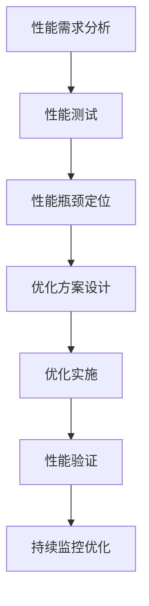

# 性能优化秘笈:提升系统性能,满足业务需求

## 1.背景介绍

### 1.1 什么是系统性能优化

系统性能优化是一种通过分析、测试和优化系统各个组件和资源的方法,旨在提高系统的整体性能、响应速度和可扩展性。随着业务需求的不断增长和系统复杂度的提高,确保系统能够高效运行并满足用户期望变得至关重要。

### 1.2 为什么需要系统性能优化

良好的系统性能不仅可以提升用户体验,还能降低运营成本、提高资源利用率,并为业务增长提供可靠的技术保障。以下是一些需要进行系统性能优化的常见原因:

- 响应时间过长,用户体验差
- 系统负载过高,资源利用率低下
- 无法有效应对突发流量,系统易崩溃
- 代码质量低下,存在性能瓶颈
- 业务快速增长,现有系统难以满足需求

### 1.3 性能优化的关键指标

在进行系统性能优化时,需要关注以下几个关键指标:

- 响应时间(Response Time)
- 吞吐量(Throughput)
- 资源利用率(Resource Utilization)
- 错误率(Error Rate)
- 可扩展性(Scalability)

## 2.核心概念与联系

### 2.1 性能优化的层次

系统性能优化可以分为以下几个层次:

1. **代码层优化**:优化算法、数据结构、代码逻辑等,消除代码级别的性能瓶颈。
2. **系统层优化**:优化操作系统、中间件、数据库等系统组件,提高资源利用效率。
3. **架构层优化**:优化系统架构设计,提高系统的可扩展性和容错性。
4. **基础设施优化**:优化硬件资源、网络环境等基础设施,为系统提供高性能的运行环境。

这些层次相互关联,需要综合考虑和优化。

### 2.2 性能优化的核心思路

性能优化的核心思路包括以下几个方面:

1. **确定性能瓶颈**:通过性能分析和测试,准确定位系统中的性能瓶颈点。
2. **消除瓶颈**:针对性能瓶颈点采取相应的优化措施,如代码重构、资源调优等。
3. **平衡资源利用**:合理分配和利用系统资源,避免资源浪费和过度竞争。
4. **提高系统可扩展性**:采用可扩展的架构设计,使系统能够灵活应对业务增长。
5. **持续监控和优化**:建立性能监控机制,持续优化系统性能。

### 2.3 性能优化的核心流程

性能优化的核心流程可以概括为以下几个步骤:

1. **性能需求分析**:明确性能目标和优化重点。
2. **性能测试**:设计测试用例,收集性能数据。
3. **性能瓶颈定位**:分析测试数据,定位性能瓶颈点。
4. **优化方案设计**:针对瓶颈点制定优化策略和方案。
5. **优化实施**:落实优化方案,优化代码、配置等。
6. **性能验证**:验证优化效果,确保满足性能目标。
7. **持续监控优化**:建立性能监控机制,持续优化。

## 3.核心算法原理具体操作步骤

### 3.1 性能测试和分析

性能测试是性能优化的基础,通过设计合理的测试用例并收集相关性能数据,可以准确定位系统中的性能瓶颈。常用的性能测试工具包括:JMeter、Apache AB、Siege等。

性能分析则是对收集到的性能数据进行深入解读,确定性能瓶颈的根本原因。常用的性能分析工具包括:性能分析器(Profiler)、堆转储分析工具、系统监控工具等。

#### 3.1.1 性能测试步骤

1. **确定测试目标**:明确需要测试的系统或模块,以及测试的目的和重点。
2. **设计测试计划**:制定测试策略、测试用例、测试环境等。
3. **准备测试环境**:搭建符合生产环境的测试环境。
4. **执行测试**:使用性能测试工具执行测试用例,收集性能数据。
5. **分析测试结果**:对测试数据进行分析,定位性能瓶颈。

#### 3.1.2 性能分析步骤

1. **收集性能数据**:通过性能测试、系统监控等方式收集CPU、内存、IO、网络等性能数据。
2. **分析性能数据**:使用性能分析工具对收集到的数据进行深入分析,查找性能瓶颈的根源。
3. **定位代码级瓶颈**:使用性能分析器(Profiler)等工具,定位代码中的热点方法、内存泄漏等问题。
4. **分析系统级瓶颈**:分析系统资源利用情况,如CPU、内存、IO、网络等,找出资源瓶颈点。
5. **总结分析结果**:汇总分析结果,明确需要优化的重点领域和具体问题。

### 3.2 代码层优化

代码层优化是性能优化的基础,通过优化算法、数据结构、代码逻辑等,可以有效消除代码级别的性能瓶颈。常见的代码层优化技术包括:

#### 3.2.1 算法优化

选择合适的算法对于提高系统性能至关重要。一些常见的算法优化技术包括:

- **减少算法时间复杂度**:优化算法的执行效率,降低时间复杂度。
- **空间换时间**:利用额外的空间来缓存中间结果,减少重复计算。
- **位运算**:在某些场景下,使用位运算可以提高计算效率。
- **预处理**:提前计算并缓存部分结果,减少运行时的计算量。

#### 3.2.2 数据结构优化

合理选择和使用数据结构,可以提高数据的存储和访问效率。常见的数据结构优化技术包括:

- **使用适当的数据结构**:根据实际需求选择合适的数据结构,如数组、链表、哈希表、树等。
- **数据压缩**:对数据进行压缩,减小存储空间和传输开销。
- **内存池**:使用内存池技术,避免频繁的内存分配和回收。
- **缓存**:使用缓存技术,减少对底层数据源的访问。

#### 3.2.3 代码逻辑优化

优化代码逻辑,消除不必要的计算和操作,可以显著提高代码执行效率。常见的代码逻辑优化技术包括:

- **减少循环次数**:通过代码重构,减少循环次数。
- **延迟计算**:推迟不必要的计算,直到真正需要时再执行。
- **避免重复计算**:缓存中间结果,避免重复计算。
- **减少对象创建**:尽量复用对象,减少对象的创建和销毁。
- **使用位运算代替条件语句**:在某些场景下,使用位运算可以提高执行效率。

### 3.3 系统层优化

系统层优化旨在提高系统资源的利用效率,常见的优化技术包括:

#### 3.3.1 操作系统优化

- **优化内核参数**:调整内核参数,如文件描述符限制、缓存大小等,以提高系统性能。
- **优化磁盘IO**:使用RAID技术、SSD等方式提高磁盘IO性能。
- **优化网络性能**:调整网络参数,如TCP窗口大小、缓冲区大小等,提高网络吞吐量。

#### 3.3.2 中间件优化

- **连接池**:使用数据库连接池、线程池等技术,避免频繁创建和销毁连接或线程。
- **缓存优化**:合理配置缓存大小、失效策略等,提高缓存命中率。
- **负载均衡**:使用负载均衡技术,合理分配请求负载。
- **异步处理**:使用异步处理技术,提高系统的并发能力。

#### 3.3.3 数据库优化

- **索引优化**:合理设计和使用索引,提高数据查询效率。
- **SQL优化**:优化SQL语句,避免全表扫描、减少数据传输量等。
- **分库分表**:对数据进行垂直或水平拆分,提高数据库并发能力。
- **读写分离**:将读写操作分离,提高数据库负载能力。

### 3.4 架构层优化

架构层优化旨在提高系统的可扩展性和容错性,常见的优化技术包括:

#### 3.4.1 分布式架构

- **服务拆分**:将系统拆分为多个服务,实现服务解耦和独立扩展。
- **负载均衡**:使用负载均衡技术,实现请求的合理分发。
- **缓存集群**:使用分布式缓存集群,提高缓存的可扩展性和高可用性。
- **消息队列**:使用消息队列实现异步处理,降低系统耦合度。

#### 3.4.2 容错和高可用

- **限流熔断**:使用限流和熔断机制,保护系统免受过载影响。
- **故障转移**:实现服务的故障转移和自动恢复,提高系统可用性。
- **数据备份**:定期备份数据,确保数据安全性和可恢复性。
- **灰度发布**:通过灰度发布机制,平滑升级系统版本。

#### 3.4.3 弹性伸缩

- **自动扩缩容**:根据系统负载自动扩展或收缩资源,提高资源利用率。
- **流量控制**:通过流量控制机制,合理分配系统资源。
- **动态路由**:使用动态路由技术,实现流量的智能调度。

### 3.5 基础设施优化

基础设施优化旨在为系统提供高性能的运行环境,常见的优化技术包括:

#### 3.5.1 硬件优化

- **CPU优化**:选择合适的CPU型号和数量,满足系统计算需求。
- **内存优化**:配置合理的内存容量和类型,提高内存访问效率。
- **存储优化**:使用SSD、RAID等技术,提高存储IO性能。
- **网络优化**:优化网络带宽、延迟等,确保网络性能满足需求。

#### 3.5.2 虚拟化优化

- **虚拟机优化**:优化虚拟机配置,如CPU虚拟化、内存气球技术等。
- **容器优化**:使用容器技术,提高资源利用率和隔离性。
- **云资源优化**:在云环境中合理配置和使用云资源。

#### 3.5.3 网络优化

- **负载均衡**:使用负载均衡技术,实现网络流量的合理分发。
- **内容分发网络**:使用CDN技术,加速静态资源的访问速度。
- **网络优化**:优化网络拓扑结构、协议栈等,提高网络性能。

## 4.数学模型和公式详细讲解举例说明

在性能优化领域,有许多数学模型和公式可以帮助我们更好地理解和分析系统性能。以下是一些常见的数学模型和公式:

### 4.1 队列理论

队列理论是一种研究等待线路的数学模型,在性能优化中常用于分析和优化系统的响应时间和吞吐量。

#### 4.1.1 小氏公式

小氏公式(Little's Law)描述了在稳定系统中,长期平均等待线路长度、长期平均到达率和长期平均逗留时间之间的关系:

$$L = \lambda W$$

其中:
- $L$表示长期平均等待线路长度(平均等待任务数)
- $\lambda$表示长期平均到达率(平均每单位时间到达任务数)
- $W$表示长期平均逗留时间(平均任务完成时间)

小氏