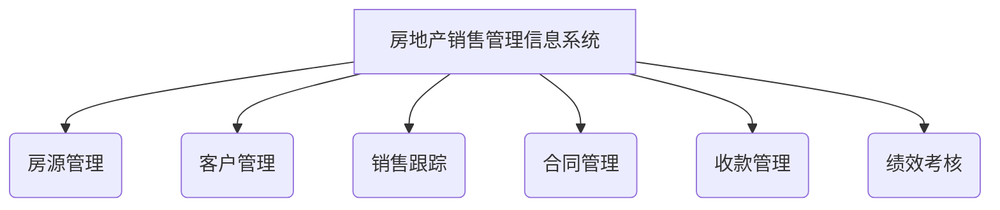
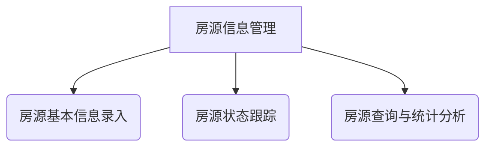
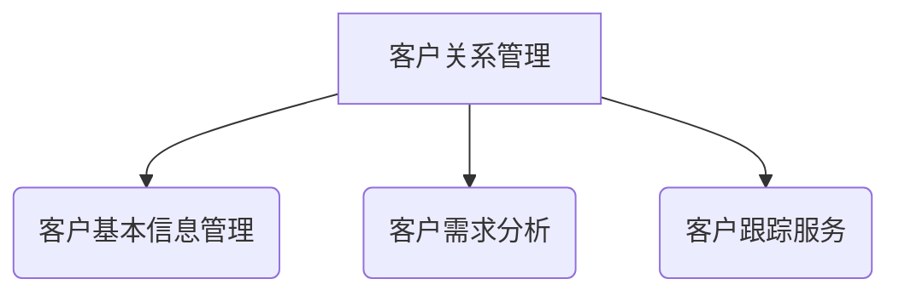
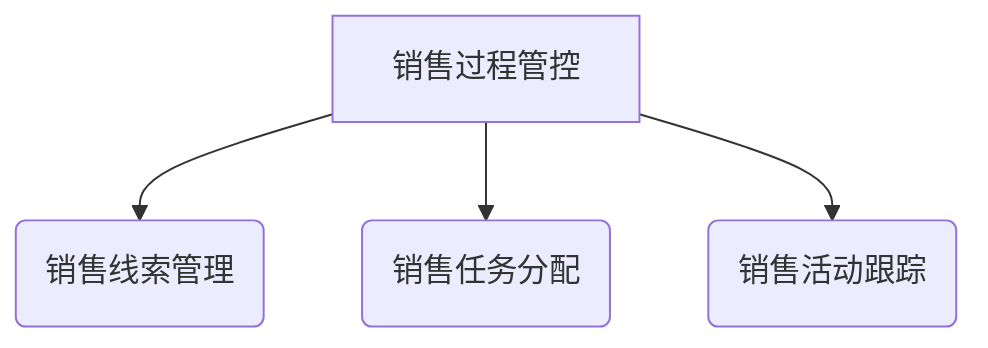
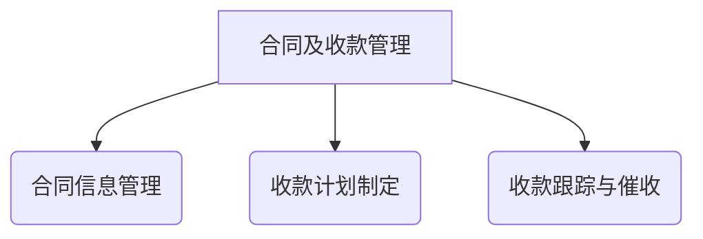
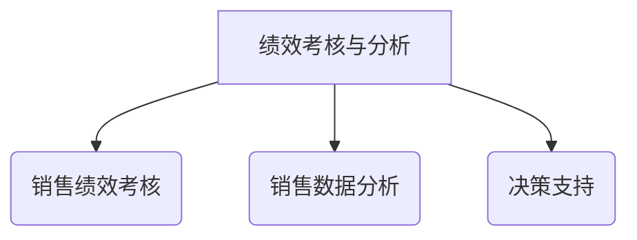

# 房地产销售管理信息系统论文

## 1.背景介绍

### 1.1 房地产行业概述

房地产行业是一个涉及面广、关联度高的复杂产业。它不仅关系到国民经济的健康发展,也与百姓的生活质量密切相关。随着城市化进程的不断加快,房地产业务日益增多,对房地产销售管理信息系统的需求也与日俱增。

### 1.2 传统房地产销售管理现状

传统的房地产销售管理模式存在诸多弊端:

- 信息孤岛,数据难以共享
- 流程冗长,效率低下
- 人工作业占比重,错误率高
- 缺乏智能化决策支持

这些问题严重制约了房地产企业的发展,亟需通过信息化手段来加以解决。

### 1.3 房地产销售管理信息系统的重要性

房地产销售管理信息系统的建设,能够实现销售全流程的自动化管理,提高工作效率,降低人力成本。同时,通过数据的集中存储和分析挖掘,可以为企业决策提供有力支撑。因此,构建一套高效、智能的房地产销售管理信息系统,对于房地产企业的可持续发展至关重要。

## 2.核心概念与联系

### 2.1 房地产销售管理信息系统的定义

房地产销售管理信息系统是指基于现代信息技术,对房地产销售全过程(房源管理、客户管理、销售跟踪、合同管理、收款管理、绩效考核等)实现自动化管理的应用系统。

### 2.2 房地产销售管理信息系统的核心功能

1. **房源信息管理**
   - 房源基本信息录入
   - 房源状态跟踪
   - 房源查询、统计分析
2. **客户关系管理**
   - 客户基本信息管理
   - 客户需求分析
   - 客户跟踪服务
3. **销售过程管控**
   - 销售线索管理
   - 销售任务分配
   - 销售活动跟踪
4. **合同及收款管理**
   - 合同信息管理
   - 收款计划制定
   - 收款跟踪与催收
5. **绩效考核与分析**
   - 销售绩效考核
   - 销售数据分析
   - 决策支持

### 2.3 房地产销售管理信息系统的作用

房地产销售管理信息系统的建设和应用,可以为企业带来以下重要作用:

1. 提高工作效率
2. 降低运营成本 
3. 改善客户体验
4. 支持决策优化
5. 实现信息共享
6. 规范业务流程
7. 加强风险控制

## 3.核心算法原理具体操作步骤  

### 3.1 房源信息管理模块

#### 3.1.1 房源基本信息录入

录入房源的基本信息,包括:

- 地理位置信息(省、市、区、小区等)
- 房屋面积、户型、朝向等
- 装修情况、配套设施等
- 定价、优惠政策等

这些信息将存储在房源信息库中,作为后续销售的基础数据。

#### 3.1.2 房源状态跟踪

系统需要实时跟踪房源的状态变化,如:

- 在售、已预订、已签约、已交房等
- 根据状态变化,自动触发相应的后续流程

#### 3.1.3 房源查询与统计分析

提供多维度的房源查询功能,如:

- 基于区域、面积、价格等条件的组合查询
- 基于状态的查询,如查询在售房源

同时,对房源信息进行统计分析,形成报表,为决策提供支持。

### 3.2 客户关系管理模块

#### 3.2.1 客户基本信息管理

建立客户信息库,录入和维护客户的基本信息,如:

- 个人信息:姓名、联系方式等
- 家庭情况:家庭成员、收入水平等
- 购房需求:期望区域、面积、价格等

#### 3.2.2 客户需求分析

根据客户提供的购房需求信息,结合房源情况,进行匹配分析,为客户推荐合适的房源。

#### 3.2.3 客户跟踪服务  

对重点客户实施全程跟踪服务,包括:

- 定期与客户沟通,了解最新需求变化
- 根据需求变化,及时调整房源推荐
- 跟踪客户的购房进展,提供贴心服务

### 3.3 销售过程管控模块

#### 3.3.1 销售线索管理

对获取的销售线索(如电话咨询、网上留言等)进行分类、评级,并分配给相应的销售人员进行跟进。

#### 3.3.2 销售任务分配

根据销售线索的级别、销售人员的工作量等,自动或手动将销售任务分配给合适的销售人员。

#### 3.3.3 销售活动跟踪

销售人员可以在系统中记录与客户的每次沟通、会面情况,系统自动形成销售活动日志,以备后续跟踪。

### 3.4 合同及收款管理模块

#### 3.4.1 合同信息管理

录入签订的销售合同信息,包括:

- 合同编号、签订日期等
- 客户信息、房源信息
- 成交价格、付款方式等

#### 3.4.2 收款计划制定

根据合同约定的付款方式,自动生成分期收款计划。

#### 3.4.3 收款跟踪与催收

跟踪每期收款的实际执行情况,对逾期未付款的,自动发起催收流程。

### 3.5 绩效考核与分析模块  

#### 3.5.1 销售绩效考核

设置合理的销售绩效考核体系,对销售人员的工作绩效进行定期考评,结果将作为薪酬分配、晋升的重要依据。

#### 3.5.2 销售数据分析

对房源销售数据进行多维度的统计分析,生成各类报表,了解销售动态。

#### 3.5.3 决策支持

基于销售数据分析结果,结合市场行情等外部数据,为企业的战略决策提供有力支持。

## 4.数学模型和公式详细讲解举例说明

在房地产销售管理信息系统中,数学模型和公式的应用主要体现在以下几个方面:

### 4.1 房源定价模型

合理的房源定价对于销售的成功至关重要。常用的定价模型包括:

1. **回归模型**

利用回归分析技术,将影响房价的各种因素(如地理位置、房龄、面积等)与房价建立数学关系模型,用于房价预测。

$$
Y = \beta_0 + \beta_1X_1 + \beta_2X_2 + \cdots + \beta_nX_n
$$

其中:
- $Y$表示房价
- $X_1, X_2, \cdots, X_n$表示影响房价的各种因素
- $\beta_0, \beta_1, \cdots, \beta_n$为模型参数,需要通过训练数据进行估计

2. **ヘドニック价格模型**

将房屋视为一个由多种特征构成的异质产品,利用ヘドニック价格理论估计每种特征的隐含价格,并将它们相加得到房屋的总价值。

$$
P = f(S, N, Q, E, C, \cdots)
$$

其中:
- $P$表示房价
- $S$表示房屋的结构特征(如面积、房龄等)
- $N$表示房屋所在社区的环境特征
- $Q$表示房屋内在质量特征(如装修水平等)
- $E$表示房屋的经济特征(如距离CBD的距离等)
- $C$表示房屋的契约特征(如物业费等)

### 4.2 客户价值分析模型

通过对客户数据的挖掘分析,可以发现潜在的高价值客户,为营销策略的制定提供依据。

1. **RFM模型**

RFM模型根据客户最近一次购买的时间(Recency)、购买频率(Frequency)和购买金额(Monetary)对客户进行打分和分层。

$$
R = \log_\alpha(1 + \textbf{r})\\
F = \log_\alpha(1 + \textbf{f})\\
M = \log_\alpha(1 + \textbf{m})\\
\text{RFM Score} = R \times 100 + F \times 10 + M
$$

其中:
- $\textbf{r}$表示客户最近一次购买时间与当前时间的间隔(天)
- $\textbf{f}$表示客户购买频率(购买次数)
- $\textbf{m}$表示客户购买金额
- $\alpha$为对数底数,通常取$\alpha = 2$

2. **客户生命周期价值模型(CLV)**

CLV模型估算客户在其整个生命周期内为企业创造的价值,有助于制定精准营销策略。

$$
\text{CLV} = \sum_{t=0}^{T} \frac{R_t \times (1 - E_t) - C_t}{(1 + i)^t}
$$

其中:
- $T$表示客户的预期存活期(购买周期)
- $R_t$表示第$t$期的预期收入
- $E_t$表示第$t$期的预期费用率
- $C_t$表示第$t$期的预期营销成本
- $i$表示折现率

### 4.3 销售人员薪酬分配模型

合理的薪酬分配机制,可以极大地激发销售人员的工作积极性。常用的分配模型包括:

1. **绩效薪酬分配模型**

根据销售人员的绩效表现,按比例分配绩效薪酬。

$$
S_i = \alpha \times B_i + \beta \times \frac{P_i}{\sum_{j=1}^{n}P_j} \times F
$$

其中:
- $S_i$表示第$i$个销售人员的薪酬
- $B_i$表示第$i$个销售人员的基本工资
- $P_i$表示第$i$个销售人员的业绩
- $F$表示可分配的绩效薪酬总额
- $\alpha$和$\beta$分别为基本工资和绩效工资的权重系数($\alpha + \beta = 1$)

2. **博弈论薪酬分配模型**

将薪酬分配视为一个博弈问题,寻求最优的纳什均衡解。

设有$n$个销售人员,其贡献向量为$\boldsymbol{x} = (x_1, x_2, \cdots, x_n)$,则根据纳什谈判模型,其薪酬分配向量$\boldsymbol{y} = (y_1, y_2, \cdots, y_n)$应满足:

$$
\max \prod_{i=1}^n (y_i - d_i)\\
\text{s.t.} \quad \sum_{i=1}^n y_i = v(\boldsymbol{x})\\
y_i \geq d_i, \quad i = 1, 2, \cdots, n
$$

其中:
- $d_i$表示第$i$个销售人员的保留收益(通常为其基本工资)
- $v(\boldsymbol{x})$表示总的可分配收益

通过求解该优化问题