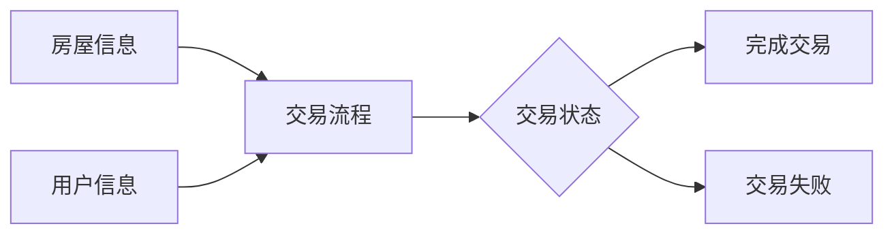

## 1.背景介绍

房屋交易作为社会经济活动的重要组成部分，其公正、公平、公开的运行对于维护社会稳定、保障公民权益具有重要的意义。然而，传统的房屋交易方式存在诸多不便之处，例如信息不透明、交易流程复杂、效率低下等。为解决这些问题，许多城市的房管局开始引入房屋交易管理系统，以提高房屋交易的效率和透明度。

## 2.核心概念与联系

房屋交易管理系统是一个涵盖了房屋信息管理、房屋交易管理、合同管理等多个模块的大型信息系统。其核心概念包括：

- 房屋信息：包括房屋的基本信息、产权信息、交易历史等。
- 用户信息：包括用户的身份信息、联系方式、交易记录等。
- 交易流程：包括发布房源、预约看房、提交购买申请、签订合同、付款、过户等步骤。

这些概念之间的联系可以通过以下Mermaid流程图进行展示：



## 3.核心算法原理具体操作步骤

房屋交易管理系统的核心算法主要涉及到信息查询、信息匹配和交易流程管理。以下是这些算法的具体操作步骤：

- 信息查询：用户通过输入查询条件（如房屋价格、面积、地段等），系统返回满足条件的房屋信息。这一步骤通常使用数据库的查询语言（如SQL）进行操作。
- 信息匹配：系统根据用户的需求（如购房预算、地段偏好等）匹配适合的房源。这一步骤通常使用推荐算法进行操作。
- 交易流程管理：系统根据交易的各个步骤设定相应的状态，如“待看房”、“待签合同”、“待付款”等。这一步骤通常使用状态机模型进行操作。

## 4.数学模型和公式详细讲解举例说明

在信息匹配的过程中，我们通常使用推荐算法来帮助用户找到适合的房源。一种常用的推荐算法是基于用户的购房需求和房源的特性进行相似度计算。例如，我们可以使用余弦相似度来计算用户需求和房源特性之间的相似度。

余弦相似度的计算公式如下：

$$
\text{similarity} = \frac{\vec{u} \cdot \vec{v}}{||\vec{u}||_2 \times ||\vec{v}||_2}
$$

其中，$\vec{u}$ 表示用户需求的向量，$\vec{v}$ 表示房源特性的向量，$\cdot$ 表示向量的点积，$||\cdot||_2$ 表示向量的2范数。

以一个简单的例子来说明，假设用户需求的向量是 [1, 0, 1]，表示用户希望购买价格低、面积大的房子，而一个房源的特性向量是 [1, 1, 0]，表示这个房源的价格低、面积小。那么，这个用户和这个房源之间的余弦相似度为：

$$
\text{similarity} = \frac{[1, 0, 1] \cdot [1, 1, 0]}{||[1, 0, 1]||_2 \times ||[1, 1, 0]||_2} = \frac{1}{\sqrt{2} \times \sqrt{2}} = 0.5
$$

这个值表示用户的需求和房源的特性有一半是相似的，因此系统可能会将这个房源推荐给用户。

## 5.项目实践：代码实例和详细解释说明

在项目实践中，我们通常使用数据库和后端开发语言（如Python、Java等）来实现房屋交易管理系统。以下是一个简单的例子，演示了如何使用Python和SQLite数据库来实现房屋信息查询的功能：

```python
import sqlite3

# 连接数据库
conn = sqlite3.connect('house.db')
c = conn.cursor()

# 定义查询条件
price = 5000000
area = 100

# 执行查询语句
c.execute("SELECT * FROM house WHERE price <= ? AND area >= ?", (price, area))

# 获取查询结果
rows = c.fetchall()

# 打印查询结果
for row in rows:
    print(row)

# 关闭数据库连接
conn.close()
```

这段代码首先连接到名为`house.db`的SQLite数据库，然后定义了查询条件（价格不超过500万，面积不小于100平方米），接着执行了查询语句，并获取了查询结果。最后，代码打印出了查询结果，并关闭了数据库连接。

## 6.实际应用场景

房屋交易管理系统在许多实际应用场景中都有着广泛的应用，例如：

- 房管局：房管局可以使用房屋交易管理系统来管理房源信息、审核房屋交易、处理交易纠纷等。
- 房地产中介：房地产中介可以使用房屋交易管理系统来发布房源信息、匹配买卖双方、助理交易流程等。
- 用户：用户可以使用房屋交易管理系统来查询房源信息、预约看房、提交购买申请等。

## 7.工具和资源推荐

以下是一些在开发房屋交易管理系统时可能会用到的工具和资源：

- 数据库：MySQL、PostgreSQL、SQLite等。
- 后端开发语言：Python、Java、C#等。
- 前端开发语言：HTML、CSS、JavaScript等。
- 开发工具：Visual Studio Code、PyCharm、Eclipse等。
- 版本控制工具：Git、SVN等。

## 8.总结：未来发展趋势与挑战

随着信息技术的发展，房屋交易管理系统的功能将越来越丰富，例如引入更先进的推荐算法、使用大数据分析来预测房价走势、利用区块链技术来确保交易的安全性等。然而，这也带来了一些挑战，例如如何保护用户隐私、如何防止虚假房源信息、如何处理大量的房源数据等。这些问题需要我们在未来的研究和开发中去解决。

## 9.附录：常见问题与解答

1. Q：房屋交易管理系统如何保证交易的安全性？
   A：房屋交易管理系统通常使用多种安全措施来保证交易的安全性，例如使用HTTPS协议来保护数据传输的安全，使用密码哈希等技术来保护用户密码的安全，使用权限控制等技术来保证只有授权用户才能访问相关信息。

2. Q：房屋交易管理系统如何处理大量的房源数据？
   A：房屋交易管理系统通常使用数据库来存储和处理大量的房源数据。数据库不仅可以高效地查询和更新数据，还可以通过索引、分区等技术来提高处理大量数据的性能。

3. Q：房屋交易管理系统如何防止虚假房源信息？
   A：房屋交易管理系统通常通过审核机制来防止虚假房源信息。例如，用户发布房源信息后，系统会进行自动审核，如检查房源信息的完整性、合理性等。此外，系统还会对用户进行实名认证，以减少虚假信息的出现。

作者：禅与计算机程序设计艺术 / Zen and the Art of Computer Programming