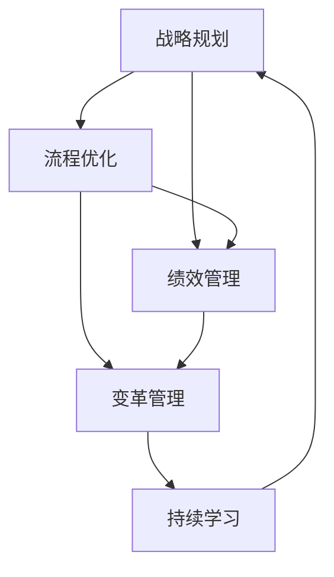
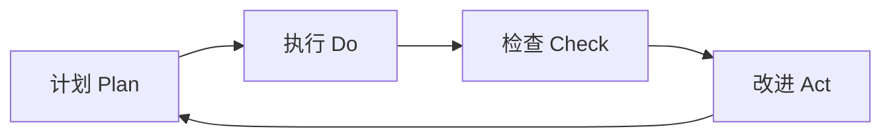

# "执行体系的持续改进：追求卓越的方法"

## 1.背景介绍

在当今瞬息万变的商业环境中,组织需要不断适应和改进其执行体系,以保持竞争力并实现可持续发展。执行体系涉及组织的各个方面,包括战略规划、资源分配、流程优化、绩效管理等。持续改进执行体系是追求卓越的关键,它能够帮助组织识别问题、优化流程、提高效率,从而实现更高的绩效和更好的业务成果。

### 1.1 执行体系的重要性

执行体系是组织实现战略目标、完成任务和创造价值的基础。一个高效、灵活、适应性强的执行体系能够帮助组织快速响应市场变化,充分利用资源,提高运营效率,从而在竞争中脱颖而出。相反,一个僵化、低效、缺乏适应性的执行体系会阻碍组织的发展,导致资源浪费、机会损失和竞争力下降。

### 1.2 持续改进的必要性

在当今快速变化的商业环境中,没有一个执行体系是完美的,也没有一个执行体系能够长期保持优势。组织需要通过持续改进来不断优化执行体系,以适应新的挑战和机遇。持续改进是一个循环往复的过程,包括计划、执行、检查和改进四个步骤。通过这个过程,组织能够发现问题、总结经验、优化流程,从而实现持续的进步和卓越的表现。

### 1.3 追求卓越的意义

追求卓越是组织持续发展的动力,也是组织实现长期成功的保证。卓越不仅意味着高水平的绩效和业务成果,更意味着不断超越自我、追求更高目标的精神。通过持续改进执行体系,组织能够不断提高标准、突破瓶颈,从而实现卓越的表现。同时,追求卓越也能够激发员工的积极性和创造力,营造一个积极向上、不断进步的组织文化。

## 2.核心概念与联系

要实现执行体系的持续改进,需要理解几个核心概念以及它们之间的联系。这些概念包括战略规划、流程优化、绩效管理、变革管理和持续学习。

### 2.1 战略规划

战略规划是执行体系的起点,它确定了组织的愿景、使命、目标和策略。一个清晰、可行、有针对性的战略规划能够为执行体系提供方向和指引,帮助组织聚焦资源、优化决策。同时,战略规划也需要根据内外部环境的变化进行动态调整,以保持其有效性和适应性。

### 2.2 流程优化

流程优化是执行体系的核心,它涉及组织内部各个业务流程的设计、执行和改进。高效、精简、标准化的流程能够提高组织的运营效率,减少资源浪费,提高产品和服务质量。流程优化需要基于数据分析和持续改进的方法,不断发现问题、优化环节、提高绩效。

### 2.3 绩效管理

绩效管理是执行体系的重要组成部分,它涉及目标设定、绩效评估、反馈改进等环节。有效的绩效管理能够激励员工,提高工作效率,促进组织目标的实现。绩效管理需要与战略规划和流程优化相结合,建立科学、公平、透明的评估体系,并为员工提供持续的指导和支持。

### 2.4 变革管理

变革管理是执行体系持续改进的保障,它涉及组织变革的计划、实施和评估。在持续改进的过程中,组织需要进行各种变革,如流程再造、组织重组、文化转型等。有效的变革管理能够减少阻力,提高变革的成功率,确保组织能够顺利实现转型和升级。变革管理需要从人、流程、技术等多个维度入手,采用系统化的方法和工具。

### 2.5 持续学习

持续学习是执行体系持续改进的源动力,它涉及组织和个人不断学习、成长和创新的过程。在持续改进的过程中,组织需要总结经验教训,吸收先进理念,掌握新的知识和技能。持续学习能够帮助组织提高适应能力,增强创新能力,从而在不断变化的环境中保持竞争优势。持续学习需要营造良好的学习氛围,建立完善的知识管理体系,鼓励员工主动学习和创新。

以下是这些核心概念之间的联系图:

从图中可以看出,战略规划是执行体系的起点,它指导流程优化和绩效管理;流程优化和绩效管理相互影响,共同促进变革管理;变革管理需要持续学习的支持,而持续学习又为战略规划提供新的思路和洞见。这些概念之间相互联系、相互促进,形成一个闭环,推动执行体系的持续改进和不断优化。

## 3.核心算法原理具体操作步骤

在执行体系的持续改进中,PDCA循环是一个核心的算法和操作步骤。PDCA循环,也称为戴明环,是由美国质量管理专家戴明提出的一种持续改进的方法。PDCA循环包括四个步骤:计划(Plan)、执行(Do)、检查(Check)和改进(Act)。

### 3.1 计划(Plan)

计划是PDCA循环的第一步,它包括以下具体操作:

1. 识别问题或改进机会:通过数据分析、流程审核、绩效评估等方式,发现执行体系中存在的问题或改进空间。
2. 确定目标和指标:根据问题或改进机会,设定明确、可衡量、可实现的目标和关键绩效指标(KPI)。
3. 制定行动计划:针对目标和指标,制定详细的行动计划,包括具体的任务、责任人、时间表和所需资源等。

### 3.2 执行(Do)

执行是PDCA循环的第二步,它包括以下具体操作:

1. 实施行动计划:按照计划,组织和调配资源,开展具体的改进行动。
2. 收集数据和信息:在执行过程中,收集与目标和指标相关的数据和信息,为后续的检查和改进提供依据。
3. 记录执行过程:详细记录执行过程中的关键活动、问题和经验,为后续的总结和改进提供素材。

### 3.3 检查(Check)

检查是PDCA循环的第三步,它包括以下具体操作:

1. 评估执行结果:根据收集的数据和信息,评估执行结果是否达到预期目标和指标。
2. 分析差异原因:如果执行结果与目标存在差异,分析差异产生的原因,如计划制定不合理、执行不到位、外部环境变化等。
3. 总结经验教训:总结执行过程中的经验教训,包括成功做法、需要改进的地方、遇到的问题和解决方法等。

### 3.4 改进(Act)

改进是PDCA循环的第四步,也是最后一步,它包括以下具体操作:

1. 制定改进措施:根据检查的结果和总结的经验教训,制定针对性的改进措施,如调整目标、优化流程、强化管理等。
2. 标准化成功做法:对于执行过程中的成功做法,总结提炼,形成标准化的流程或方法,并在组织内推广应用。
3. 开始新的PDCA循环:根据改进措施的实施情况,启动新一轮的PDCA循环,持续优化执行体系。

以下是PDCA循环的流程图:

从图中可以看出,PDCA循环是一个不断循环、螺旋上升的过程。每一次循环都会基于上一次的结果进行改进,使得执行体系不断优化,绩效水平不断提高。通过PDCA循环的持续运用,组织能够实现执行体系的持续改进,追求卓越的表现。

## 4.数学模型和公式详细讲解举例说明

在执行体系的持续改进中,数学模型和公式可以用于绩效评估、决策优化、资源分配等方面。下面以OEE(Overall Equipment Effectiveness,设备综合效率)模型为例,详细讲解其原理和应用。

### 4.1 OEE模型原理

OEE模型是衡量设备综合效率的一种方法,它考虑了设备的可用性、性能和质量三个方面。OEE可以用以下公式表示:

$$
OEE = 可用性 \times 性能 \times 质量
$$

其中:

- 可用性(Availability):设备实际运行时间占计划运行时间的比例,反映了设备的利用率。可用性可以用以下公式计算:

$$
可用性 = \frac{实际运行时间}{计划运行时间} \times 100\%
$$

- 性能(Performance):设备实际生产速度与标准生产速度的比值,反映了设备的生产效率。性能可以用以下公式计算:

$$
性能 = \frac{实际生产速度}{标准生产速度} \times 100\%
$$

- 质量(Quality):合格产品数量占总产品数量的比例,反映了设备生产的产品质量。质量可以用以下公式计算:

$$
质量 = \frac{合格产品数量}{总产品数量} \times 100\%
$$

### 4.2 OEE模型应用举例

假设某制造企业有一条生产线,计划每天运行8小时(480分钟),标准生产速度为每分钟60个产品。在某一天,该生产线实际运行了420分钟,共生产了20000个产品,其中合格产品为19600个。根据OEE模型,可以计算该生产线当天的设备综合效率:

- 计划运行时间:480分钟
- 实际运行时间:420分钟
- 标准生产速度:60个/分钟
- 实际生产速度:20000个/420分钟=47.62个/分钟
- 总产品数量:20000个
- 合格产品数量:19600个

根据公式,可以计算:

- 可用性:$\frac{420}{480} \times 100\% = 87.5\%$
- 性能:$\frac{47.62}{60} \times 100\% = 79.37\%$
- 质量:$\frac{19600}{20000} \times 100\% = 98\%$

因此,该生产线当天的OEE为:

$$
OEE = 87.5\% \times 79.37\% \times 98\% = 68.1\%
$$

这意味着,该生产线当天的设备综合效率为68.1%,还有较大的提升空间。企业可以通过分析可用性、性能和质量三个维度的数据,找出影响OEE的关键因素,并采取针对性的改进措施,如优化设备维护、提高生产效率、加强质量控制等,从而持续提升设备综合效率,实现执行体系的持续改进。

## 5.项目实践:代码实例和详细解释说明

在执行体系的持续改进中,信息技术发挥着越来越重要的作用。下面以一个绩效管理系统的代码实例为例,详细说明如何利用信息技术支持执行体系的持续改进。

### 5.1 绩效管理系统功能介绍

该绩效管理系统主要包括以下功能模块:

- 目标管理:支持战略目标的分解和cascading,形成各层级的目标体系。
- 绩效计划:支持制定个人和团队的绩效计划,明确工作任务和目标。
- 绩效考核:支持多维度、多层级的绩效考核,包括KPI考核、能力考核、行为考核等。
- 绩效反馈:支持绩效反馈和面谈,帮助员工发现问题,改进绩效。
- 绩效改进:支持制定和跟踪绩效改进计划,持续提升个人和组织绩效。

### 5.2 关键代码实例

以下是该绩效管理系统中目标管理模块的部分代码实例: