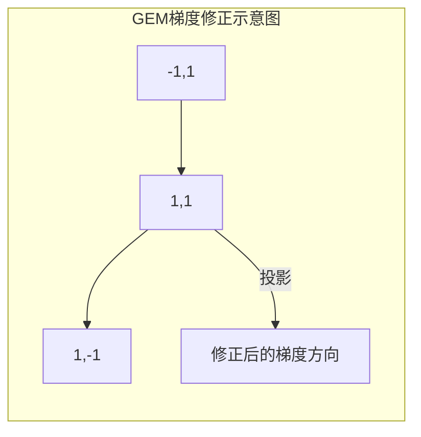

# 持续学习与渐进学习原理与代码实战案例讲解

作者：禅与计算机程序设计艺术

## 1. 背景介绍

### 1.1 人工智能的发展历程

#### 1.1.1 早期人工智能的探索
#### 1.1.2 机器学习的兴起  
#### 1.1.3 深度学习的突破

### 1.2 传统机器学习的局限性

#### 1.2.1 需要大量标注数据
#### 1.2.2 泛化能力有限
#### 1.2.3 缺乏持续学习能力

### 1.3 持续学习与渐进学习的提出

#### 1.3.1 持续学习的概念
#### 1.3.2 渐进学习的概念 
#### 1.3.3 二者之间的关系

## 2. 核心概念与联系

### 2.1 持续学习(Continual Learning)

#### 2.1.1 定义与特点
持续学习是指AI系统能够不断从新数据中学习新知识,同时保留之前学到的知识,实现知识的持续积累和更新。其特点包括:
- 能够持续不断地学习新任务和新知识
- 在学习新知识的同时尽量避免遗忘之前学到的知识(即避免灾难性遗忘)
- 能够利用之前学到的知识更高效地学习新知识

#### 2.1.2 面临的挑战
持续学习面临的主要挑战包括:
- 灾难性遗忘(Catastrophic Forgetting):在学习新任务时,神经网络的参数发生剧烈变化,导致之前学到的知识被"冲刷"掉。
- 数据可用性:新任务的数据可能无法与历史数据混合在一起训练。
- 模型复杂度:为每个新任务都训练一个模型会导致模型数量和复杂度急剧增加。

### 2.2 渐进学习(Incremental Learning)

#### 2.2.1 定义与特点  
渐进学习是指AI系统能够渐进式地学习新类别,即在保留已学类别知识的基础上,不断扩充新的类别。其特点包括:
- 每次学习一个或少量新类别,而不是一次性学习所有类别
- 保留对已学类别的识别能力
- 新类别的学习不需要重新使用之前的训练数据

#### 2.2.2 面临的挑战
渐进学习面临的主要挑战包括:  
- 类别增量问题:每次新增类别后,分类器需要重新训练,而新类别的样本数量通常很少。
- 特征表示漂移:不同批次间的数据分布可能发生漂移,导致之前学到的特征不再适用。
- 旧类别的过拟合:在增量学习后期,分类器在旧类别上容易过拟合。

### 2.3 二者的关系与区别

持续学习和渐进学习都是为了让AI系统获得持续学习的能力,但二者侧重点有所不同:
- 持续学习偏重任务层面,强调不断学习新任务和避免灾难性遗忘。
- 渐进学习偏重数据层面,强调不断学习新类别和保持对旧类别的识别能力。
- 渐进学习可以看作是持续学习的一个子问题和基础。很多渐进学习方法也可以用于持续学习。

## 3. 核心算法原理与具体操作步骤

### 3.1 基于正则化的持续学习方法

#### 3.1.1 弹性权重巩固(Elastic Weight Consolidation, EWC)

**基本思想**: 在学习新任务时,对对原任务有重要贡献的参数施加正则化约束,使其在训练新任务时不会剧烈改变。

**具体步骤**:
1. 在任务A上训练网络,得到参数$\theta^*_A$。
2. 计算任务A的Fisher信息矩阵$F_A$,它表示每个参数的重要性。 
3. 在任务B的损失函数中加入正则化项:$L_B(\theta) + \sum_i \frac{\lambda}{2} F_{A,i} (\theta_i - \theta^*_{A,i})^2$
4. 在任务B上训练网络,同时使正则化项最小。这样可以在学习任务B的同时,保留对任务A有重要贡献的参数。
5. 不断重复上述过程,实现持续学习。

#### 3.1.2 学习无遗忘(Learning without Forgetting, LwF)

**基本思想**: 在学习新任务时,同时对原任务的知识进行蒸馏,使新模型在新任务上表现良好的同时,也能保持对原任务的知识。

**具体步骤**:
1. 在任务A上训练网络,得到模型$M_A$。
2. 在任务B的训练集上,用$M_A$对每个样本生成软标签$y_A$。
3. 在任务B上训练新模型$M_B$,损失函数为:$L_B + \lambda L_{KD}(y_B, y_A)$。其中$L_{KD}$是蒸馏损失,使$M_B$的输出与$M_A$在任务B数据上的输出尽量一致。
4. 不断重复上述过程,实现持续学习。

### 3.2 基于动态结构的持续学习方法

#### 3.2.1 渐进网络(Progressive Networks)

**基本思想**: 每个新任务对应一个新的子网络,通过横向连接重用之前任务学到的特征,同时各任务子网络间不共享参数,避免了灾难性遗忘。

**具体步骤**:
1. 从任务1开始,为每个任务分配一个对应的子网络。
2. 当前任务T的子网络通过横向连接接收所有之前任务子网络的特征图。
3. 冻结之前所有任务的子网络参数,只训练当前任务T的子网络。
4. 不断重复上述过程,实现持续学习。随着任务数量增加,网络规模也会变大。

#### 3.2.2 动态扩展网络(Dynamically Expandable Networks, DEN)

**基本思想**: 将网络划分为特定任务的子网络和共享的子网络。通过选择性地复制和重训练部分参数来适应新任务,同时保留共享的知识。

**具体步骤**:
1. 初始化任务1的网络,包含特定任务的子网络和共享子网络。
2. 当新任务到来时,冻结共享子网络的参数。
3. 对新任务的损失函数求梯度,根据梯度选择需要扩展的神经元和连接。
4. 复制选择出的神经元和连接,加入到特定任务的子网络中。
5. 微调整个网络,共享子网络参数不变,其余参数更新。
6. 不断重复上述过程,实现持续学习。网络规模可以动态增长。

### 3.3 基于记忆回放的持续学习方法

#### 3.3.1 深度生成回放(Deep Generative Replay, DGR)

**基本思想**: 在学习新任务时,通过生成模型重现之前任务的数据分布,再利用重现的数据进行回放训练,减缓灾难性遗忘。

**具体步骤**:
1. 初始化生成器G和分类器S,在任务1上进行训练。
2. 当新任务t到来时,冻结生成器G。
3. 用G生成一些任务t-1的样本,与任务t的样本混合,一起训练分类器S。
4. 用任务t的数据训练一个新的生成器G_t。
5. 将G_t和S组成新的模型,用于后续任务。
6. 不断重复上述过程,实现持续学习。

#### 3.3.2 梯度情节化(Gradient Episodic Memory, GEM)

**基本思想**: 将一部分历史数据存入记忆库中,在学习新任务时通过优化方向约束,使得新任务的梯度不会使损失在记忆库的样本上上升,避免遗忘。

**具体步骤**:
1. 初始化模型,并将每个任务的一部分数据存入记忆库。
2. 用当前任务的损失函数对参数求梯度$g$。
3. 对记忆库中每个任务采样一个batch,分别计算梯度$g_k$。
4. 将$g$投影到每个$g_k$的半空间内,修正优化方向为$\tilde g$。
5. 用修正后的梯度$\tilde g$更新模型参数。
6. 不断重复上述过程,实现持续学习。

## 4. 数学模型和公式详细讲解举例说明

### 4.1 EWC的Fisher信息矩阵

在EWC算法中,Fisher信息矩阵$F$用于衡量每个参数的重要性。对于参数$\theta$和数据分布$D$,Fisher信息矩阵定义为:

$$
F=\mathbb{E}_{x \sim D}\left[\left(\frac{\partial \log p(x|\theta)}{\partial \theta}\right)^{2}\right]
$$

直观地理解,如果一个参数$\theta_i$的微小变化会导致数据的似然概率有较大变化,那么这个参数对当前任务是重要的,对应的$F_{ii}$就会较大。

在实际计算时,我们用经验Fisher信息矩阵来近似:

$$
\hat{F}=\frac{1}{N} \sum_{n=1}^{N}\left(\frac{\partial \log p\left(x^{(n)} | \theta\right)}{\partial \theta}\right)^{2}
$$

其中$\{x^{(n)}\}_{n=1}^N$是从任务的数据分布中采样的数据。

### 4.2 GEM的梯度方向修正

在GEM算法中,我们需要将当前任务的梯度$g$投影到每个记忆任务的梯度$g_k$的半空间内,得到修正后的梯度方向$\tilde g$。

具体地,我们要解决如下优化问题:

$$
\begin{aligned}
\min _{\tilde{g}} &\frac{1}{2}\|\tilde{g}-g\|^{2} \\
\text { s.t. } &\left\langle\tilde{g}, g_{k}\right\rangle \geq 0, \forall k
\end{aligned}
$$

这个问题可以用二次规划(QP)求解。直观地理解,我们希望修正后的梯度方向$\tilde g$与原梯度$g$尽量接近,同时与每个记忆任务的梯度$g_k$夹角小于90度,即不会使这些任务的损失上升。

假设一个模型有两个参数$\theta_1,\theta_2$,当前任务的梯度为$g=(1,1)$,记忆中有两个任务的梯度分别为$g_1=(-1,1), g_2=(1,-1)$。如下图所示,GEM算法会将$g$投影到$g_1,g_2$的半空间交集内,得到修正后的梯度方向$\tilde g$。



## 5. 项目实践：代码实例和详细解释说明

下面我们以PyTorch为例,实现一个简单的EWC算法。

```python
import torch
import torch.nn as nn
import torch.optim as optim

class Net(nn.Module):
    def __init__(self):
        super(Net, self).__init__()
        self.fc1 = nn.Linear(784, 256)
        self.fc2 = nn.Linear(256, 10)
        
    def forward(self, x):
        x = torch.relu(self.fc1(x))
        x = self.fc2(x)
        return x

def compute_fisher(model, dataset, sample_size):
    fisher = {}
    for n, p in model.named_parameters():
        fisher[n] = p.data.zero_()
        
    model.eval()
    for x, y in dataset:
        model.zero_grad()
        x = x.view(1, -1)
        y_pred = model(x)
        loss = torch.nn.functional.nll_loss(torch.log_softmax(y_pred, dim=1), y.view(-1))
        loss.backward()
        
        for n, p in model.named_parameters():
            fisher[n] += p.grad.data ** 2 / sample_size
    
    model.train()
    return fisher

def train(model, dataset, optimizer, fisher=None, ewc_lambda=0):
    model.train()
    for x, y in dataset:
        optimizer.zero_grad()
        x = x.view(1, -1)
        y_pred = model(x)
        loss = torch.nn.functional.nll_loss(torch.log_softmax(y_pred, dim=1), y.view(-1))
        
        if fisher is not None: