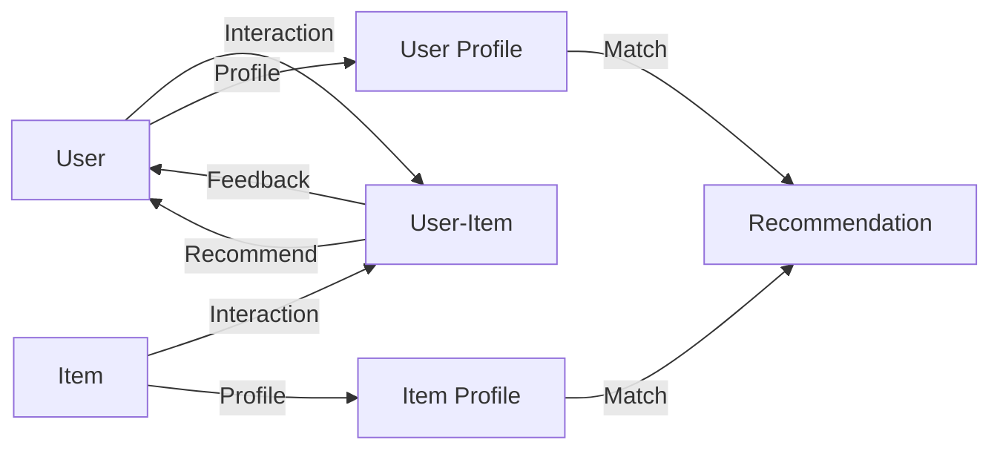

# 《推荐系统原理与实践》

## 1.背景介绍

### 1.1 推荐系统的兴起
在互联网时代,信息过载和选择困难成为了人们面临的主要问题。推荐系统应运而生,旨在帮助用户从海量信息中发现感兴趣的内容,提升用户体验。从亚马逊的商品推荐到Netflix的电影推荐,再到今日头条的新闻推荐,推荐系统已经渗透到我们生活的方方面面。

### 1.2 推荐系统的商业价值
对于企业而言,推荐系统是提升用户粘性、增加销售额、优化运营效率的利器。据统计,亚马逊35%的销售额来自推荐,Netflix超过80%的视频流量来自推荐。可以说,谁掌握了更加智能、精准的推荐技术,谁就能在竞争中占据优势地位。

### 1.3 推荐系统的技术挑战  
尽管推荐系统取得了巨大成功,但仍面临诸多技术挑战:
- 数据稀疏性:用户行为数据高度稀疏,如何克服数据稀疏性是一大难题
- 冷启动:对于新用户和新物品,如何给出合理推荐
- 多样性:推荐结果要兼顾相关性和多样性,不能只推荐热门
- 实时性:用户兴趣变化快,需要实时捕捉用户动态偏好
- 解释性:推荐要让用户知其所以然,黑盒算法难以解释  

## 2.核心概念与联系

### 2.1 用户(User)
推荐系统中的核心角色,推荐的目的就是满足用户的个性化需求。用户通常有一些属性特征,如人口统计学特征、兴趣爱好等。

### 2.2 物品(Item) 
推荐系统要推荐的对象,可以是商品、电影、新闻等。物品也有自己的属性特征,如类别、关键词等。

### 2.3 用户-物品交互(User-Item Interaction)
用户对物品产生的行为,表明用户对物品的兴趣程度。常见的交互类型有:
- 显式反馈:打分、点赞、收藏等
- 隐式反馈:浏览、点击、购买等

### 2.4 用户画像(User Profile)
对用户各种属性和行为的全面刻画,用于表征用户。通过分析用户画像,可以洞察用户的个性化需求。

### 2.5 物品画像(Item Profile)
对物品各种元数据的全面刻画,用于表征物品。通过分析物品画像,可以计算物品之间的相似度。

### 2.6 推荐任务
根据用户画像和历史行为,从海量物品中筛选出用户可能感兴趣的物品。常见的推荐任务有:
- 评分预测:预测用户对物品的评分
- Top-N推荐:给用户推荐Top-N个物品
- 序列推荐:推荐用户可能感兴趣的序列

## 3.核心算法原理具体操作步骤

### 3.1 协同过滤(Collaborative Filtering)

#### 3.1.1 基于用户的协同过滤(User-based CF)
1. 收集用户对物品的偏好数据,构建用户-物品评分矩阵
2. 计算用户之间的相似度,常用相似度度量有:
   - 余弦相似度
   - 皮尔逊相关系数 
3. 根据相似用户的评分来预测目标用户对物品的评分
4. 为目标用户推荐评分较高的Top-N个物品

#### 3.1.2 基于物品的协同过滤(Item-based CF) 
1. 收集用户对物品的偏好数据,构建用户-物品评分矩阵
2. 计算物品之间的相似度,常用相似度度量有:  
   - 余弦相似度
   - 条件概率 
3. 根据相似物品的评分来预测目标用户对物品的评分
4. 为目标用户推荐评分较高的Top-N个物品

### 3.2 矩阵分解(Matrix Factorization)

#### 3.2.1 奇异值分解(SVD)
1. 构建用户-物品评分矩阵 $R$
2. 对矩阵 $R$ 进行奇异值分解:$R=U\Sigma V^T$
   - $U$:用户隐语义矩阵
   - $\Sigma$:奇异值矩阵
   - $V$:物品隐语义矩阵
3. 选取Top-k个奇异值,得到秩为k的近似矩阵 $R_k$
4. 用 $R_k$ 中的值作为用户对物品的评分预测值
5. 为目标用户推荐评分较高的Top-N个物品

#### 3.2.2 非负矩阵分解(NMF)
1. 构建用户-物品评分矩阵 $R$
2. 将 $R$ 分解为两个非负矩阵 $W$ 和 $H$ 的乘积:$R \approx WH$
   - $W$:用户隐因子矩阵
   - $H$:物品隐因子矩阵  
3. 通过最小化损失函数求解 $W$ 和 $H$:
   $$\min_{W,H} \frac{1}{2}||R-WH||_F^2 \quad s.t. \quad W,H \geq 0$$
4. 用 $WH$ 中的值作为用户对物品的评分预测值
5. 为目标用户推荐评分较高的Top-N个物品

### 3.3 深度学习(Deep Learning)

#### 3.3.1 多层感知机(MLP) 
1. 将用户ID和物品ID通过Embedding层转换为稠密向量
2. 将用户向量和物品向量拼接后输入多层感知机
3. 多层感知机通过前馈神经网络学习用户-物品交互函数
4. 网络输出层predicts用户对物品的评分
5. 用均方误差作为损失函数,用SGD优化模型参数
6. 为目标用户推荐评分较高的Top-N个物品

#### 3.3.2 深度协同过滤(Deep CF)
1. 用户和物品的one-hot编码通过Embedding层转换为稠密向量
2. 用户Embedding和物品Embedding分别输入多层神经网络
3. 将用户网络和物品网络的输出向量做内积,然后输入神经网络
4. 网络输出层predicts用户对物品的评分
5. 用交叉熵作为损失函数,用Adam优化模型参数 
6. 为目标用户推荐评分较高的Top-N个物品

## 4.数学模型和公式详细讲解举例说明

### 4.1 用户-物品评分矩阵
用户-物品评分矩阵是推荐系统的基础。矩阵中的元素 $r_{ui}$ 表示用户 $u$ 对物品 $i$ 的评分。

例如,有4个用户和5个物品,评分矩阵如下:

$$R = \begin{bmatrix}
5 & 4 & 0 & 0 & 3\\
0 & 0 & 3 & 0 & 1\\
3 & 0 & 3 & 5 & 0\\
1 & 1 & 0 & 2 & 0
\end{bmatrix}$$

其中,0表示用户未对物品评分。评分矩阵通常非常稀疏。

### 4.2 相似度度量

#### 4.2.1 余弦相似度
余弦相似度用向量夹角的余弦值来度量两个向量的相似程度。

假设有两个n维向量 $\mathbf{x}$ 和 $\mathbf{y}$,它们的余弦相似度为:

$$\cos(\mathbf{x},\mathbf{y}) = \frac{\mathbf{x} \cdot \mathbf{y}}{||\mathbf{x}|| \times ||\mathbf{y}||} = \frac{\sum_{i=1}^n x_i y_i}{\sqrt{\sum_{i=1}^n x_i^2} \sqrt{\sum_{i=1}^n y_i^2}}$$

例如,有两个用户对5个物品的评分向量如下:

$$\mathbf{x} = [5, 4, 0, 0, 3]$$
$$\mathbf{y} = [3, 0, 3, 5, 0]$$

则它们的余弦相似度为:

$$\cos(\mathbf{x},\mathbf{y}) = \frac{5 \times 3 + 4 \times 0 + 0 \times 3 + 0 \times 5 + 3 \times 0}{\sqrt{5^2+4^2+0^2+0^2+3^2} \sqrt{3^2+0^2+3^2+5^2+0^2}} \approx 0.267$$

#### 4.2.2 皮尔逊相关系数
皮尔逊相关系数度量两组数据的线性相关程度,取值范围为[-1,1]。

假设有两组数据 $\mathbf{x}$ 和 $\mathbf{y}$,它们的皮尔逊相关系数为:

$$\rho(\mathbf{x},\mathbf{y}) = \frac{\sum_{i=1}^n (x_i-\bar{x})(y_i-\bar{y})}{\sqrt{\sum_{i=1}^n (x_i-\bar{x})^2} \sqrt{\sum_{i=1}^n (y_i-\bar{y})^2}}$$

其中 $\bar{x}$ 和 $\bar{y}$ 分别为 $\mathbf{x}$ 和 $\mathbf{y}$ 的均值。

例如,对于上述两个用户的评分向量,它们的皮尔逊相关系数为:

$$\bar{x} = \frac{5+4+0+0+3}{5} = 2.4$$
$$\bar{y} = \frac{3+0+3+5+0}{5} = 2.2$$
$$\rho(\mathbf{x},\mathbf{y}) = \frac{(5-2.4)(3-2.2)+(4-2.4)(0-2.2)+(0-2.4)(3-2.2)+(0-2.4)(5-2.2)+(3-2.4)(0-2.2)}{\sqrt{(5-2.4)^2+(4-2.4)^2+(0-2.4)^2+(0-2.4)^2+(3-2.4)^2} \sqrt{(3-2.2)^2+(0-2.2)^2+(3-2.2)^2+(5-2.2)^2+(0-2.2)^2}} \approx 0.137$$

### 4.3 矩阵分解

#### 4.3.1 奇异值分解(SVD)
任意一个 $m \times n$ 矩阵 $\mathbf{A}$ 都可以分解为三个矩阵的乘积:

$$\mathbf{A}_{m \times n} = \mathbf{U}_{m \times m} \mathbf{\Sigma}_{m \times n} \mathbf{V}_{n \times n}^{\top}$$

其中:
- $\mathbf{U}$ 是 $m$ 阶正交矩阵
- $\mathbf{\Sigma}$ 是 $m \times n$ 的对角矩阵,对角线上的元素称为奇异值
- $\mathbf{V}$ 是 $n$ 阶正交矩阵

SVD可以用于矩阵降维和缺失值填充。如果只保留前 $r$ 个最大奇异值,就可以得到原矩阵的最优秩$r$近似:

$$\mathbf{A} \approx \mathbf{U}_r \mathbf{\Sigma}_r \mathbf{V}_r^{\top}$$

其中 $\mathbf{U}_r$ 包含前 $r$ 个左奇异向量,$\mathbf{\Sigma}_r$ 包含前 $r$ 个最大奇异值,$\mathbf{V}_r$ 包含前 $r$ 个右奇异向量。

例如,对上述用户-物品评分矩阵进行SVD分解,取前2个奇异值:

$$\mathbf{R} \approx \begin{bmatrix} 
-0.55 & -0.28\\
-0.12 & 0.26\\
-0.71 & 0.35\\
-0.42 & -0.86
\end{bmatrix} 
\begin{bmatrix}
9.72 & 0\\
0 & 5.58
\end{bmatrix}
\begin{bmatrix}
-0.48 & -0.44 & -0.29 & -0.45 & -0.53\\  
-