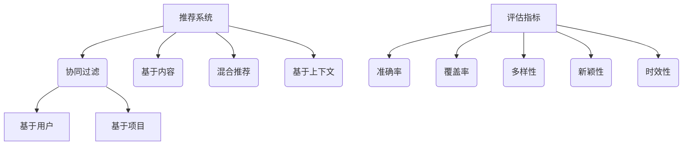
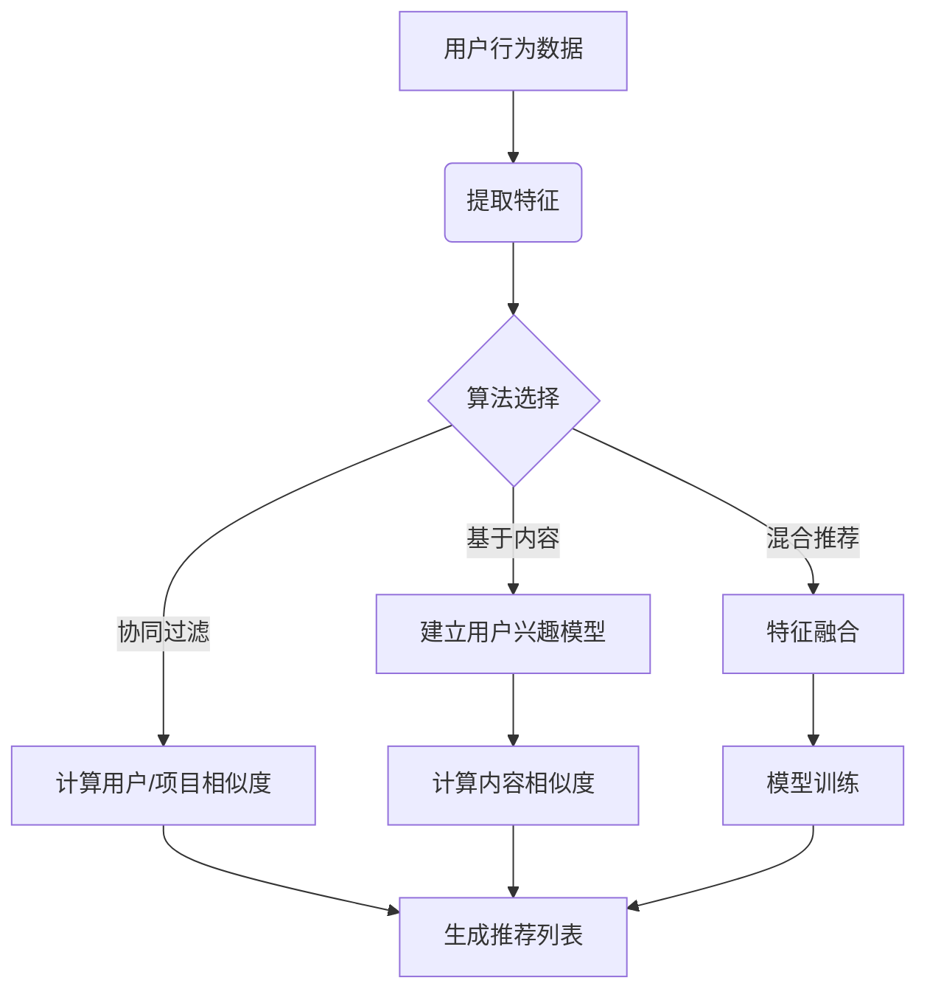

# 推荐系统：为用户推荐个性化内容

## 1.背景介绍

### 1.1 什么是推荐系统?

推荐系统是一种利用机器学习和数据挖掘技术，根据用户的过往行为和偏好，预测并推荐可能感兴趣的项目(如商品、服务、信息等)的智能系统。它广泛应用于电子商务、在线视频、音乐流媒体、社交网络等领域,为用户提供个性化的体验。

### 1.2 推荐系统的重要性

随着信息时代的到来,人们面临着信息过载的困扰。推荐系统能够从海量数据中为用户精准推荐感兴趣的内容,帮助用户快速发现有价值的信息,提高信息获取效率。同时,推荐系统也为企业带来了巨大的商业价值,能够提高用户粘性、增加销售额、提升营收等。

### 1.3 推荐系统的挑战

构建高质量的推荐系统面临诸多挑战:

- 数据质量和稀疏性
- 冷启动问题
- 隐私和安全性
- 可解释性和透明度
- 系统的实时性和可扩展性

## 2.核心概念与联系

### 2.1 推荐系统的类型

根据所使用的数据和算法,推荐系统可分为以下几种类型:

1. **协同过滤推荐**(Collaborative Filtering)
    - 基于用户(User-based)
    - 基于项目(Item-based)
2. **基于内容推荐**(Content-based)
3. **混合推荐**(Hybrid)
4. **基于上下文的推荐**(Context-aware)

#### 2.1.1 协同过滤推荐

协同过滤是最广泛使用的推荐算法,其核心思想是基于过去用户对项目的评分,找到具有相似兴趣的用户群体,并推荐该群体中用户喜欢的其他项目。

**基于用户**的协同过滤通过计算用户之间的相似度,为活跃用户推荐与其相似用户喜欢的项目。

**基于项目**的协同过滤则是计算项目之间的相似度,为用户推荐与其历史喜好项目类似的新项目。

#### 2.1.2 基于内容推荐

基于内容推荐根据项目内容特征(如文本、图像等)与用户兴趣的相似度来进行推荐。常用于推荐文章、电影等带有丰富内容特征的项目。

#### 2.1.3 混合推荐

混合推荐系统结合了协同过滤和基于内容的优点,通过综合考虑用户的历史行为、项目内容特征以及其他上下文信息,来提高推荐的准确性和多样性。

#### 2.1.4 基于上下文的推荐

基于上下文的推荐除了考虑用户和项目本身,还会结合时间、地点、心理状态等上下文信息进行推荐,以提供更加个性化和场景化的体验。

### 2.2 推荐系统的评估指标

评估推荐系统的质量对于系统的持续优化至关重要。常用的评估指标包括:

- 准确率(Accuracy)
- 覆盖率(Coverage)
- 多样性(Diversity)
- 新颖性(Novelty)
- 时效性(Timeliness)

### 2.3 核心概念关系图

以下是推荐系统核心概念的关系图:

## 3.核心算法原理具体操作步骤

### 3.1 协同过滤算法

协同过滤算法是推荐系统中最常用和最成熟的算法,包括基于用户和基于项目两种方式。

#### 3.1.1 基于用户的协同过滤

基于用户的协同过滤算法分为两个主要步骤:

1. **计算用户相似度**

    常用的相似度计算方法有欧几里得距离、余弦相似度和皮尔逊相关系数等。以皮尔逊相关系数为例,计算公式如下:

    $$sim(u,v) = \frac{\sum_{i \in I}(r_{ui} - \overline{r_u})(r_{vi} - \overline{r_v})}{\sqrt{\sum_{i \in I}(r_{ui} - \overline{r_u})^2}\sqrt{\sum_{i \in I}(r_{vi} - \overline{r_v})^2}}$$

    其中$r_{ui}$表示用户u对项目i的评分,$\overline{r_u}$表示用户u所有评分的均值。

2. **计算预测评分并推荐**

    对于活跃用户u,基于其最相似的K个用户的评分,预测u对目标项目i的评分:

    $$\hat{r}_{ui} = \overline{r_u} + \frac{\sum\limits_{v \in N(u,K)}sim(u,v)(r_{vi} - \overline{r_v})}{\sum\limits_{v \in N(u,K)}|sim(u,v)|}$$

    其中$N(u,K)$表示与用户u最相似的K个用户集合。然后根据预测评分从高到低推荐前N个项目。

#### 3.1.2 基于项目的协同过滤

基于项目的协同过滤算法思路类似,不同之处在于:

1. 计算项目相似度,而不是用户相似度
2. 预测活跃用户u对目标项目i的评分时,利用u历史评分过的与i最相似的K个项目

具体步骤如下:

1. **计算项目相似度**

    使用与计算用户相似度相同的方法,如余弦相似度、皮尔逊相关系数等。

2. **计算预测评分并推荐**

    $$\hat{r}_{ui} = \overline{r_i} + \frac{\sum\limits_{j \in N(i,K)}sim(i,j)(r_{uj} - \overline{r_j})}{\sum\limits_{j \in N(i,K)}|sim(i,j)|}$$

    其中$N(i,K)$表示与项目i最相似的K个项目集合,$\overline{r_i}$表示项目i所有评分的均值。根据预测评分从高到低推荐前N个项目。

### 3.2 基于内容推荐算法

基于内容推荐算法的核心思想是:分析用户过去喜欢的项目内容特征,并推荐具有相似内容特征的新项目。主要分为以下步骤:

1. **提取项目内容特征**

    对于文本类项目,可以使用TF-IDF、Word2Vec等方法提取关键词作为特征;对于图像、音频等非结构化数据,则可以使用CNN、RNN等深度学习模型提取特征向量。

2. **建立用户兴趣模型**

    通过分析用户历史行为数据,了解用户对不同内容特征的偏好,建立用户兴趣模型。常用的模型有多项式朴素贝叶斯、KNN等。

3. **计算内容相似度并推荐**

    计算目标项目与用户兴趣模型的相似度,如余弦相似度:

    $$sim(u,i) = \frac{\vec{u} \cdot \vec{i}}{||\vec{u}|| \times ||\vec{i}||}$$

    其中$\vec{u}$表示用户兴趣模型特征向量,$\vec{i}$表示项目内容特征向量。根据相似度从高到低推荐前N个项目。

### 3.3 混合推荐算法

混合推荐算法结合了协同过滤和基于内容的优点,通常有以下几种实现方式:

1. **加权hybri**d:对协同过滤和基于内容的预测结果进行加权求和
2. **切换hybrid**:根据场景选择使用协同过滤还是基于内容
3. **级联hybrid**:先利用一种算法过滤部分数据,再使用另一种算法进行推荐
4. **特征组合hybrid**:将协同过滤和内容特征融合到同一个模型中训练

### 3.4 算法流程图

以上算法的总体流程如下:

## 4.数学模型和公式详细讲解举例说明

推荐系统中常用的数学模型和公式包括:

### 4.1 相似度计算

#### 4.1.1 欧几里得距离

欧几里得距离用于计算两个向量之间的距离,公式如下:

$$d(x,y) = \sqrt{\sum_{i=1}^{n}(x_i - y_i)^2}$$

其中$x$和$y$是n维向量。距离越小,表示两个向量越相似。

#### 4.1.2 余弦相似度

余弦相似度计算两个向量的夹角余弦值,公式如下:

$$sim(x,y) = \frac{x \cdot y}{||x|| \times ||y||}$$

余弦值越接近1,表示两个向量越相似。

#### 4.1.3 皮尔逊相关系数

皮尔逊相关系数用于计算两个序列之间的相关性,公式如下:

$$r = \frac{\sum_{i=1}^{n}(x_i - \overline{x})(y_i - \overline{y})}{\sqrt{\sum_{i=1}^{n}(x_i - \overline{x})^2}\sqrt{\sum_{i=1}^{n}(y_i - \overline{y})^2}}$$

其中$\overline{x}$和$\overline{y}$分别是$x$和$y$序列的均值。相关系数在-1到1之间,绝对值越大,表示两个序列越相关。

**举例**:

假设有两个用户u1和u2,他们对5个商品的评分如下:

| 商品 | u1 | u2 |
|------|----|----|
| A    | 5  | 4  |
| B    | 3  | 3  |  
| C    | 4  | 5  |
| D    | 2  | 1  |
| E    | 4  | 5  |

计算u1和u2的皮尔逊相关系数:

$$\overline{r_{u1}} = \frac{5+3+4+2+4}{5} = 3.6$$
$$\overline{r_{u2}} = \frac{4+3+5+1+5}{5} = 3.6$$

$$r = \frac{(5-3.6)(4-3.6) + (3-3.6)(3-3.6) + (4-3.6)(5-3.6) + (2-3.6)(1-3.6) + (4-3.6)(5-3.6)}{\sqrt{(5-3.6)^2 + (3-3.6)^2 + (4-3.6)^2 + (2-3.6)^2 + (4-3.6)^2} \times \sqrt{(4-3.6)^2 + (3-3.6)^2 + (5-3.6)^2 + (1-3.6)^2 + (5-3.6)^2}}$$
$$r = \frac{1.4 \times 0.4 + (-0.6)^2 + 0.4 \times 1.4 + (-1.6)(-2.6) + 0.4 \times 1.4}{\sqrt{6.76} \times \sqrt{6.76}} = 0.97$$

可见,u1和u2的评分存在很强的正相关性,因此可以基于他们的相似性进行推荐。

### 4.2 矩阵分解

矩阵分解是协同过滤算法中常用的一种技术,通过将用户-项目评分矩阵分解为两个低维矩阵的乘积,发现用户和项目的潜在特征,从而预测缺失值。

假设有m个用户,n个项目,评分矩阵R为m x n维,目标是将其分解为:

$$R \approx P^TQ$$

其中P为m x k的用户潜在特征矩阵,Q为n x k的项目潜在特征矩阵,k << min(m,n)。

常用的矩阵分解算法有SVD(奇异值分解)、PM