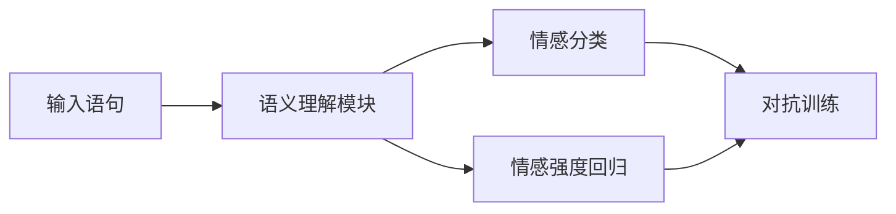

# 揭秘LLMAgentOS的自然语言理解能力:从语义到情感分析

## 1. 背景介绍

### 1.1 自然语言处理的重要性

在当今的数字时代,自然语言处理(NLP)已经成为人工智能领域中最重要和最具挑战性的研究方向之一。作为人类与机器之间交互的桥梁,NLP技术的发展水平直接影响着人工智能系统的实用性和用户体验。随着大数据和计算能力的不断提高,NLP技术也在不断演进,展现出越来越强大的语言理解和生成能力。

### 1.2 LLMAgentOS简介

LLMAgentOS是一款基于大型语言模型(LLM)的操作系统,旨在为用户提供无缝的自然语言交互体验。它集成了众多先进的NLP技术,包括语义理解、知识表示、推理和生成等,使得系统能够像人类一样理解和回应自然语言查询。作为AI助手的大脑,LLMAgentOS的核心在于其卓越的自然语言理解能力。

## 2. 核心概念与联系

### 2.1 自然语言理解的挑战

自然语言理解是NLP领域中最具挑战性的任务之一。它需要系统能够深入理解语言的语义、语用和情感等多个层面,并将它们与背景知识和上下文信息相结合。这需要解决以下几个关键问题:

1. **语义理解**: 准确捕捉语句的字面意义和隐含含义。
2. **语用理解**: 理解语句的交际用途和说话人的意图。
3. **情感分析**: 识别语句中蕴含的情感倾向和强度。
4. **知识融合**: 将语句与已有知识库相关联,实现知识增强的理解。
5. **上下文理解**: 将语句置于对话和场景的上下文中进行理解。

### 2.2 LLMAgentOS的核心技术

为了应对自然语言理解的挑战,LLMAgentOS采用了多种先进的NLP技术,并将它们有机结合,形成了一个强大的语言理解框架。其核心技术包括:

1. **预训练语言模型**: 基于海量语料进行预训练,获得丰富的语义和语用知识。
2. **知识图谱**: 构建结构化的知识库,支持实体链接和知识推理。
3. **注意力机制**: 通过自注意力捕捉长距离依赖,提高上下文理解能力。
4. **多任务学习**: 同时优化多个NLP任务,促进知识迁移和泛化能力。
5. **对抗训练**: 引入对抗样本,增强模型的鲁棒性和泛化能力。

## 3. 核心算法原理具体操作步骤

LLMAgentOS的自然语言理解能力主要由三个核心模块组成:语义理解模块、情感分析模块和知识融合模块。下面将分别介绍它们的工作原理和算法流程。

### 3.1 语义理解模块

语义理解模块的主要任务是捕捉输入语句的字面意义和隐含含义。它基于预训练语言模型和注意力机制,通过以下步骤实现语义理解:

1. **词向量编码**: 将输入语句的每个单词映射为一个固定维度的词向量表示。
2. **上下文编码**: 使用Transformer的多头自注意力机制,捕捉单词之间的长距离依赖关系,得到每个单词的上下文化表示。
3. **语义表示**: 对上下文化的单词表示进行pooling操作,得到整个语句的语义表示向量。
4. **语义预测**: 将语义表示向量输入到分类器中,预测语句的语义类别(如命题、疑问、命令等)和具体意义。


### 3.2 情感分析模块

情感分析模块旨在识别语句中蕴含的情感倾向和强度。它采用多任务学习和对抗训练的方法,同时优化情感分类和情感强度回归任务,提高模型的泛化能力。具体步骤如下:

1. **特征提取**: 将语句输入到语义理解模块,获得语义表示向量作为情感分析的输入特征。
2. **情感分类**: 将语义表示向量输入到分类器中,预测语句的情感极性(正面、负面或中性)。
3. **情感强度回归**: 将语义表示向量输入到回归器中,预测语句的情感强度分数。
4. **对抗训练**: 在训练过程中,引入对抗样本,增强模型对于噪声和小扰动的鲁棒性。



### 3.3 知识融合模块

知识融合模块的目标是将语句与已有知识库相关联,实现知识增强的理解。它利用知识图谱和实体链接技术,将语句中的实体映射到知识库中的概念节点,并融合相关知识进行推理和补充。算法流程如下:

1. **实体识别**: 使用命名实体识别(NER)模型,从输入语句中提取出实体mentions。
2. **实体链接**: 将提取出的实体mentions链接到知识图谱中的概念节点。
3. **知识融合**: 基于链接的概念节点,从知识图谱中检索相关的语义信息和三元组关系,与语句的语义表示相融合。
4. **知识增强推理**: 在融合了知识的基础上,对语句的意义进行进一步的推理和补充,得到知识增强的语义表示。


通过上述三个模块的协同工作,LLMAgentOS能够全面理解语句的语义、情感和背景知识,为后续的自然语言生成和交互决策提供有力支持。

## 4. 数学模型和公式详细讲解举例说明

在LLMAgentOS的自然语言理解过程中,涉及到多种数学模型和公式。下面将详细介绍其中几个核心模型的数学原理。

### 4.1 Transformer的自注意力机制

Transformer模型中的自注意力机制是捕捉长距离依赖关系的关键。给定一个输入序列 $X = (x_1, x_2, \dots, x_n)$,其中 $x_i \in \mathbb{R}^{d_x}$ 是 $i$ 位置的输入向量,自注意力机制计算每个位置的输出向量 $y_i$ 如下:

$$y_i = \sum_{j=1}^n \alpha_{ij}(x_jW^V)$$

其中, $W^V \in \mathbb{R}^{d_x \times d_v}$ 是一个可学习的值映射矩阵, $\alpha_{ij}$ 是注意力权重,表示 $i$ 位置对 $j$ 位置的注意力程度。注意力权重是通过缩放点积注意力机制计算得到的:

$$\alpha_{ij} = \frac{(x_iW^Q)(x_jW^K)^T}{\sqrt{d_k}}$$

这里, $W^Q \in \mathbb{R}^{d_x \times d_q}$ 和 $W^K \in \mathbb{R}^{d_x \times d_k}$ 分别是可学习的查询和键映射矩阵。通过这种方式,每个输出向量 $y_i$ 都是所有输入向量的加权和,其中权重由注意力机制自动学习得到。

在实际应用中,Transformer通常会使用多头注意力机制,将注意力分布在不同的子空间上,以捕捉不同类型的依赖关系。

### 4.2 BERT的掩码语言模型

BERT(Bidirectional Encoder Representations from Transformers)是一种广泛应用的预训练语言模型。它采用了掩码语言模型(Masked Language Model)的预训练目标,通过预测被掩码的单词来学习双向的语义表示。

给定一个输入序列 $X = (x_1, x_2, \dots, x_n)$,我们随机将其中的一些单词替换为特殊的 [MASK] 标记,得到掩码序列 $\hat{X}$。BERT的目标是最大化掩码单词的条件概率:

$$\mathcal{L}_{MLM} = -\mathbb{E}_{X, \hat{X}} \left[ \sum_{i \in \mathcal{M}} \log P(x_i | \hat{X}) \right]$$

其中, $\mathcal{M}$ 是掩码位置的集合。该条件概率由BERT的Transformer编码器计算得到:

$$P(x_i | \hat{X}) = \text{softmax}(h_i^T W_e)$$

这里, $h_i$ 是 $\hat{X}$ 在 $i$ 位置的隐藏状态向量, $W_e$ 是词嵌入矩阵。通过最小化该损失函数,BERT能够学习到对上下文敏感的双向语义表示。

### 4.3 知识图谱嵌入

为了将语句与知识图谱相融合,LLMAgentOS采用了TransE知识嵌入模型,将实体和关系映射到低维连续向量空间中。给定一个三元组事实 $(h, r, t)$,其中 $h$ 是头实体, $r$ 是关系, $t$ 是尾实体,TransE试图在向量空间中满足:

$$\vec{h} + \vec{r} \approx \vec{t}$$

其中, $\vec{h}$, $\vec{r}$ 和 $\vec{t}$ 分别是 $h$, $r$ 和 $t$ 的向量表示。TransE的目标是最小化所有训练三元组的损失函数:

$$\mathcal{L} = \sum_{(h, r, t) \in \mathcal{S}} \sum_{(h', r', t') \in \mathcal{S}'^{(h, r, t)}} \max \left( 0, \gamma + d(\vec{h} + \vec{r}, \vec{t}) - d(\vec{h}' + \vec{r}', \vec{t}') \right)$$

这里, $\mathcal{S}$ 是训练三元组集合, $\mathcal{S}'^{(h, r, t)}$ 是通过替换 $h$, $r$ 或 $t$ 得到的负例三元组集合, $\gamma$ 是边距超参数, $d(\cdot, \cdot)$ 是距离函数(如 $L_1$ 或 $L_2$ 范数)。

通过这种方式,TransE能够将知识图谱中的结构信息编码到低维向量空间中,为后续的知识融合和推理提供有力支持。

上述数学模型和公式只是LLMAgentOS自然语言理解能力中的一小部分。在实际应用中,还涉及到诸如注意力机制的变体、图神经网络、对抗生成网络等多种先进模型,以及相应的损失函数、优化算法和训练技巧。这些都是该系统取得卓越性能的重要基础。

## 5. 项目实践:代码实例和详细解释说明

为了更好地理解LLMAgentOS的自然语言理解能力,我们将通过一个实际项目案例,展示其核心模块的代码实现和运行效果。

### 5.1 项目概述

本项目旨在构建一个智能问答系统,能够回答有关计算机科学领域的自然语言问题。我们将利用LLMAgentOS的语义理解、情感分析和知识融合等模块,实现高质量的问答交互。

### 5.2 语义理解模块实现

我们首先实现语义理解模块,用于捕捉输入问题的语义含义。这个模块基于BERT预训练语言模型和注意力机制,代码如下:

```python
import torch
from transformers import BertModel, BertTokenizer

class SemanticUnderstanding(torch.nn.Module):
    def __init__(self):
        super().__init__()
        self.bert = BertModel.from_pretrained('bert-base-uncased')
        self.tokenizer = BertTokenizer.from_pretrained('bert-base-uncased')
        self.classifier = torch.nn.Linear(768, 5)  # 5个语义类别

    def forward(self, input_str):
        inputs = self.tokenizer(input_str, return_tensors='pt')
        outputs = self.bert(**inputs)
        pooled_output = outputs.pool