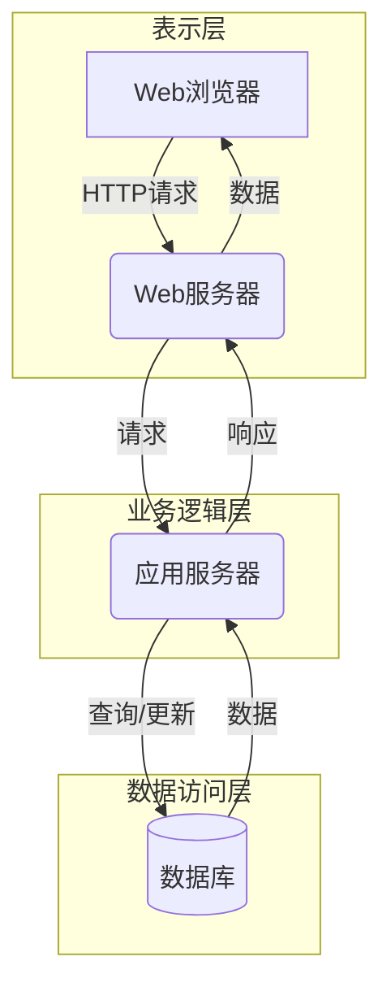
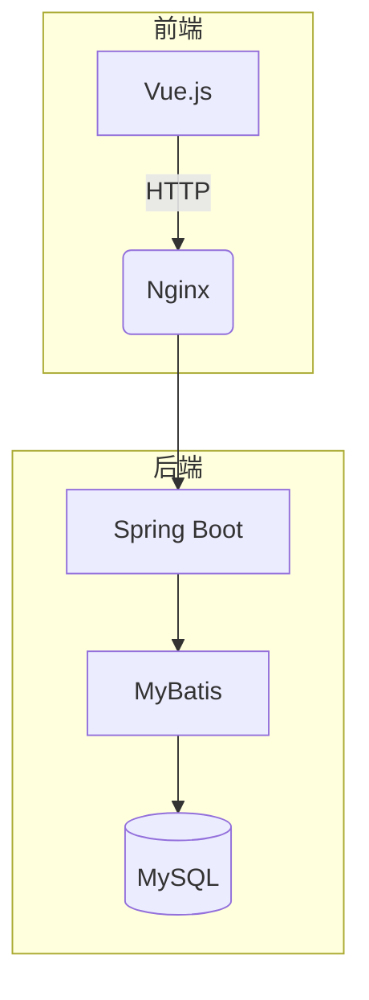
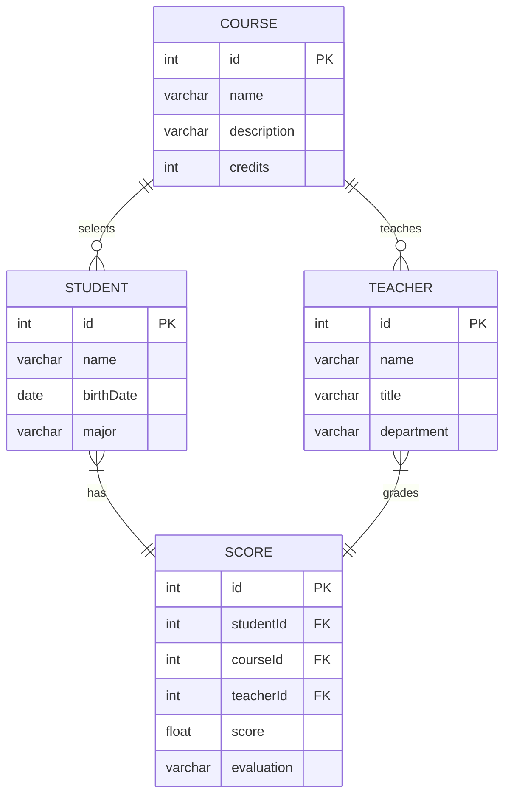

# 教学信息管理系统详细设计与具体代码实现

## 1.背景介绍

### 1.1 教学信息管理系统概述

随着信息技术的快速发展,教育信息化建设已成为提高教育现代化水平的重要途径。教学信息管理系统作为学校教学管理工作的重要辅助工具,可以有效整合学校的教学资源,提高教学管理效率,优化教学过程,促进教学质量的提升。

教学信息管理系统是一种基于网络的应用软件系统,主要功能包括教学计划管理、课程管理、教师管理、学生管理、成绩管理等多个模块。系统可以实现教学资源的共享、教学过程的监控、教学质量的评价等,为教师和学生提供了一个高效的教学互动平台。

### 1.2 系统建设的必要性

1. **提高教学管理效率**。传统的教学管理方式依赖大量手工操作,工作量大、效率低下。教学信息管理系统可以实现教学计划、课程安排、成绩管理等工作的自动化,极大降低了管理人员的工作强度。

2. **促进教学资源共享**。教学信息管理系统可以集中存储和管理学校的教学资源,如课件、教案、试卷等,实现资源的共享和重复利用,避免资源的重复建设和浪费。

3. **加强教学过程监控**。系统可以记录学生的学习情况、考勤记录、成绩等数据,教师可以及时了解学生的学习状态,并根据数据分析给予适当的指导。

4. **优化教学质量评价**。系统中存储了大量的教学数据,可以为教学质量评价提供依据,有利于发现教学中存在的问题并及时改进。

5. **适应教育信息化发展需求**。教育信息化是教育现代化的必由之路,建设教学信息管理系统是学校信息化建设的重要组成部分,有利于提高学校的信息化水平。

## 2.核心概念与联系

### 2.1 系统架构

教学信息管理系统通常采用 B/S(Browser/Server)架构或 C/S(Client/Server)架构。

**B/S架构**是指浏览器/服务器架构,用户通过 Web 浏览器访问服务器上的应用程序。优点是无需安装客户端软件,维护成本低;缺点是对网络环境要求较高。

**C/S架构**是指客户端/服务器架构,需要在客户端安装专用的应用软件。优点是响应速度快,可以在无网络的情况下使用;缺点是安装和维护成本较高。

无论采用哪种架构,系统都可以分为表示层(前端)、业务逻辑层(中间件)和数据访问层(后端数据库)三个部分。



### 2.2 系统功能模块

教学信息管理系统主要包括以下核心功能模块:

1. **教学计划管理**:制定和发布教学计划、课程安排等。
2. **课程管理**:维护课程基本信息、教学资源等。
3. **教师管理**:管理教师基本信息、工作量、教学任务等。
4. **学生管理**:管理学生基本信息、选课、成绩等。
5. **成绩管理**:录入、统计和查询学生成绩。
6. **系统管理**:进行系统参数设置、权限分配、数据维护等。

各功能模块相互关联、相互作用,共同构建了一个完整的教学管理信息系统。

### 2.3 用户角色

系统用户主要包括以下几类:

1. **管理员**:拥有最高权限,可以管理系统参数、分配权限等。
2. **教务人员**:负责制定教学计划、安排课程、管理教师信息等。
3. **教师**:录入成绩、管理课程资源、查看教学任务等。
4. **学生**:选择课程、查看成绩和课程资源等。

不同用户角色拥有不同的系统操作权限,以满足各自的工作需求。

## 3.核心算法原理具体操作步骤

### 3.1 课程排课算法

课程排课是教学信息管理系统的一个核心功能,需要合理安排课程时间和教室资源。一种常用的排课算法是**图着色算法**。

1. 构建课程冲突图 $G=(V,E)$。将每门课程作为一个节点 $v \in V$,如果两门课程时间冲突,则在这两个节点之间连一条边 $e \in E$。

2. 为图 $G$ 的节点着色,相邻节点必须使用不同的颜色。着色后,同一种颜色的节点(课程)可以安排在同一个时间段。

3. 尽量使用较少的颜色数,以节省时间资源。

4. 对于剩余的未排课节点,重复步骤2和3。

使用图着色算法排课的复杂度较高,可以使用启发式算法(如遗传算法、蚁群算法等)来改进和加速。

### 3.2 学生成绩计算算法

学生的最终成绩通常需要综合平时分、期中考试、期末考试等多个环节的分数。成绩计算算法如下:

1. 设置各个环节的权重: $w_1, w_2, ..., w_n$,且 $\sum_{i=1}^n w_i = 1$。

2. 对于每个学生,将其在各个环节的原始分数记为 $s_1, s_2, ..., s_n$。

3. 计算加权平均分数:
   $$\overline{s} = \sum_{i=1}^n w_i s_i$$

4. 根据 $\overline{s}$ 的数值区间,确定最终的等级分数或者直接作为最终成绩。

该算法简单直观,权重可根据学校的教学管理规定进行调整。

## 4.数学模型和公式详细讲解举例说明

### 4.1 马尔可夫模型在教学质量评价中的应用

马尔可夫模型是一种重要的随机过程模型,可以用于描述系统在不同状态之间的转移规律。在教学质量评价中,我们可以将学生的学习状态看作马尔可夫过程的不同状态,通过分析学生状态的转移规律,对学生的学习质量进行评价和预测。

假设学生的学习状态有 $n$ 个,用 $S=\{s_1,s_2,...,s_n\}$ 表示状态空间。在时刻 $t$,学生处于某一状态 $s_i$,则在时刻 $t+1$ 转移到状态 $s_j$ 的概率为:

$$
p_{ij}=P(X_{t+1}=s_j|X_t=s_i),\quad i,j=1,2,...,n
$$

所有状态转移概率组成一个 $n$ 阶转移矩阵 $\mathbf{P}$:

$$
\mathbf{P}=\begin{bmatrix}
p_{11} & p_{12} & \cdots & p_{1n}\\
p_{21} & p_{22} & \cdots & p_{2n}\\
\vdots & \vdots & \ddots & \vdots\\
p_{n1} & p_{n2} & \cdots & p_{nn}
\end{bmatrix}
$$

其中 $\sum_{j=1}^n p_{ij}=1$。

在已知初始状态概率向量 $\boldsymbol{\pi}_0$ 和转移矩阵 $\mathbf{P}$ 的情况下,可以计算出 $t$ 步后的状态概率向量:

$$
\boldsymbol{\pi}_t=\boldsymbol{\pi}_0\mathbf{P}^t
$$

通过分析 $\boldsymbol{\pi}_t$ 中各状态概率的变化趋势,我们可以评估学生的学习质量,并预测其未来的学习状态,从而为教学决策提供依据。

### 4.2 教室资源分配的整数规划模型

假设学校有 $m$ 间教室,需要安排 $n$ 门课程。已知每门课程的上课时间段、所需教室数量和教室类型要求。我们可以构建如下整数规划模型,以实现教室资源的合理分配:

决策变量:
$$
x_{ijk}=\begin{cases}
1, & \text{将第 $i$ 门课程安排在第 $j$ 个时间段的第 $k$ 间教室}\\
0, & \text{否则}
\end{cases}
$$

目标函数:最小化教室利用率差异
$$
\min \sum_{j=1}^T\left(\max_{k=1}^m\sum_{i=1}^nx_{ijk}-\min_{k=1}^m\sum_{i=1}^nx_{ijk}\right)
$$

约束条件:
1. 每门课程只能安排一个时间段和教室:
   $$
   \sum_{j=1}^T\sum_{k=1}^mx_{ijk}=1,\quad i=1,2,...,n
   $$

2. 每个时间段每间教室最多只能安排一门课程:
   $$
   \sum_{i=1}^nx_{ijk}\leq1,\quad j=1,2,...,T;k=1,2,...,m
   $$

3. 每门课程的教室类型要求必须满足:
   $$
   \sum_{k\in K_i}x_{ijk}=1,\quad i=1,2,...,n;j=1,2,...,T
   $$
   其中 $K_i$ 表示第 $i$ 门课程可以使用的教室集合。

通过求解该整数规划模型,可以得到一个教室分配方案,使得教室利用率差异最小,从而提高资源利用效率。

## 5.项目实践:代码实例和详细解释说明

### 5.1 系统框架

教学信息管理系统采用 Spring Boot + MyBatis 框架,前端使用 Vue.js。系统架构如下图所示:



- **Vue.js**: 负责构建系统的用户界面
- **Nginx**: 作为反向代理服务器,负载均衡和静态资源服务
- **Spring Boot**: 提供 RESTful API 接口,处理业务逻辑
- **MyBatis**: 实现数据持久化操作
- **MySQL**: 系统的关系型数据库

### 5.2 数据库设计



数据库主要包括 `COURSE`、`TEACHER`、`STUDENT` 和 `SCORE` 四个核心表。其中:

- `COURSE` 表存储课程基本信息
- `TEACHER` 表存储教师信息
- `STUDENT` 表存储学生信息
- `SCORE` 表存储学生的课程成绩和教师的评语

### 5.3 关键代码实现

#### 5.3.1 教师模块

```java
// TeacherController.java
@RestController
@RequestMapping("/teachers")
public class TeacherController {

    @Autowired
    private TeacherService teacherService;

    // 获取所有教师
    @GetMapping
    public List<Teacher> getAllTeachers() {
        return teacherService.getAllTeachers();
    }

    // 根据ID获取教师
    @GetMapping("/{id}")
    public Teacher getTeacherById(@PathVariable int id) {
        return teacherService.getTeacherById(id);
    }

    // 添加新教师
    @PostMapping
    public int addTeacher(@RequestBody Teacher teacher) {
        return teacherService.addTeacher(teacher);
    }

    // ...
}

// TeacherService.java
@Service
public class TeacherService {

    @Autowired
    private TeacherMapper teacherMapper;

    public List<Teacher> getAllTeachers() {
        return teacherMapper.getAllTeachers();
    }

    public Teacher getTeacherById(int id)