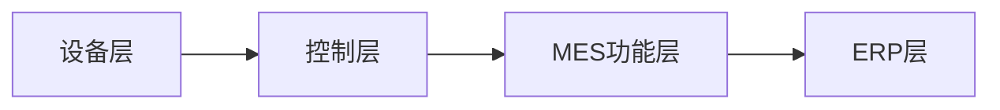

# 数字化车间:MES与工业互联网的融合应用

## 1.背景介绍

### 1.1 数字化车间的定义与内涵
数字化车间是指利用数字化技术，对车间的人、机、料、法、环等生产要素进行数字化建模、仿真优化和集成管控，实现生产过程的数字化管理和优化的先进生产模式。它通过对车间生产过程的全面感知、实时分析、科学决策和精准执行，提高生产效率、产品质量和管理水平，降低运营成本，增强企业竞争力。

### 1.2 MES系统的功能与架构
MES（Manufacturing Execution System）即制造执行系统，是一套面向制造企业车间执行层的生产信息化管理系统。MES可以为企业提供包括制造数据管理、计划排产管理、生产调度管理、库存管理、质量管理、人力资源管理、工作中心/设备管理、工具工装管理、采购管理、成本管理、项目看板管理、生产过程控制、底层数据集成分析、上层数据集成分解等管理模块，为企业打造一个扎实、可靠、全面、可行的制造协同管理平台。

MES系统的架构通常分为设备层、控制层、MES功能层、ERP层等。

### 1.3 工业互联网的内涵与特点
工业互联网是新一代信息通信技术与工业经济深度融合的产物，通过对人、机、物的全面连接，实现生产制造各环节、产业链各环节乃至整个产业链的全面感知、动态传输、实时分析、科学决策和智能控制，推动形成全新的工业生产制造和服务模式，实现从传统生产制造向智能制造的跨越。

工业互联网具有全面感知、实时传输、智能分析、自主决策、精准执行等特点，通过构建网络、平台、安全三大功能体系，打通人、机、物、环节之间的壁垒，实现工业数据的互联互通和工业资源的共享协同，推动工业经济高质量发展。

## 2.核心概念与联系

### 2.1 数字孪生
数字孪生是指在虚拟空间构建物理实体的数字化模型，通过实时数据映射，实现物理实体与数字模型的同步，用于模拟、监测、诊断、预测和优化物理实体的全生命周期过程。在数字化车间中，可以构建产品、设备、生产线等对象的数字孪生模型，实现设计、生产、服务等环节的仿真优化和实时监控。

### 2.2 边缘计算
边缘计算是在靠近物或数据源头的网络边缘侧，融合网络、计算、存储、应用核心能力的分布式开放平台，就近提供边缘智能服务，满足行业数字化在敏捷连接、实时业务、数据优化、应用智能、安全与隐私保护等方面的关键需求。在数字化车间中，可以利用边缘计算处理设备端的海量数据，减轻云端的计算压力，提高系统实时性和可靠性。

### 2.3 5G通信
5G是第五代移动通信技术，具有高速率、低时延、大连接的特点。5G可以提供高达10Gbps的峰值速率，1ms的端到端时延，每平方公里100万个连接数。在数字化车间中，5G可以为设备互联、移动机器人、AR/VR等应用提供高速可靠的无线通信支撑，提升生产过程的柔性和智能化水平。

### 2.4 人工智能
人工智能是研究、开发用于模拟、延伸和扩展人的智能的理论、方法、技术及应用系统的一门新的技术科学。人工智能包括机器学习、深度学习、知识图谱、自然语言处理等技术。在数字化车间中，人工智能可以应用于生产计划、设备预测性维护、质量缺陷检测等场景，提高生产过程的自动化和智能化水平。

## 3.核心算法原理具体操作步骤

### 3.1 设备预测性维护算法
设备预测性维护是指利用设备运行数据，构建设备健康度评估模型，预测设备的潜在故障，提前安排维护，避免非计划停机。其主要步骤如下：

1. 数据采集：通过各类传感器采集设备的振动、温度、电流等参数。
2. 数据预处理：对采集的数据进行清洗、对齐、归一化等处理。
3. 特征提取：从时域、频域提取反映设备健康状态的特征。
4. 模型训练：使用机器学习算法如SVM、随机森林等训练预测模型。
5. 模型评估：使用新的数据对模型进行测试，评估模型性能。
6. 模型应用：使用训练好的模型对设备进行实时监测和预警。

### 3.2 产能平衡与排产优化算法
产能平衡与排产优化是指合理配置生产资源，优化生产计划，最大化产能利用率，最小化生产成本。其主要步骤如下：

1. 建立数学模型：考虑设备、人员、物料、订单等约束，建立优化目标函数。
2. 求解模型：使用运筹优化算法如整数规划、启发式算法等求解模型。
3. 生成排产方案：将优化结果转化为可执行的生产计划。
4. 仿真验证：使用仿真软件对排产方案进行验证，评估可行性。
5. 下发执行：将优化方案下发到MES系统进行生产调度执行。
6. 动态优化：根据实际生产情况的变化，动态调整优化方案。

### 3.3 质量缺陷检测算法
质量缺陷检测是指利用机器视觉等技术，自动识别产品表面的缺陷，提高质检效率和准确率。其主要步骤如下：

1. 图像采集：使用工业相机采集产品表面图像。
2. 图像预处理：对图像进行滤波、增强、分割等处理。
3. 特征提取：提取图像的颜色、纹理、形状等特征。
4. 缺陷识别：使用深度学习算法如CNN、YOLO等识别图像中的缺陷。
5. 缺陷定位：对识别出的缺陷进行精确定位。
6. 缺陷分类：根据缺陷的类型、严重程度进行分类。

## 4.数学模型和公式详细讲解举例说明

### 4.1 SVM设备预测性维护模型
支持向量机（Support Vector Machine，SVM）是一种常用的机器学习算法，可以用于设备健康度评估与故障预测。其基本原理是在特征空间中寻找一个最优分类超平面，使得不同类别的样本能够被超平面分开，并且离超平面最近的样本点到超平面的距离最大化。

假设训练集为$\{(x_1,y_1),(x_2,y_2),...,(x_n,y_n)\}$，其中$x_i \in R^p$为第$i$个样本的特征向量，$y_i \in \{-1,+1\}$为对应的类别标签。SVM的目标是找到一个超平面$w^Tx+b=0$，使得对于所有的样本$(x_i,y_i)$，都有：

$$
y_i(w^Tx_i+b) \geq 1
$$

同时最大化超平面的间隔$\frac{2}{||w||}$。这可以通过求解如下优化问题得到：

$$
\min_{w,b} \frac{1}{2}||w||^2 \\
s.t. \quad y_i(w^Tx_i+b) \geq 1, \quad i=1,2,...,n
$$

引入拉格朗日乘子$\alpha_i \geq 0$，将上述问题转化为其对偶问题：

$$
\max_{\alpha} \sum_{i=1}^n \alpha_i - \frac{1}{2} \sum_{i=1}^n \sum_{j=1}^n \alpha_i \alpha_j y_i y_j x_i^T x_j \\
s.t. \quad \sum_{i=1}^n \alpha_i y_i = 0, \quad \alpha_i \geq 0, \quad i=1,2,...,n
$$

求解出最优的$\alpha$后，可得到分类决策函数：

$$
f(x) = sign(\sum_{i=1}^n \alpha_i y_i x_i^T x + b)
$$

其中$sign$为符号函数，$x$为待预测的样本特征向量。如果$f(x)=1$，则预测样本为正常；如果$f(x)=-1$，则预测样本为故障。

在实际应用中，可以选择不同的核函数如线性核、多项式核、高斯核等，将样本映射到高维空间，提高分类性能。同时，可以通过交叉验证等方法优化模型的超参数，提高泛化能力。

### 4.2 整数规划产能平衡与排产优化模型
整数规划（Integer Programming）是运筹学的一个分支，主要研究如何在一组线性约束条件下，求解目标函数为线性的整数优化问题。它在生产计划与排程优化中有广泛应用。

假设有$m$台设备、$n$种产品、$T$个时间周期，目标是最小化总生产成本，满足市场需求和生产能力约束。令决策变量$x_{ijt}$表示在第$t$个周期，在第$i$台设备上生产第$j$种产品的数量，$c_{ijt}$表示单位生产成本，$d_{jt}$表示第$j$种产品在第$t$个周期的市场需求量，$a_{ij}$表示第$i$台设备生产单位第$j$种产品所需的时间，$C_{it}$表示第$i$台设备在第$t$个周期的生产能力。则整数规划模型可表示为：

$$
\min \sum_{i=1}^m \sum_{j=1}^n \sum_{t=1}^T c_{ijt} x_{ijt} \\
s.t. \quad \sum_{i=1}^m x_{ijt} \geq d_{jt}, \quad \forall j,t \\
\sum_{j=1}^n a_{ij} x_{ijt} \leq C_{it}, \quad \forall i,t \\
x_{ijt} \geq 0, \quad x_{ijt} \in Z, \quad \forall i,j,t
$$

其中，目标函数表示总生产成本最小，第一个约束表示满足市场需求，第二个约束表示不超过生产能力，第三个约束表示生产数量为非负整数。

求解该整数规划模型可以得到最优的生产计划$x_{ijt}$，即在每个周期、每台设备上生产每种产品的数量。常用的求解算法有分支定界法、切平面法、启发式算法等。

在实际应用中，还需要考虑设备切换、人员安排、物料约束等因素，可以在模型中引入相应的决策变量和约束条件。同时，可以使用商业优化软件如CPLEX、Gurobi等求解大规模问题。

### 4.3 CNN质量缺陷检测模型
卷积神经网络（Convolutional Neural Network，CNN）是一种深度学习模型，常用于图像识别与分类任务。它通过局部连接和权重共享，能够自动提取图像的层次化特征，具有平移不变性。

典型的CNN模型包括输入层、卷积层、池化层、全连接层和输出层。其中，卷积层使用卷积核对上一层特征图进行卷积操作，提取局部特征；池化层对卷积层的输出进行下采样，减小特征图尺寸；全连接层将特征图展平为一维向量，并通过全连接的方式进行分类预测。

假设输入图像为$X \in R^{H \times W \times C}$，其中$H$、$W$、$C$分别为图像的高度、宽度和通道数。在第$l$个卷积层，令卷积核为$K^l \in R^{k \times k \times C_l}$，偏置为$b^l \in R^{C_l}$，激活函数为$f$，则第$l$个卷积层的输出特征图$Z^l \in R^{H_l \times W_l \times C_l}$为：

$$
Z^l = f(K^l * X^{l-1} + b^l)
$$

其中，$*$表示卷积操作，$X^{l-1}$为上一层的输出特征