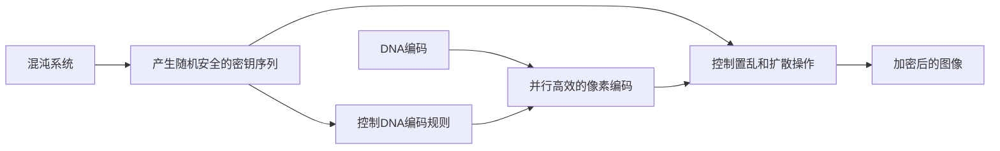

# 数字图像加密关键技术研究与实现

## 1.背景介绍

### 1.1 数字图像加密的重要性

在当今信息化时代,数字图像已广泛应用于各个领域。然而,随着网络技术的飞速发展,数字图像的安全问题日益突出。未经授权的访问、篡改和非法传播等威胁着数字图像的机密性、完整性和可用性。因此,研究高效可靠的数字图像加密技术具有重要的理论意义和实际应用价值。

### 1.2 数字图像加密面临的挑战 

与普通文本数据相比,数字图像具有数据量大、像素值相关性强、冗余度高等特点,对加密算法提出了更高的要求。传统的加密算法如DES、AES等难以直接应用于图像加密。同时,图像加密还需兼顾算法的安全性、效率以及加密后图像的视觉质量等因素。如何设计既安全高效又能保证图像质量的加密方案是一大挑战。

### 1.3 本文的研究内容和意义

本文针对数字图像加密中的关键技术进行了深入研究,提出了一种基于混沌系统和DNA编码的新型图像加密方案。该方案利用混沌系统的初值敏感性和拓扑传递性产生安全的密钥序列,结合DNA编码的并行性和巨大的编码空间实现了高效的像素置乱和值扩散。本文还从安全性、效率和视觉质量等方面对所提出的方案进行了全面评估,验证了其优越性能。本研究对于推动数字图像加密技术的发展具有重要意义。

## 2.核心概念与联系

### 2.1 混沌系统

混沌是一类表现出随机性、不可预测性和对初值极其敏感的非线性动力学系统。混沌系统的这些特性与密码学的 confusion 和 diffusion 要求不谋而合,因此广泛应用于图像加密领域。常见的混沌系统有Logistic映射、Tent映射、Arnold猫映射等。

### 2.2 DNA编码 

DNA(脱氧核糖核酸)是生物遗传信息的载体,由腺嘌呤(A)、胸腺嘧啶(T)、胞嘧啶(C)、鸟嘌呤(G)四种碱基组成。DNA编码是将二进制数据与这四种碱基进行映射,从而实现数据的生物学表示。DNA编码具有存储容量大、并行操作等优点,近年来受到图像加密领域的广泛关注。

### 2.3 像素置乱与值扩散

Shannon提出,一个安全的加密系统需要具备 confusion(混淆)和 diffusion(扩散)两大特性。在图像加密中,像素置乱对应混淆,通过打乱像素的位置破坏图像的统计特性;值扩散对应扩散,通过改变像素的灰度值使微小的明文变化影响大部分密文。二者相结合,可以有效抵抗统计分析和差分攻击。

### 2.4 混沌系统与DNA编码在图像加密中的结合

混沌系统和DNA编码各具优势,将二者结合可以实现优势互补,大大提升图像加密的性能:



如上图所示,混沌系统产生的随机序列一方面控制DNA编码规则的选择,另一方面控制像素的置乱和值扩散操作。而DNA编码则负责对像素进行高效并行的编码。二者协同工作,最终输出加密后的图像。

## 3.核心算法原理具体操作步骤

本文提出的数字图像加密方案主要分为密钥生成、像素置乱、DNA编码和值扩散四个阶段,具体步骤如下:

### 3.1 密钥生成

1. 选择两个混沌映射(如Logistic映射和Tent映射),分别记为$f_1$和$f_2$,设定初值$x_0$和$y_0$以及控制参数$\mu_1$和$\mu_2$。
2. 迭代$f_1$和$f_2$各$N$次($N$为图像像素总数),得到两个实值混沌序列$\{x_i\}$和$\{y_i\}$。
3. 对$\{x_i\}$和$\{y_i\}$进行二值化处理,得到两个二进制随机序列$\{b^x_i\}$和$\{b^y_i\}$。

### 3.2 像素置乱

1. 将原始图像$I$的行和列分别编号为$0 \sim M-1$和$0 \sim N-1$。
2. 根据$\{b^x_i\}$的值,对图像的行进行重排,得到置乱后的图像$I_r$。
3. 根据$\{b^y_i\}$的值,对$I_r$的列进行重排,得到置乱后的图像$I_p$。

### 3.3 DNA编码

1. 将$I_p$的像素值转换为8位二进制形式。
2. 根据$\{b^x_i\}$和$\{b^y_i\}$的值,动态选择DNA编码规则,将二进制像素值映射为碱基序列。
3. 对碱基序列进行互补配对(A-T, C-G),得到DNA编码后的图像$I_d$。

### 3.4 值扩散

1. 对$\{x_i\}$和$\{y_i\}$进行异或操作,得到扩散用的混沌序列$\{s_i\}$。
2. 将$I_d$的碱基序列转换回二进制像素值。 
3. 对二进制像素值与$\{s_i\}$进行逐位异或,得到扩散后的二进制像素值。
4. 将扩散后的二进制像素值转换为十进制,得到最终加密图像$I_e$。

解密过程与加密过程相反,使用相同的密钥和混沌映射即可恢复原始图像。

## 4.数学模型和公式详细讲解举例说明

### 4.1 Logistic映射

Logistic映射是一种常见的一维混沌系统,其数学模型为:

$$
x_{n+1} = \mu x_n(1-x_n)
$$

其中,$x_n \in (0,1)$为系统状态,$\mu \in (0,4]$为控制参数。当$\mu=4$时,系统处于完全混沌状态。

举例说明:取$\mu=4$,$x_0=0.2$,迭代Logistic映射10次,得到混沌序列:

```python
x = 0.2
for i in range(10):
    x = 4 * x * (1 - x)
    print(f"{x:.6f}")
```

输出结果为:
```
0.640000
0.921600
0.287373
0.821175
0.590841
0.964924
0.134638
0.464256
0.991188
0.034509
```

可见,Logistic映射对初值极其敏感,生成的序列呈现出随机性和不可预测性。

### 4.2 DNA编码规则

DNA编码需要预先定义二进制到碱基的映射规则。以"00-A, 01-C, 10-G, 11-T"为例,可得到8种不同的编码规则:

| 规则 | 00 | 01 | 10 | 11 |
|:----:|:--:|:--:|:--:|:--:|
| 1    | A  | C  | G  | T  |
| 2    | A  | C  | T  | G  |
| 3    | A  | G  | C  | T  |
| 4    | A  | G  | T  | C  |
| 5    | A  | T  | C  | G  |
| 6    | A  | T  | G  | C  |
| 7    | C  | A  | G  | T  |
| 8    | G  | A  | C  | T  |

在加密过程中,可根据混沌序列的值动态选择编码规则,提高安全性。例如:

```python
rules = ['ACGT','ACTG','AGCT','AGTC','ATCG','ATGC','CAGT','GACT']
idx = int(x * 8) # x为混沌序列值
rule = rules[idx]
```

### 4.3 互补配对操作

互补配对是指将一条DNA序列转换为其互补序列,具体规则为:A与T互补,C与G互补。例如,"ACGTAC"的互补序列为"TGCATG"。

互补配对操作可用以下Python代码实现:

```python
def complement(dna):
    return dna.replace('A', 't').replace('T', 'a').replace('C', 'g').replace('G', 'c').upper()

dna = "ACGTAC"
comp_dna = complement(dna)
print(comp_dna) # 输出 TGCATG
```

在加密过程中,对DNA编码后的序列进行互补配对操作,可进一步增强算法的扩散能力。 

## 5.项目实践:代码实例和详细解释说明

下面给出本文提出的图像加密方案的Python实现,并对关键代码进行解释说明。

```python
import numpy as np
import cv2

# Logistic映射
def logistic_map(x, mu, n):
    for i in range(n):
        x = mu * x * (1 - x)
    return x

# 二值化
def binarize(x, threshold=0.5):
    return 1 if x > threshold else 0

# DNA编码
def dna_encode(pixel, rule):
    dna = ""
    for i in range(0, 8, 2):
        b = pixel >> i & 3
        dna += rule[b]
    return dna
        
# DNA解码
def dna_decode(dna, rule):
    pixel = 0
    for i, base in enumerate(dna):
        b = rule.index(base)
        pixel |= b << (i*2)
    return pixel

# 加密函数
def encrypt(img, x0, y0, mu1, mu2):
    M, N = img.shape
    # 生成混沌序列
    x_seq = [logistic_map(x0, mu1, i) for i in range(M*N)]
    y_seq = [logistic_map(y0, mu2, i) for i in range(M*N)]
    b_x = [binarize(x) for x in x_seq]
    b_y = [binarize(y) for y in y_seq]
    
    # 像素置乱
    flat_img = img.flatten()
    p_img = flat_img.copy()
    for i in range(M*N):
        j = b_x[i] * M + b_y[i]
        p_img[i], p_img[j] = p_img[j], p_img[i]
    p_img = p_img.reshape(M, N)
    
    # DNA编码
    dna_img = ""
    rules = ['ACGT','ACTG','AGCT','AGTC','ATCG','ATGC','CAGT','GACT'] 
    for i in range(M*N):
        idx = int(x_seq[i] * 8)
        rule = rules[idx]
        dna_img += dna_encode(p_img[i//N, i%N], rule)
    comp_dna_img = dna_img.replace('A', 't').replace('T', 'a').replace('C', 'g').replace('G', 'c').upper()
    
    # 值扩散
    s_seq = [binarize(x^y) for x,y in zip(x_seq, y_seq)]
    e_dna_img = ""
    for i in range(M*N*4):
        e_dna_img += str(int(comp_dna_img[i]) ^ s_seq[i])
    e_img = np.zeros((M,N), dtype=np.uint8)
    for i in range(M*N):
        rule = rules[int(y_seq[i] * 8)]
        pixel = dna_decode(e_dna_img[i*4:(i+1)*4], rule)
        e_img[i//N, i%N] = pixel
        
    return e_img

# 读取原始图像
img = cv2.imread('lena.png', 0)

# 设置密钥参数 
x0, y0 = 0.2, 0.3
mu1, mu2 = 4.0, 3.99

# 加密
e_img = encrypt(img, x0, y0, mu1, mu2)

# 保存加密后的图像
cv2.imwrite('encrypted.png', e_img)
```

代码解释:

1. `logistic_map`函数实现了Logistic映射,用于生成混沌序列。
2. `binarize`函数对混沌序列进行二值化处理。
3. `dna_encode`和`dna_decode`函数分别实现了DNA编码和解码操作。
4. 在加密函数`encrypt`中,首先生成两个混沌序列`x_seq`和`y_seq`,并进行二