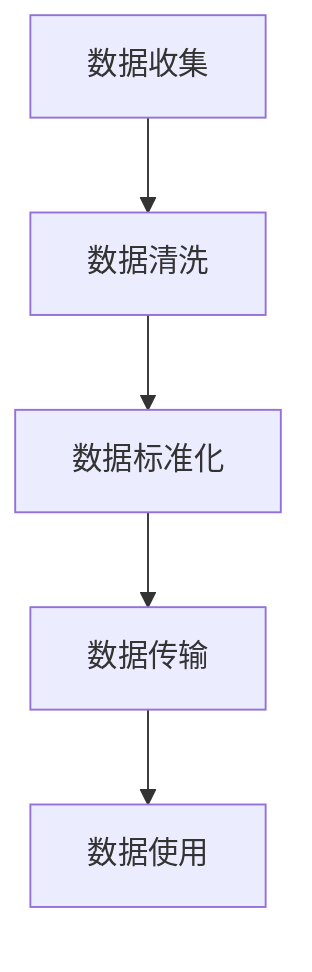

## 1.背景介绍

在数字化的世界中，数据已经成为一种新的货币。每天，我们在社交媒体、购物网站、智能设备等上产生大量的数据。这些数据不仅揭示了我们的行为习惯，也为企业提供了深入了解我们的可能性。然而，这种情况引发了一个问题：我们对自己的数据有多少控制权？这就引出了我们今天要讨论的主题——数据可移植权，也就是用户个人数据的自主管理。

## 2.核心概念与联系

数据可移植权是一种法律概念，它赋予个人对自己数据的控制权，包括查看、修改和传输数据。这是一种从数据保护法中产生的权利，它允许用户从一个服务提供商转移到另一个服务提供商，而不会丧失他们的数据。这种权利的实现需要处理许多技术和法律问题，包括数据的标准化、数据的安全传输和数据的隐私保护。

## 3.核心算法原理具体操作步骤

实现数据可移植权需要以下几个步骤：

1. **数据收集**：首先，从各个源收集用户数据。这可能包括社交媒体、电子邮件、购物网站等。

2. **数据清洗**：清洗数据，去除不必要的信息，如广告、垃圾邮件等。

3. **数据标准化**：将数据转换为标准格式，以便在不同的服务提供商之间进行传输。

4. **数据传输**：通过安全的方式将数据从一个服务提供商转移到另一个服务提供商。

5. **数据使用**：新的服务提供商可以使用这些数据来提供个性化的服务。

这个过程可以用以下的 Mermaid 流程图来表示：



## 4.数学模型和公式详细讲解举例说明

在数据可移植性的背景下，我们可以使用信息熵来度量数据的价值。信息熵是一个衡量信息量的指标，定义如下：

$$ H(X) = -\sum_{i=1}^{n} P(x_i) \log P(x_i) $$

其中，$X$ 是一个随机变量，$x_i$ 是 $X$ 的一个可能的取值，$P(x_i)$ 是 $x_i$ 的概率。这个公式告诉我们，数据的价值与其包含的信息量成正比。

## 5.项目实践：代码实例和详细解释说明

下面是一个简单的例子，展示了如何使用 Python 来收集、清洗和标准化数据：

```python
import pandas as pd

# 数据收集
data = pd.read_csv('user_data.csv')

# 数据清洗
data = data.dropna()
data = data.drop_duplicates()

# 数据标准化
data['age'] = (data['age'] - data['age'].mean()) / data['age'].std()
```

## 6.实际应用场景

数据可移植权在很多场景中都有应用。例如，当用户想要从一个社交媒体平台迁移到另一个平台时，他们可以将他们的数据（如朋友列表、照片、帖子等）带走。同样，当用户更换电子邮件服务提供商时，他们也可以将他们的邮件、联系人等数据带走。

## 7.工具和资源推荐

实现数据可移植权需要一些工具和资源。例如，数据清洗和标准化可以使用 Python 的 Pandas 库。数据的安全传输可以使用 SSL/TLS 协议。此外，还有一些开源项目，如 Google 的 Data Transfer Project，可以帮助实现数据的移植。

## 8.总结：未来发展趋势与挑战

数据可移植权是一个重要的议题，它将影响我们如何在数字化的世界中管理我们的数据。然而，实现数据可移植权也面临着许多挑战，包括技术挑战（如数据的标准化和安全传输）和法律挑战（如数据的隐私保护）。未来，我们需要更多的研究和努力来克服这些挑战。

## 9.附录：常见问题与解答

**问题1：数据可移植权是否意味着我可以随时删除我的数据？**

答：数据可移植权主要是指你可以将你的数据从一个服务提供商转移到另一个服务提供商。至于是否可以删除数据，这通常由数据保护法规定。

**问题2：所有的数据都可以移植吗？**

答：并非所有的数据都可以移植。一般来说，只有你提供给服务提供商的数据，以及由你的行为生成的数据，才可以移植。其他的数据，如由服务提供商生成的数据，可能不能移植。

作者：禅与计算机程序设计艺术 / Zen and the Art of Computer Programming
