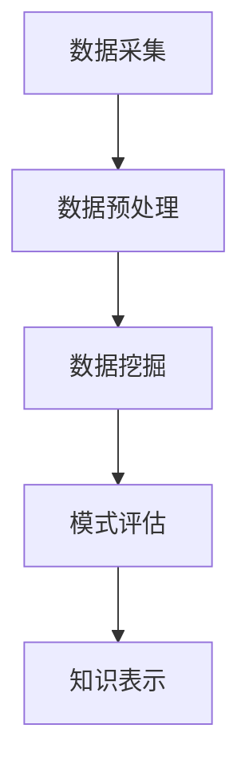

# 数据挖掘和大数据分析的新方法和算法

## 1. 背景介绍

### 1.1 大数据时代的到来

随着互联网、物联网和云计算的快速发展,数据正以前所未有的规模和速度被产生和积累。根据IDC(International Data Corporation)的预测,到2025年全球数据量将达到175ZB(1ZB=1万亿GB)。这种海量的数据被称为"大数据"(Big Data),其主要特征包括:

- 体积庞大(Volume)
- 种类繁多(Variety)
- 增长迅速(Velocity)
- 价值密度低(Value Density)

大数据时代的到来,为企业带来了巨大的机遇和挑战。一方面,隐藏在大数据中的宝贵信息和知识,可以帮助企业更好地了解客户需求、优化业务流程、发现新的商机等。另一方面,如何高效地从海量数据中提取有价值的信息,成为企业亟待解决的问题。

### 1.2 数据挖掘的重要性

数据挖掘(Data Mining)是从大量的数据中发现有价值的、隐藏的、未知的模式和关系的过程。它通过运用统计学、人工智能、机器学习等技术,自动或半自动地分析大数据,以发现其中蕴含的知识。数据挖掘在大数据时代扮演着越来越重要的角色,成为企业获取竞争优势的关键手段。

### 1.3 大数据分析的挑战

尽管大数据和数据挖掘为企业带来了巨大的机遇,但也存在诸多挑战需要克服:

- 数据量大、种类多、增长快,传统的数据处理和分析方法难以应对
- 数据质量参差不齐,存在噪音、缺失值、异常值等问题
- 隐私和安全问题日益突出,需要保护个人隐私和数据安全
- 缺乏高效的大数据分析算法和工具

为了应对这些挑战,需要开发新的大数据分析方法和算法,以充分挖掘大数据的价值。

## 2. 核心概念与联系

### 2.1 大数据分析流程

大数据分析的核心流程包括以下几个阶段:

1. **数据采集**: 从各种数据源(如网络日志、传感器、社交媒体等)收集原始数据。
2. **数据预处理**: 对原始数据进行清洗、集成、转换和规范化,以准备数据挖掘阶段。
3. **数据挖掘**: 应用各种算法和技术(如分类、聚类、关联规则挖掘等)发现隐藏的模式和知识。
4. **模式评估**: 评估挖掘出的模式的有效性和可用性。
5. **知识表示**: 将发现的知识用可解释的形式表示出来,供决策者使用。

### 2.2 常用数据挖掘任务

数据挖掘常见的任务包括:

- **分类(Classification)**: 根据已知的训练数据,构建模型对新的数据进行分类。
- **聚类(Clustering)**: 根据数据的相似性,将数据划分为多个簇或组。
- **关联规则挖掘(Association Rule Mining)**: 发现数据集中的频繁模式、相关性和关联规则。
- **异常检测(Anomaly Detection)**: 识别数据集中的异常值或异常模式。
- **回归分析(Regression Analysis)**: 建立自变量和因变量之间的数学模型。

### 2.3 大数据分析平台

为了高效地处理和分析大数据,需要采用分布式计算框架和大数据分析平台,如:

- **Apache Hadoop**: 一个分布式计算框架,提供分布式存储(HDFS)和分布式计算(MapReduce)能力。
- **Apache Spark**: 一个快速、通用的大数据分析引擎,支持内存计算和流式计算。
- **Apache Kafka**: 一个分布式流式处理平台,用于构建实时数据管道和流应用程序。
- **Apache Flink**: 一个分布式流式数据处理框架,用于有状态计算和批处理。

这些平台为大数据分析提供了强大的计算能力和可扩展性,使得处理和分析海量数据成为可能。

## 3. 核心算法原理具体操作步骤

### 3.1 分类算法

分类是数据挖掘中最常见和最重要的任务之一。常用的分类算法包括决策树、朴素贝叶斯、逻辑回归、支持向量机等。以决策树算法为例,其核心思想是根据训练数据构建一个决策树模型,然后使用该模型对新的数据进行分类。

决策树算法的具体步骤如下:

1. **收集数据**: 从可用的数据源收集训练数据。
2. **准备数据**: 对数据进行预处理,如去除噪音、处理缺失值等。
3. **构建决策树**:
    a. 计算每个特征的信息增益率或基尼指数,选择增益率最高或基尼指数最小的特征作为根节点。
    b. 根据该特征的不同取值,将数据集划分为若干子集。
    c. 对每个子集递归构建决策树,直到满足停止条件(如子集中实例属于同一类别或没有剩余特征可用)。
4. **决策树剪枝**: 对已生成的决策树进行剪枝,以避免过拟合。
5. **使用决策树进行分类**: 对新的数据实例,根据决策树的路径进行分类。

### 3.2 聚类算法

聚类算法的目标是根据数据实例之间的相似性,将它们划分为多个簇或组。常用的聚类算法包括K-Means、层次聚类、DBSCAN等。以K-Means算法为例,其核心思想是通过迭代最小化每个数据点到其所属簇中心的距离平方和,从而得到最优的簇划分。

K-Means算法的具体步骤如下:

1. **初始化**: 随机选择K个数据点作为初始簇中心。
2. **分配簇**: 对每个数据点,计算其与各个簇中心的距离,将其分配到最近的簇。
3. **更新簇中心**: 对每个簇,重新计算簇中所有数据点的均值作为新的簇中心。
4. **迭代**: 重复步骤2和3,直到簇中心不再发生变化或达到最大迭代次数。

K-Means算法的关键在于选择合适的K值(簇数)和初始簇中心。常用的方法包括肘部法则(Elbow Method)和平均轮廓系数(Silhouette Coefficient)等。

### 3.3 关联规则挖掘算法

关联规则挖掘旨在发现数据集中的频繁项集和关联规则。常用的算法包括Apriori算法和FP-Growth算法。以Apriori算法为例,其核心思想是通过迭代的方式发现频繁项集,然后根据频繁项集生成关联规则。

Apriori算法的具体步骤如下:

1. **设置最小支持度阈值**: 确定判断一个项集是否频繁的最小支持度阈值。
2. **发现频繁1-项集**: 扫描数据集,统计每个项的支持度,保留支持度大于阈值的项作为频繁1-项集。
3. **发现更高阶频繁项集**:
    a. 利用频繁(k-1)-项集生成候选k-项集。
    b. 扫描数据集,统计每个候选k-项集的支持度。
    c. 保留支持度大于阈值的候选k-项集作为频繁k-项集。
    d. 重复步骤a-c,直到无法再生成新的频繁项集。
4. **生成关联规则**: 对每个频繁项集,根据最小置信度阈值生成关联规则。

Apriori算法的效率受频繁项集数量和数据集大小的影响。FP-Growth算法通过构建FP-Tree数据结构,可以更高效地发现频繁项集。

## 4. 数学模型和公式详细讲解举例说明

### 4.1 信息增益率和基尼指数

在决策树算法中,信息增益率和基尼指数是两种常用的指标,用于选择最优特征作为决策树节点。

**信息增益率(Information Gain Ratio)**

信息增益率基于信息熵的概念,它度量了使用某个特征进行划分后,所获得的信息增益。

对于一个数据集D,其信息熵定义为:

$$Ent(D) = -\sum_{i=1}^{c}p_ilog_2p_i$$

其中,c是类别数,$p_i$是D中属于第i类的比例。

假设使用特征A对D进行划分,产生子集$D_1,D_2,...,D_v$,则信息增益为:

$$Gain(D,A) = Ent(D) - \sum_{j=1}^{v}\frac{|D_j|}{|D|}Ent(D_j)$$

信息增益率通过将信息增益除以特征A的熵,从而消除特征值过多对信息增益的影响:

$$GainRatio(D,A) = \frac{Gain(D,A)}{IV(A)}$$

其中,$IV(A) = -\sum_{j=1}^{v}\frac{|D_j|}{|D|}log_2\frac{|D_j|}{|D|}$是特征A的熵。

**基尼指数(Gini Index)**

基尼指数度量了一个数据集的"纯度",值越小表示数据集越纯。对于数据集D,其基尼指数定义为:

$$Gini(D) = 1 - \sum_{i=1}^{c}p_i^2$$

其中,c是类别数,$p_i$是D中属于第i类的比例。

使用特征A对D进行划分后,得到子集$D_1,D_2,...,D_v$,则基尼指数为:

$$Gini_A(D) = \sum_{j=1}^{v}\frac{|D_j|}{|D|}Gini(D_j)$$

在决策树算法中,通常选择信息增益率或基尼指数最大(或最小)的特征作为节点。

### 4.2 K-Means聚类中的距离度量

在K-Means聚类算法中,需要计算每个数据点与簇中心之间的距离,以确定数据点应该分配到哪个簇。常用的距离度量包括欧氏距离、曼哈顿距离和余弦相似度等。

**欧氏距离(Euclidean Distance)**

对于两个n维向量$x = (x_1,x_2,...,x_n)$和$y = (y_1,y_2,...,y_n)$,它们之间的欧氏距离定义为:

$$d(x,y) = \sqrt{\sum_{i=1}^{n}(x_i-y_i)^2}$$

欧氏距离是最常用的距离度量,它直观地反映了两个点在空间中的直线距离。

**曼哈顿距离(Manhattan Distance)**

曼哈顿距离也称为城市街区距离,它定义为两个向量对应元素的绝对差之和:

$$d(x,y) = \sum_{i=1}^{n}|x_i-y_i|$$

曼哈顿距离在某些场景下比欧氏距离更加鲁棒。

**余弦相似度(Cosine Similarity)**

对于两个向量$x$和$y$,它们的余弦相似度定义为:

$$sim(x,y) = \frac{x \cdot y}{||x||\cdot||y||}=\frac{\sum_{i=1}^{n}x_iy_i}{\sqrt{\sum_{i=1}^{n}x_i^2}\sqrt{\sum_{i=1}^{n}y_i^2}}$$

余弦相似度测量两个向量之间的夹角余弦值,常用于文本挖掘和推荐系统等领域。

在K-Means聚类中,通常使用欧氏距离或曼哈顿距离作为距离度量。对于高维稀疏数据,也可以考虑使用余弦相似度。

### 4.3 关联规则的评价指标

关联规则挖掘算法发现的规则需要通过一定的指标来评估其质量和可用性。常用的评价指标包括支持度、置信度和提升度等。

**支持度(Support)**

支持度度量了一个项集在整个数据集中出现的频率。对于项集$X$,其支持度定义为