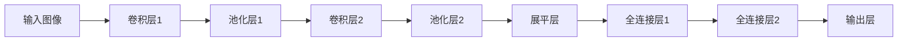
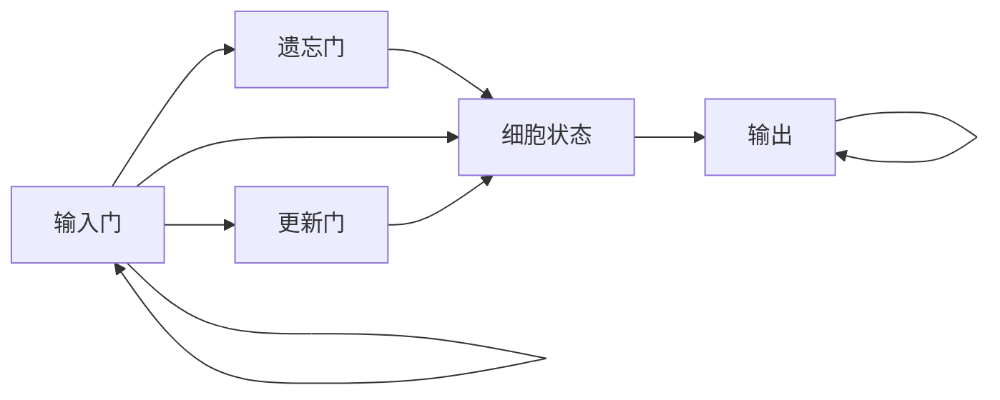

# 数据标注与边缘计算：实时数据处理与标注

## 1.背景介绍

### 1.1 数据标注的重要性

在当今的数据驱动时代，数据标注扮演着至关重要的角色。无论是在机器学习、计算机视觉、自然语言处理还是其他人工智能领域,高质量的训练数据对于构建准确、可靠的模型至关重要。数据标注是一种为原始数据添加有意义的元数据或标签的过程,使其可被机器学习算法有效地理解和利用。

### 1.2 边缘计算的兴起

随着物联网(IoT)设备和实时数据流的激增,传统的云计算架构面临着延迟、带宽和隐私等挑战。边缘计算应运而生,将计算资源和数据处理能力推向网络边缘,靠近数据源。这种分布式架构可以实现低延迟、高带宽、增强隐私和安全性,从而满足实时数据处理和分析的需求。

### 1.3 实时数据标注的重要性

在许多应用场景中,如自动驾驶汽车、工业自动化、医疗诊断等,实时数据处理和标注对于及时做出准确决策至关重要。通过在边缘节点进行实时数据标注,可以减少数据传输延迟,提高系统响应速度,并确保敏感数据的隐私和安全性。

## 2.核心概念与联系

### 2.1 数据标注

数据标注是一种为原始数据添加有意义的元数据或标签的过程,使其可被机器学习算法有效地理解和利用。常见的数据标注类型包括:

- 图像标注:为图像中的对象、人物、场景等添加标签。
- 视频标注:为视频中的对象、动作、事件等添加标签。
- 文本标注:为文本中的实体、关系、情感等添加标签。
- 音频标注:为音频中的语音、音乐、噪音等添加标签。

### 2.2 边缘计算

边缘计算是一种分布式计算架构,将计算资源和数据处理能力推向网络边缘,靠近数据源。它具有以下关键特征:

- 就近处理:在靠近数据源的边缘节点进行数据处理,减少数据传输延迟。
- 分布式架构:计算资源分布在多个边缘节点上,实现高度可扩展性。
- 低延迟:由于就近处理,可以实现低延迟的实时数据处理和响应。
- 增强隐私和安全性:敏感数据可以在边缘节点进行处理,避免传输到云端。

### 2.3 实时数据处理与标注

实时数据处理与标注是指在数据生成的同时,对其进行即时处理和标注。这种实时处理模式对于许多应用场景至关重要,如:

- 自动驾驶汽车:需要实时处理来自传感器的数据,并标注道路、障碍物等,以确保安全驾驶。
- 工业自动化:需要实时监控生产线数据,并标注异常情况,以及时采取措施。
- 医疗诊断:需要实时处理患者生理数据,并标注异常情况,以提供及时诊断和治疗。

通过将数据标注与边缘计算相结合,可以实现低延迟、高带宽、增强隐私和安全性的实时数据处理与标注,满足各种应用场景的需求。

## 3.核心算法原理具体操作步骤

实现实时数据标注与边缘计算涉及多种算法和技术,下面将介绍其中的核心算法原理和具体操作步骤。

### 3.1 数据标注算法

数据标注算法是实现自动化数据标注的关键。常见的数据标注算法包括:

#### 3.1.1 基于规则的标注算法

基于规则的标注算法根据预定义的规则对数据进行标注。这种算法通常适用于结构化数据或具有明确模式的数据。具体操作步骤如下:

1. 定义标注规则:根据领域知识和专家经验,制定数据标注的规则集。
2. 预处理数据:对原始数据进行清洗、规范化等预处理,以满足规则匹配的要求。
3. 应用标注规则:遍历数据,对满足规则条件的数据进行相应的标注。
4. 后处理和优化:对标注结果进行人工审核和优化,以提高标注质量。

#### 3.1.2 基于机器学习的标注算法

基于机器学习的标注算法利用训练数据,学习数据模式和特征,从而实现自动标注。常见的算法包括:

- 监督学习算法:如支持向量机(SVM)、决策树、随机森林等,需要大量标注好的训练数据。
- 无监督学习算法:如聚类算法、主题模型等,无需标注数据,但准确性较低。
- 半监督学习算法:结合少量标注数据和大量未标注数据进行训练,平衡了准确性和标注成本。
- 深度学习算法:如卷积神经网络(CNN)、递归神经网络(RNN)等,在图像、文本、语音等领域表现出色。

具体操作步骤如下:

1. 数据准备:收集和清洗原始数据,构建训练集和测试集。
2. 特征工程:从原始数据中提取有意义的特征,作为模型的输入。
3. 模型训练:选择合适的机器学习算法,使用训练数据对模型进行训练。
4. 模型评估:使用测试集评估模型的性能,根据需要进行调参和优化。
5. 模型部署:将训练好的模型部署到生产环境中,用于实时数据标注。

### 3.2 边缘计算架构

边缘计算架构通常采用分层设计,将计算资源和数据处理能力分布在不同的层级上。常见的边缘计算架构包括:

#### 3.2.1 三层边缘计算架构

三层边缘计算架构由设备层、边缘层和云层组成:

1. 设备层:包括各种IoT设备、传感器等,负责数据采集和初步处理。
2. 边缘层:由边缘节点组成,负责实时数据处理和标注,以及与云层的通信。
3. 云层:提供大规模的计算和存储资源,用于进一步的数据分析和模型训练。

#### 3.2.2 五层边缘计算架构

五层边缘计算架构在三层架构的基础上增加了两个层级:

1. 设备层:包括各种IoT设备、传感器等,负责数据采集。
2. 边缘节点层:由边缘节点组成,负责实时数据处理和标注。
3. 边缘网关层:负责边缘节点的管理和协调,以及与云层的通信。
4. 边缘数据中心层:提供区域性的计算和存储资源,用于边缘数据的进一步处理和分析。
5. 云层:提供大规模的计算和存储资源,用于全局数据分析和模型训练。

无论采用哪种架构,实现实时数据标注与边缘计算的关键步骤如下:

1. 部署边缘节点:在网络边缘部署具有一定计算能力的边缘节点,用于实时数据处理和标注。
2. 数据采集和预处理:从IoT设备、传感器等采集原始数据,并进行必要的预处理,如数据清洗、格式转换等。
3. 实时数据标注:在边缘节点上部署数据标注算法,对实时数据进行标注。
4. 数据传输和协调:将标注后的数据传输到上层节点或云端,并进行必要的协调和管理。
5. 模型训练和优化:利用云端的计算资源,对标注数据进行进一步分析和模型训练,以优化数据标注算法。

## 4.数学模型和公式详细讲解举例说明

在实现实时数据标注与边缘计算过程中,涉及多种数学模型和公式。下面将详细讲解其中的几种常见模型和公式。

### 4.1 支持向量机(SVM)

支持向量机(Support Vector Machine, SVM)是一种常用的监督学习算法,适用于分类和回归问题。它的基本思想是在高维空间中构造一个超平面,将不同类别的数据点分开,并使得两类数据点到超平面的距离最大化。

SVM的数学模型可以表示为:

$$
\begin{aligned}
\min_{\mathbf{w}, b} \quad & \frac{1}{2} \|\mathbf{w}\|^2 \\
\text{s.t.} \quad & y_i(\mathbf{w}^T \mathbf{x}_i + b) \geq 1, \quad i = 1, \ldots, n
\end{aligned}
$$

其中:

- $\mathbf{w}$和$b$分别表示超平面的法向量和偏移量。
- $\mathbf{x}_i$和$y_i$分别表示第$i$个训练样本的特征向量和标签。
- $n$表示训练样本的数量。

对于线性不可分的情况,SVM采用核技巧将数据映射到更高维的空间,使其成为线性可分。常用的核函数包括:

- 线性核:$K(\mathbf{x}_i, \mathbf{x}_j) = \mathbf{x}_i^T \mathbf{x}_j$
- 多项式核:$K(\mathbf{x}_i, \mathbf{x}_j) = (\gamma \mathbf{x}_i^T \mathbf{x}_j + r)^d$
- 高斯核:$K(\mathbf{x}_i, \mathbf{x}_j) = \exp(-\gamma \|\mathbf{x}_i - \mathbf{x}_j\|^2)$

SVM在图像分类、文本分类等领域有广泛应用。

### 4.2 卷积神经网络(CNN)

卷积神经网络(Convolutional Neural Network, CNN)是一种深度学习模型,在计算机视觉和图像处理领域表现出色。CNN的核心思想是通过卷积操作提取图像的局部特征,并通过池化操作降低特征维度,最后通过全连接层进行分类或回归。

CNN的基本结构如下:

卷积层的数学表达式为:

$$
y_{ij}^l = f\left(\sum_{m} \sum_{p=0}^{P_m-1} \sum_{q=0}^{Q_m-1} w_{pq}^{lm} x_{i+p,j+q}^{l-1} + b^{lm}\right)
$$

其中:

- $y_{ij}^l$表示第$l$层的第$i$行第$j$列的输出特征图。
- $x_{ij}^{l-1}$表示第$l-1$层的第$i$行第$j$列的输入特征图。
- $w_{pq}^{lm}$表示第$l$层第$m$个卷积核的权重。
- $b^{lm}$表示第$l$层第$m$个卷积核的偏置项。
- $f$表示激活函数,如ReLU、Sigmoid等。

池化层的作用是降低特征维度,常用的池化操作包括最大池化和平均池化。

CNN在图像分类、目标检测、语义分割等领域有广泛应用。

### 4.3 长短期记忆网络(LSTM)

长短期记忆网络(Long Short-Term Memory, LSTM)是一种特殊的递归神经网络,在自然语言处理、时序数据处理等领域表现出色。LSTM的核心思想是通过门控机制来控制信息的流动,从而解决传统递归神经网络梯度消失和梯度爆炸的问题。

LSTM的基本结构如下:

LSTM的数学表达式为:

$$
\begin{aligned}
f_t &= \sigma(W_f \cdot [h_{t-1}, x_t] + b_f) \\
i_t &= \sigma(W_i