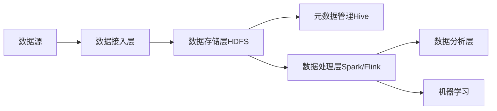

# 数据湖 原理与代码实例讲解

## 1. 背景介绍
### 1.1 数据湖的诞生
在大数据时代,企业面临着海量、多样化的数据,传统的数据仓库架构已经无法满足快速增长的数据处理需求。数据湖(Data Lake)应运而生,它是一种可以存储和处理各种原始格式数据的平台,为企业提供了一种灵活、可扩展、低成本的大数据解决方案。

### 1.2 数据湖的优势
与传统数据仓库相比,数据湖具有以下优势:

- 支持多种数据类型:结构化、半结构化、非结构化数据
- 数据存储成本低,采用廉价的分布式存储
- 数据处理灵活,支持批处理、流处理、交互式查询等
- 易于扩展,可以线性扩展存储和计算能力

### 1.3 数据湖的应用场景
数据湖广泛应用于以下场景:

- 日志分析:存储和分析海量的系统日志、用户行为日志等
- 社交媒体分析:处理社交网络的文本、图片、视频等非结构化数据  
- 物联网数据处理:接收和分析传感器、设备产生的实时数据流
- 数据科学与机器学习:为数据科学家提供原始数据进行探索和建模

## 2. 核心概念与联系
### 2.1 数据湖的核心组件
数据湖的核心组件包括:

- 数据存储:采用HDFS、对象存储等分布式存储系统
- 元数据管理:负责管理数据的元信息,如数据格式、来源、权限等
- 数据接入:支持批量和实时的数据采集和导入
- 数据处理:提供 ETL、流处理、SQL 分析等数据处理能力
- 数据治理:确保数据质量、安全性、可追溯性

### 2.2 数据湖与数据仓库的区别
数据湖与传统数据仓库的主要区别在于:

- 数据存储:数据湖存储原始格式数据,数据仓库存储结构化数据
- 数据处理:数据湖支持多种处理方式,数据仓库侧重于 ETL 和 SQL 分析
- 数据模式:数据湖采用 Schema-on-read,数据仓库采用 Schema-on-write
- 成本:数据湖存储成本低,数据仓库需要昂贵的专有存储

### 2.3 数据湖架构
一个典型的数据湖架构如下图所示:



## 3. 核心算法原理具体操作步骤
### 3.1 数据接入
数据湖的数据接入主要有两种方式:批量接入和实时接入。

#### 3.1.1 批量接入
批量接入通常使用 Sqoop、Flume 等工具从关系型数据库、日志文件等数据源中抽取数据,并以文件的形式存储到 HDFS 中。以 Sqoop 为例,将 MySQL 数据导入 HDFS 的步骤如下:

1. 配置 Sqoop 环境,包括 JDBC 驱动、Hadoop 配置等
2. 使用 Sqoop 命令从 MySQL 表中抽取数据到 HDFS
3. 指定输入格式、目标路径、并行度等参数
4. 执行 Sqoop 作业,将数据以文件形式写入 HDFS

#### 3.1.2 实时接入
实时接入通常使用 Kafka、Flume 等消息队列从实时数据源中采集数据,并以流的形式传输到数据处理引擎。以 Kafka 为例,将日志数据实时写入 Kafka 的步骤如下:

1. 搭建 Kafka 集群,创建 Topic 用于存储日志数据
2. 在应用程序中集成 Kafka Producer API,将日志写入 Kafka
3. 配置 Kafka Consumer,订阅日志 Topic 并消费数据
4. 将消费到的日志数据传输到 Spark Streaming、Flink 等流处理引擎

### 3.2 数据存储
数据湖的核心存储通常采用 HDFS 等分布式文件系统。HDFS 具有高容错、高吞吐的特点,适合存储大规模非结构化数据。

#### 3.2.1 HDFS 写入数据
将数据写入 HDFS 的基本步骤如下:

1. 客户端将文件切分成块,并发送写请求给 NameNode
2. NameNode 返回一组 DataNode 用于存储数据块
3. 客户端以 Pipeline 方式将数据块写入 DataNode
4. 所有块写入完成后,通知 NameNode 提交文件

#### 3.2.2 HDFS 读取数据
从 HDFS 读取文件的基本步骤如下:  

1. 客户端发送读请求给 NameNode,指定文件路径
2. NameNode 返回文件的块信息和 DataNode 地址
3. 客户端并发从 DataNode 读取数据块
4. 将读取的数据块拼接成完整的文件

### 3.3 元数据管理
数据湖中的元数据管理通常使用 Hive Metastore。Hive 是一个基于 Hadoop 的数据仓库工具,其 Metastore 用于存储表、字段、分区等元信息。

#### 3.3.1 Hive 表创建
在 Hive 中创建表的基本步骤如下:

1. 连接到 Hive 客户端,如 beeline
2. 使用 HQL 语句创建表,指定列名和数据类型
3. 可选择指定分区、存储格式、位置等属性
4. 执行 HQL,将表元数据写入 Metastore

#### 3.3.2 Hive 表查询
在 Hive 中查询表数据的基本步骤如下:

1. 使用 HQL 编写查询语句,支持 SELECT、JOIN、GROUP BY 等
2. Hive 将 HQL 转换成 MapReduce 作业
3. MapReduce 作业读取 HDFS 中的表数据并执行计算
4. 将查询结果返回给客户端

### 3.4 数据处理
数据湖的数据处理通常使用 Spark、Flink 等分布式计算引擎。以 Spark 为例,介绍几种常见的数据处理场景。

#### 3.4.1 ETL
Spark 可以方便地进行 ETL,将原始数据转换为结构化、易于分析的形式。基本步骤如下:

1. 使用 Spark SQL 从 Hive 表或 Parquet 文件加载数据
2. 使用 DataFrame/Dataset API 进行数据转换,如过滤、聚合、连接等
3. 将转换后的结果写入 Hive 表或保存成文件

#### 3.4.2 机器学习
Spark MLlib 提供了常用的机器学习算法,可以方便地进行特征工程、模型训练和预测。基本步骤如下:

1. 加载训练数据集,创建 DataFrame
2. 对特征进行转换和提取,如归一化、OneHot 编码等 
3. 选择合适的算法进行模型训练,如决策树、逻辑回归等
4. 在测试集上评估模型性能,并调优超参数
5. 使用训练好的模型对新数据进行预测

#### 3.4.3 流处理
Spark Streaming 可以对实时数据流进行处理,支持滑动窗口、状态管理等。基本步骤如下:

1. 创建输入数据流,如从 Kafka 读取数据
2. 定义数据处理逻辑,如 map、filter、reduce 等
3. 设置处理时间间隔,如每 5 秒处理一次
4. 启动 Streaming 作业,持续处理数据流
5. 将处理结果写入外部存储或下游系统

## 4. 数学模型和公式详细讲解举例说明
数据湖涉及的数学模型主要有统计学和线性代数。下面以 Spark MLlib 中的逻辑回归为例,讲解其原理。

### 4.1 逻辑回归原理
逻辑回归是一种常用的分类算法,用于二分类问题。其核心是 Sigmoid 函数:

$$
g(z) = \frac{1}{1+e^{-z}}
$$

其中 $z$ 是特征 $x$ 的线性组合:

$$
z = w_0 + w_1x_1 + w_2x_2 + ... + w_nx_n
$$

逻辑回归的目标是找到一组权重 $w$,最大化似然函数:

$$
\mathcal{L}(w) = \prod_{i=1}^{n} p(x_i)^{y_i}(1-p(x_i))^{1-y_i}
$$

其中 $y_i$ 是样本 $i$ 的真实标签。

### 4.2 梯度下降求解
对似然函数取对数,得到对数似然:

$$
\ell(w) = \sum_{i=1}^{n} y_i \log p(x_i) + (1-y_i) \log (1-p(x_i))
$$

使用梯度下降法求解 $w$ 的最优值,迭代公式为:

$$
w := w - \alpha \nabla_w \ell(w)
$$

其中 $\alpha$ 是学习率,$\nabla_w \ell(w)$ 是 $\ell(w)$ 对 $w$ 的梯度。

### 4.3 正则化
为了防止过拟合,通常在目标函数中加入正则化项,如 L2 正则化:

$$
\min_w \sum_{i=1}^{n} \log (1+e^{-y_i(w^Tx_i)}) + \frac{\lambda}{2} \|w\|^2
$$

其中 $\lambda$ 是正则化系数,$\|w\|$ 是 $w$ 的 L2 范数。加入 L2 正则化相当于在权重更新时,对 $w$ 进行缩减:

$$
w := w - \alpha (\nabla_w \ell(w) + \lambda w) 
$$

## 5. 项目实践:代码实例和详细解释说明
下面使用 Spark 实现一个简单的逻辑回归二分类任务。

### 5.1 数据准备
首先准备训练数据,每行数据包含多个特征和一个标签,特征用逗号分隔。

```
0.5,1.0,0.7,0.2,1
0.1,0.5,0.3,0.8,0
0.7,0.8,0.5,0.3,1
0.2,0.1,0.4,0.6,0
```

### 5.2 数据加载
使用 Spark SQL 从 CSV 文件加载数据:

```scala
val data = spark.read.format("csv")
  .option("header", "false")
  .option("inferSchema", "true")
  .load("data/lr_data.csv")
```

### 5.3 数据转换
将数据集划分为特征和标签,并转换成 MLlib 需要的格式:

```scala
import org.apache.spark.ml.feature.VectorAssembler
import org.apache.spark.ml.linalg.Vectors

val assembler = new VectorAssembler()
  .setInputCols(Array("_c0","_c1","_c2","_c3"))
  .setOutputCol("features")

val df = assembler.transform(data)
  .select("features", "_c4".alias("label"))
```

### 5.4 模型训练
创建逻辑回归对象,设置参数并训练模型:

```scala
import org.apache.spark.ml.classification.LogisticRegression

val lr = new LogisticRegression()
  .setMaxIter(10)
  .setRegParam(0.3)
  .setElasticNetParam(0.8)

val model = lr.fit(df)
```

### 5.5 模型评估
对训练集进行预测,计算准确率:

```scala
val predictions = model.transform(df)

val accuracy = predictions.filter($"label" === $"prediction").count().toDouble / df.count()
println(s"Accuracy = $accuracy")
```

### 5.6 完整代码

```scala
import org.apache.spark.ml.classification.LogisticRegression
import org.apache.spark.ml.feature.VectorAssembler
import org.apache.spark.ml.linalg.Vectors
import org.apache.spark.sql.SparkSession

object LogisticRegressionExample {
  def main(args: Array[String]): Unit = {
    val spark = SparkSession.builder.appName("LogisticRegressionExample").getOrCreate()
    
    val data = spark.read.format("csv")
      .option("header", "false")
      .option("inferSchema", "true")
      .load("data/lr_data.csv")
      
    val assembler = new VectorAssembler()