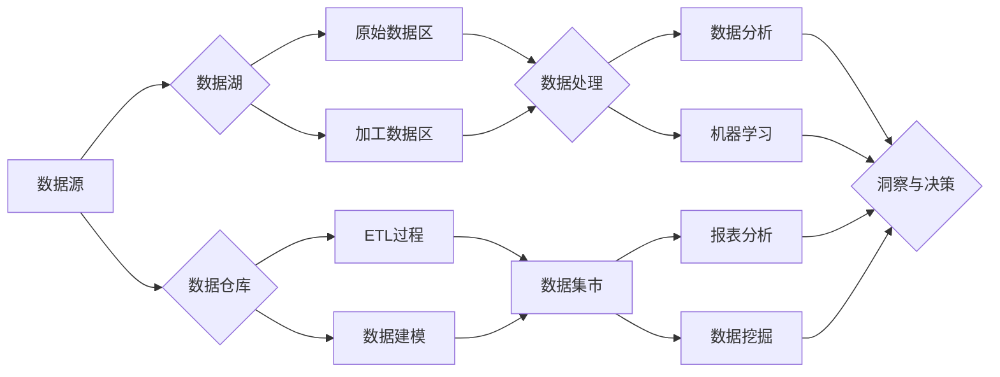

# 数据湖可以替代数据仓库？

## 1. 背景介绍
### 1.1 数据仓库的局限性
#### 1.1.1 数据仓库的概念与特点
#### 1.1.2 数据仓库面临的挑战
#### 1.1.3 数据仓库的局限性总结

### 1.2 数据湖的兴起
#### 1.2.1 大数据时代的数据处理需求
#### 1.2.2 数据湖的概念与特点
#### 1.2.3 数据湖相对于数据仓库的优势

## 2. 核心概念与联系
### 2.1 数据仓库的核心概念
#### 2.1.1 ETL过程
#### 2.1.2 数据建模与Schema
#### 2.1.3 数据治理与质量管理

### 2.2 数据湖的核心概念 
#### 2.2.1 数据采集与存储
#### 2.2.2 Schema-on-Read
#### 2.2.3 数据治理与元数据管理

### 2.3 数据仓库与数据湖的联系
#### 2.3.1 数据处理流程对比
#### 2.3.2 数据治理策略对比
#### 2.3.3 两者的互补与结合

## 3. 核心算法原理具体操作步骤
### 3.1 数据仓库的ETL过程
#### 3.1.1 数据抽取
#### 3.1.2 数据转换
#### 3.1.3 数据加载

### 3.2 数据湖的数据采集与处理
#### 3.2.1 数据采集与接入
#### 3.2.2 数据存储与组织
#### 3.2.3 数据处理与分析

## 4. 数学模型和公式详细讲解举例说明
### 4.1 数据仓库的数据建模
#### 4.1.1 星型模型
#### 4.1.2 雪花模型
#### 4.1.3 数据立方体

### 4.2 数据湖的统计与机器学习模型
#### 4.2.1 描述性统计模型
#### 4.2.2 预测性分析模型
#### 4.2.3 聚类与分类模型

## 5. 项目实践：代码实例和详细解释说明
### 5.1 数据仓库的ETL实现
#### 5.1.1 使用SQL进行数据抽取与转换
#### 5.1.2 使用ETL工具进行数据加载
#### 5.1.3 数据质量检查与监控

### 5.2 数据湖的数据处理实现
#### 5.2.1 使用Spark进行数据采集与存储  
#### 5.2.2 使用Hive进行数据查询与分析
#### 5.2.3 使用机器学习算法进行数据挖掘

## 6. 实际应用场景
### 6.1 电商行业的应用
#### 6.1.1 用户行为分析
#### 6.1.2 个性化推荐
#### 6.1.3 供应链优化

### 6.2 金融行业的应用
#### 6.2.1 风险管理与欺诈检测  
#### 6.2.2 客户画像与精准营销
#### 6.2.3 实时交易分析

### 6.3 医疗行业的应用
#### 6.3.1 疾病诊断与预测
#### 6.3.2 药物研发与临床试验
#### 6.3.3 医疗保险欺诈检测

## 7. 工具和资源推荐
### 7.1 数据仓库工具
#### 7.1.1 传统数据仓库：Oracle、Teradata、IBM DB2等
#### 7.1.2 云数据仓库：Amazon Redshift、Google BigQuery、Snowflake等
#### 7.1.3 开源数据仓库：Apache Hive、Presto、Druid等

### 7.2 数据湖工具
#### 7.2.1 数据存储：HDFS、Amazon S3、Azure Blob Storage等 
#### 7.2.2 数据处理：Apache Spark、Flink、Beam等
#### 7.2.3 元数据管理：Apache Atlas、Cloudera Navigator等

### 7.3 学习资源
#### 7.3.1 在线课程：Coursera、edX、Udacity等
#### 7.3.2 书籍：《数据仓库工具箱》、《Hadoop权威指南》等
#### 7.3.3 博客与社区：KDnuggets、DataCamp等

## 8. 总结：未来发展趋势与挑战
### 8.1 数据仓库与数据湖的融合趋势 
#### 8.1.1 统一的数据治理体系
#### 8.1.2 实时数据处理与分析
#### 8.1.3 AI与机器学习的深度应用

### 8.2 未来的挑战
#### 8.2.1 数据隐私与安全
#### 8.2.2 数据质量与一致性
#### 8.2.3 人才缺口与技能要求

## 9. 附录：常见问题与解答
### 9.1 数据仓库与数据湖的区别是什么？
### 9.2 企业是否需要同时构建数据仓库和数据湖？
### 9.3 如何选择合适的数据仓库或数据湖工具？
### 9.4 数据治理在数据仓库和数据湖中的作用是什么？
### 9.5 未来数据仓库和数据湖将如何发展？



数据湖和数据仓库是当前大数据时代两种主流的数据管理和处理架构。数据仓库起源于上世纪90年代,是一种高度结构化、经过清洗和整合的数据存储,主要用于支持企业的商业智能和决策分析。而数据湖则是近年来伴随着大数据技术的发展而兴起的一种新型数据架构,它以原始格式存储各种结构化、半结构化和非结构化数据,通过灵活的Schema-on-Read方式进行数据处理和分析。

数据仓库的核心是ETL(Extract-Transform-Load)过程,将来自不同数据源的数据抽取、清洗、转换并最终加载到数据仓库中。数据仓库采用多维数据模型如星型模型和雪花模型,通过事实表和维度表的设计实现数据的有效组织。数据立方体则是一种常见的OLAP(联机分析处理)工具,支持多维度的数据分析与可视化。

与之相比,数据湖的核心理念是"先存储、后处理",将各种原始数据直接采集并存储到廉价的分布式存储系统如HDFS或云存储中,再根据具体的业务需求进行数据处理与分析。数据湖通常采用扁平化的文件组织方式如Parquet和ORC,通过Hive等工具提供类SQL的数据查询与分析功能。此外,数据湖还广泛应用机器学习算法,实现对非结构化数据的挖掘和预测分析。

下面是一个使用Spark进行数据湖处理的代码示例:

```python
from pyspark.sql import SparkSession

# 创建SparkSession对象
spark = SparkSession.builder \
    .appName("DataLakeExample") \
    .getOrCreate()

# 从HDFS加载原始数据
raw_data = spark.read.format("json").load("hdfs://path/to/raw/data")

# 数据转换与处理
processed_data = raw_data.select("user_id", "item_id", "rating") \
    .where("rating > 3") \
    .groupBy("user_id") \
    .agg({"item_id": "count"}) \
    .withColumnRenamed("count(item_id)", "item_count") 

# 将处理后的数据写回HDFS
processed_data.write.format("parquet").save("hdfs://path/to/processed/data")

# 停止SparkSession
spark.stop()
```

上述代码首先从HDFS加载原始的JSON格式数据,然后使用Spark SQL的API对数据进行转换和处理,筛选出评分大于3的记录,并统计每个用户的商品数量,最后将处理后的结果以Parquet格式写回HDFS。这展示了数据湖灵活的数据处理能力。

数据湖和数据仓库在实际应用中各有优势。数据仓库更适合处理结构化的业务数据,支持企业的常规报表和OLAP分析。而数据湖则在处理海量、多样化数据方面具有优势,特别适合数据挖掘和机器学习场景。未来,二者很可能会趋向融合,形成统一的数据管理和分析平台。

总的来说,数据湖并不能完全替代数据仓库,而是作为一种补充,解决了传统数据仓库在大数据时代面临的局限性。数据湖提供了一种更加灵活、经济的数据存储和处理方式,使企业能够从海量数据中挖掘价值。同时,数据仓库在数据一致性、数据质量和业务规则管理方面仍然具有独特的优势。未来,企业需要根据自身的业务特点和数据应用场景,合理规划和设计数据架构,综合利用数据仓库和数据湖的优势,实现数据价值的最大化。

作者：禅与计算机程序设计艺术 / Zen and the Art of Computer Programming