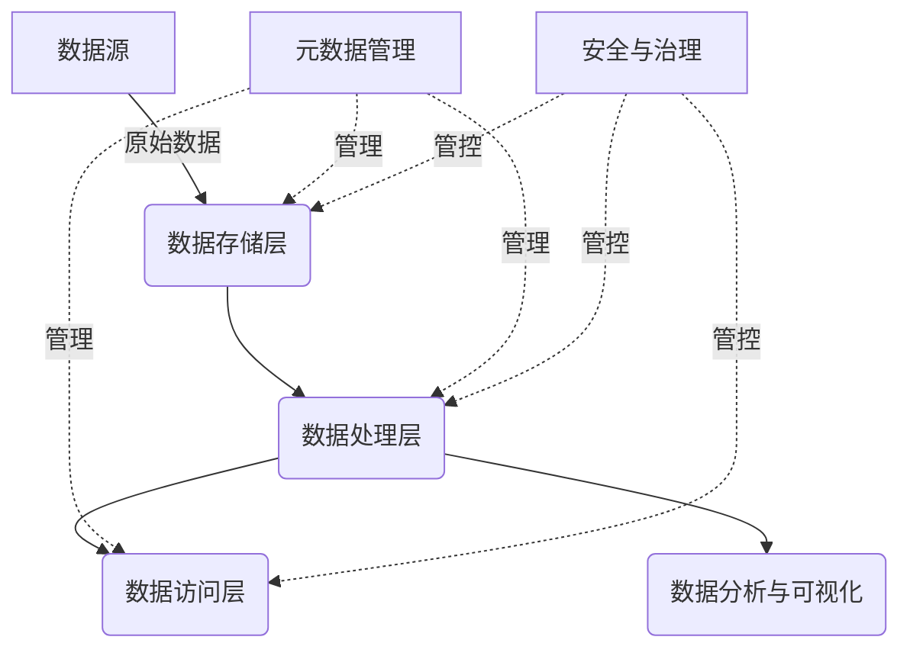

# 数据湖在金融领域的应用：风险管理与欺诈检测

## 1.背景介绍

### 1.1 金融行业的数据挑战

在当今数字化时代,金融行业正面临着前所未有的数据挑战。随着交易量的增加、监管要求的加强以及新兴技术的涌现,金融机构需要处理大量的结构化和非结构化数据。这些数据来源包括交易记录、客户信息、社交媒体数据、网络日志等。传统的数据仓库已无法满足金融机构对数据存储、处理和分析的需求。

### 1.2 数据湖的兴起

为了应对这一挑战,数据湖(Data Lake)作为一种新兴的大数据架构应运而生。数据湖是一种高度可扩展的数据存储和处理平台,能够容纳各种类型的数据,包括结构化、半结构化和非结构化数据。与传统数据仓库不同,数据湖采用了一种schema-on-read的模式,即在数据被读取和处理时才定义数据模式,而不是在数据被加载时就预先定义。这种灵活的方式使得数据湖能够更好地适应不断变化的业务需求。

### 1.3 金融领域的应用前景

在金融领域,数据湖的应用前景广阔。它可以用于风险管理、欺诈检测、客户洞察、合规监控等多个领域。通过将来自各种来源的数据集中存储和处理,金融机构可以获得更全面、更深入的洞察力,从而做出更明智的决策。本文将重点探讨数据湖在风险管理和欺诈检测领域的应用。

## 2.核心概念与联系

### 2.1 数据湖架构

数据湖通常由以下几个核心组件组成:

- **数据存储层**: 用于存储原始数据,通常使用分布式文件系统如HDFS或对象存储如S3。
- **数据处理层**: 用于处理和转换数据,可以使用大数据框架如Apache Spark、Apache Flink等。
- **数据访问层**: 提供数据查询和可视化功能,常用工具包括Apache Hive、Apache Impala、Apache Kudu等。
- **元数据管理**: 用于管理和维护数据湖中的元数据,如数据目录、数据血缘等。
- **安全与治理**: 确保数据湖中的数据安全性和合规性,包括访问控制、数据加密、审计跟踪等。



### 2.2 风险管理与欺诈检测

风险管理和欺诈检测是金融机构的两大核心任务。

- **风险管理**: 包括识别、评估和控制各种风险,如信用风险、市场风险、操作风险等。金融机构需要全面了解客户信息、交易数据、市场数据等,以准确评估风险水平。

- **欺诈检测**: 旨在发现和防止各种欺诈行为,如信用卡欺诈、洗钱、网络安全攻击等。这需要对大量交易数据进行实时监控和分析,识别异常模式。

数据湖通过集中存储和处理各种数据源,为风险管理和欺诈检测提供了强大的数据支持。

## 3.核心算法原理具体操作步骤

### 3.1 风险评估算法

风险评估是风险管理的关键环节。常用的风险评估算法包括:

1. **逻辑回归模型**:用于预测违约概率,是信用风险评估的核心模型。
2. **决策树模型**:通过构建决策树,可以发现影响风险的关键因素。
3. **聚类算法**:将客户或交易数据划分为不同的风险群组。
4. **异常检测算法**:识别异常的客户行为或交易模式。

以逻辑回归模型为例,其核心步骤如下:

1. **数据预处理**:对原始数据进行清洗、标准化和特征工程。
2. **模型训练**:使用历史数据训练逻辑回归模型,得到模型参数。
3. **模型评估**:在测试集上评估模型性能,如准确率、ROC曲线等。
4. **模型应用**:将训练好的模型应用于新的客户数据,预测违约概率。
5. **模型监控**:持续监控模型性能,并根据新数据进行模型重训练。

### 3.2 欺诈检测算法

欺诈检测常用的算法包括:

1. **规则引擎**:根据预定义的规则识别欺诈行为。
2. **机器学习模型**:使用监督或无监督学习算法构建欺诈检测模型。
3. **图分析算法**:利用图数据结构发现欺诈网络和关联模式。
4. **序列模式挖掘**:从时序数据中发现异常序列模式。

以基于机器学习的欺诈检测为例,核心步骤包括:

1. **标记欺诈数据**:人工或基于规则标记已知的欺诈交易数据。
2. **数据预处理**:对原始数据进行清洗、特征工程等预处理。
3. **模型训练**:使用监督学习算法(如随机森林、梯度提升树)训练欺诈检测模型。
4. **模型评估**:在测试集上评估模型性能,如精确率、召回率等。
5. **模型部署**:将训练好的模型部署到生产环境,对新的交易数据进行欺诈评分。
6. **模型更新**:持续收集新的欺诈样本,定期重训练模型。

## 4.数学模型和公式详细讲解举例说明

### 4.1 逻辑回归模型

逻辑回归模型是风险评估中常用的机器学习模型。它的数学表达式如下:

$$
P(Y=1|X) = \frac{1}{1 + e^{-(\beta_0 + \beta_1X_1 + \beta_2X_2 + ... + \beta_nX_n)}}
$$

其中:
- $Y$是二值变量,表示是否违约($Y=1$表示违约,$Y=0$表示未违约)
- $X_1, X_2, ..., X_n$是影响违约的特征变量
- $\beta_0, \beta_1, \beta_2, ..., \beta_n$是模型参数,需要通过训练数据估计得到

通过最大似然估计,可以求解模型参数$\beta$,使得数据的似然函数最大化:

$$
\max_\beta \prod_{i=1}^N P(Y_i|X_i)^{Y_i} \cdot (1 - P(Y_i|X_i))^{1-Y_i}
$$

其中$N$是训练样本数量。

在实际应用中,我们可以设置一个阈值$t$,当$P(Y=1|X) > t$时,判定为违约风险较高。通过调整$t$可以平衡模型的精确率和召回率。

### 4.2 随机森林算法

随机森林算法是一种常用的集成学习算法,可以用于欺诈检测。它的核心思想是构建多个决策树,并将它们的预测结果进行组合。

对于二分类问题,随机森林的预测函数可以表示为:

$$
\hat{C}(X) = \mathrm{majority\ vote} \{ \hat{c}_b(X) \}_{b=1}^B
$$

其中:
- $\hat{C}(X)$是随机森林对样本$X$的预测类别
- $\hat{c}_b(X)$是第$b$棵决策树对样本$X$的预测类别
- $B$是决策树的总数

在训练过程中,每棵决策树都是使用Bootstrap采样的子集进行构建的,同时在每个节点划分时,只考虑一个随机选择的特征子集。这种随机性可以减少决策树之间的相关性,提高整体模型的泛化能力。

随机森林算法在欺诈检测中的优势在于:
1. 能够处理高维、异质的数据特征
2. 对异常值和噪声数据有较强的鲁棒性
3. 可以输出每个特征对预测结果的重要性评分,有助于特征选择和模型解释

## 5.项目实践:代码实例和详细解释说明

为了更好地理解数据湖在风险管理和欺诈检测中的应用,我们将通过一个基于Apache Spark的实例项目进行说明。

### 5.1 项目概述

该项目旨在构建一个基于数据湖的欺诈检测系统,用于监控信用卡交易并识别潜在的欺诈行为。我们将使用开源的信用卡欺诈数据集,并在Apache Spark环境中进行数据处理和模型训练。

### 5.2 数据准备

首先,我们需要将原始数据加载到数据湖中。以下是使用Apache Spark加载CSV文件的代码示例:

```python
from pyspark.sql import SparkSession

# 创建SparkSession
spark = SparkSession.builder \
    .appName("CreditCardFraudDetection") \
    .getOrCreate()

# 加载CSV文件到Spark DataFrame
transactions = spark.read.csv("data/transactions.csv", header=True, inferSchema=True)
```

### 5.3 数据预处理

接下来,我们需要对数据进行清洗和特征工程。以下是一些常见的预处理步骤:

```python
from pyspark.sql.functions import col, when, isnan, count, mean

# 填充缺失值
transactions = transactions.na.fill(transactions.select(mean(c).alias(c)).collect()[0])

# 编码类别特征
from pyspark.ml.feature import StringIndexer, OneHotEncoder

categoricalCols = ["product", "gender", "category"]
indexers = [StringIndexer(inputCol=c, outputCol=c+"_indexed") for c in categoricalCols]
encoders = [OneHotEncoder(inputCol=indexer.getOutputCol(), outputCol=indexer.getOutputCol()+"_encoded") for indexer in indexers]

# 构建特征向量
assembler = VectorAssembler(inputCols=[col.name for col in transactions.columns if col.endswith("_encoded")] + ["amount"], outputCol="features")
transactions = assembler.transform(transactions)
```

### 5.4 模型训练

现在,我们可以使用Apache Spark ML库训练一个随机森林模型进行欺诈检测:

```python
from pyspark.ml.classification import RandomForestClassifier
from pyspark.ml.evaluation import BinaryClassificationEvaluator

# 划分训练集和测试集
(trainingData, testData) = transactions.randomSplit([0.7, 0.3], seed=42)

# 训练随机森林模型
rf = RandomForestClassifier(labelCol="isFraud", featuresCol="features")
model = rf.fit(trainingData)

# 评估模型性能
predictions = model.transform(testData)
evaluator = BinaryClassificationEvaluator(labelCol="isFraud")
areaUnderPR = evaluator.evaluate(predictions, {evaluator.metricName: "areaUnderPR"})
print(f"Area Under PR: {areaUnderPR}")
```

### 5.5 模型部署和在线检测

最后,我们可以将训练好的模型部署到生产环境中,对新的交易数据进行实时欺诈检测。以下是一个使用Apache Spark Structured Streaming的示例:

```python
from pyspark.sql.functions import struct

# 定义输入数据流
transactions = spark.readStream \
    .format("kafka") \
    .option("kafka.bootstrap.servers", "kafka:9092") \
    .option("subscribe", "transactions") \
    .load()

# 应用模型进行欺诈检测
predictions = model.transform(transactions)
fraud_transactions = predictions.filter(col("prediction") == 1.0)

# 输出结果到Kafka
query = fraud_transactions \
    .select(struct("*").alias("value")) \
    .writeStream \
    .format("kafka") \
    .option("kafka.bootstrap.servers", "kafka:9092") \
    .option("topic", "fraud_transactions") \
    .option("checkpointLocation", "/tmp/checkpoint") \
    .start()

query.awaitTermination()
```

在这个示例中,我们从Kafka消息队列中读取新的交易数据流,应用预先训练好的模型进行欺诈检测,并将检测到的欺诈交易输出到另一个Kafka主题中,以供后续处理和警报发送。

通过上述实例,我们可以看到数据湖在构建端到端的欺诈检测系统中的重要作用。它为数据的存储、处理和分析提