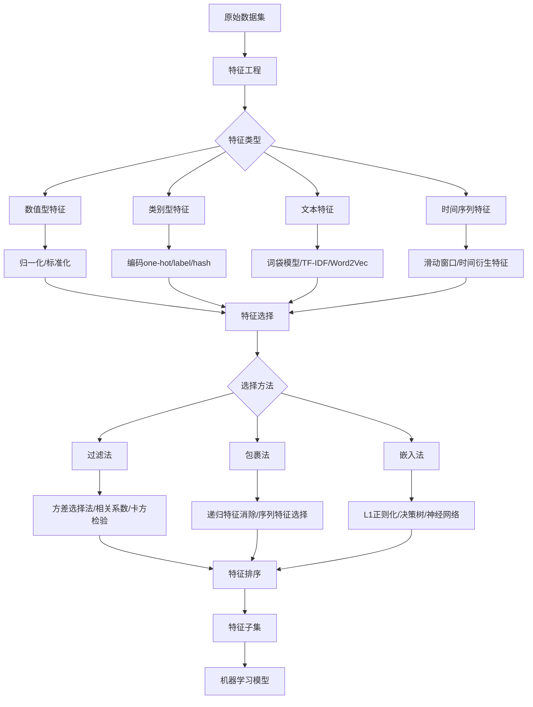

# 数据集的艺术：特征工程与特征选择

## 1. 背景介绍

在机器学习和数据挖掘领域,数据集的质量直接影响着模型的性能。而数据集的质量,很大程度上取决于数据的特征表示。特征工程和特征选择是数据预处理阶段的关键步骤,旨在从原始数据中提取和选择最具有区分性、最相关的特征子集,从而提高模型的性能。

### 1.1 特征工程的重要性

特征工程是将原始数据转换为更好地表示预测模型的潜在问题的特征的过程。好的特征可以提高模型的准确性,减少计算复杂度,增强模型的泛化能力和鲁棒性。相反,糟糕的特征会导致模型性能下降,甚至无法收敛。

### 1.2 特征选择的必要性 

在高维数据集中,特征数量可能非常庞大。但并非所有特征都是有用的,有些特征可能是无关的、冗余的或噪声特征,会降低模型性能。特征选择就是从原有特征中选择一个最具区分性的特征子集的过程,旨在去除无关、冗余的特征,减少特征维度,从而提高模型的性能。

### 1.3 特征工程与特征选择的关系

特征工程和特征选择是相辅相成的。特征工程旨在构建新的特征,而特征选择旨在从现有的特征中选择最佳子集。通常,我们先进行特征工程,然后再进行特征选择。二者相结合,可以得到一个质量更高、维度更低的特征子集,从而训练出性能更优的模型。

## 2. 核心概念与联系

在讨论特征工程和选择的具体方法前,我们先来了解一些核心概念:

### 2.1 特征类型

根据特征取值的不同,可以将特征分为以下几类:

- 数值型特征:取值为连续的实数,例如身高、体重等。
- 类别型特征:取值为不连续的类别,例如性别、血型等。
- 二元特征:取值只有两个,通常为0/1,表示某种属性的有无。
- 文本特征:取值为文本,例如邮件内容、新闻标题等。
- 时间序列特征:取值为一系列随时间变化的数据,例如股票价格、天气温度等。

### 2.2 特征相关性

特征相关性指的是特征之间的相互关系。常见的相关性有:

- 线性相关:两个特征呈线性关系,例如身高和体重。
- 非线性相关:两个特征呈非线性关系,例如房价和房屋面积。
- 多重共线性:多个特征之间存在线性关系,可以用更少的特征来表示。

### 2.3 特征冗余性

如果两个特征具有很高的相关性,那么它们所包含的信息就有很大的重叠,即存在信息冗余。冗余的特征会增加计算开销,而且有可能降低模型的泛化能力。因此,需要在特征选择阶段去除冗余特征。

### 2.4 特征重要性

特征重要性衡量了每个特征对于模型性能的贡献程度。基于特征重要性的排序,可以选择出最具有区分性的特征子集。常见的特征重要性评估方法有:

- 过滤法:如方差选择法、卡方检验等,根据某种统计指标对特征进行排序。
- 包裹法:将特征选择看作一个子集搜索问题,用某种准则评估特征子集的质量,如递归特征消除法等。
- 嵌入法:将特征选择与模型训练过程结合,如L1正则化、决策树等。

下图展示了特征工程与特征选择的主要流程:

## 3. 核心算法原理与具体步骤

### 3.1 特征工程

#### 3.1.1 数值型特征处理

对于数值型特征,常用的处理方法有:

- 归一化:将特征值缩放到[0,1]区间内,公式为:
  
$$x' = \frac{x - min(x)}{max(x) - min(x)}$$

- 标准化:将特征值缩放到均值为0、方差为1的分布中,公式为:

$$x' = \frac{x - \mu}{\sigma}$$

其中,$\mu$为特征的均值,$\sigma$为特征的标准差。

- 分箱:将连续特征离散化,例如等宽分箱、等频分箱等。

- 对数变换:对数值范围很大的特征取对数,可以将数据分布压缩到较小的范围内。

- 多项式特征:构造一些高阶的非线性特征,例如$x^2$,$\sqrt{x}$等。

#### 3.1.2 类别型特征处理

对于类别型特征,常用的处理方法有:

- One-Hot编码:为每个类别生成一个二元特征。

- Label Encoding:将类别映射为一个整数。

- Frequency Encoding:用类别的出现频率替换类别特征。

- Hash Encoding:用哈希函数将类别映射到一个固定长度的特征向量。

#### 3.1.3 文本特征处理

对于文本特征,常用的处理方法有:

- 词袋模型:将文本表示为其中单词的出现频率向量。

- TF-IDF:在词袋模型的基础上,考虑了词在文档中的重要性和在语料库中的稀有程度。

- Word2Vec:通过神经网络学习单词的低维稠密向量表示,捕捉单词之间的语义关系。

- 主题模型:如LDA,将文本映射到一些潜在主题上。

#### 3.1.4 时间序列特征处理

对于时间序列特征,常用的处理方法有:

- 滑动窗口:提取一段时间窗口内的统计量,如均值、方差等。

- 时间衍生特征:提取一些时间相关的特征,如周期、趋势等。

- 频域分析:对时间序列进行傅立叶变换,提取频域特征。

### 3.2 特征选择

#### 3.2.1 过滤法 

过滤法根据特征本身的统计特性来评估特征的重要性,常用方法有:

- 方差选择法:选择方差大于阈值的特征。

- 相关系数法:计算每个特征与目标变量的相关系数,选择相关系数大于阈值的特征。

- 卡方检验:评估每个特征与目标变量的相关性,选择卡方统计量大于阈值的特征。

- 互信息:评估每个特征与目标变量的互信息,选择互信息大于阈值的特征。

过滤法的步骤如下:

1. 计算每个特征的统计量(如方差、相关系数等)。
2. 根据阈值筛选特征,得到特征排序。
3. 选择排名前k的特征作为特征子集。

#### 3.2.2 包裹法

包裹法将特征选择看作一个搜索问题,用某种准则评估特征子集的质量,然后选择最优子集。常用方法有:

- 递归特征消除(RFE):递归地训练模型,每次消除若干最不重要的特征,直到达到所需的特征数量。

- 序列特征选择:根据某种准则(如交叉验证分数)来评估特征子集,然后用启发式搜索算法(如前向搜索、后向搜索等)来搜索最优子集。

包裹法的步骤如下:

1. 定义子集搜索策略(如前向搜索、后向搜索等)。
2. 定义子集评估准则(如交叉验证分数)。
3. 用搜索算法搜索最优子集。
4. 返回最优子集作为选择结果。

#### 3.2.3 嵌入法

嵌入法将特征选择与模型训练过程结合,同时完成特征选择和模型训练。常见方法有:

- L1正则化:在目标函数中加入L1正则化项,使得学习到的模型参数是稀疏的,参数为0的特征即被视为无用特征。

- 决策树:根据特征对目标变量的信息增益或基尼指数来评估特征重要性。

- 神经网络:用神经网络训练模型,根据连接权重来评估特征重要性。

嵌入法的步骤如下:

1. 定义带有嵌入特征选择的模型(如L1正则化线性模型、决策树等)。
2. 在训练数据上训练模型。
3. 根据模型参数或特征重要性度量来评估特征重要性。
4. 选择重要性高的特征作为特征子集。

## 4. 数学模型与公式详解

### 4.1 方差选择法

方差选择法计算每个特征的方差,然后根据阈值筛选方差大的特征。特征$X_i$的方差$Var(X_i)$定义为:

$$Var(X_i) = \frac{1}{n}\sum_{j=1}^n(x_{ij} - \mu_i)^2$$

其中,$\mu_i$为特征$X_i$的均值:

$$\mu_i = \frac{1}{n}\sum_{j=1}^nx_{ij}$$

### 4.2 相关系数法

相关系数法计算每个特征与目标变量的皮尔逊相关系数,然后根据阈值筛选相关系数大的特征。特征$X_i$与目标变量$Y$的皮尔逊相关系数$\rho(X_i,Y)$定义为:

$$\rho(X_i,Y) = \frac{Cov(X_i,Y)}{\sqrt{Var(X_i)Var(Y)}}$$

其中,$Cov(X_i,Y)$为$X_i$和$Y$的协方差:

$$Cov(X_i,Y) = \frac{1}{n}\sum_{j=1}^n(x_{ij} - \mu_i)(y_j - \mu_y)$$

### 4.3 卡方检验

卡方检验评估每个特征与目标变量的相关性。对于特征$X_i$,其卡方统计量$\chi^2$定义为:

$$\chi^2 = \sum_{c=1}^{C}\sum_{k=1}^{K}\frac{(A_{ck} - E_{ck})^2}{E_{ck}}$$

其中,$C$为目标变量的类别数,$K$为特征$X_i$的取值数,$A_{ck}$为$X_i=k$且$Y=c$的样本数,$E_{ck}$为$X_i=k$且$Y=c$的期望样本数,可由下式估计:

$$E_{ck} = \frac{(\sum_{c=1}^CA_{ck})(\sum_{k=1}^KA_{ck})}{n}$$

### 4.4 互信息

互信息评估每个特征与目标变量的相关性。特征$X_i$与目标变量$Y$的互信息$I(X_i;Y)$定义为:

$$I(X_i;Y) = \sum_{x\in X_i}\sum_{y\in Y}p(x,y)log\frac{p(x,y)}{p(x)p(y)}$$

其中,$p(x)$为$X_i=x$的边缘概率,$p(y)$为$Y=y$的边缘概率,$p(x,y)$为$X_i=x$且$Y=y$的联合概率,可通过频率估计得到。

### 4.5 递归特征消除

递归特征消除(RFE)算法的步骤如下:

1. 训练模型,得到每个特征的重要性。
2. 去除若干最不重要的特征。
3. 在剩余特征上重复步骤1和2,直到达到所需的特征数量