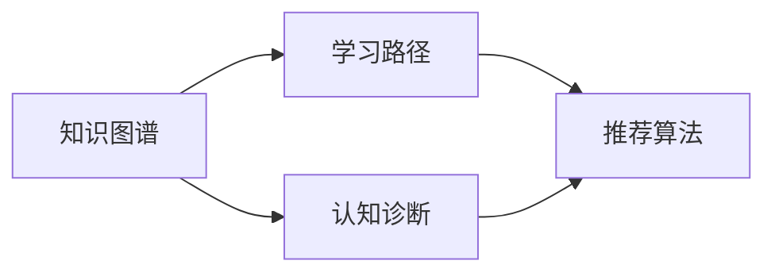

# 智能学习系统学习功能的设计与实现

## 1. 背景介绍

在当今信息技术飞速发展的时代,智能学习系统已成为教育领域的一个重要研究方向。智能学习系统通过引入人工智能技术,能够为学习者提供个性化、自适应的学习体验,极大地提高学习效率。作为智能学习系统的核心功能之一,学习功能的设计与实现对于整个系统的性能和用户体验有着至关重要的影响。

本文将深入探讨智能学习系统学习功能的设计与实现,从核心概念出发,详细阐述相关算法原理、数学模型,并给出具体的代码实例。同时,本文还将讨论学习功能在实际应用场景中的价值,介绍相关工具和资源,展望未来发展趋势与挑战。

### 1.1 智能学习系统概述
#### 1.1.1 定义与特点  
#### 1.1.2 发展历程
#### 1.1.3 关键技术

### 1.2 学习功能的重要性
#### 1.2.1 个性化学习
#### 1.2.2 自适应学习
#### 1.2.3 提高学习效率

## 2. 核心概念与联系

要设计和实现智能学习系统的学习功能,首先需要理解几个核心概念及其之间的联系。

### 2.1 知识图谱
知识图谱是智能学习系统的重要组成部分,它以结构化的方式表示领域知识,为学习功能提供了坚实的知识基础。知识图谱通常由概念(Concept)、关系(Relation)和实例(Instance)三个基本元素组成。

### 2.2 学习路径
学习路径指的是学习者在学习过程中所经历的一系列知识点或学习活动的序列。合理的学习路径能够帮助学习者循序渐进地掌握知识,提高学习效率。学习路径的生成需要综合考虑学习者的知识水平、学习目标、认知特点等因素。

### 2.3 认知诊断
认知诊断旨在准确评估学习者对知识点的掌握程度,发现其知识缺陷。通过对学习者的学习行为数据进行分析,认知诊断模型能够推断出学习者对每个知识点的掌握情况,为个性化学习提供依据。

### 2.4 推荐算法
推荐算法是实现个性化学习的关键技术之一。通过分析学习者的学习行为、兴趣爱好等数据,推荐算法能够为学习者推荐最合适的学习资源和学习路径,满足其个性化学习需求。

下图展示了上述核心概念之间的联系:

## 3. 核心算法原理具体操作步骤

智能学习系统学习功能的实现离不开多种人工智能算法的支持。下面将重点介绍几种核心算法的原理和具体操作步骤。

### 3.1 知识追踪算法
知识追踪(Knowledge Tracing)算法用于动态地评估学习者对知识点的掌握情况。其基本思想是根据学习者对一系列问题的作答情况,利用概率模型推断其对每个知识点的掌握概率。

#### 3.1.1 贝叶斯知识追踪(BKT)
BKT是一种经典的知识追踪算法,它假设每个知识点都有"已掌握"和"未掌握"两种状态,并用隐马尔可夫模型(HMM)对学习过程进行建模。BKT的具体操作步骤如下:

1. 定义模型参数:
   - $P(L_0)$:学习者初始已掌握知识点的概率
   - $P(T)$:未掌握知识点的情况下回答正确的概率(猜测概率)  
   - $P(S)$:已掌握知识点的情况下回答错误的概率(失误概率)
   - $P(G)$:学习者在做题过程中掌握知识点的概率(学习概率)

2. 根据学习者的作答序列,使用前向算法计算每个时刻学习者掌握知识点的概率:

$$
P(L_n|O_1,\dots,O_n)=\frac{P(L_n,O_1,\dots,O_n)}{P(O_1,\dots,O_n)}
$$

其中,$L_n$表示第$n$时刻学习者是否掌握知识点,$O_n$表示第$n$道题的作答情况。

3. 根据计算得到的掌握概率值,判断学习者对知识点的掌握情况,并据此调整学习路径。

#### 3.1.2 深度知识追踪(DKT)
DKT是一种基于深度学习的知识追踪算法,它使用循环神经网络(RNN)对学习过程进行建模。与BKT相比,DKT能够捕捉知识点之间的复杂关系,具有更强的表达能力。DKT的具体操作步骤如下:

1. 将学习者的作答序列表示为向量,每个向量包含题目ID和作答结果(正确/错误)两个部分。

2. 使用RNN(通常选择LSTM或GRU)对作答序列进行编码,得到每个时刻的隐藏状态$h_t$:

$$
h_t=RNN(x_t,h_{t-1})
$$

其中,$x_t$为第$t$道题的输入向量。

3. 将隐藏状态$h_t$通过全连接层映射到知识点掌握概率:

$$
P(L_{t,i}|x_1,\dots,x_t)=\sigma(W_ih_t+b_i)
$$

其中,$L_{t,i}$表示第$t$时刻学习者对第$i$个知识点的掌握情况,$W_i$和$b_i$为全连接层的参数。

4. 使用交叉熵损失函数对模型进行训练,不断更新模型参数,使预测结果尽可能接近真实情况。

### 3.2 学习路径规划算法
学习路径规划算法旨在根据学习者的知识水平和学习目标,自动生成最优的学习路径。常见的学习路径规划算法包括基于知识图谱的启发式搜索算法和基于强化学习的算法。

#### 3.2.1 基于知识图谱的启发式搜索算法
该算法利用知识图谱表示领域知识,通过启发式搜索策略寻找最优学习路径。具体操作步骤如下:

1. 构建知识图谱,将知识点表示为节点,知识点之间的依赖关系表示为有向边。

2. 根据学习者的当前知识水平,在知识图谱中标注出已掌握的知识点。

3. 根据学习者的学习目标,在知识图谱中标注出目标知识点。

4. 使用启发式搜索算法(如A*算法)在知识图谱中搜索从当前知识点到目标知识点的最短路径,同时考虑知识点的难度、重要性等因素。

5. 将搜索得到的路径作为推荐的学习路径,引导学习者按照该路径进行学习。

#### 3.2.2 基于强化学习的学习路径规划算法
该算法将学习路径规划问题建模为马尔可夫决策过程(MDP),通过强化学习算法寻找最优策略。具体操作步骤如下:

1. 定义MDP的状态空间、动作空间和奖励函数:
   - 状态:学习者当前的知识水平
   - 动作:选择下一个学习的知识点
   - 奖励:学习者在学习过程中的表现(如作答正确率、学习效率等)

2. 使用值函数方法(如Q-learning)或策略梯度方法(如REINFORCE)对MDP进行求解,得到最优策略$\pi^*$:

$$
\pi^*=\arg\max_{\pi} \mathbb{E}_{\pi}[\sum_{t=0}^{\infty}\gamma^t r_t]
$$

其中,$\gamma$为折扣因子,$r_t$为第$t$步获得的奖励。

3. 根据最优策略$\pi^*$生成学习路径,引导学习者进行学习。在学习过程中不断更新策略,以适应学习者知识水平的变化。

### 3.3 个性化推荐算法
个性化推荐算法用于为学习者推荐最合适的学习资源(如课程、练习题等),以满足其个性化学习需求。常见的个性化推荐算法包括协同过滤算法和基于内容的推荐算法。

#### 3.3.1 协同过滤算法
协同过滤算法基于学习者之间的相似性进行推荐,其基本假设是具有相似兴趣或行为的学习者对学习资源的偏好也相似。协同过滤算法分为基于用户的协同过滤和基于物品的协同过滤两种。

以基于用户的协同过滤为例,其具体操作步骤如下:

1. 计算学习者之间的相似度矩阵$S$,常用的相似度度量方法包括余弦相似度、皮尔逊相关系数等:

$$
S_{ij}=\frac{\sum_{k\in I_{ij}}(R_{ik}-\bar{R}_i)(R_{jk}-\bar{R}_j)}{\sqrt{\sum_{k\in I_{ij}}(R_{ik}-\bar{R}_i)^2}\sqrt{\sum_{k\in I_{ij}}(R_{jk}-\bar{R}_j)^2}}
$$

其中,$I_{ij}$为学习者$i$和$j$共同评分过的学习资源集合,$R_{ik}$为学习者$i$对资源$k$的评分,$\bar{R}_i$为学习者$i$的平均评分。

2. 根据相似度矩阵,为目标学习者生成推荐列表。对于学习者$u$,其对学习资源$i$的预测评分$\hat{R}_{ui}$可通过以下公式计算:

$$
\hat{R}_{ui}=\bar{R}_u+\frac{\sum_{v\in N_u}S_{uv}(R_{vi}-\bar{R}_v)}{\sum_{v\in N_u}|S_{uv}|}
$$

其中,$N_u$为与学习者$u$最相似的$k$个学习者(即$u$的$k$近邻)。

3. 将预测评分最高的学习资源推荐给学习者。

#### 3.3.2 基于内容的推荐算法
基于内容的推荐算法利用学习资源的内容特征进行推荐,其基本假设是学习者倾向于选择与其过去喜欢的学习资源内容相似的资源。

具体操作步骤如下:

1. 对学习资源进行内容特征提取,常用的特征提取方法包括TF-IDF、Word2Vec等。

2. 根据学习者的历史行为数据,构建其偏好向量$P_u$:

$$
P_u=\frac{\sum_{i\in I_u}R_{ui}V_i}{\sum_{i\in I_u}R_{ui}}
$$

其中,$I_u$为学习者$u$访问过的学习资源集合,$R_{ui}$为学习者$u$对资源$i$的隐式评分(如点击、收藏等),$V_i$为资源$i$的特征向量。

3. 计算学习资源与学习者偏好向量之间的相似度,常用的相似度度量方法包括余弦相似度、Jaccard相似度等。

4. 将与学习者偏好最相似的学习资源推荐给学习者。

## 4. 数学模型和公式详细讲解举例说明

本节将通过具体的例子,详细讲解智能学习系统学习功能中涉及的几个关键数学模型和公式。

### 4.1 BKT模型详解
以一个包含3个知识点(A,B,C)的学习任务为例,假设某学习者的作答序列如下:

| 题目 | 知识点 | 作答结果 |
|------|--------|----------|
| 1    | A      | 正确     |
| 2    | B      | 错误     |
| 3    | A      | 正确     |
| 4    | C      | 错误     |
| 5    | B      | 正确     |

根据BKT模型,我们需要估计每个知识点的以下参数:

- $P(L_0)$:学习者初始已掌握知识点的概率
- $P(T)$:未掌握知识点的情况下回答正确的概率(猜测概率)
- $P(S)$:已掌握知识点的情况下回答错