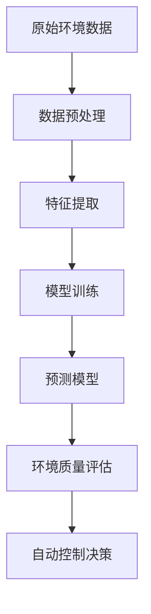
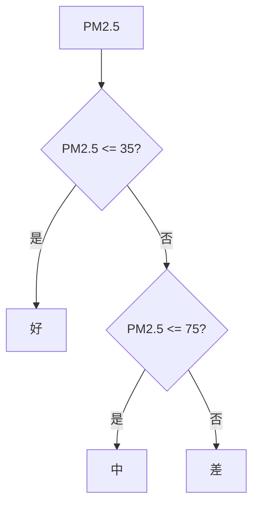

# 智能家居环境质量分析系统的设计与实现

## 1. 背景介绍

### 1.1 智能家居概述

随着物联网、人工智能和大数据等技术的不断发展,智能家居已成为现代生活方式的一个重要组成部分。智能家居系统通过将各种智能设备连接到家庭网络,实现对家居环境的自动化控制和优化,提高生活质量和能源利用效率。

### 1.2 环境质量的重要性

居住环境对人体健康和生活质量有着深远的影响。空气质量、温湿度、光照、噪音等因素都会影响人们的身心状态。因此,对家居环境质量进行实时监测和分析,并根据分析结果自动调节环境参数,对于创造舒适、健康的居住环境至关重要。

### 1.3 现有系统的不足

目前,大多数智能家居系统仅关注设备控制,缺乏对环境质量的全面监测和分析能力。一些专门的环境监测系统往往成本较高,且缺乏智能化的分析和调节功能。因此,需要一种集成化的智能系统,能够实现低成本的环境质量监测、智能分析和自动调节。

## 2. 核心概念与联系

### 2.1 环境质量指标

环境质量主要包括以下几个关键指标:

- **空气质量**:包括PM2.5、PM10、CO2、TVOC等污染物浓度。
- **温湿度**:包括温度和相对湿度。
- **光照**:包括光照强度和光谱分布。
- **噪音**:包括噪音分贝值和频谱分布。

### 2.2 传感器网络

传感器网络是实现环境质量监测的基础。它由多个传感器节点组成,每个节点集成了不同类型的传感器,用于采集相应的环境数据。这些节点通过无线通信协议(如ZigBee、Wi-Fi等)相互连接,形成覆盖整个家居环境的监测网络。

### 2.3 大数据分析

通过传感器网络采集到大量的环境数据,需要利用大数据分析技术对这些数据进行处理和挖掘,发现隐藏其中的模式和规律。常用的分析方法包括时间序列分析、聚类分析、回归分析等。

### 2.4 机器学习

机器学习算法可以从历史数据中自动学习环境质量的影响因素及其相互关系,构建预测模型。常用的算法包括决策树、支持向量机、神经网络等。通过模型预测,可以提前发现潜在的环境质量问题,并采取相应的调节措施。

### 2.5 自动控制

根据环境质量分析结果,系统可以自动控制各种家居设备(如空调、新风系统、窗帘等),调节环境参数,达到优化环境质量的目的。控制算法需要综合考虑能耗、用户偏好等多个因素,实现舒适性和能效的平衡。

## 3. 核心算法原理具体操作步骤

智能家居环境质量分析系统的核心算法包括数据预处理、特征提取、模型训练和预测四个主要步骤,具体操作流程如下:



### 3.1 数据预处理

1) **数据清洗**:剔除传感器故障或通信错误导致的异常数据。
2) **缺失值处理**:使用插值法或机器学习模型估计缺失值。
3) **数据标准化**:将不同量纲的数据统一转换到相同的数值范围。

### 3.2 特征提取

1) **时间特征**:提取数据的时间戳、小时、周期等时间特征,捕捉环境质量的周期性变化规律。
2) **统计特征**:计算数据的统计量(均值、方差、分位数等),反映数据的分布情况。
3) **频域特征**:对时间序列数据进行傅里叶变换,提取频域特征,发现周期性模式。

### 3.3 模型训练

1) **监督学习**:利用带有环境质量标签的历史数据,训练分类或回归模型,预测未来的环境质量状态。常用模型包括决策树、随机森林、支持向量机等。
2) **无监督学习**:对环境数据进行聚类分析,发现潜在的环境质量模式,用于异常检测和根因分析。
3) **时间序列分析**:建立环境质量的时间序列模型(如ARIMA、LSTM等),捕捉数据的动态变化趋势,进行预测。

### 3.4 预测与评估

1) **模型预测**:将新的环境数据输入到训练好的模型中,预测未来的环境质量状态。
2) **评估指标**:使用准确率、F1分数、均方根误差等指标,评估模型的预测性能。
3) **模型更新**:定期使用新的数据对模型进行重新训练,提高预测精度。

## 4. 数学模型和公式详细讲解举例说明

### 4.1 线性回归模型

线性回归是一种常用的监督学习算法,可用于建立环境质量指标与影响因素之间的线性关系模型。假设环境质量指标 $y$ 与 $n$ 个影响因素 $x_1,x_2,...,x_n$ 的关系为:

$$y = \beta_0 + \beta_1x_1 + \beta_2x_2 + ... + \beta_nx_n + \epsilon$$

其中 $\beta_0, \beta_1, ..., \beta_n$ 为模型参数, $\epsilon$ 为随机误差项。通过最小二乘法,可以估计出模型参数的值,使得预测值 $\hat{y}$ 与实际值 $y$ 的残差平方和最小:

$$\min \sum_{i=1}^{m}(y_i - \hat{y_i})^2 = \min \sum_{i=1}^{m}(y_i - \beta_0 - \beta_1x_{i1} - ... - \beta_nx_{in})^2$$

其中 $m$ 为训练样本的数量。

例如,对于室内PM2.5浓度预测,可以将温度、湿度、开窗时长等作为影响因素,建立线性回归模型:

$$\text{PM2.5} = 10.5 + 0.8\times\text{温度} - 1.2\times\text{湿度} + 3.7\times\text{开窗时长}$$

根据该模型,可以预测在给定温度、湿度和开窗时长条件下,室内PM2.5浓度的大致水平。

### 4.2 决策树模型

决策树是一种常用的分类和回归模型,可以根据特征值对样本进行分层决策,最终得到预测结果。决策树的构建过程如下:

1) 从根节点开始,对于每个节点,根据特征值将样本分成两个或多个子集。
2) 对于每个子集,重复上一步骤,直到满足停止条件(如样本足够纯或达到最大深度)。
3) 生成决策树的叶节点,每个叶节点对应一个预测值或类别。

决策树模型可以用于环境质量分类预测。例如,根据PM2.5浓度将空气质量分为好、中、差三个等级,决策树模型可能如下所示:



在上述模型中,当PM2.5浓度小于等于35时,空气质量被预测为"好";当PM2.5浓度大于35且小于等于75时,空气质量被预测为"中";当PM2.5浓度大于75时,空气质量被预测为"差"。

### 4.3 时间序列模型

时间序列模型可以捕捉环境质量数据的动态变化趋势,对未来进行预测。常用的时间序列模型包括自回归移动平均模型(ARIMA)和长短期记忆神经网络(LSTM)等。

#### ARIMA模型

ARIMA模型由三个部分组成:自回归(AR)部分、移动平均(MA)部分和差分(I)部分。对于一个时间序列 $\{X_t\}$,其ARIMA(p,d,q)模型可表示为:

$$X_t = c + \phi_1X_{t-1} + ... + \phi_pX_{t-p} + \theta_1\epsilon_{t-1} + ... + \theta_q\epsilon_{t-q} + \epsilon_t$$

其中:
- $p$ 是自回归项的阶数
- $d$ 是差分的阶数
- $q$ 是移动平均项的阶数
- $\phi_1,...,\phi_p$ 是自回归系数
- $\theta_1,...,\theta_q$ 是移动平均系数
- $\epsilon_t$ 是白噪声序列

通过对历史数据进行ARIMA模型拟合,可以预测未来的环境质量数据。

#### LSTM模型

长短期记忆神经网络(LSTM)是一种常用的循环神经网络,可以有效捕捉时间序列数据的长期依赖关系。LSTM网络的核心是记忆单元,它通过控制门机制来决定何时保留、更新或忘记记忆单元中的信息。

对于一个时间序列 $\{X_t\}$,LSTM模型可以表示为:

$$\begin{aligned}
f_t &= \sigma(W_f\cdot[h_{t-1}, x_t] + b_f) \\
i_t &= \sigma(W_i\cdot[h_{t-1}, x_t] + b_i) \\
\tilde{C}_t &= \tanh(W_C\cdot[h_{t-1}, x_t] + b_C) \\
C_t &= f_t\odot C_{t-1} + i_t\odot\tilde{C}_t \\
o_t &= \sigma(W_o\cdot[h_{t-1}, x_t] + b_o) \\
h_t &= o_t\odot\tanh(C_t)
\end{aligned}$$

其中:
- $f_t$ 是遗忘门,控制遗忘记忆单元中的信息
- $i_t$ 是输入门,控制更新记忆单元中的信息
- $\tilde{C}_t$ 是候选记忆单元
- $C_t$ 是当前记忆单元
- $o_t$ 是输出门,控制输出记忆单元中的信息
- $h_t$ 是当前隐藏状态

通过训练LSTM模型,可以学习到环境质量时间序列数据的内在规律,并对未来进行预测。

## 5. 项目实践:代码实例和详细解释说明

以下是一个使用Python和相关库实现智能家居环境质量分析系统的示例代码,包括数据采集、预处理、模型训练和预测等步骤。

### 5.1 数据采集

```python
import paho.mqtt.client as mqtt

# MQTT代理服务器地址
broker_address = "localhost"

# 创建MQTT客户端实例
client = mqtt.Client()

# 连接MQTT代理服务器
client.connect(broker_address)

# 定义回调函数,处理接收到的环境数据
def on_message(client, userdata, msg):
    # 解析消息主题和数据
    topic = msg.topic
    payload = msg.payload.decode()
    
    # 处理环境数据
    process_env_data(topic, payload)

# 订阅环境数据主题
client.subscribe("env_data/#")

# 设置消息回调函数
client.on_message = on_message

# 保持客户端运行,持续接收数据
client.loop_forever()
```

在上述代码中,我们使用MQTT协议从传感器网络中采集环境数据。首先,创建MQTT客户端实例并连接到MQTT代理服务器。然后,定义一个回调函数`on_message`来处理接收到的环境数据消息。最后,订阅相关主题并设置回调函数,保持客户端运行以持续接收数据。

### 5.2 数据预处理

```python
import pandas as pd
from sklearn.preprocessing import StandardScaler

# 读取环境数据CSV文件
env_data = pd.read_csv('env_data.csv')

# 处理缺失值
env_data = env_data.interpolate()

# 提取时间特征
env_data['hour'] = env_data['timestamp'].dt.hour
env_data['weekday'] = env_data['timestamp'].dt.weekday

# 标准化数据
scaler = StandardSc