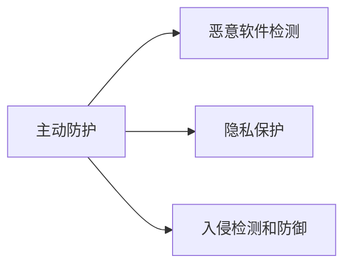
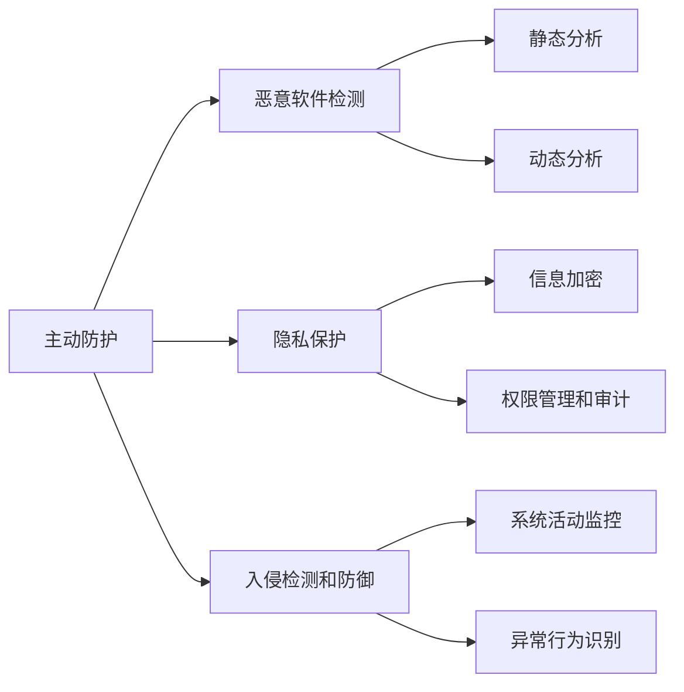

## 1.背景介绍

智能手机已经成为我们日常生活中不可或缺的一部分，它不仅仅是通讯工具，更是我们获取信息、娱乐、购物、办公等各种活动的重要平台。然而，随着智能手机功能的日益增强，安全问题也日益突出。恶意软件、钓鱼网站、信息泄露等问题层出不穷，对用户的个人信息安全构成了严重威胁。因此，如何设计和实现一个能够主动防护，有效保护用户信息安全的智能手机安全系统，成为了当前亟待解决的问题。

## 2.核心概念与联系

设计和实现智能手机主动安全防护系统，需要理解和掌握以下几个核心概念：

- **主动防护**：与传统的被动防护不同，主动防护是指安全系统能够主动识别和阻止安全威胁，而不是等待威胁发生后再进行应对。

- **恶意软件检测**：恶意软件是威胁智能手机安全的主要因素之一，恶意软件检测是通过分析软件行为和代码，识别并阻止恶意软件的技术。

- **隐私保护**：隐私保护是指保护用户的个人信息不被非法获取和使用，这包括通信隐私、位置隐私、设备信息隐私等。

- **入侵检测和防御**：入侵检测是通过监控系统活动，识别异常行为和攻击模式，防止或减轻安全威胁的影响。

这些核心概念之间的联系，在于共同构成了智能手机主动防护系统的基础架构。恶意软件检测、隐私保护和入侵检测防御等技术，都是为了实现主动防护的目标。



## 3.核心算法原理具体操作步骤

设计和实现智能手机主动安全防护系统，主要包括以下几个步骤：

1. **恶意软件检测**：首先，通过静态分析和动态分析相结合的方法，对手机中的应用软件进行检测。静态分析主要是分析软件的代码，动态分析则是在软件运行时，监控其行为。通过这两种方法，可以有效识别恶意软件。

2. **隐私保护**：对于用户的个人信息，如通信记录、位置信息、设备信息等，采取加密存储和传输的方法，防止信息被非法获取。同时，对于请求获取这些信息的应用，进行严格的权限管理和审计。

3. **入侵检测和防御**：通过实时监控系统活动，使用机器学习等技术，建立正常行为模型，识别异常行为和攻击模式。一旦检测到入侵行为，立即启动防御机制，阻止或减轻安全威胁的影响。

4. **主动防护**：基于以上步骤，构建主动防护机制。这包括定期自动检测恶意软件，实时保护用户隐私，及时响应安全威胁等。



## 4.数学模型和公式详细讲解举例说明

在设计和实现智能手机主动安全防护系统中，我们可以利用一些数学模型和算法来提高系统的效率和准确性。例如，在恶意软件检测中，我们可以使用机器学习算法来自动识别恶意软件。

假设我们有一个训练数据集，其中每个样本由一个特征向量$x$和一个标签$y$组成。特征向量$x$描述了一个应用的行为或属性，标签$y$表示该应用是否为恶意软件。我们的目标是学习一个函数$f(x)$，使得对于任意一个新的应用，我们都可以通过$f(x)$来预测它是否为恶意软件。

这可以通过最小化以下损失函数来实现：

$$
L(f) = \sum_{i=1}^{n} l(y_i, f(x_i)) + \lambda \|f\|^2
$$

其中，$l(y_i, f(x_i))$是损失函数，用来衡量预测值$f(x_i)$和真实标签$y_i$之间的差距；$\|f\|^2$是函数$f$的复杂度，用来防止过拟合；$\lambda$是一个超参数，用来控制模型的复杂度。

## 5.项目实践：代码实例和详细解释说明

下面，我们来看一个简单的恶意软件检测的例子。我们将使用Python的scikit-learn库来实现一个基于逻辑回归的恶意软件检测模型。

```python
from sklearn.linear_model import LogisticRegression
from sklearn.model_selection import train_test_split
from sklearn.metrics import accuracy_score

# 假设我们已经有了特征向量X和标签y
X_train, X_test, y_train, y_test = train_test_split(X, y, test_size=0.2, random_state=42)

# 创建逻辑回归模型
model = LogisticRegression()

# 训练模型
model.fit(X_train, y_train)

# 使用模型进行预测
y_pred = model.predict(X_test)

# 计算预测的准确率
accuracy = accuracy_score(y_test, y_pred)
print('Accuracy: ', accuracy)
```

在这个例子中，我们首先将数据集分为训练集和测试集。然后，我们创建一个逻辑回归模型，并使用训练集来训练这个模型。最后，我们使用测试集来评估模型的性能。

## 6.实际应用场景

智能手机主动安全防护系统在很多场景中都有应用。例如，对于个人用户，他们可以使用这个系统来保护自己的手机不受恶意软件的侵害，保护自己的个人信息不被泄露。对于企业用户，他们可以使用这个系统来保护公司的商业信息和客户数据。

此外，智能手机主动安全防护系统也可以与其他系统集成，提供更全面的安全保护。例如，它可以与移动支付系统、社交网络应用、电子商务平台等集成，为用户提供安全的网络环境。

## 7.工具和资源推荐

以下是一些在设计和实现智能手机主动安全防护系统时可能会用到的工具和资源：

- **Python**：Python是一种广泛用于数据分析和机器学习的编程语言。它有丰富的库和框架，如scikit-learn、TensorFlow等，可以方便地实现各种算法。

- **Android Studio**：Android Studio是Google官方的Android应用开发工具。它提供了各种功能，如代码编辑、调试、性能优化等，可以帮助开发者更高效地开发Android应用。

- **Wireshark**：Wireshark是一个网络协议分析器，可以用来捕获和分析网络流量。它可以帮助我们理解网络通信的细节，识别可能的安全威胁。

## 8.总结：未来发展趋势与挑战

随着智能手机的普及和功能的增强，智能手机安全问题将更加突出。智能手机主动安全防护系统的设计和实现，将是一个持续的挑战。在未来，我们需要面对以下几个方面的挑战：

1. **新型恶意软件的检测**：随着攻击者技术的进步，恶意软件也在不断变化和进化。如何有效检测新型恶意软件，是一个重要的挑战。

2. **隐私保护**：随着用户对隐私保护的关注度提高，如何在保护用户隐私的同时，提供个性化的服务，是一个需要平衡的问题。

3. **系统性能**：随着手机功能的增强，安全系统也需要处理更多的数据和任务。如何在保证安全的同时，不影响系统的性能和用户体验，是一个重要的问题。

尽管面临挑战，但我相信，通过不断的研究和创新，我们一定能够设计出更加安全、高效的智能手机主动安全防护系统。

## 9.附录：常见问题与解答

1. **Q: 智能手机主动安全防护系统会影响手机的性能吗?**
   
   A: 设计好的安全防护系统会尽量减少对手机性能的影响。例如，它可以在手机空闲时进行恶意软件检测，或者使用优化的算法来减少计算量。

2. **Q: 我应该如何选择一个好的智能手机主动安全防护系统?**
   
   A: 选择一个好的安全防护系统，你应该考虑以下几个因素：它是否可以有效检测恶意软件；它是否可以保护你的个人信息；它是否会影响你的手机性能；它的用户评价如何。

3. **Q: 我可以自己开发一个智能手机主动安全防护系统吗?**
   
   A: 如果你有足够的编程和信息安全知识，你完全可以尝试自己开发一个安全防护系统。但需要注意的是，这是一个复杂的任务，需要花费大量的时间和精力。

作者：禅与计算机程序设计艺术 / Zen and the Art of Computer Programming