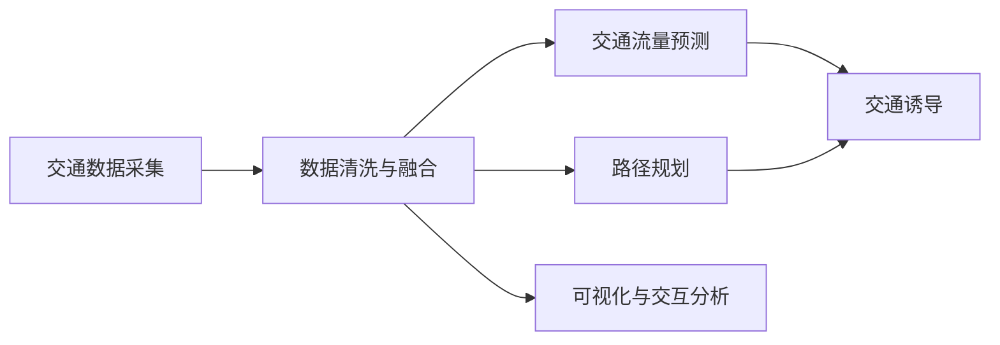
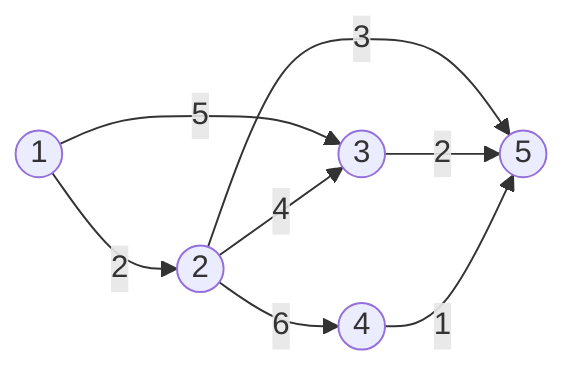

# 智能道路交通信息管理系统详细设计与具体代码实现

## 1.背景介绍
### 1.1 智慧交通的发展现状
随着城市化进程的加快,城市道路交通问题日益突出,交通拥堵、交通事故频发、交通污染严重等问题亟待解决。为了应对这些挑战,智慧交通应运而生。智慧交通是利用先进的信息技术、数据通信传输技术、电子传感技术、控制技术及计算机技术等,对整个交通运输系统进行实时、高效、协同的管理,是未来交通系统发展的必然趋势。

### 1.2 智能交通信息管理系统的必要性
智能交通信息管理系统是智慧交通的核心组成部分,通过对海量交通数据的采集、传输、存储、挖掘和分析,为交通管理部门和广大出行者提供及时、准确、全面的交通信息服务,有效缓解交通拥堵,提高交通效率,保障交通安全。因此,开发一套功能完备、性能优异、易于扩展的智能交通信息管理系统具有十分重要的意义。

### 1.3 系统目标与功能需求
本文旨在设计并实现一个智能道路交通信息管理系统,该系统具备以下主要目标和功能:
1. 实时采集各种交通传感器数据,包括车流量、平均速度、交通事件等。
2. 对采集的海量异构数据进行清洗、存储、索引,便于后续高效查询和分析。
3. 融合多源异构交通数据,提供交通流量预测、路径规划、诱导屏信息发布等核心功能。
4. 提供直观友好的可视化界面,支持地图展示和多维交互式数据分析。
5. 提供开放的API接口,便于与其他系统对接集成,实现数据共享。

## 2.核心概念与联系
### 2.1 交通数据采集
交通数据采集是系统的基础,通过在道路上布设各种传感器,如线圈车辆检测器、视频车辆检测器、微波雷达、RFID等,实时采集车辆通过、排队长度、平均速度等数据。数据采集的准确性和实时性直接影响后续功能的实现效果。

### 2.2 数据清洗与融合
原始采集的交通数据通常夹杂着大量噪声和异常值,需要进行数据清洗,剔除无效脏数据。同时,来自不同传感器的异构数据要进行时空对齐和语义映射,融合成一致的数据表示,为后续数据分析提供统一的数据视图。

### 2.3 交通流量预测
交通流量预测对于交通诱导、信号配时优化等至关重要。通过对历史数据的深度挖掘,结合实时交通状态数据,利用时间序列分析、机器学习等算法构建流量预测模型,对未来一段时间内的交通流量进行预估。

### 2.4 路径规划
路径规划是根据道路实时交通状况和出行者的需求,为其规划一条最优出行路径,以最小化出行时间或成本。路径规划算法通常基于图论算法,如Dijkstra、A*搜索等,并引入实时路况和拥堵预测对算法进行改进提升。

### 2.5 交通诱导
交通诱导是通过信息发布屏、导航软件、广播等途径,将路径规划、交通预测的结果传递给出行者,引导车流合理分布,缓解局部拥堵。及时准确的交通诱导可显著提升道路通行效率。

### 2.6 可视化与交互分析
海量交通数据蕴含着丰富的时空特征和潜在规律,需要借助数据可视化技术将其直观地呈现出来,便于管理人员和公众直观理解。同时,通过友好的交互方式支持用户自定义的多维数据分析,挖掘数据价值。

下图展示了智能交通信息管理系统的核心概念之间的关联:


## 3.核心算法原理具体操作步骤
### 3.1 数据清洗算法
数据清洗主要包括缺失值处理、异常值检测、噪声去除等步骤:
1. 统计各数据字段的缺失率,对于缺失率较低的可以直接删除,缺失率较高的可以考虑使用插值、回归、机器学习等方法进行数据填补。
2. 基于统计方法(如3-σ原则)或基于距离的方法(如LOF局部异常因子)识别异常值,将其剔除或修正。
3. 对于噪声数据,可使用平滑滤波(如移动平均、中值滤波、卡尔曼滤波)、小波分析等信号处理方法进行去噪。

### 3.2 交通流量预测算法
交通流量预测可分为以下几个步骤:
1. 特征工程:从历史数据中构建特征向量,通常包括时间特征(如小时、星期等)、历史流量、天气等。
2. 数据集划分:将数据划分为训练集和测试集,注意要考虑数据的时间序列特性,避免数据泄露。
3. 模型训练:常用的流量预测模型有ARIMA、SVR、LSTM神经网络等,通过模型超参数选择、交叉验证等方法对模型进行优化。
4. 模型评估:使用MAE、MAPE、RMSE等指标评估模型在测试集上的预测效果。
5. 模型应用:使用训练好的模型对新的实时数据进行预测。

### 3.3 路径规划算法
Dijkstra算法是最经典的单源最短路径算法,其基本步骤如下:
1. 初始化:将起点s的距离设为0,其他所有点的距离设为无穷大。
2. 创建一个优先队列Q,将所有节点插入Q。
3. 循环直到Q为空:
   a. 取出Q中距离最小的节点u。
   b. 对u的所有邻居v,如果s到v的距离大于s到u的距离加上u到v的距离,则进行松弛操作,更新s到v的距离,并更新Q。
4. 最终得到起点s到其他所有点的最短距离。

在考虑动态路况时,需要在松弛操作时动态更新边权值。同时,可以引入A*搜索等启发式方法进一步提升寻路效率。

## 4.数学模型和公式详细讲解举例说明
### 4.1 交通流量预测模型
以ARIMA模型为例,ARIMA(p,d,q)模型可表示为:

$$(1-\sum_{i=1}^p \phi_i B^i)(1-B)^d X_t = (1+\sum_{i=1}^q \theta_i B^i)\varepsilon_t$$

其中,$X_t$为时间序列,$B$为滞后算子,$\varepsilon_t$为白噪声,$\phi_i$和$\theta_i$为模型参数,$p$、$d$、$q$分别为自回归阶数、差分阶数和移动平均阶数。

模型的关键是要确定最优的$p$、$d$、$q$值。通常采用Box-Jenkins方法,基本步骤如下:
1. 平稳性检测:通过ADF检验等方法判断原始序列是否平稳,若不平稳则需要进行d阶差分。
2. 模型识别:根据自相关系数(ACF)和偏自相关系数(PACF)的拖尾和截尾性质识别p和q的阶数。
3. 模型估计:使用最大似然估计、最小二乘法等方法估计模型参数。
4. 模型诊断:对残差进行白噪声检验,若不通过则需要重新指定模型。
5. 模型应用:使用通过诊断的模型进行预测。

例如,对于某路段每小时的交通流量数据,经过平稳性检测发现需要进行一阶差分。接着通过ACF和PACF图发现PACF在lag 2后截尾,ACF呈现拖尾性,因此可以选择ARIMA(2,1,0)模型。然后通过最小二乘法估计AR(2)模型的参数$\phi_1$和$\phi_2$,代入公式即可得到流量预测值。

### 4.2 路径规划模型
以Dijkstra算法为例,设图G=(V,E),其中V为节点集,E为边集。定义节点s到节点v的最短距离为d(v),初始化d(s)=0,其他d(v)=∞。

Dijkstra算法的数学描述为:
$$
d(v)=
\begin{cases}
0, & v=s \\
\min\limits_{u\in V} \{d(u)+w(u,v)\}, & v\neq s
\end{cases}
$$

其中,w(u,v)为边(u,v)的权值。

算法过程可用如下的迭代公式表示:

$$d_i(v)=\min\{d_{i-1}(v), \min\limits_{u\in V} \{d_{i-1}(u)+w(u,v)\}\}$$

其中,$d_i(v)$表示第i次迭代时s到v的最短距离。

例如,对于如下的加权有向图:



以节点1为起点,Dijkstra算法的执行过程如下:

| Iteration | d(1) | d(2) | d(3) | d(4) | d(5) |
|-----------|------|------|------|------|------|
| Init      | 0    | ∞    | ∞    | ∞    | ∞    |
| 1         | 0    | 2    | 5    | ∞    | ∞    |
| 2         | 0    | 2    | 5    | 8    | 5    |
| 3         | 0    | 2    | 5    | 7    | 5    |
| 4         | 0    | 2    | 5    | 7    | 5    |

最终得到从节点1到其他各节点的最短距离为d(2)=2,d(3)=5,d(4)=7,d(5)=5。

## 5.项目实践:代码实例和详细解释说明
下面以Python为例,给出智能交通信息管理系统的部分核心代码实现。

### 5.1 数据清洗
```python
import pandas as pd
import numpy as np
from sklearn.impute import KNNImputer
from scipy.stats import zscore

# 读取数据
data = pd.read_csv('traffic_data.csv')

# 缺失值填充
imputer = KNNImputer(n_neighbors=5)
data_filled = imputer.fit_transform(data)

# 异常值检测与处理
z = zscore(data_filled)
data_cleaned = data_filled[(z < 3).all(axis=1)]

# 数据平滑
data_smoothed = pd.DataFrame(data_cleaned).rolling(window=10, min_periods=1).mean()
```

这段代码首先使用KNN插值法对缺失值进行填补,然后基于z-score方法识别并剔除异常值,最后采用移动平均的方式对数据进行平滑去噪。

### 5.2 交通流量预测
```python
import statsmodels.api as sm

# 创建ARIMA模型
model = sm.tsa.ARIMA(data_smoothed, order=(2,1,0))
result = model.fit()

# 模型诊断
print(result.summary())
residuals = result.resid
sm.stats.durbin_watson(residuals)

# 交通流量预测
pred = result.forecast(steps=10)
```

这段代码使用statsmodels库创建了一个ARIMA(2,1,0)模型,通过拟合历史数据得到模型参数。接着对模型残差进行白噪声检验,最后使用训练好的模型对未来10个时间步的交通流量进行预测。

### 5.3 路径规划
```python
import heapq

def dijkstra(graph, start):
    distances = {vertex: float('inf') for vertex in graph}
    distances[start] = 0
    pq = [(0, start)]

    while pq:
        current_distance, current_vertex = heapq.heappop(pq)
        if current_distance > distances[current_vertex]:
            continue
        
        for neighbor, weight in graph[current_vertex].items():
            distance = current_distance + weight
            if distance < distances[neighbor]:
                distances[neighbor] = distance
                heapq.heappush(pq, (distance, neighbor