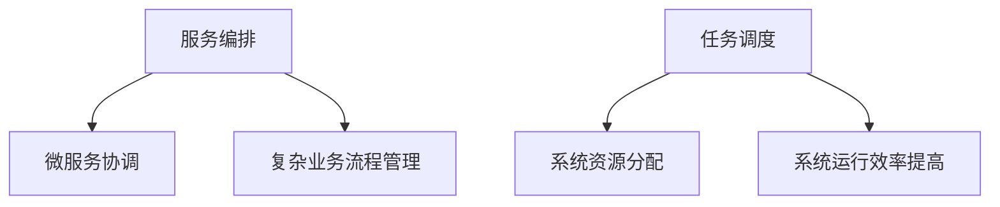

## 1.背景介绍

在当今的微服务架构中，服务编排和任务调度已经成为了一个不可或缺的组成部分。为了处理复杂的业务流程，我们需要对多个微服务进行协调和管理，这就涉及到了服务编排。而任务调度则是为了确保系统资源的合理利用，按照一定的策略将任务分配给具有相应资源的节点，从而提高系统的整体效率。

## 2.核心概念与联系

服务编排和任务调度虽然是两个不同的概念，但是它们在实际的应用中是密切相关的。服务编排是指通过对多个微服务的协调和管理，以实现复杂的业务流程。而任务调度则是为了合理地分配和管理系统的资源，提高系统的运行效率。



## 3.核心算法原理具体操作步骤

### 3.1 服务编排

服务编排通常需要通过编写一些特定的规则或者策略来实现，这些规则或者策略可以是一些简单的逻辑，也可以是一些复杂的算法。例如，我们可以通过编写一些规则来实现服务的自动发现和注册，或者通过编写一些策略来实现服务的负载均衡和熔断。

### 3.2 任务调度

任务调度则需要通过一些算法来实现，这些算法通常需要考虑到系统的资源情况，以及任务的优先级、依赖关系等因素。例如，我们可以通过最小化资源浪费的算法来实现任务的调度，或者通过最大化系统吞吐量的算法来实现任务的调度。

## 4.数学模型和公式详细讲解举例说明

在任务调度中，我们通常会使用一些数学模型和公式来描述和解决问题。例如，我们可以使用二分图模型来描述任务和资源的关系，然后使用匈牙利算法来寻找最优的任务调度方案。

假设我们有n个任务和m个资源，我们可以通过一个n*m的矩阵A来描述任务和资源的关系，其中A[i][j]表示任务i和资源j之间的权重。我们的目标是找到一个任务调度方案，使得所有任务的权重之和最大。

这个问题可以通过匈牙利算法来解决。匈牙利算法的基本思想是通过不断地寻找增广路径来改进当前的匹配，直到找不到增广路径为止。

匈牙利算法的具体步骤如下：

1. 初始化一个空的匹配M。
2. 在剩余的未匹配的任务中，选择一个任务i，寻找一个增广路径P。
3. 如果找到了增广路径P，那么就将P中的边加入匹配M，然后返回步骤2。
4. 如果没有找到增广路径P，那么就结束算法。

匈牙利算法可以通过以下的公式来描述：

$$
M = \emptyset
$$

$$
\text{while } \exists i \in \text{Tasks} \text{ s.t. } i \notin M \text{ do}
$$

$$
\text{Find an augmenting path } P \text{ for } i
$$

$$
\text{if } P \text{ exists, then } M = M \oplus P
$$

$$
\text{end while}
$$

其中，$\oplus$表示对匹配和增广路径的对称差运算。

## 5.项目实践：代码实例和详细解释说明

下面我们通过一个简单的代码示例来说明如何实现服务编排和任务调度。

```python
# 服务编排
class ServiceOrchestration:
    def __init__(self):
        self.services = {}

    def register(self, name, service):
        self.services[name] = service

    def execute(self, name, *args, **kwargs):
        if name in self.services:
            return self.services[name](*args, **kwargs)

# 任务调度
class TaskScheduler:
    def __init__(self):
        self.tasks = []

    def add_task(self, task):
        self.tasks.append(task)

    def schedule(self):
        self.tasks.sort(key=lambda task: task.priority)
        for task in self.tasks:
            task.execute()
```

在这个示例中，我们首先定义了一个服务编排类，这个类可以注册和执行服务。然后，我们定义了一个任务调度类，这个类可以添加和调度任务。在调度任务时，我们按照任务的优先级进行排序，然后依次执行任务。

## 6.实际应用场景

服务编排和任务调度在很多实际的应用场景中都有广泛的应用。例如，在云计算中，我们需要通过服务编排来管理和协调各种云服务，以实现复杂的业务流程。而在大数据处理中，我们需要通过任务调度来合理地分配和管理系统的资源，以提高系统的运行效率。

## 7.工具和资源推荐

目前，有很多优秀的工具和资源可以帮助我们实现服务编排和任务调度。例如，Kubernetes是一个开源的容器编排平台，它可以帮助我们管理和协调容器服务。而Apache Mesos是一个开源的分布式系统内核，它可以帮助我们实现大规模的任务调度。

## 8.总结：未来发展趋势与挑战

随着微服务架构的广泛应用，服务编排和任务调度的重要性也日益显现。然而，如何实现高效、灵活、可靠的服务编排和任务调度，仍然是一个具有挑战性的问题。未来，我们期待有更多的研究和技术能够解决这个问题，以推动微服务架构的发展。

## 9.附录：常见问题与解答

Q: 服务编排和任务调度有什么区别？

A: 服务编排主要是对多个微服务进行协调和管理，以实现复杂的业务流程。而任务调度则是为了合理地分配和管理系统的资源，提高系统的运行效率。

Q: 如何实现服务编排？

A: 服务编排通常需要通过编写一些特定的规则或者策略来实现，这些规则或者策略可以是一些简单的逻辑，也可以是一些复杂的算法。

Q: 如何实现任务调度？

A: 任务调度则需要通过一些算法来实现，这些算法通常需要考虑到系统的资源情况，以及任务的优先级、依赖关系等因素。

作者：禅与计算机程序设计艺术 / Zen and the Art of Computer Programming