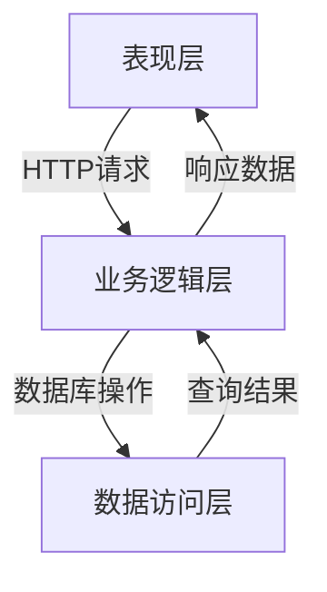
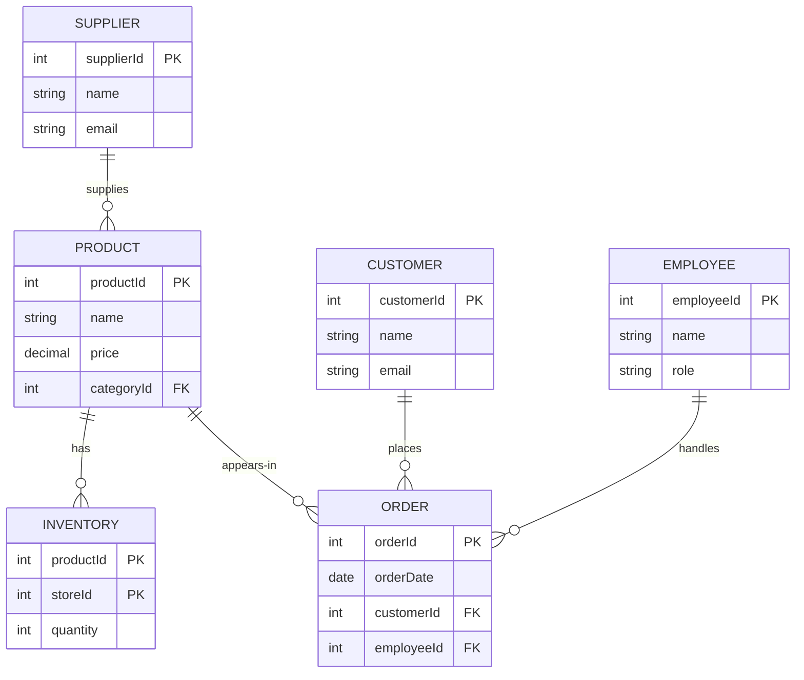

# 服装专卖店管理系统详细设计与具体代码实现

## 1. 背景介绍

### 1.1 服装零售行业概况

服装零售行业是一个庞大且不断增长的市场。随着人们生活水平的提高和时尚意识的增强,对服装的需求也与日俱增。然而,传统的服装零售模式面临着诸多挑战,例如库存管理困难、缺乏个性化服务和线上线下渠道割裂等问题。因此,构建一个高效、智能的服装专卖店管理系统势在必行。

### 1.2 系统需求分析

服装专卖店管理系统需要满足以下核心需求:

- 库存管理:实时监控库存水平,自动生成补货订单。
- 销售管理:记录销售数据,分析销售趋势。
- 客户管理:建立客户资料,提供个性化服务。
- 供应链管理:与供应商协调,确保货源稳定。
- 财务管理:记录收支情况,生成财务报表。
- 员工管理:管理员工信息,分配工作任务。

## 2. 核心概念与联系

### 2.1 系统架构

服装专卖店管理系统采用三层架构设计,包括表现层(前端)、业务逻辑层(后端)和数据访问层。



### 2.2 核心模块

系统由以下几个核心模块组成:

- **库存管理模块**: 负责监控库存水平,生成补货订单。
- **销售管理模块**: 记录销售数据,分析销售趋势。
- **客户管理模块**: 维护客户资料,提供个性化服务。
- **供应链管理模块**: 管理供应商信息,协调货源供给。
- **财务管理模块**: 记录收支情况,生成财务报表。
- **员工管理模块**: 管理员工信息,分配工作任务。

### 2.3 数据模型

系统使用关系型数据库存储数据,核心数据模型如下:



## 3. 核心算法原理具体操作步骤

### 3.1 库存补货算法

库存补货算法负责监控库存水平,当库存量低于预设阈值时自动生成补货订单。算法步骤如下:

1. 获取所有商品的当前库存量。
2. 对每种商品,计算其库存量与预设最低库存阈值的差值。
3. 如果差值小于0,则生成一个补货订单,订单数量为预设最低库存阈值与当前库存量之差。
4. 将生成的补货订单发送给相应的供应商。

```python
def restock_inventory(inventory, min_threshold):
    restock_orders = []
    for product_id, quantity in inventory.items():
        if quantity < min_threshold:
            restock_qty = min_threshold - quantity
            order = RestockOrder(product_id, restock_qty)
            restock_orders.append(order)
    return restock_orders
```

### 3.2 个性化推荐算法

个性化推荐算法根据客户的购买历史和偏好,推荐感兴趣的商品。算法步骤如下:

1. 获取客户的购买记录和浏览记录。
2. 计算客户对每个商品类别的偏好分数。
3. 从高偏好分数的商品类别中,选取客户未购买过的商品作为推荐列表。
4. 根据商品的销量和评分,对推荐列表进行排序。

```python
def recommend_products(customer_id, purchase_history, view_history):
    category_scores = calculate_category_scores(purchase_history, view_history)
    recommended_products = []
    for category, score in category_scores.items():
        unseen_products = get_unseen_products(customer_id, category)
        recommended_products.extend(unseen_products)
    recommended_products.sort(key=lambda p: (p.sales, p.rating), reverse=True)
    return recommended_products[:10]
```

## 4. 数学模型和公式详细讲解举例说明

### 4.1 库存管理模型

在库存管理中,我们需要确定最优库存水平,以平衡库存成本和缺货成本。我们可以使用经济订货量(EOQ)模型来计算最优订货量。

EOQ模型的公式如下:

$$EOQ = \sqrt{\frac{2DC}{H}}$$

其中:
- $D$ 是年度需求量
- $C$ 是每次订货的固定成本
- $H$ 是每单位商品的年度库存持有成本

例如,某商品年度需求量为10000件,每次订货固定成本为100元,每件商品的年度库存持有成本为2元。那么,最优订货量为:

$$EOQ = \sqrt{\frac{2 \times 10000 \times 100}{2}} = 1000 \text{ (件)}$$

因此,该商品的最优订货量是1000件。

### 4.2 销售预测模型

为了更好地管理库存和供应链,我们需要预测未来的销售量。我们可以使用时间序列分析方法,如移动平均法或指数平滑法,来预测未来销售量。

移动平均法的公式如下:

$$\overline{x}_t = \frac{1}{n}\sum_{i=1}^{n}x_{t-i+1}$$

其中:
- $\overline{x}_t$ 是时间 $t$ 的移动平均值
- $n$ 是移动平均的时间窗口大小
- $x_{t-i+1}$ 是时间 $t-i+1$ 的实际值

例如,我们要预测未来一个月的销售量,并使用过去3个月的数据进行移动平均。假设过去3个月的销售量分别为100、120和90,则未来一个月的预测销售量为:

$$\overline{x}_4 = \frac{1}{3}(100 + 120 + 90) = 103.33$$

因此,预测的未来一个月销售量为103.33件。

## 5. 项目实践: 代码实例和详细解释说明

### 5.1 表现层: React前端

我们使用React框架构建服装专卖店管理系统的前端。以下是一个简单的商品列表组件示例:

```jsx
import React, { useState, useEffect } from 'react';
import axios from 'axios';

const ProductList = () => {
  const [products, setProducts] = useState([]);

  useEffect(() => {
    const fetchProducts = async () => {
      const response = await axios.get('/api/products');
      setProducts(response.data);
    };
    fetchProducts();
  }, []);

  return (
    <div>
      <h2>Product List</h2>
      <ul>
        {products.map(product => (
          <li key={product.id}>{product.name} - ${product.price}</li>
        ))}
      </ul>
    </div>
  );
};

export default ProductList;
```

在这个示例中,我们使用 `useState` 钩子来管理组件的状态,使用 `useEffect` 钩子在组件挂载时从后端获取商品列表数据。我们使用 `axios` 库发送 HTTP 请求,并将响应数据存储在组件状态中。最后,我们使用 JSX 语法渲染商品列表。

### 5.2 业务逻辑层: Node.js后端

我们使用 Node.js 和 Express 框架构建服装专卖店管理系统的后端。以下是一个简单的商品 API 路由示例:

```javascript
const express = require('express');
const router = express.Router();
const productService = require('../services/productService');

// 获取所有商品
router.get('/', async (req, res) => {
  try {
    const products = await productService.getAllProducts();
    res.json(products);
  } catch (err) {
    res.status(500).json({ message: err.message });
  }
});

// 获取单个商品
router.get('/:id', async (req, res) => {
  try {
    const product = await productService.getProductById(req.params.id);
    if (product) {
      res.json(product);
    } else {
      res.status(404).json({ message: 'Product not found' });
    }
  } catch (err) {
    res.status(500).json({ message: err.message });
  }
});

module.exports = router;
```

在这个示例中,我们定义了两个 API 路由:一个用于获取所有商品,另一个用于获取单个商品。我们使用 `productService` 模块来与数据访问层交互,获取商品数据。如果操作成功,我们将商品数据作为 JSON 响应返回;如果出现错误,我们返回适当的错误状态码和错误消息。

### 5.3 数据访问层: MongoDB

我们使用 MongoDB 作为服装专卖店管理系统的数据库。以下是一个简单的 `productService` 模块示例,用于与 MongoDB 交互:

```javascript
const mongoose = require('mongoose');
const Product = require('../models/Product');

const getAllProducts = async () => {
  try {
    const products = await Product.find();
    return products;
  } catch (err) {
    throw err;
  }
};

const getProductById = async (id) => {
  try {
    const product = await Product.findById(id);
    return product;
  } catch (err) {
    throw err;
  }
};

module.exports = {
  getAllProducts,
  getProductById,
};
```

在这个示例中,我们定义了两个函数 `getAllProducts` 和 `getProductById`,分别用于获取所有商品和获取单个商品。我们使用 Mongoose 库与 MongoDB 交互,执行查询操作。如果查询成功,我们返回查询结果;如果出现错误,我们抛出错误。

## 6. 实际应用场景

服装专卖店管理系统可以应用于各种规模的服装零售企业,包括独立服装店、连锁专卖店和大型服装零售集团。以下是一些典型的应用场景:

### 6.1 独立服装店

独立服装店可以使用该系统来管理库存、销售和客户关系。系统可以帮助店主实时监控库存水平,及时补货,避免缺货或过度库存。同时,系统还可以记录客户信息,为客户提供个性化服务和推荐,增强客户粘性。

### 6.2 连锁专卖店

对于拥有多家分店的连锁专卖店,该系统可以实现集中式管理。总部可以通过系统监控各分店的库存、销售和财务情况,进行统一决策和调配。同时,系统还可以协调供应链,确保货源稳定。

### 6.3 大型服装零售集团

大型服装零售集团通常拥有多个品牌和渠道,包括实体店和电商平台。该系统可以集成各个渠道的数据,实现全渠道销售和库存管理。同时,系统还可以利用大数据分析,洞察消费者偏好,优化产品策略和营销策略。

## 7. 工具和资源推荐

### 7.1 开发工具

- **React**: 用于构建现代化的Web应用程序前端。
- **Node.js**: 用于构建高效、可扩展的Web应用程序后端。
- **Express**: 一个简洁而灵活的Node.js Web应用程序框架。
- **MongoDB**: 一个流行的NoSQL数据库,适合存储非结构化数据。
- **Mongoose**: 一个对象数据建模(ODM)库,用于在Node.js中与MongoDB交互。
- **Postman**: 一个API开发和测试工具,用于测试和调试API。

### 7.2 学习资源

- **React官方文档**: https://reactjs.org/docs/getting-started.html
- **Node.js官方文档**: https://nodejs.org/en/docs/
- **Express官方文档**: https://expressjs.com/
- **MongoDB官方文档**: https://docs.mongodb.com/
- **Mongoose官方文档**: https://mongoosejs.com/docs/
- **MDN Web Docs**: https://developer.mozilla.org/en-US/

## 8. 总结: 未来发展趋势与挑战

### 8.1 人工智能和大数据分析

未来,人工智能和大数据分析将在服装零售行业发挥越来越重要的作用。通过分析历史销售数据和客户行为数据,系