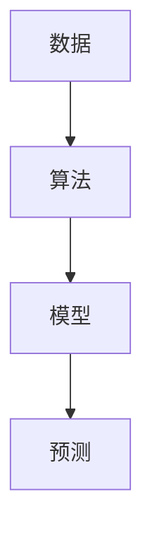

## 1.背景介绍

机器学习，这个词汇近年来越来越频繁地出现在我们的视野中，从搜索引擎到社交媒体，从自动驾驶到智能家居，机器学习已经深入到了我们生活的各个角落。但是，机器学习究竟是什么？它又是如何工作的呢？

机器学习是一种人工智能（AI）的形式，它允许计算机无需进行明确编程就能学习。更具体地说，机器学习是一种数据分析方法，它通过构建模型来使计算机自我学习。这种模型可以被认为是一个预测函数，它试图从一组已知的输入-输出对（也称为训练样本）中学习出一个最佳的映射。

## 2.核心概念与联系

机器学习的核心概念可以分为以下几个部分：

- **数据**：这是机器学习的基础，数据可以是标签的（已知输出），也可以是未标签的（未知输出）。

- **模型**：模型是用来描述数据中隐藏规律的数学表达式，可以是线性的，也可以是非线性的。

- **算法**：算法是用来从数据中学习模型的过程，常见的算法有梯度下降、随机森林等。

- **预测**：预测是利用学习到的模型对新的数据进行输出的过程。

这四个概念之间的关系可以用以下的Mermaid流程图来表示：



## 3.核心算法原理具体操作步骤

接下来，我们以最常见的线性回归为例，介绍机器学习的核心算法原理和具体操作步骤。

线性回归模型的目标是找到一条最佳拟合线，使得所有数据点到这条线的垂直距离之和最小。这个过程可以分为以下几个步骤：

1. **初始化参数**：选择一条初始的直线，通常可以随机选择。

2. **计算误差**：计算所有数据点到当前直线的垂直距离之和，这就是我们要最小化的误差。

3. **更新参数**：根据误差的大小和方向，更新直线的斜率和截距，这个过程通常使用梯度下降算法。

4. **重复步骤2和3**：直到误差达到一个预设的阈值，或者达到预设的迭代次数。

## 4.数学模型和公式详细讲解举例说明

线性回归模型的数学表达式为：$y = ax + b$，其中，$a$是斜率，$b$是截距。

我们的目标是找到最佳的$a$和$b$，使得误差函数$E(a, b) = \sum_{i=1}^{n}(y_i - (ax_i + b))^2$最小，其中，$n$是数据点的数量，$(x_i, y_i)$是第$i$个数据点。

我们可以通过梯度下降算法来找到最佳的$a$和$b$，梯度下降算法的更新公式为：

$$a = a - \alpha \frac{\partial E}{\partial a}$$
$$b = b - \alpha \frac{\partial E}{\partial b}$$

其中，$\alpha$是学习率，它决定了参数更新的步长。

## 5.项目实践：代码实例和详细解释说明

接下来，我们通过一个具体的代码实例来展示如何实现线性回归。

```python
import numpy as np

# 初始化参数
a, b = np.random.rand(), np.random.rand()

# 设置学习率
alpha = 0.01

# 加载数据
X, Y = load_data()

# 迭代1000次
for i in range(1000):
    # 计算预测值
    Y_pred = a * X + b

    # 计算误差
    error = Y - Y_pred

    # 更新参数
    a = a - alpha * np.sum(error * X) / len(X)
    b = b - alpha * np.sum(error) / len(X)
```

## 6.实际应用场景

机器学习在许多实际场景中都有广泛的应用，例如：

- **搜索引擎**：搜索引擎使用机器学习算法来理解用户的查询，提供相关的搜索结果。

- **社交媒体**：社交媒体使用机器学习算法来推荐用户可能感兴趣的内容。

- **自动驾驶**：自动驾驶车辆使用机器学习算法来理解周围的环境，做出决策。

- **智能家居**：智能家居设备使用机器学习算法来理解用户的习惯，自动化执行任务。

## 7.工具和资源推荐

以下是一些学习和使用机器学习的工具和资源推荐：

- **Python**：Python是最受欢迎的机器学习语言，它有许多强大的机器学习库，如Scikit-learn、TensorFlow等。

- **Jupyter Notebook**：Jupyter Notebook是一个交互式的编程环境，它可以让你在一个文档中同时运行代码、查看结果、写笔记。

- **Coursera**：Coursera上有许多优质的机器学习课程，如Andrew Ng的《Machine Learning》。

- **Kaggle**：Kaggle是一个数据科学竞赛平台，你可以在这里找到许多机器学习的项目和数据集。

## 8.总结：未来发展趋势与挑战

机器学习的发展前景广阔，但也面临着许多挑战。一方面，随着计算能力的提升和数据量的增加，我们有可能开发出更复杂、更强大的机器学习模型。另一方面，如何保护用户的隐私、如何避免算法的偏见等问题也越来越受到关注。

## 9.附录：常见问题与解答

1. **问：为什么要使用梯度下降算法？**

答：梯度下降算法是一种优化算法，它可以找到函数的局部最小值。在机器学习中，我们通常需要找到误差函数的最小值，这就是为什么我们要使用梯度下降算法。

2. **问：如何选择学习率？**

答：学习率是一个超参数，它决定了参数更新的步长。学习率的选择需要通过实验来确定，通常，我们会尝试多个不同的学习率，然后选择使得误差最小的那个。

3. **问：机器学习和深度学习有什么区别？**

答：深度学习是机器学习的一个子领域，它主要关注的是神经网络模型，特别是深度神经网络模型。深度学习的主要优点是可以处理更复杂的问题，但它也需要更多的数据和计算资源。

作者：禅与计算机程序设计艺术 / Zen and the Art of Computer Programming