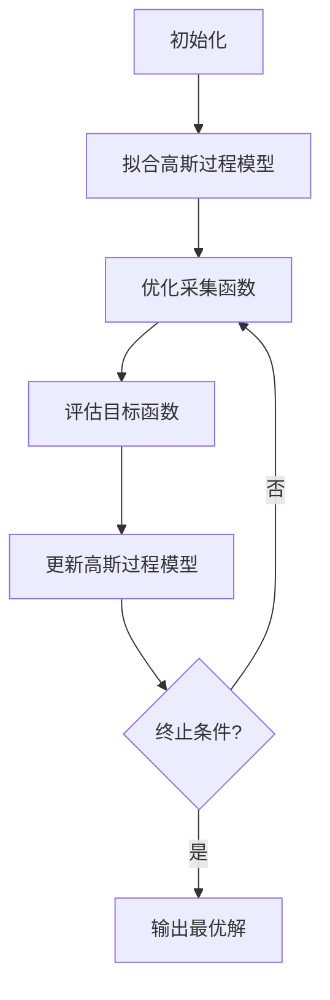

# 机器学习参数的贝叶斯优化

## 1. 背景介绍

### 1.1 机器学习模型的参数调优问题

在机器学习领域中,模型的性能往往取决于超参数的选择。超参数是在模型训练之前设置的参数,它们控制着模型的学习过程,例如学习率、正则化系数、神经网络的层数和节点数等。选择合适的超参数对于获得良好的模型性能至关重要。

然而,超参数空间通常是高维的,并且不同超参数之间存在复杂的相互作用。传统的网格搜索或随机搜索方法效率低下,无法在合理的时间内找到最优解。此外,由于模型训练过程的计算成本很高,我们希望减少不必要的模型评估次数。

### 1.2 贝叶斯优化的优势

贝叶斯优化(Bayesian Optimization)是一种用于解决黑盒优化问题的有效方法,它可以有效地在高维空间中搜索全局最优解。与传统的优化算法相比,贝叶斯优化具有以下优势:

1. **高效性**: 贝叶斯优化通过构建代理模型(如高斯过程)来近似目标函数,从而减少了对目标函数的评估次数,提高了优化效率。
2. **全局优化**: 贝叶斯优化能够在高维空间中搜索全局最优解,而不会陷入局部最优。
3. **鲁棒性**: 贝叶斯优化可以处理噪声数据,对异常值具有一定的鲁棒性。
4. **可解释性**: 贝叶斯优化的过程是可解释的,我们可以了解每一步的决策依据。

由于这些优势,贝叶斯优化已经被广泛应用于机器学习模型的超参数优化、自动机器学习、神经架构搜索等领域。

## 2. 核心概念与联系

### 2.1 贝叶斯优化的基本概念

贝叶斯优化是一种基于贝叶斯理论的序列模型优化方法。它主要由以下三个核心组成部分:

1. **目标函数(Objective Function)**: 需要优化的黑盒函数,通常是机器学习模型的损失函数或评估指标。
2. **代理模型(Surrogate Model)**: 用于近似目标函数的概率模型,常用的是高斯过程(Gaussian Process)。
3. **采集函数(Acquisition Function)**: 基于代理模型和已观测数据,决定下一步应该在哪个点评估目标函数。

贝叶斯优化的基本流程如下:

1. 初始化代理模型,通常使用少量随机采样点。
2. 基于代理模型和采集函数,选择下一个需要评估的候选点。
3. 在选定的候选点评估目标函数,获得新的观测数据。
4. 使用新的观测数据更新代理模型。
5. 重复步骤2-4,直到满足终止条件(如最大迭代次数或预算)。

### 2.2 高斯过程(Gaussian Process)

高斯过程是贝叶斯优化中常用的代理模型。它是一种非参数概率模型,可以对函数进行概率分布建模。高斯过程的优点包括:

1. **灵活性**: 高斯过程可以拟合任意形状的函数,无需事先假设函数的形式。
2. **可解释性**: 高斯过程不仅给出了函数值的预测,还提供了相应的不确定性估计。
3. **闭合性**: 高斯过程具有良好的数学性质,可以方便地进行推理和更新。

高斯过程由均值函数和核函数(协方差函数)参数化。通过观测数据,我们可以估计出高斯过程的参数,从而对目标函数进行建模。

### 2.3 采集函数(Acquisition Function)

采集函数用于权衡探索(Exploration)和利用(Exploitation)之间的平衡。常用的采集函数包括:

1. **期望提升(Expected Improvement, EI)**: 衡量在某个点评估目标函数时,期望的改进量。
2. **预测熵搜索(Predictive Entropy Search, PES)**: 最小化代理模型在下一个评估点的预测熵。
3. **上置信界(Upper Confidence Bound, UCB)**: 在置信区间的上界进行搜索,平衡探索和利用。

不同的采集函数具有不同的特点,适用于不同的优化场景。选择合适的采集函数对于优化性能至关重要。

## 3. 核心算法原理具体操作步骤

### 3.1 高斯过程回归(Gaussian Process Regression)

高斯过程回归是贝叶斯优化中常用的代理模型。它假设目标函数的观测值服从一个高斯过程分布:

$$
f(\mathbf{x}) \sim \mathcal{GP}(m(\mathbf{x}), k(\mathbf{x}, \mathbf{x'}))
$$

其中:

- $m(\mathbf{x})$ 是均值函数,通常设置为零。
- $k(\mathbf{x}, \mathbf{x'})$ 是核函数(协方差函数),用于描述输入之间的相似性。

给定观测数据 $\mathcal{D} = \{(\mathbf{x}_i, y_i)\}_{i=1}^n$,我们可以计算出在新的输入点 $\mathbf{x}_*$ 处的条件预测分布:

$$
f(\mathbf{x}_*) | \mathcal{D}, \mathbf{x}_* \sim \mathcal{N}(\mu(\mathbf{x}_*), \sigma^2(\mathbf{x}_*))
$$

其中:

- $\mu(\mathbf{x}_*)$ 是预测均值,反映了目标函数在 $\mathbf{x}_*$ 处的期望值。
- $\sigma^2(\mathbf{x}_*)$ 是预测方差,反映了预测的不确定性。

通过最大化边际似然估计,我们可以获得核函数的最优超参数。常用的核函数包括径向基函数(RBF)核、Matérn核等。

### 3.2 采集函数优化

在每一步迭代中,贝叶斯优化需要选择下一个最有利的评估点。这个决策过程由采集函数来指导。

#### 3.2.1 期望提升(Expected Improvement)

期望提升(EI)是最常用的采集函数之一。它衡量在某个点 $\mathbf{x}$ 评估目标函数时,期望的改进量:

$$
\alpha_\text{EI}(\mathbf{x}) = \mathbb{E}\left[\max(0, f_\text{min} - f(\mathbf{x}))\right]
$$

其中 $f_\text{min}$ 是当前已观测到的最小函数值。

对于高斯过程,期望提升可以解析求解:

$$
\alpha_\text{EI}(\mathbf{x}) = (\mu(\mathbf{x}) - f_\text{min})\Phi(Z) + \sigma(\mathbf{x})\phi(Z)
$$

其中 $Z = (\mu(\mathbf{x}) - f_\text{min}) / \sigma(\mathbf{x})$, $\Phi(\cdot)$ 和 $\phi(\cdot)$ 分别是标准正态分布的累积分布函数和概率密度函数。

期望提升平衡了探索(通过 $\sigma(\mathbf{x})$ 项)和利用(通过 $\mu(\mathbf{x}) - f_\text{min}$ 项)。

#### 3.2.2 预测熵搜索(Predictive Entropy Search)

预测熵搜索(PES)的目标是最小化代理模型在下一个评估点的预测熵,从而减少对目标函数的不确定性。

对于高斯过程,预测熵可以解析计算:

$$
\alpha_\text{PES}(\mathbf{x}) = \frac{1}{2}\log(2\pi e \sigma^2(\mathbf{x}))
$$

PES 倾向于选择具有较大预测方差的点,从而促进探索行为。

#### 3.2.3 上置信界(Upper Confidence Bound)

上置信界(UCB)采集函数试图在探索和利用之间寻找平衡:

$$
\alpha_\text{UCB}(\mathbf{x}) = \mu(\mathbf{x}) + \kappa \sigma(\mathbf{x})
$$

其中 $\kappa > 0$ 是一个权衡参数,用于控制探索和利用的程度。较大的 $\kappa$ 值会促进更多的探索行为。

UCB 采集函数具有理论保证,可以确保在无限时间内收敛到全局最优解。

在实际应用中,我们可以根据具体问题的特点选择合适的采集函数,或者组合多种采集函数以获得更好的性能。

### 3.3 算法流程

贝叶斯优化的整体算法流程如下:

1. **初始化**:
   - 选择初始观测点集合 $\mathcal{D}_0 = \{(\mathbf{x}_i, y_i)\}_{i=1}^{n_0}$,通常使用少量随机采样点。
   - 使用 $\mathcal{D}_0$ 拟合初始的高斯过程模型。

2. **迭代**:
   - 对于第 $t$ 次迭代:
     1. 基于当前的高斯过程模型和采集函数 $\alpha$,优化下一个评估点:
        $$
        \mathbf{x}_{t+1} = \arg\max_{\mathbf{x}} \alpha(\mathbf{x})
        $$
     2. 在 $\mathbf{x}_{t+1}$ 处评估目标函数,获得新的观测数据 $(\mathbf{x}_{t+1}, y_{t+1})$。
     3. 使用新的观测数据更新高斯过程模型:
        $$
        \mathcal{D}_{t+1} = \mathcal{D}_t \cup \{(\mathbf{x}_{t+1}, y_{t+1})\}
        $$
   - 重复上述步骤,直到满足终止条件(如最大迭代次数或预算)。

3. **输出**:
   - 返回观测到的最小函数值及其对应的输入参数。

该算法流程可以用以下 Mermaid 流程图表示:

## 4. 数学模型和公式详细讲解举例说明

在本节中,我们将详细讲解贝叶斯优化中使用的数学模型和公式,并给出具体的例子说明。

### 4.1 高斯过程(Gaussian Process)

高斯过程是一种非参数概率模型,可以对函数进行概率分布建模。它假设目标函数的观测值服从一个高斯过程分布:

$$
f(\mathbf{x}) \sim \mathcal{GP}(m(\mathbf{x}), k(\mathbf{x}, \mathbf{x'}))
$$

其中:

- $m(\mathbf{x})$ 是均值函数,通常设置为零。
- $k(\mathbf{x}, \mathbf{x'})$ 是核函数(协方差函数),用于描述输入之间的相似性。

常用的核函数包括:

1. **径向基函数(RBF)核**:
   $$
   k_\text{RBF}(\mathbf{x}, \mathbf{x'}) = \sigma_f^2 \exp\left(-\frac{1}{2\ell^2} \|\mathbf{x} - \mathbf{x'}\|^2\right)
   $$
   其中 $\sigma_f^2$ 是信号方差,控制函数值的幅度; $\ell$ 是长度尺度,控制函数的平滑程度。

2. **Matérn核**:
   $$
   k_\text{Matern}(\mathbf{x}, \mathbf{x'}) = \sigma_f^2 \frac{2^{1-\nu}}{\Gamma(\nu)}\left(\sqrt{2\nu}\frac{\|\mathbf{x} - \mathbf{x'}\|}{\ell}\right)^\nu K_\nu\left(\sqrt{2\nu}\frac{\|\mathbf{x} - \mathbf{x'}\|}{\ell}\right)
   $$
   其中 $\nu$ 是平滑度参数,控制函数的差分可导性; $K_\nu(\cdot)$ 是修正的第二类贝塞尔函数。

给定观测数据 $\mathcal{D} = \{(\mathbf{x}_i, y_i)\}_{i=1}^n$,我们可以计算出在新的输入点 $\mathbf{x}_*$ 处的