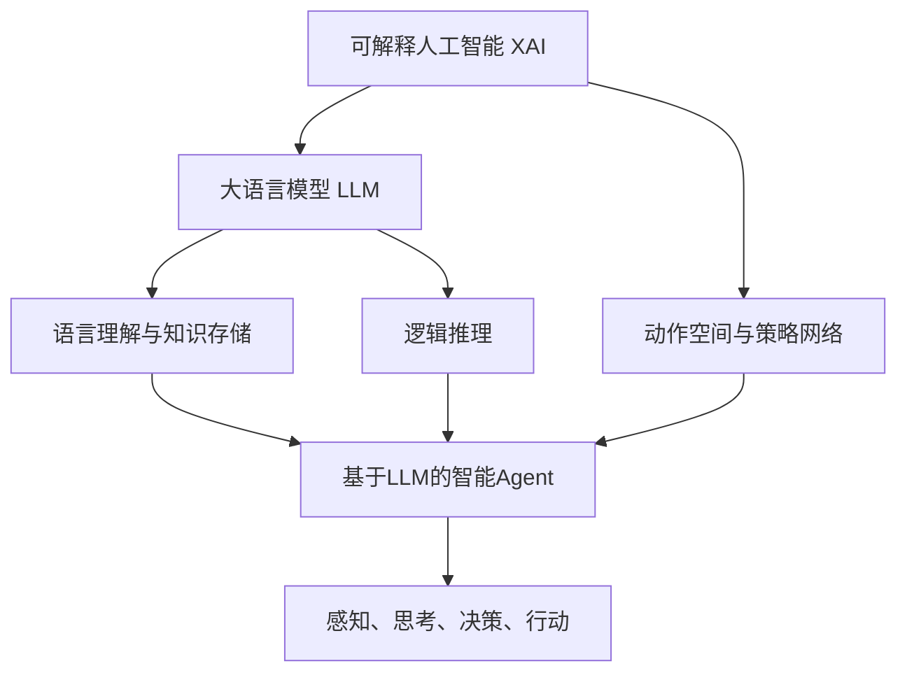

# 构建可解释的LLM-basedAgent：理解AI决策过程

## 1. 背景介绍
### 1.1 大语言模型(LLM)的兴起
近年来,随着深度学习技术的快速发展,大语言模型(Large Language Model, LLM)取得了令人瞩目的成就。从GPT-3到ChatGPT,LLM展现出了强大的自然语言理解和生成能力,在问答、对话、写作等多个任务上达到甚至超越人类的水平。

### 1.2 LLM在智能Agent中的应用
LLM优异的语言理解和生成能力,使其成为构建智能Agent的理想基础模型。许多研究者开始探索将LLM与强化学习、规划等传统AI技术相结合,构建更加智能、通用的Agent。这类基于LLM的Agent,在指令遵循、任务规划、推理决策等方面展现出了初步的能力。

### 1.3 可解释性的重要性
尽管LLM在赋能智能Agent方面展现出了巨大的潜力,但其内部工作机制仍然是一个"黑箱"。我们很难理解LLM是如何理解自然语言、存储知识、进行推理的。对于基于LLM的Agent,我们更需要理解其决策背后的逻辑。这种可解释性,对于我们理解Agent的能力边界、提升其鲁棒性、避免意外行为至关重要。同时,良好的可解释性也是我们信任并采用智能Agent的基础。

### 1.4 本文的主要内容
本文将重点探讨如何构建可解释的、基于大语言模型的智能Agent。我们将从Agent的核心组成出发,分析其内部机理,提出相应的可解释性方法。通过本文,读者将对LLM-based Agent的工作原理有更深入的认识,并掌握一些可解释性的思路和方法。

## 2. 核心概念与联系
### 2.1 大语言模型(LLM)
大语言模型是以自然语言为建模对象的深度神经网络模型。其通过在大规模文本语料上进行自监督学习,习得了丰富的语言知识,具备语言理解和生成的能力。当前主流的LLM包括GPT系列模型、T5、PaLM等。

### 2.2 基于LLM的智能Agent 
基于LLM的智能Agent将大语言模型作为基础模块,并在此之上添加其他组件如动作空间、策略网络、环境模型等,从而使Agent具备感知、思考、决策、行动的完整能力。一些代表性的工作包括InstructGPT、Delphi、WebGPT等。

### 2.3 可解释人工智能
可解释人工智能(Explainable AI, XAI)是一个旨在让AI系统的决策过程对人类可理解、可解释的研究方向。其主要目的是揭示AI系统尤其是深度学习模型的内部工作机制,理解其决策背后的逻辑。常见的可解释性方法包括特征可视化、注意力机制、因果推理等。

### 2.4 核心概念之间的联系
在基于LLM的智能Agent中,大语言模型承担了核心的语言理解、知识存储、逻辑推理等任务。而Agent的其他组件如动作空间、策略网络等,则基于LLM的输出做出最终的决策。因此,对LLM的可解释性分析,是理解整个智能Agent决策过程的基础。同时,Agent的其他组件如策略网络,也需要引入可解释性机制,以实现全面的透明。下图展示了这些核心概念之间的关系:



## 3. 核心算法原理与具体操作步骤
### 3.1 基于注意力机制的LLM可解释性算法
注意力机制是大语言模型的核心组件之一。通过分析LLM各层的注意力分布,我们可以了解模型在做出特定预测时,重点关注输入文本的哪些部分。这为我们提供了一种直观的可解释性。
算法步骤如下:
1. 在LLM的每一层Transformer Block中,提取其自注意力矩阵。
2. 对注意力矩阵进行归一化,得到注意力分布。
3. 将注意力分布与输入的Token进行对齐,生成热力图。
4. 通过热力图分析LLM在生成某个词时,重点关注了哪些上下文词。

### 3.2 基于知识蒸馏的LLM可解释性算法
知识蒸馏是将大模型的知识迁移到小模型的一种技术。通过蒸馏出一个参数量更少的模型,我们可以更容易地分析其内部机制,实现可解释性。
算法步骤如下:  
1. 准备好训练好的大语言模型(Teacher模型)。
2. 构建一个参数量更小的Student模型。
3. 使用Teacher模型的软标签指导Student模型训练。
4. 对训练好的Student模型进行可解释性分析,如可视化其注意力、神经元激活等。
5. 将Student模型的可解释性结果映射回原始的Teacher模型。

### 3.3 基于因果推理的Agent可解释性算法
因果推理可以帮助我们理解智能Agent做出某个决策的原因。通过建立Agent感知、思考、决策、行动各环节的因果关系图,我们可以追溯Agent每个决定的来龙去脉。
算法步骤如下:
1. 在Agent的感知、思考、决策、行动各环节设置因果关系记录点。
2. 运行Agent,在每个记录点记录下相应的输入、输出变量。
3. 依据记录点变量,建立因果关系有向图。
4. 对于Agent的每个决策,从因果图反向追溯其输入源,生成决策解释。
5. 评估决策解释的合理性,必要时对Agent进行改进。

## 4. 数学模型与公式详解
### 4.1 注意力机制的数学模型
Transformer的自注意力机制可以表示为:

$$
Attention(Q,K,V) = softmax(\frac{QK^T}{\sqrt{d_k}})V
$$

其中,$Q$,$K$,$V$分别表示查询、键、值矩阵,$d_k$为键向量的维度。这个公式表达了Transformer如何通过查询与键的相似度,对值进行加权求和。我们可以将$softmax(\frac{QK^T}{\sqrt{d_k}})$视为注意力分布。

举例说明:
假设我们有一个输入序列"I love deep learning"。经过Embedding后得到矩阵$X$。我们取$Q=K=V=X$带入公式,可以得到:

$$
Attention(X,X,X) = softmax(\frac{XX^T}{\sqrt{d_k}})X
$$

通过分析$softmax(\frac{XX^T}{\sqrt{d_k}})$这个注意力矩阵,我们可以看出模型在编码某个词时,重点关注了序列中的哪些词。这就是注意力机制的可解释性。

### 4.2 知识蒸馏的数学模型 
知识蒸馏的目标是最小化Teacher模型和Student模型的预测分布之间的KL散度。用公式表示为:

$$
\mathcal{L}_{KD} = \sum_{i=1}^{N} KL(p_T(y_i|x_i;\tau) || p_S(y_i|x_i;\tau))
$$

其中,$p_T$和$p_S$分别表示Teacher和Student的预测分布,$\tau$是温度超参数,$N$为样本数量。通过最小化这个损失,Student模型可以学到Teacher模型的知识。

举例说明:  
假设我们有一个情感分类任务,类别为"正面"和"负面"。对于某个输入文本$x_i$,Teacher模型的预测概率为$p_T=[0.8,0.2]$,Student模型的预测概率为$p_S=[0.6,0.4]$。带入公式计算$KL(p_T||p_S)$,可以得知两个分布的差异。训练过程就是要最小化这个差异,使Student模型逼近Teacher模型。

### 4.3 因果推理的数学模型
因果推理通常基于结构因果模型(Structural Causal Model, SCM)。一个SCM可以表示为:

$$
\begin{aligned}
x_i &:= f_i(pa_i,u_i) \\
P(u) &= \prod_i P(u_i)
\end{aligned}
$$

其中,$x_i$表示变量,$pa_i$表示其父变量,$u_i$为外生噪声,$f_i$为因果机制函数。这个模型描述了变量之间的因果依赖关系。

举例说明:
假设我们有三个变量:文本情感$S$,用户评分$R$,购买意愿$P$。它们之间的因果关系为:$S\rightarrow R\rightarrow P$。我们可以建立如下的SCM:

$$
\begin{aligned}
S &:= u_S \\
R &:= f_R(S,u_R) \\
P &:= f_P(R,u_P)
\end{aligned}
$$

其中,$u_S$,$u_R$,$u_P$为相互独立的外生噪声。通过这个SCM,我们可以推理购买意愿$P$受到评分$R$和情感$S$的影响。这就是因果推理的基本思想。

## 5. 项目实践:代码实例与详解
下面我们通过一个简单的情感分类任务,演示如何使用Python实现基于注意力机制的LLM可解释性。

### 5.1 数据准备
我们使用IMDb电影评论数据集,其中包含25000条正面评论和25000条负面评论。我们将其划分为训练集和测试集。

```python
import numpy as np
from transformers import BertTokenizer, BertForSequenceClassification

# 加载IMDb数据集
train_texts, train_labels = load_imdb_train()
test_texts, test_labels = load_imdb_test() 

# 初始化BERT Tokenizer和Model
tokenizer = BertTokenizer.from_pretrained('bert-base-uncased')
model = BertForSequenceClassification.from_pretrained('bert-base-uncased')

# 将文本转化为BERT输入
train_encodings = tokenizer(train_texts, truncation=True, padding=True)
test_encodings = tokenizer(test_texts, truncation=True, padding=True)
```

### 5.2 训练与评估
我们使用Hugging Face的Trainer API进行模型的训练和评估。
```python
from transformers import Trainer, TrainingArguments

# 定义训练参数
training_args = TrainingArguments(
    output_dir='./results',          
    num_train_epochs=3,              
    per_device_train_batch_size=16,  
    per_device_eval_batch_size=64,   
    warmup_steps=500,                
    weight_decay=0.01,               
    logging_dir='./logs',            
)

# 定义Trainer
trainer = Trainer(
    model=model,                         
    args=training_args,                  
    train_dataset=train_dataset,         
    eval_dataset=test_dataset            
)

# 训练模型
trainer.train()

# 评估模型
trainer.evaluate()
```

### 5.3 可解释性分析
我们使用IntegratedGradients方法,分析模型对特定样本的预测结果。
```python
from captum.attr import IntegratedGradients

# 定义解释器
ig = IntegratedGradients(model)

# 选择一个样本
text = "This movie is amazing!"
encoding = tokenizer(text, return_tensors='pt')

# 计算属性
attributions = ig.attribute(inputs=encoding['input_ids'],
                            target=1,
                            n_steps=50)

# 可视化解释结果
vis = VisualizationDataRecord(
    word_attributions=attributions,
    pred_prob=pred_prob,
    pred_class=pred_class,
    true_class=true_class,
    attr_class=attr_class,
    attr_score=attr_score,
    raw_input=text,
    convergence_score=ig.has_converged()
)
```

通过可视化attributions,我们可以看出模型在预测"正面"情感时,重点关注了"amazing"这个词。这说明模型已经学会根据关键词判断情感倾向。

## 6. 实际应用场景
可解释的LLM-based Agent在很多实际场景中都有重要应用价值,例如:

### 6.1 智能客服
传统的客服聊天机器人往往只能应对一些常见问题的回复,缺乏灵活性和可解释性。而基于LLM的智能客服Agent,可以根据用户问题,自