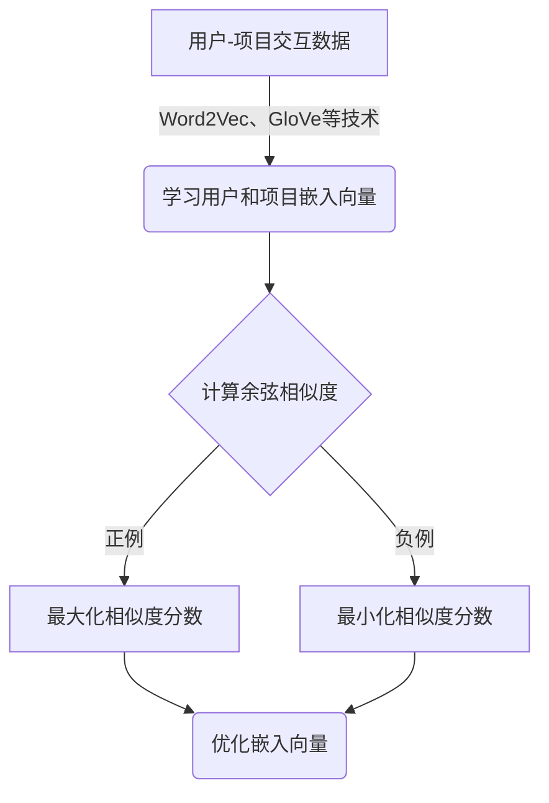

# 构建基于向量的推荐系统：提供个性化用户体验

## 1. 背景介绍

### 1.1 推荐系统的重要性

在当今信息过载的时代，推荐系统已经成为帮助用户发现相关内容和产品的关键工具。无论是在线视频平台、电子商务网站还是社交媒体应用程序,推荐系统都扮演着重要角色,为用户提供个性化的体验。有效的推荐系统不仅能够提高用户满意度和留存率,还能促进业务增长和收入增加。

### 1.2 传统推荐系统的局限性

传统的推荐系统通常基于协同过滤算法,利用用户的历史行为数据(如浏览记录、购买记录等)来预测用户的偏好。然而,这种方法存在一些固有的局限性:

- **冷启动问题**: 对于新用户或新项目,由于缺乏足够的历史数据,难以生成准确的推荐。
- **数据稀疏性**: 在大型系统中,用户-项目交互矩阵通常非常稀疏,导致推荐质量下降。
- **内容冷门问题**: 算法倾向于推荐热门项目,而忽视了长尾内容。

### 1.3 基于向量的推荐系统

基于向量的推荐系统通过将用户和项目映射到同一个向量空间中,从而克服了传统方法的局限性。这种方法利用了自然语言处理(NLP)和机器学习技术,能够更好地捕捉用户偏好和项目语义,从而提供更加个性化和多样化的推荐。

## 2. 核心概念与联系

### 2.1 嵌入向量 (Embedding Vectors)

嵌入向量是将离散对象(如单词、用户或项目)映射到连续向量空间的一种技术。在推荐系统中,我们需要学习用户嵌入向量和项目嵌入向量,以捕捉它们的语义关系。

### 2.2 余弦相似度 (Cosine Similarity)

余弦相似度是一种常用的计算两个向量相似性的方法。在推荐系统中,我们可以通过计算用户嵌入向量和项目嵌入向量之间的余弦相似度来预测用户对该项目的偏好程度。

$$\text{cosine\_similarity}(u, i) = \frac{u \cdot i}{\|u\| \|i\|}$$

其中 $u$ 和 $i$ 分别表示用户嵌入向量和项目嵌入向量。

### 2.3 负采样 (Negative Sampling)

在训练过程中,我们不仅需要最大化用户对已互动项目的相似度分数,还需要最小化用户对未互动项目的相似度分数。负采样是一种常用的技术,通过随机采样一些负例(未互动项目)来加速训练过程。



## 3. 核心算法原理具体操作步骤

基于向量的推荐系统通常采用以下步骤:

1. **数据预处理**: 从原始数据中提取用户-项目交互记录,如浏览记录、购买记录等。
2. **构建语料库**: 将用户和项目视为"单词",构建一个语料库,其中每个"句子"表示一个用户与其交互过的项目序列。
3. **学习嵌入向量**: 使用Word2Vec、GloVe等技术在语料库上训练,学习用户嵌入向量和项目嵌入向量。
4. **计算相似度**: 对于每个用户-项目对,计算它们嵌入向量之间的余弦相似度。
5. **负采样**: 为每个正例(用户已互动的项目)随机采样若干负例(用户未互动的项目)。
6. **优化目标函数**: 最大化正例的相似度分数,最小化负例的相似度分数,通过随机梯度下降等优化算法调整嵌入向量。
7. **生成推荐列表**: 对于每个用户,根据用户嵌入向量与所有项目嵌入向量的相似度,排序并返回最相关的项目作为推荐列表。

## 4. 数学模型和公式详细讲解举例说明

### 4.1 Word2Vec 模型

Word2Vec 是一种流行的词嵌入技术,它可以用于学习用户和项目的嵌入向量。Word2Vec 包含两种模型:连续词袋模型(CBOW)和Skip-Gram模型。

#### 4.1.1 CBOW 模型

CBOW 模型的目标是根据上下文词预测目标词。对于推荐系统,我们可以将用户视为"上下文",项目视为"目标词"。模型的目标是最大化以下条件概率:

$$\mathcal{L} = \frac{1}{T}\sum_{t=1}^{T}\log P(i_t|u_t)$$

其中 $T$ 是语料库中的句子数, $u_t$ 是句子 $t$ 中的用户, $i_t$ 是句子 $t$ 中的项目。

#### 4.1.2 Skip-Gram 模型

Skip-Gram 模型的目标是根据目标词预测上下文词。在推荐系统中,我们可以将项目视为"目标词",用户视为"上下文"。模型的目标是最大化以下条件概率:

$$\mathcal{L} = \frac{1}{T}\sum_{t=1}^{T}\sum_{-c \leq j \leq c, j \neq 0}\log P(u_{t+j}|i_t)$$

其中 $c$ 是上下文窗口大小, $u_{t+j}$ 是项目 $i_t$ 在窗口内的上下文用户。

### 4.2 负采样 (Negative Sampling)

在训练过程中,我们不仅需要最大化用户对已互动项目的相似度分数,还需要最小化用户对未互动项目的相似度分数。负采样是一种常用的技术,通过随机采样一些负例(未互动项目)来加速训练过程。

对于每个正例 $(u, i)$,我们随机采样 $k$ 个负例 $\{i_1^-, i_2^-, \ldots, i_k^-\}$,其中 $i_j^-$ 表示用户 $u$ 未互动的项目。然后,我们最大化以下对数似然函数:

$$\mathcal{L} = \log\sigma(\vec{u}^{\top}\vec{i}) + \sum_{j=1}^{k}\mathbb{E}_{i_j^- \sim P_n(i)}[\log\sigma(-\vec{u}^{\top}\vec{i}_j^-)]$$

其中 $\sigma$ 是 Sigmoid 函数, $\vec{u}$ 和 $\vec{i}$ 分别表示用户嵌入向量和项目嵌入向量, $P_n(i)$ 是负例项目的噪声分布。

通过最大化这个目标函数,我们可以同时提高正例的相似度分数,降低负例的相似度分数,从而学习更好的嵌入向量表示。

### 4.3 举例说明

假设我们有以下用户-项目交互数据:

```
用户A: 浏览了项目1、项目3、购买了项目2
用户B: 浏览了项目2、项目4、购买了项目1
```

我们可以构建如下语料库:

```
句子1: 用户A 项目1 项目3 项目2
句子2: 用户B 项目2 项目4 项目1
```

然后,使用 Word2Vec 技术在这个语料库上训练,学习用户嵌入向量 $\vec{u}_A$、$\vec{u}_B$ 和项目嵌入向量 $\vec{i}_1$、$\vec{i}_2$、$\vec{i}_3$、$\vec{i}_4$。

对于用户 A,我们计算 $\vec{u}_A$ 与所有项目嵌入向量的余弦相似度:

$$\begin{aligned}
\text{score}(A, 1) &= \text{cosine\_similarity}(\vec{u}_A, \vec{i}_1) \\
\text{score}(A, 2) &= \text{cosine\_similarity}(\vec{u}_A, \vec{i}_2) \\
\text{score}(A, 3) &= \text{cosine\_similarity}(\vec{u}_A, \vec{i}_3) \\
\text{score}(A, 4) &= \text{cosine\_similarity}(\vec{u}_A, \vec{i}_4)
\end{aligned}$$

然后,我们根据这些分数对项目进行排序,取前 $N$ 个作为推荐列表。同理,我们可以为用户 B 生成推荐列表。

在训练过程中,我们不仅需要最大化用户 A 对项目 2 的相似度分数,还需要最小化用户 A 对其他未互动项目(如项目 4)的相似度分数。通过负采样和优化目标函数,我们可以学习到更好的嵌入向量表示,从而提高推荐系统的性能。

## 5. 项目实践: 代码实例和详细解释说明

在这一部分,我们将使用 Python 和 TensorFlow 实现一个基于向量的推荐系统。完整代码可以在 [这里](https://github.com/zen-and-the-art-of-computer-programming/vector-based-recommendation-system) 找到。

### 5.1 数据预处理

首先,我们需要从原始数据中提取用户-项目交互记录。假设我们有一个包含用户浏览记录的 CSV 文件 `browsing.csv`:

```
user_id,item_id
1,100
1,203
2,457
2,100
...
```

我们可以使用 Pandas 库读取这个文件,并构建一个用户-项目交互字典:

```python
import pandas as pd

browsing_data = pd.read_csv('browsing.csv')
user_item_dict = {}

for user, item in zip(browsing_data['user_id'], browsing_data['item_id']):
    if user not in user_item_dict:
        user_item_dict[user] = []
    user_item_dict[user].append(item)
```

### 5.2 构建语料库

接下来,我们将用户和项目视为"单词",构建一个语料库,其中每个"句子"表示一个用户与其交互过的项目序列:

```python
corpus = []
for user, items in user_item_dict.items():
    sentence = [str(user)] + [str(item) for item in items]
    corpus.append(sentence)
```

### 5.3 学习嵌入向量

我们使用 TensorFlow 内置的 `tf.keras.layers.Embedding` 层来学习用户和项目的嵌入向量。首先,我们需要构建词汇表:

```python
import tensorflow as tf

# 构建词汇表
vocab = {}
for sentence in corpus:
    for word in sentence:
        if word not in vocab:
            vocab[word] = len(vocab)

# 反转词汇表
reverse_vocab = {idx: word for word, idx in vocab.items()}
```

然后,我们定义一个简单的模型,包含两个嵌入层和一个点积层:

```python
class RecommenderModel(tf.keras.Model):
    def __init__(self, num_users, num_items, embedding_dim):
        super(RecommenderModel, self).__init__()
        self.user_embedding = tf.keras.layers.Embedding(num_users, embedding_dim)
        self.item_embedding = tf.keras.layers.Embedding(num_items, embedding_dim)
        self.dot_product = tf.keras.layers.Dot(axes=(2, 2), normalize=True)

    def call(self, inputs):
        user_ids, item_ids = inputs
        user_embeddings = self.user_embedding(user_ids)
        item_embeddings = self.item_embedding(item_ids)
        return self.dot_product([user_embeddings, item_embeddings])
```

我们使用 Word2Vec 的 Skip-Gram 模型来训练这个模型:

```python
def generate_samples(corpus, window_size=2):
    samples = []
    for sentence in corpus:
        sentence = [vocab[word] for word in sentence]
        for i in range(len(sentence)):
            target = sentence[i]
            context = [sentence[j] for j in range(len(sentence)) if j != i and abs(j - i) <= window_size]
            samples.append((target, context))
    return samples

samples = generate_samples(corpus, window_size=2)

model = RecommenderModel(num_users=len(vocab), num_items=len(vocab), embedding_dim=64)
optimizer = tf.keras.optimizers.Adam(learning_rate=0.001)

for epoch in range(10):
    for target, context in samples:
        with tf.GradientTape() as tape:
            target_embedding = model.item_embedding(tf.constant([target]))
            context_embeddings = model.item_embedding(tf.constant(context))