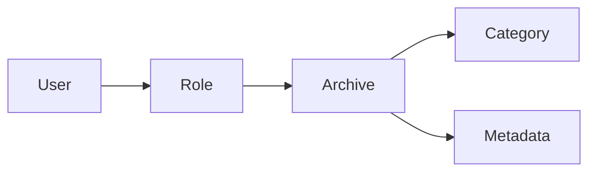

# 档案管理系统详细设计与具体代码实现

## 1.背景介绍

在当今数字化时代,高效管理和利用档案资源已成为各行各业的重要课题。传统的纸质档案管理方式已无法满足现代化企业的需求,因此开发一套功能完善、易于使用的档案管理系统势在必行。本文将详细阐述档案管理系统的设计思路和具体实现过程,为相关领域的研究和实践提供参考。

### 1.1 档案管理的重要性

档案是记录企业或组织历史沿革、反映其职能活动的各种文字、图表、声像等不同形式的材料。科学管理档案不仅可以为企业的决策提供依据,也是维护企业合法权益、传承企业文化的需要。

### 1.2 传统档案管理的局限性

传统的档案管理主要依赖纸质载体和人工方式,存在检索困难、存储空间有限、安全性差等问题,已不能适应信息化时代的要求。因此,开发一套现代化的档案管理系统来克服上述缺陷势在必行。

### 1.3 档案管理系统的目标

档案管理系统旨在实现档案的电子化存储、高效检索、严格权限控制和安全备份等功能,从而提高档案管理的效率和规范性,为企业的管理和决策提供有力支撑。

## 2.核心概念与关联

在设计档案管理系统之前,我们需要明确几个核心概念,并理清它们之间的关联。

### 2.1 档案(Archive)

档案是指由企业或组织在社会活动中直接形成的对本单位有保存价值的各种文字、图表、声像等不同形式的历史记录。它具有真实性、完整性、可用性等特点。在系统中,档案将以电子文件的形式存储。

### 2.2 档案类别(Category)

为了便于管理和检索,档案通常按照一定的标准分类。常见的分类方法有:按职能分类、按载体形式分类等。在系统中,档案类别将以树状结构展现。每个档案都必须从属于某个类别。

### 2.3 元数据(Metadata)

元数据是用于描述档案属性的一组数据,如档案的标题、作者、创建日期、关键词等。合理设计元数据可以极大地提高档案的可检索性。在系统中,每个档案都将与一组元数据关联。

### 2.4 用户(User)和角色(Role)

档案管理系统是面向多用户的,因此需要对用户进行管理。用户通过角色获得相应的操作权限。常见的角色有:系统管理员、档案管理员、一般用户等。

以下是核心概念关联的Mermaid流程图:



## 3.核心算法原理与操作步骤

档案管理系统的核心功能包括:档案的录入、检索、权限控制和统计分析等。以下是几个关键算法的原理和操作步骤。

### 3.1 档案录入

1. 用户选择档案类别,填写档案元数据
2. 上传档案电子文件 
3. 系统对文件进行病毒检测,并生成唯一的文件编号
4. 将档案元数据和文件信息写入数据库
5. 返回录入成功的提示信息

### 3.2 档案检索

1. 用户输入检索关键词,选择检索范围(全文检索/元数据检索)
2. 系统对关键词进行分词和语义分析
3. 根据检索算法(如倒排索引)在数据库中查找匹配的档案
4. 对结果按照相关度排序,返回给用户

### 3.3 权限控制

1. 用户登录系统,系统根据其角色获取相应权限
2. 用户对档案进行操作请求(如阅读、编辑、删除等)
3. 系统检查用户是否具有相应权限
4. 如有权限则允许操作,否则拒绝并返回错误提示

### 3.4 统计分析

1. 管理员选择统计分析的维度和时间范围
2. 系统查询数据库,获取相关数据
3. 使用统计图表库对数据进行可视化处理
4. 生成统计分析报告,输出为PDF或HTML格式

## 4.数学模型和公式详解

在档案检索和统计分析等功能中,会涉及一些数学模型和公式。以下是两个常用模型的详细讲解。

### 4.1 TF-IDF模型

TF-IDF(Term Frequency-Inverse Document Frequency)是一种用于评估词语在文档中重要性的统计方法。它的基本思想是:如果某个词在一篇文档中出现的频率高,且在其他文档中出现的频率低,则认为该词对这篇文档具有很高的重要性。

TF(词频)表示词语t在文档d中出现的频率。它的计算公式为:

$TF(t,d) = \frac{f_{t,d}}{\sum_{t'\in d} f_{t',d}}$

其中,$f_{t,d}$表示词语t在文档d中出现的次数,$\sum_{t'\in d} f_{t',d}$则表示文档d中所有词语出现的次数之和。

IDF(逆文档频率)表示词语t在整个文档集合中的重要程度。它的计算公式为:

$IDF(t) = \log \frac{N}{n_t}$

其中,N表示文档集合中的总文档数,而$n_t$表示包含词语t的文档数。

TF-IDF的计算公式为:

$TFIDF(t,d) = TF(t,d) \times IDF(t)$

在档案检索中,我们可以计算查询词与每篇档案的TF-IDF值,从而评估档案与查询的相关性。

### 4.2 Pagerank算法

Pagerank是Google提出的一种用于评估网页重要性的算法。它的基本思想是:如果一个网页被很多其他网页链接,则认为该网页比较重要,其Pagerank值也会较高。

一个网页的Pagerank值由所有链接到它的网页的Pagerank值决定。Pagerank值的计算可以用下面的公式表示:

$PR(p_i) = \frac{1-d}{N} + d \sum_{p_j\in M(p_i)}\frac{PR(p_j)}{L(p_j)}$

其中,$p_i$表示网页i,$PR(p_i)$表示网页i的Pagerank值,N表示所有网页的数量,d是阻尼系数(一般取0.85),M(pi)表示链接到网页i的网页集合,$L(p_j)$表示网页j的出链数量。

在档案管理系统中,我们可以用类似的思想来评估档案的重要性。一个档案如果被很多其他档案引用或关联,则可以认为它的重要性较高。这对档案检索和推荐功能很有帮助。

## 5.项目实践:代码实例与详解

下面我们以Python语言为例,展示档案管理系统的部分核心代码。

### 5.1 档案录入

```python
@app.route('/archives/add', methods=['POST'])
@login_required
def add_archive():
    """档案录入"""
    category_id = request.form['category_id']
    title = request.form['title']
    description = request.form['description']
    file = request.files['file']

    if not file:
        return jsonify({'code': -1, 'message': '请选择档案文件'})

    # 生成唯一文件名
    filename = secure_filename(file.filename)
    uuid_str = str(uuid.uuid4())
    new_filename = uuid_str + '.' + filename.split('.')[-1]

    # 保存文件到指定目录
    file_path = os.path.join(app.config['UPLOAD_FOLDER'], new_filename)
    file.save(file_path)

    # 写入数据库
    archive = Archive(title=title, description=description, category_id=category_id, filename=new_filename)
    db.session.add(archive)
    db.session.commit()

    return jsonify({'code': 0, 'message': '档案录入成功'})
```

这段代码实现了档案录入的功能。首先从前端表单获取档案的元数据和文件,然后生成唯一的文件名,将文件保存到指定目录,最后将档案元数据写入数据库。

### 5.2 档案全文检索

```python
@app.route('/archives/search', methods=['GET'])
@login_required
def search_archive():
    """档案全文检索"""
    keyword = request.args.get('keyword')
    if not keyword:
        return jsonify({'code': -1, 'message': '请输入关键词'})

    # 使用全文检索引擎检索
    results = Archive.query.whoosh_search(keyword, or_=True).all()

    archives = []
    for result in results:
        archive = {
            'id': result.id,
            'title': result.title,
            'description': result.description,
            'category': result.category.name,
            'filename': result.filename,
            'create_time': result.create_time.strftime('%Y-%m-%d %H:%M:%S')
        }
        archives.append(archive)

    return jsonify({'code': 0, 'data': archives})
```

这段代码实现了档案的全文检索功能。首先获取用户输入的关键词,然后调用whoosh全文检索引擎进行检索,将检索结果转换为JSON格式返回给前端。

### 5.3 权限控制

```python
class ArchiveView(MethodView):
    decorators = [login_required]

    def get(self, archive_id):
        """获取档案详情"""
        archive = Archive.query.get(archive_id)
        if archive is None:
            abort(404)

        # 检查用户是否有阅读权限
        if not current_user.can(Permission.READ_ARCHIVE):
            abort(403)

        data = {
            'id': archive.id,
            'title': archive.title,
            'description': archive.description,
            'category': archive.category.name,
            'filename': archive.filename,
            'create_time': archive.create_time.strftime('%Y-%m-%d %H:%M:%S')
        }
        return jsonify({'code': 0, 'data': data})

    def put(self, archive_id):
        """编辑档案"""
        archive = Archive.query.get(archive_id)
        if archive is None:
            abort(404)

        # 检查用户是否有编辑权限
        if not current_user.can(Permission.EDIT_ARCHIVE):
            abort(403)

        # 更新档案元数据
        archive.title = request.form['title']
        archive.description = request.form['description']
        archive.category_id = request.form['category_id']
        db.session.commit()

        return jsonify({'code': 0, 'message': '档案更新成功'})

    def delete(self, archive_id):
        """删除档案"""
        archive = Archive.query.get(archive_id)
        if archive is None:
            abort(404)

        # 检查用户是否有删除权限
        if not current_user.can(Permission.DELETE_ARCHIVE):
            abort(403)

        # 从数据库中删除
        db.session.delete(archive)
        db.session.commit()

        # 删除实际文件
        os.remove(os.path.join(app.config['UPLOAD_FOLDER'], archive.filename))

        return jsonify({'code': 0, 'message': '档案删除成功'})
```

这段代码使用Flask的MethodView实现了档案的CRUD操作,同时进行了权限控制。不同的操作方法(get、put、delete)分别检查用户是否具有相应的权限,只有拥有权限的用户才能进行操作。

## 6.实际应用场景

档案管理系统可应用于以下场景:

- 政府机关的公文管理
- 企业的合同、财务报表等文件管理
- 学校的教学、科研材料管理
- 医院的病历、医疗影像管理
- 图书馆的典藏文献管理

不同场景下,系统需要根据具体需求进行定制化开发,但核心功能大致相同。比如在医院场景下,需要重点考虑病历的隐私保护和医疗影像的高效存取;在图书馆场景下,需要加强资源的分类和推荐功能。

## 7.工具和资源推荐

以下是档案管理系统开发中常用的一些工具和资源:

- Python Web框架:Flask、Django
- 数据库:MySQL、PostgreSQL、MongoDB
- 全文检索引擎:Elasticsearch、Whoosh、Lucene
- 前端框架:Vue.js、React、Angular
- UI组件库:Element UI、Ant Design、Bootstrap
- 文件存储:本地文件系统、阿里云OSS、Amazon S3
- 文档转换工具:Apache Tika、Pandoc
- OCR工具:Tesseract

开发者可以根据项目的具体技术栈选择合适的工具。建议多关注Github上的优秀开源项目,学习它们的设计思路和实现方法。

## 8.总结