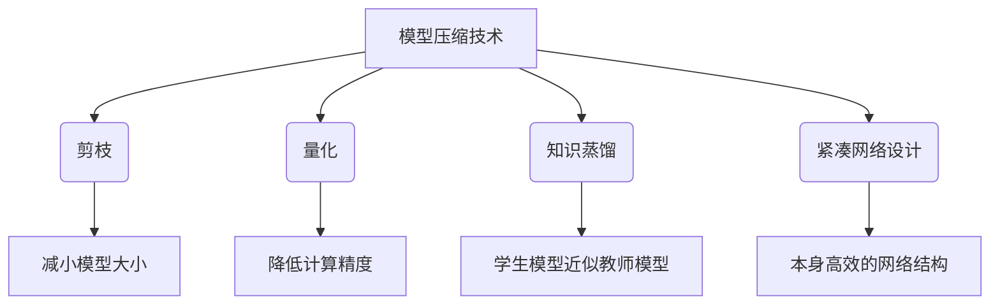

# 模型压缩在移动端的实战经验分享

## 1.背景介绍

### 1.1 移动端AI的重要性

随着人工智能(AI)技术的不断发展,AI应用已经广泛渗透到我们日常生活的方方面面。移动设备作为人机交互的主要入口,移动端AI应用的重要性日益凸显。从语音助手、图像识别到自然语言处理等,移动端AI可以为用户带来更加智能化和人性化的体验。

### 1.2 移动端AI面临的挑战

然而,在将AI模型部署到移动端时,我们面临着诸多挑战:

- **计算资源有限**: 与服务器相比,移动设备的CPU、GPU和内存资源都相对有限,无法支持大型AI模型的运行。
- **功耗和发热**: 复杂的AI计算会消耗大量能量,导致设备发热和电池续航时间降低。
- **模型大小**: 一些先进的AI模型体积庞大,难以部署在有限的移动设备存储空间中。

### 1.3 模型压缩的重要性

为了在移动端顺利部署AI应用,我们必须采取有效的模型压缩技术,将庞大的AI模型精简为更小、更高效的版本,从而满足移动设备的硬件约束,同时保持模型的精度和性能。

## 2.核心概念与联系

### 2.1 模型压缩概述

模型压缩是一种将深度神经网络模型的计算复杂度和存储需求降低的技术,主要包括以下几种方法:

- **剪枝(Pruning)**: 通过移除神经网络中的冗余权重和神经元,从而减小模型大小。
- **量化(Quantization)**: 将原本使用32位或16位浮点数表示的权重和激活值,转换为占用空间更小的整数表示。
- **知识蒸馏(Knowledge Distillation)**: 利用一个大型教师模型来指导训练一个小型的学生模型,使学生模型在保持较高精度的同时大幅减小模型大小。
- **紧凑网络设计(Compact Network Design)**: 设计出本身就更加紧凑高效的神经网络结构。

这些技术可以单独使用,也可以组合使用,从而实现模型大小和计算量的进一步压缩。

### 2.2 压缩与精度的权衡

在模型压缩过程中,我们需要权衡模型大小、计算量和精度之间的关系。过度压缩可能会导致模型精度下降,而压缩不足则无法真正满足移动端的硬件约束。因此,我们需要根据具体的应用场景和硬件条件,选择合适的压缩策略和程度。

### 2.3 硬件加速技术

除了模型压缩,移动端AI还可以借助硬件加速技术来提升性能,例如:

- **GPU加速**: 利用移动设备上的GPU进行并行计算,加速神经网络的运算。
- **NPU加速**: 一些新型移动芯片集成了专用的神经网络处理单元(NPU),可以高效地执行AI计算。
- **量化感知训练(Quantization-Aware Training)**: 在训练阶段就考虑量化对模型精度的影响,使量化后的模型性能更佳。

模型压缩和硬件加速技术相辅相成,共同推动了移动端AI的发展。

## 3.核心算法原理具体操作步骤

在本节,我们将详细介绍上述几种主要的模型压缩算法的原理和具体操作步骤。

### 3.1 剪枝(Pruning)

剪枝算法的目标是从神经网络中识别并移除冗余的权重和神经元,从而减小模型大小和计算量,而不会过多影响模型的精度。常见的剪枝算法包括:

1. **权重剪枝(Weight Pruning)**: 根据权重的重要性,移除那些对模型精度影响较小的权重。
2. **滤波器剪枝(Filter Pruning)**: 移除那些对模型精度影响较小的卷积滤波器。
3. **神经元剪枝(Neuron Pruning)**: 移除那些对模型精度影响较小的神经元。

剪枝算法的一般步骤如下:

1. **训练基础模型**: 首先训练一个较大的基础模型,作为剪枝的起点。
2. **计算权重/滤波器/神经元的重要性**: 根据一定的评估标准(如绝对值、二范数等),计算每个权重、滤波器或神经元对模型精度的重要性。
3. **剪枝**: 根据重要性排序,移除那些重要性较低的权重、滤波器或神经元。
4. **微调**: 对剪枝后的模型进行进一步的微调训练,以恢复可能受到的精度损失。

剪枝算法通常需要反复进行多轮迭代,逐步压缩模型,直至达到所需的压缩率。

### 3.2 量化(Quantization)

量化算法的目标是将原本使用32位或16位浮点数表示的权重和激活值,转换为占用空间更小的整数表示,从而减小模型大小和计算量。常见的量化算法包括:

1. **权重量化(Weight Quantization)**: 将模型权重从浮点数量化为整数。
2. **激活值量化(Activation Quantization)**: 将模型的中间激活值从浮点数量化为整数。

量化算法的一般步骤如下:

1. **确定量化比特位数**: 根据硬件支持情况和精度要求,选择合适的量化比特位数(如8位、4位或更低)。
2. **计算量化参数**: 根据权重或激活值的分布,计算量化的缩放系数和零点等参数。
3. **量化**: 将浮点数权重或激活值根据量化参数映射为整数表示。
4. **量化感知训练(Quantization-Aware Training)**: 使用量化后的模型进行训练,使模型适应量化带来的数值误差。

量化算法可以大幅减小模型大小和计算量,但也会引入一定的精度损失。因此,我们需要在量化比特位数和精度之间进行权衡。

### 3.3 知识蒸馏(Knowledge Distillation)

知识蒸馏算法的目标是利用一个大型的教师模型来指导训练一个小型的学生模型,使学生模型在保持较高精度的同时大幅减小模型大小。

知识蒸馏算法的一般步骤如下:

1. **训练教师模型**: 首先训练一个大型的教师模型,作为知识来源。
2. **获取教师模型的软标签(Soft Labels)**: 使用教师模型对训练数据进行前向传播,获取教师模型在每个类别上的预测概率分布,即软标签。
3. **训练学生模型**: 使用软标签和硬标签(Hard Labels,即真实标签)共同指导学生模型的训练,使学生模型学习到教师模型的知识。
4. **微调学生模型**: 对训练好的学生模型进行进一步的微调,提高其精度。

知识蒸馏算法的关键在于,学生模型不仅学习真实标签,还学习了教师模型的预测分布,从而获得了更丰富的知识。通过这种方式,学生模型可以在大幅减小模型大小的同时,保持接近教师模型的精度水平。

### 3.4 紧凑网络设计(Compact Network Design)

除了上述压缩现有模型的方法,我们还可以设计出本身就更加紧凑高效的神经网络结构,从源头上降低模型的计算复杂度和存储需求。

一些典型的紧凑网络设计包括:

1. **SqueezeNet**: 通过设计特殊的Fire模块,大幅减小了参数量和计算量。
2. **MobileNets**: 使用深度可分离卷积(Depthwise Separable Convolution)代替标准卷积,大幅降低了计算量。
3. **ShuffleNets**: 通过通道洗牌(Channel Shuffle)操作,实现了更高效的信息流传递。

这些紧凑网络设计通常会牺牲一定的精度,但在移动端等资源受限的场景下,它们可以提供更好的速度和效率。

## 4.数学模型和公式详细讲解举例说明

在本节,我们将介绍一些与模型压缩相关的数学模型和公式,并通过具体例子加以说明。

### 4.1 权重剪枝的数学模型

在权重剪枝算法中,我们需要评估每个权重对模型精度的重要性。一种常见的方法是计算每个权重的绝对值,并将绝对值较小的权重视为不重要的权重。

设某层神经网络的权重矩阵为 $W \in \mathbb{R}^{m \times n}$,其中 $m$ 和 $n$ 分别表示输入和输出的维度。我们可以计算每个权重的绝对值:

$$
|W|_{i,j} = |w_{i,j}|, \quad \forall i \in \{1, 2, \ldots, m\}, j \in \{1, 2, \ldots, n\}
$$

然后,我们可以根据一定的阈值 $\theta$,将绝对值小于该阈值的权重设置为零:

$$
\hat{w}_{i,j} = \begin{cases}
0, & \text{if } |w_{i,j}| < \theta \\
w_{i,j}, & \text{otherwise}
\end{cases}
$$

其中 $\hat{W}$ 表示剪枝后的权重矩阵。通过调整阈值 $\theta$,我们可以控制剪枝的程度,实现模型大小和精度之间的权衡。

例如,假设我们有一个 $3 \times 3$ 的权重矩阵:

$$
W = \begin{bmatrix}
0.2 & -0.1 & 0.5\\
0.3 & 0.7 & -0.2\\
-0.4 & 0.1 & 0.6
\end{bmatrix}
$$

如果我们设置阈值 $\theta = 0.3$,那么绝对值小于 $0.3$ 的权重将被设置为零:

$$
\hat{W} = \begin{bmatrix}
0 & 0 & 0.5\\
0.3 & 0.7 & 0\\
-0.4 & 0 & 0.6
\end{bmatrix}
$$

可以看到,剪枝后的权重矩阵 $\hat{W}$ 中有 $3$ 个权重被设置为零,从而减小了模型大小和计算量。

### 4.2 量化的数学模型

在量化算法中,我们需要将浮点数权重或激活值映射为整数表示。一种常见的方法是使用线性量化(Linear Quantization)。

设浮点数 $x \in \mathbb{R}$ 需要被量化为 $k$ 比特的整数表示,其量化公式为:

$$
Q(x) = \mathrm{clamp}\left(\mathrm{round}\left(\frac{x}{S} + Z\right), \mathrm{qmin}, \mathrm{qmax}\right)
$$

其中:

- $S$ 是缩放系数(Scale Factor),用于将浮点数缩放到整数范围内。
- $Z$ 是零点(Zero Point),用于将量化后的整数值平移到合适的范围。
- $\mathrm{clamp}(\cdot, \mathrm{qmin}, \mathrm{qmax})$ 是一个截断函数,将输入值限制在 $[\mathrm{qmin}, \mathrm{qmax}]$ 范围内,其中 $\mathrm{qmin}$ 和 $\mathrm{qmax}$ 分别表示量化后整数的最小值和最大值。

例如,假设我们要将浮点数 $x = 0.7$ 量化为 $8$ 比特整数表示,其中 $S = 0.1$, $Z = 128$, $\mathrm{qmin} = 0$, $\mathrm{qmax} = 255$。根据上述公式,我们可以计算出量化后的整数值:

$$
Q(0.7) = \mathrm{clamp}\left(\mathrm{round}\left(\frac{0.7}{0.1} + 128\right), 0, 255\right) = 135
$$

因此,浮点数 $