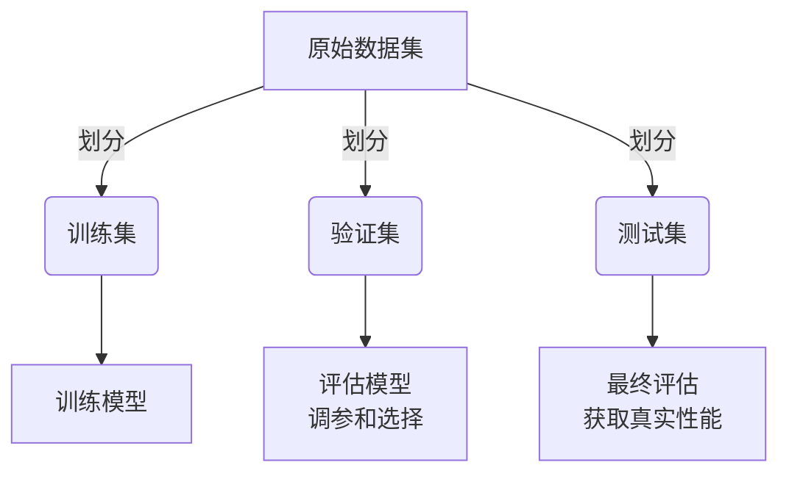
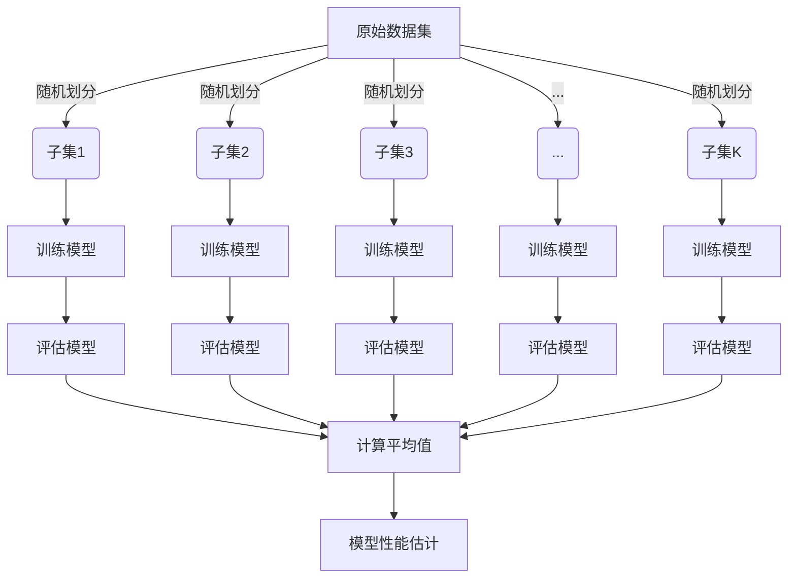
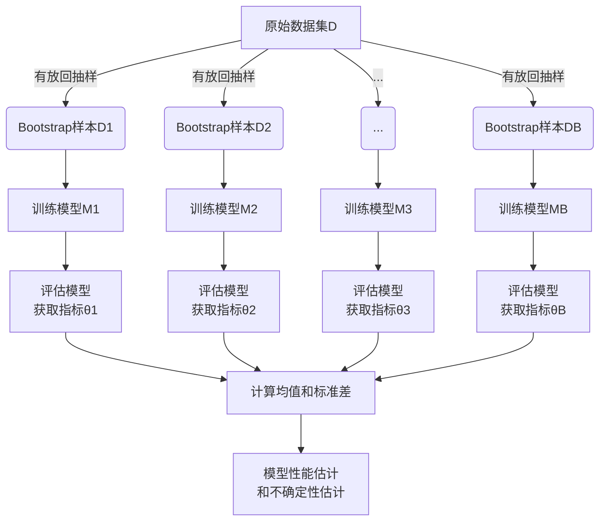
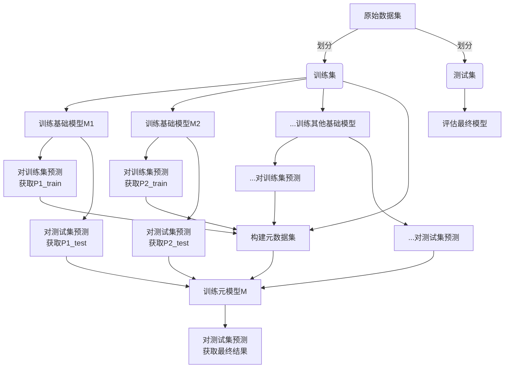

# 模型评估(Model Evaluation)原理与代码实战案例讲解

## 1.背景介绍

### 1.1 什么是模型评估

在机器学习和深度学习领域中,模型评估是一个至关重要的步骤。它是指评估模型在给定数据集上的性能表现,以确定模型是否满足预期目标。模型评估可以帮助我们了解模型的优缺点,并根据评估结果进行调整和优化。

### 1.2 为什么需要模型评估

模型评估的目的主要有以下几个方面:

1. **选择最佳模型**: 通过评估不同模型在相同数据集上的表现,可以选择性能最佳的模型用于实际应用场景。
2. **避免过拟合和欠拟合**: 通过评估模型在训练集和测试集上的表现差异,可以发现模型是否存在过拟合或欠拟合问题,并进行相应调整。
3. **调整超参数**: 模型评估可以帮助确定最佳的超参数设置,从而优化模型性能。
4. **了解模型局限性**: 通过分析模型在不同数据子集上的表现,可以发现模型的局限性,并采取相应措施进行改进。

### 1.3 模型评估的一般流程

模型评估的一般流程如下:

1. **准备数据集**: 将原始数据集分为训练集、验证集和测试集。
2. **训练模型**: 使用训练集对模型进行训练。
3. **评估模型**: 在验证集或测试集上评估模型的性能,计算相应的评估指标。
4. **模型选择和调优**: 根据评估结果选择最佳模型,或对模型进行调优。
5. **最终评估**: 在保留的测试集上对最终模型进行评估,获得模型的真实性能估计。

## 2.核心概念与联系

### 2.1 训练集、验证集和测试集

在模型评估过程中,我们通常需要将原始数据集划分为三个子集:

- **训练集(Training Set)**: 用于训练模型的数据。
- **验证集(Validation Set)**: 用于评估模型在训练过程中的性能,并进行调参和模型选择。
- **测试集(Test Set)**: 用于对最终模型进行评估,获得模型在未见数据上的真实性能估计。

通常,我们会将数据集按比例划分为训练集、验证集和测试集,比例可能因具体问题而有所不同。一种常见的划分方式是:训练集 60%,验证集 20%,测试集 20%。

### 2.2 评估指标

评估指标是衡量模型性能的重要标准。不同的任务类型和应用场景需要使用不同的评估指标。以下是一些常见的评估指标:

- **分类任务**:
  - 准确率(Accuracy)
  - 精确率(Precision)
  - 召回率(Recall)
  - F1分数(F1 Score)
  - 受试者工作特征曲线(ROC)和曲线下面积(AUC)
- **回归任务**:
  - 均方根误差(RMSE)
  - 平均绝对误差(MAE)
  - 决定系数(R-Squared)
- **其他任务**:
  - 平均精度(mAP)
  - 编辑距离(Edit Distance)
  - 困惑度(Perplexity)

选择合适的评估指标对于正确评估模型性能至关重要。在实际应用中,我们还需要根据具体问题的特点和需求来选择和设计评估指标。

### 2.3 模型复杂度与偏差-方差权衡

在模型评估中,我们需要考虑模型复杂度与偏差-方差权衡的关系。

- **模型复杂度**:
  - 模型复杂度越高,模型的拟合能力越强,但也更容易出现过拟合。
  - 模型复杂度越低,模型的泛化能力越强,但也可能导致欠拟合。

- **偏差-方差权衡**:
  - 偏差(Bias)指模型与真实函数之间的差距,反映了模型的拟合能力。
  - 方差(Variance)指模型对训练数据的微小变化的敏感程度,反映了模型的稳定性。
  - 偏差过高会导致欠拟合,方差过高会导致过拟合。
  - 我们需要在偏差和方差之间寻找一个合适的平衡点。

通过模型评估,我们可以发现模型是否存在过拟合或欠拟合问题,并相应地调整模型复杂度或采取正则化等技术来优化模型性能。

## 3.核心算法原理具体操作步骤

### 3.1 交叉验证

交叉验证(Cross-Validation)是一种常用的模型评估和选择技术。它的基本思想是将原始数据集划分为多个子集,每次使用其中一个子集作为验证集,其余部分作为训练集,重复多次训练和评估,最后取平均值作为模型的性能估计。

交叉验证的具体步骤如下:

1. 将原始数据集随机划分为 K 个大小相等的子集(通常 K=5 或 K=10)。
2. 对于每个子集 i (i=1,2,...,K):
   - 将子集 i 作为验证集,其余 K-1 个子集作为训练集。
   - 在训练集上训练模型,在验证集上评估模型性能,记录评估指标。
3. 计算 K 次评估指标的平均值,作为模型的最终性能估计。

交叉验证可以有效减少模型评估的偏差,提高评估结果的可靠性。常见的交叉验证方法包括:

- K 折交叉验证(K-Fold Cross-Validation)
- 留一交叉验证(Leave-One-Out Cross-Validation, LOOCV)
- stratified K 折交叉验证(Stratified K-Fold Cross-Validation)

### 3.2 Bootstrap 方法

Bootstrap 是一种基于重复采样的统计方法,可用于估计模型的性能和不确定性。它的基本思想是从原始数据集中重复采样(有放回抽样),生成多个 Bootstrap 样本,分别在这些样本上训练和评估模型,最后汇总结果得到模型性能的估计。

Bootstrap 方法的具体步骤如下:

1. 从原始数据集 D 中,通过有放回抽样生成 B 个 Bootstrap 样本 $D_1, D_2, ..., D_B$,每个样本的大小与原始数据集相同。
2. 对于每个 Bootstrap 样本 $D_b$ (b=1,2,...,B):
   - 使用 $D_b$ 作为训练集训练模型 $M_b$。
   - 在原始数据集 D 上评估模型 $M_b$ 的性能,记录评估指标 $\theta_b$。
3. 计算 B 个评估指标 $\theta_1, \theta_2, ..., \theta_B$ 的均值和标准差,作为模型性能的估计和不确定性的估计。

Bootstrap 方法的优点是它不需要事先将数据集划分为训练集和测试集,可以充分利用所有可用数据进行模型评估。此外,它还可以提供模型性能的置信区间,帮助我们更好地了解模型的不确定性。

### 3.3 层次集成

层次集成(Stacking)是一种将多个模型组合在一起的元学习方法。它的基本思想是训练多个基础模型,然后使用另一个元模型(meta-model)来组合这些基础模型的预测结果,从而获得更好的性能。

层次集成的具体步骤如下:

1. 准备原始数据集,将其划分为训练集和测试集(或使用交叉验证)。
2. 在训练集上训练多个不同类型的基础模型 $M_1, M_2, ..., M_N$。
3. 对于每个基础模型 $M_i$ (i=1,2,...,N):
   - 在训练集上训练模型 $M_i$。
   - 使用训练好的模型 $M_i$ 对训练集进行预测,获得预测结果 $P_i^{train}$。
   - 使用训练好的模型 $M_i$ 对测试集进行预测,获得预测结果 $P_i^{test}$。
4. 将基础模型在训练集上的预测结果 $P_1^{train}, P_2^{train}, ..., P_N^{train}$ 作为新的特征,连同原始训练集特征一起,构建元数据集。
5. 在元数据集上训练元模型 M,使用基础模型在测试集上的预测结果 $P_1^{test}, P_2^{test}, ..., P_N^{test}$ 作为元模型的预测目标。
6. 使用训练好的元模型 M 对测试集进行预测,获得最终的预测结果。

层次集成的优点是可以充分利用不同模型的优势,提高预测的准确性和鲁棒性。它在许多机器学习比赛中表现出色,被广泛应用于各种任务。

## 4.数学模型和公式详细讲解举例说明

在模型评估中,我们经常需要使用一些数学模型和公式来计算评估指标。以下是一些常见评估指标的数学模型和公式:

### 4.1 分类任务评估指标

#### 4.1.1 准确率(Accuracy)

准确率是分类任