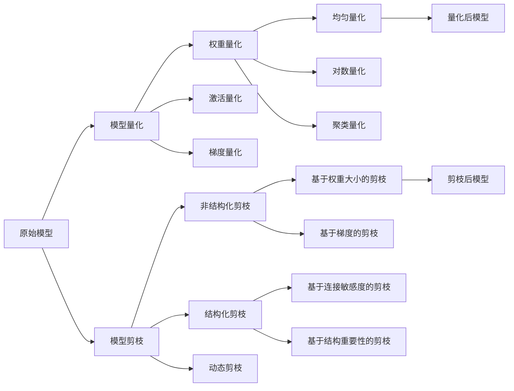

# 模型量化与剪枝原理与代码实战案例讲解

## 1. 背景介绍
### 1.1 深度学习模型的计算和存储挑战
### 1.2 模型压缩的必要性
### 1.3 量化和剪枝技术概述

## 2. 核心概念与联系
### 2.1 模型量化
#### 2.1.1 量化的定义和目的
#### 2.1.2 量化的类型
##### 2.1.2.1 权重量化
##### 2.1.2.2 激活量化
##### 2.1.2.3 梯度量化
### 2.2 模型剪枝
#### 2.2.1 剪枝的定义和目的
#### 2.2.2 剪枝的类型
##### 2.2.2.1 非结构化剪枝
##### 2.2.2.2 结构化剪枝
##### 2.2.2.3 动态剪枝
### 2.3 量化和剪枝的关系

## 3. 核心算法原理具体操作步骤
### 3.1 量化算法
#### 3.1.1 均匀量化
#### 3.1.2 对数量化
#### 3.1.3 聚类量化
#### 3.1.4 量化感知训练
### 3.2 剪枝算法
#### 3.2.1 基于权重大小的剪枝
#### 3.2.2 基于梯度的剪枝
#### 3.2.3 基于连接敏感度的剪枝
#### 3.2.4 基于结构重要性的剪枝

## 4. 数学模型和公式详细讲解举例说明
### 4.1 量化的数学模型
#### 4.1.1 线性量化
$q = round(\frac{r}{S}) = round(\frac{r - Z}{S})$
其中，$q$为量化后的值，$r$为实际值，$S$为缩放因子，$Z$为零点。
#### 4.1.2 对数量化
$q = round(log_2(\frac{r}{S}))$
### 4.2 剪枝的数学模型
#### 4.2.1 $L_0$范数
$L_0(W) = \sum_{i=1}^{n} \mathbb{I}(w_i \neq 0)$
其中，$W$为权重矩阵，$w_i$为权重矩阵的第$i$个元素，$\mathbb{I}$为指示函数。
#### 4.2.2 $L_1$范数
$L_1(W) = \sum_{i=1}^{n} |w_i|$

## 5. 项目实践：代码实例和详细解释说明
### 5.1 PyTorch中的量化实现
```python
import torch
import torch.nn as nn
import torch.quantization

# 定义模型
class Net(nn.Module):
    def __init__(self):
        super(Net, self).__init__()
        self.fc = nn.Linear(784, 10)

    def forward(self, x):
        x = self.fc(x)
        return x

# 准备数据
data = torch.randn(1, 784)

# 创建模型实例
model = Net()

# 模型量化
quantized_model = torch.quantization.quantize_dynamic(
    model, {nn.Linear}, dtype=torch.qint8
)

# 执行推理
res = quantized_model(data)
```

在上面的代码中，我们首先定义了一个简单的全连接神经网络模型`Net`。然后，我们使用`torch.quantization.quantize_dynamic`函数对模型进行动态量化，指定量化的数据类型为`torch.qint8`。最后，我们使用量化后的模型`quantized_model`对数据`data`进行推理。

### 5.2 TensorFlow中的剪枝实现
```python
import tensorflow as tf
from tensorflow_model_optimization.sparsity import keras as sparsity

# 定义模型
model = tf.keras.Sequential([
    tf.keras.layers.Dense(10, activation='relu', input_shape=(784,)),
    tf.keras.layers.Dense(10, activation='softmax')
])

# 定义剪枝参数
pruning_params = {
    'pruning_schedule': sparsity.PolynomialDecay(
        initial_sparsity=0.0,
        final_sparsity=0.5,
        begin_step=0,
        end_step=1000
    )
}

# 应用剪枝
model_for_pruning = sparsity.prune_low_magnitude(model, **pruning_params)

# 编译模型
model_for_pruning.compile(
    optimizer='adam',
    loss='categorical_crossentropy',
    metrics=['accuracy']
)

# 训练模型
model_for_pruning.fit(x_train, y_train, epochs=10)

# 导出剪枝后的模型
pruned_model = sparsity.strip_pruning(model_for_pruning)
```

在上面的代码中，我们首先定义了一个简单的全连接神经网络模型。然后，我们使用`sparsity.PolynomialDecay`定义了剪枝的参数，指定了初始稀疏度、最终稀疏度以及剪枝的起始和结束步数。接下来，我们使用`sparsity.prune_low_magnitude`函数对模型应用剪枝。在训练模型之后，我们可以使用`sparsity.strip_pruning`函数导出剪枝后的模型。

## 6. 实际应用场景
### 6.1 移动设备上的模型部署
### 6.2 边缘计算中的模型优化
### 6.3 资源受限环境下的模型压缩

## 7. 工具和资源推荐
### 7.1 量化工具
- TensorFlow Lite
- PyTorch Quantization
- ONNX Runtime
### 7.2 剪枝工具
- TensorFlow Model Optimization Toolkit
- PyTorch Pruning
- NNI (Neural Network Intelligence)
### 7.3 相关论文和资源
- "Deep Compression: Compressing Deep Neural Networks with Pruning, Trained Quantization and Huffman Coding" by Han et al.
- "Learning both Weights and Connections for Efficient Neural Networks" by Han et al.
- "AMC: AutoML for Model Compression and Acceleration on Mobile Devices" by He et al.

## 8. 总结：未来发展趋势与挑战
### 8.1 自动化模型压缩
### 8.2 硬件感知的模型优化
### 8.3 模型压缩与安全性
### 8.4 模型压缩的可解释性

## 9. 附录：常见问题与解答
### 9.1 量化和剪枝对模型精度的影响
### 9.2 如何选择合适的量化位宽
### 9.3 剪枝后的模型如何进行微调
### 9.4 量化和剪枝技术的局限性



量化和剪枝是深度学习模型压缩中两种重要的技术。量化通过减少模型权重和激活的位宽来压缩模型，而剪枝通过移除冗余或不重要的连接和神经元来压缩模型。这两种技术可以显著减小模型的计算和存储开销，使其更适合在资源受限的环境中部署。

在实践中，量化和剪枝需要权衡模型压缩率和精度之间的平衡。过度的量化或剪枝可能导致模型性能下降。因此，需要仔细选择量化位宽和剪枝策略，并对压缩后的模型进行微调以恢复精度。

未来，自动化的模型压缩技术和硬件感知的模型优化将成为研究热点。同时，模型压缩技术也面临着安全性和可解释性等挑战。

希望这篇文章能够帮助读者深入理解模型量化和剪枝的原理，并在实践中灵活运用这些技术来优化深度学习模型。

作者：禅与计算机程序设计艺术 / Zen and the Art of Computer Programming