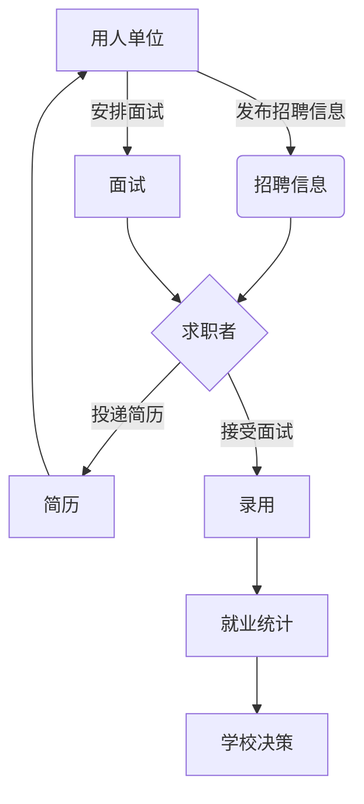

# 毕业生就业信息管理系统详细设计与具体代码实现

## 1. 背景介绍

### 1.1 毕业生就业形势分析

随着高等教育的大众化,每年都有大量的毕业生进入就业市场。然而,就业市场的供求关系失衡、就业观念的转变以及经济环境的波动,都给毕业生的就业带来了巨大挑战。因此,高校需要建立一个高效的毕业生就业信息管理系统,以帮助毕业生更好地了解就业市场,获取合适的工作机会,同时也方便学校对毕业生的就业情况进行跟踪和分析。

### 1.2 系统的必要性

毕业生就业信息管理系统的建立,可以实现以下目标:

1. 为毕业生提供全面的就业信息,包括招聘信息、就业指导、政策解读等,方便毕业生了解就业形势,做好就业准备。

2. 建立校企合作平台,促进学校与用人单位的良性互动,为毕业生提供更多的就业机会。

3. 收集和分析毕业生的就业数据,为学校的人才培养和就业指导工作提供决策依据。

4. 加强学校与毕业生之间的联系,了解毕业生的就业状况,为其提供持续的职业发展指导。

### 1.3 系统的功能模块

毕业生就业信息管理系统主要包括以下几个功能模块:

- 就业信息发布模块
- 求职管理模块
- 企业管理模块
- 就业统计分析模块
- 系统管理模块

## 2. 核心概念与联系

### 2.1 核心概念

1. **求职者(Jobseeker)**: 指正在寻求工作机会的毕业生。求职者可以在系统中查看招聘信息、投递简历、接受面试邀请等。

2. **用人单位(Employer)**: 指在系统中发布招聘信息、管理招聘流程的企业或机构。

3. **招聘信息(Job Posting)**: 用人单位在系统中发布的工作机会,包括职位描述、要求、薪资待遇等信息。

4. **简历(Resume)**: 求职者在系统中上传和管理的个人简历,用于投递工作机会。

5. **面试(Interview)**: 用人单位根据投递情况安排的面试,求职者可以接受或拒绝面试邀请。

6. **就业统计(Employment Statistics)**: 系统根据求职者的就业情况,对就业数据进行统计和分析,为学校提供决策依据。

### 2.2 核心概念之间的联系

这些核心概念之间存在着紧密的联系,构成了系统的核心业务流程:

1. 用人单位在系统中发布招聘信息。

2. 求职者浏览招聘信息,根据自身情况投递简历。

3. 用人单位收到简历后,根据筛选条件安排面试。

4. 求职者接受或拒绝面试邀请,参加面试。

5. 用人单位根据面试结果确定录用人选。

6. 系统收集求职者的就业信息,进行统计和分析。

7. 学校根据就业统计数据,调整人才培养计划和就业指导策略。

上图展示了系统中核心概念之间的关系和业务流程。用人单位发布招聘信息,求职者投递简历,用人单位安排面试并最终录用人选,系统收集就业数据进行统计分析,为学校决策提供依据。

## 3. 核心算法原理具体操作步骤

### 3.1 简历匹配算法

为了帮助求职者找到合适的工作机会,同时也方便用人单位快速筛选出合格的候选人,系统需要实现一种高效的简历匹配算法。该算法的基本原理是:

1. 将招聘信息和简历中的关键词进行分词和向量化,构建向量空间模型。

2. 计算招聘信息向量和简历向量之间的相似度,作为匹配度的评分标准。

3. 根据设定的阈值,筛选出匹配度较高的简历,推荐给用人单位。

具体的操作步骤如下:

1. **文本预处理**

   - 对招聘信息和简历的文本进行分词、去停用词、词性标注等预处理操作。

2. **构建向量空间模型**

   - 使用TF-IDF等方法,将文本转换为向量空间模型,每个词对应一个维度。

3. **计算相似度**

   - 使用余弦相似度等方法,计算招聘信息向量和简历向量之间的相似度得分。

   $$\text{sim}(X, Y) = \cos(\theta) = \frac{X \cdot Y}{\|X\|\|Y\|}$$

   其中,X和Y分别表示招聘信息向量和简历向量,$\theta$为它们之间的夹角。

4. **结果排序**

   - 根据相似度得分,对简历进行排序,得分高的简历排在前面。

5. **阈值筛选**

   - 设置一个相似度阈值,只保留得分高于该阈值的简历,作为匹配结果推荐给用人单位。

该算法的优点是可以快速从大量简历中筛选出与招聘要求最匹配的候选人,提高了招聘效率。同时,它也为求职者推荐了合适的工作机会,提高了匹配的精准度。

### 3.2 面试邀请算法

当用人单位从匹配结果中选择了感兴趣的候选人后,需要安排面试。为了优化面试流程,系统采用了一种面试邀请算法,具体步骤如下:

1. **确定面试时间段**

   - 用人单位在系统中设置可用的面试时间段,例如每周三下午2点到5点。

2. **收集求职者时间偏好**

   - 求职者在投递简历时,可以填写自己的时间偏好,例如周一到周五上午。

3. **时间匹配**

   - 系统根据用人单位的可用时间段和求职者的时间偏好,匹配出双方都可以接受的时间段。

   $$\text{AvailableTime} = \text{EmployerTime} \cap \text{JobseekerTime}$$

4. **发送面试邀请**

   - 系统从匹配出的时间段中,选择一个具体的面试时间,并向求职者发送面试邀请。

5. **求职者确认或拒绝**

   - 求职者可以在系统中查看面试邀请,并确认或拒绝该邀请。

6. **反馈结果**

   - 如果求职者确认,则将该面试时间段锁定,并通知用人单位。
   - 如果求职者拒绝,则释放该时间段,并继续匹配其他时间。

该算法可以最大程度地满足双方的时间需求,提高面试的效率和出席率。同时,它也避免了手动安排面试时间的繁琐流程,提高了系统的自动化水平。

## 4. 数学模型和公式详细讲解举例说明

在毕业生就业信息管理系统中,数学模型和公式主要应用于简历匹配和就业数据分析等方面。

### 4.1 简历匹配模型

简历匹配算法的核心是计算招聘信息向量和简历向量之间的相似度。常用的相似度计算方法有:

1. **余弦相似度**

   余弦相似度是计算两个向量夹角余弦值的方法,公式如下:

   $$\text{sim}(X, Y) = \cos(\theta) = \frac{X \cdot Y}{\|X\|\|Y\|}$$

   其中,X和Y分别表示招聘信息向量和简历向量,$\theta$为它们之间的夹角。余弦相似度的值范围在[-1,1]之间,值越接近1,表示两个向量越相似。

   例如,假设招聘信息向量X = (2,3,5),简历向量Y = (4,6,10),则它们之间的余弦相似度为:

   $$\begin{aligned}
   \text{sim}(X, Y) &= \cos(\theta) \\
                   &= \frac{X \cdot Y}{\|X\|\|Y\|} \\
                   &= \frac{2 \times 4 + 3 \times 6 + 5 \times 10}{\sqrt{2^2 + 3^2 + 5^2} \times \sqrt{4^2 + 6^2 + 10^2}} \\
                   &= \frac{98}{\sqrt{38} \times \sqrt{116}} \\
                   &\approx 0.9972
   \end{aligned}$$

   可以看出,这两个向量的余弦相似度很高,表明它们之间具有很高的相似性。

2. **欧几里得距离**

   欧几里得距离是计算两个向量在空间中的直线距离,公式如下:

   $$\text{dist}(X, Y) = \sqrt{\sum_{i=1}^{n}(x_i - y_i)^2}$$

   其中,X和Y分别表示招聘信息向量和简历向量,n是向量的维度。距离越小,表示两个向量越相似。

   例如,假设招聘信息向量X = (2,3,5),简历向量Y = (4,6,10),则它们之间的欧几里得距离为:

   $$\begin{aligned}
   \text{dist}(X, Y) &= \sqrt{\sum_{i=1}^{3}(x_i - y_i)^2} \\
                     &= \sqrt{(2 - 4)^2 + (3 - 6)^2 + (5 - 10)^2} \\
                     &= \sqrt{4 + 9 + 25} \\
                     &= \sqrt{38} \\
                     &\approx 6.16
   \end{aligned}$$

   可以看出,这两个向量的欧几里得距离较小,表明它们之间具有较高的相似性。

在实际应用中,可以根据具体情况选择合适的相似度计算方法,并设置一个阈值,将高于该阈值的简历视为匹配成功。

### 4.2 就业数据分析模型

就业数据分析模型主要用于对毕业生的就业情况进行统计和分析,为学校的人才培养和就业指导工作提供决策依据。常用的分析方法包括:

1. **描述性统计分析**

   描述性统计分析主要包括计算均值、中位数、方差、频率分布等统计量,用于描述就业数据的基本特征。

   例如,计算某专业毕业生的平均薪资:

   $$\bar{x} = \frac{\sum_{i=1}^{n}x_i}{n}$$

   其中,$\bar{x}$表示平均薪资,${x_i}$表示第i个毕业生的薪资,n表示毕业生总数。

2. **相关性分析**

   相关性分析用于研究两个或多个变量之间的关系,常用的方法是计算相关系数。

   例如,计算某专业毕业生的平均学分绩点(GPA)与就业薪资之间的相关系数:

   $$r_{xy} = \frac{\sum_{i=1}^{n}(x_i - \bar{x})(y_i - \bar{y})}{\sqrt{\sum_{i=1}^{n}(x_i - \bar{x})^2\sum_{i=1}^{n}(y_i - \bar{y})^2}}$$

   其中,${x_i}$表示第i个毕业生的GPA,${y_i}$表示第i个毕业生的薪资,$\bar{x}$和$\bar{y}$分别表示GPA和薪资的均值。相关系数的取值范围在[-1,1]之间,值越接近1或-1,表示两个变量之间的相关性越强。

3. **回归分析**

   回归分析用于研究自变量对因变量的影响,常用的方法是构建回归方程。

   例如,构建某专业毕业生的GPA对薪资的线性回归方程:

   $$y = \beta_0 + \beta_1x$$

   其中,y表示薪资,x表示GPA,$\beta_0$和$\beta_1$是需要估计的回归系数。可以使用最小二乘法等方法来估计这些系数。

通过对就业数据进行描述性统计、相关性分析和回归分析等