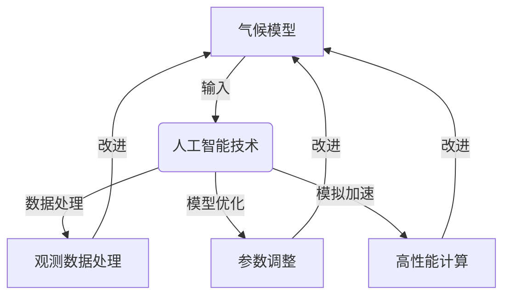

# 气候模型预测中的AI应用：准确预报自然灾害

## 1.背景介绍

### 1.1 自然灾害的威胁

自然灾害一直是人类面临的重大挑战之一。无论是洪水、干旱、热浪、森林火灾还是台风和飓风,这些极端天气事件每年都会给全球各地带来巨大的生命和经济损失。根据联合国统计,2000年至2019年间,自然灾害造成了120万人死亡,影响了40亿人的生活,导致了2.97万亿美元的直接经济损失。

### 1.2 气候变化加剧自然灾害

气候变化正在加剧自然灾害的频率和强度。全球变暖导致海平面上升、极端天气事件增多、生态系统遭到破坏等一系列后果。根据政府间气候变化专门委员会(IPCC)的报告,未来几十年内,自然灾害的发生率将进一步增加,给人类社会带来更大的挑战。

### 1.3 准确预报的重要性

为了有效应对自然灾害,准确预报是关键。及时、精准的预报可以为政府、救援机构和公众提供宝贵的时间,采取必要的防御措施,从而减少生命和财产损失。然而,由于气候系统的复杂性和不确定性,准确预报自然灾害一直是一项艰巨的挑战。

## 2.核心概念与联系

### 2.1 气候模型

气候模型是一种数学模型,旨在模拟地球的气候系统,包括大气、海洋、陆地和冰雪等组成部分,以及它们之间的相互作用。气候模型通过解决一系列复杂的物理方程,来预测未来的气候变化和相关现象。

### 2.2 数值天气预报

数值天气预报(NWP)是一种利用计算机模型来预测未来天气状况的方法。NWP模型通过解决控制大气运动的基本物理方程,结合当前的天气观测数据,来预测未来一段时间内的天气变化。

### 2.3 人工智能在气候模型中的应用

人工智能(AI)技术在气候模型和数值天气预报中发挥着越来越重要的作用。AI可以帮助处理大量的观测数据、优化模型参数、提高模型精度,并加速模拟和预测过程。

人工智能技术在气候模型中的应用包括:

- 机器学习算法用于处理和分析大量的观测数据,提取有价值的信息。
- 深度学习模型用于优化气候模型的参数,提高模型的精度和性能。
- 高性能计算技术(如GPU加速)用于加速模拟和预测过程。

通过与人工智能技术的结合,气候模型和数值天气预报的准确性和效率都得到了显著提高,为准确预报自然灾害提供了有力支持。

## 3.核心算法原理具体操作步骤

### 3.1 机器学习在气候模型中的应用

机器学习算法在气候模型中的应用主要包括以下几个方面:

#### 3.1.1 数据处理和特征提取

气候模型需要大量的观测数据作为输入,包括温度、湿度、气压、风速等气象数据,以及地形、植被、土壤等环境数据。机器学习算法可以用于处理这些高维、异构的数据,进行数据清洗、插补缺失值、降维和特征提取等操作,为模型提供高质量的输入数据。

常用的机器学习算法包括:

- **主成分分析(PCA)**: 用于降维,提取主要特征。
- **K-means聚类**: 用于发现数据模式,识别异常值。
- **决策树**: 用于特征选择和数据预处理。

#### 3.1.2 参数估计和模型校准

气候模型中存在许多需要估计和调整的参数,如云参数化方案、辐射传输方案等。机器学习算法可以通过分析历史数据,自动估计这些参数的最优值,从而校准和优化气候模型。

常用的机器学习算法包括:

- **随机森林**: 用于参数敏感性分析和模型校准。
- **支持向量机(SVM)**: 用于参数估计和模式识别。
- **贝叶斯优化**: 用于高效地搜索参数空间,找到最优参数组合。

#### 3.1.3 模式发现和预测

机器学习算法还可以用于发现气候数据中的模式和规律,并基于这些模式进行预测。例如,可以使用时间序列分析和深度学习模型来预测未来的温度、降水等气候变量。

常用的机器学习算法包括:

- **长短期记忆网络(LSTM)**: 用于时间序列预测。
- **卷积神经网络(CNN)**: 用于空间模式识别。
- **生成对抗网络(GAN)**: 用于气候模式生成和增强。

### 3.2 深度学习在气候模型中的应用

深度学习是机器学习的一个重要分支,它利用深层神经网络来学习数据的复杂模式和特征。在气候模型中,深度学习可以用于以下几个方面:

#### 3.2.1 物理过程参数化

气候模型中存在许多需要参数化的物理过程,如云过程、辐射传输、边界层过程等。传统的参数化方案往往基于简化的假设和经验公式,存在一定的局限性。深度学习模型可以通过学习大量的观测数据和模拟数据,自动发现这些物理过程的复杂模式,从而提供更准确的参数化方案。

常用的深度学习模型包括:

- **卷积神经网络(CNN)**: 用于学习空间模式,如云的结构和演化。
- **递归神经网络(RNN)**: 用于学习时间序列模式,如大气运动的动力学过程。
- **生成对抗网络(GAN)**: 用于生成物理过程的模拟数据,增强训练数据集。

#### 3.2.2 数据驱动建模

除了参数化物理过程,深度学习还可以用于直接构建数据驱动的气候模型。这种方法不需要显式地解决控制方程,而是通过学习大量的观测数据和模拟数据,直接建立输入(如温度、湿度等)和输出(如未来气候状态)之间的映射关系。

常用的深度学习模型包括:

- **长短期记忆网络(LSTM)**: 用于学习时间序列模式,预测未来的气候状态。
- **生成对抗网络(GAN)**: 用于生成高分辨率的气候模拟数据,提高模型的预测能力。
- **变分自编码器(VAE)**: 用于学习气候数据的潜在表示,提高模型的泛化能力。

#### 3.2.3 多模型集成

由于气候系统的复杂性,单一的气候模型往往难以捕捉所有的物理过程和模式。深度学习可以用于集成多个气候模型的输出,形成更准确的预测结果。

常用的深度学习模型包括:

- **堆叠式集成**: 将多个模型的输出作为特征,输入到另一个深度学习模型中进行集成。
- **注意力机制**: 自适应地为不同模型的输出赋予不同的权重,实现智能集成。
- **混合专家模型**: 将不同的专家模型(如物理模型和数据驱动模型)组合,利用各自的优势。

通过将机器学习和深度学习技术与传统的气候模型相结合,我们可以显著提高气候预测的准确性和效率,为准确预报自然灾害提供有力支持。

## 4.数学模型和公式详细讲解举例说明

### 4.1 气候模型的基本方程

气候模型的核心是一系列控制大气、海洋和其他环境要素运动的物理方程。这些方程描述了质量、动量和能量的守恒定律,以及它们之间的相互作用。

#### 4.1.1 大气动力学方程

大气动力学方程描述了大气运动的基本规律,包括:

1. **连续方程**:

$$
\frac{\partial \rho}{\partial t} + \nabla \cdot (\rho \vec{v}) = 0
$$

其中 $\rho$ 表示空气密度, $\vec{v}$ 表示风速矢量, $\nabla \cdot$ 表示散度算子。该方程表示质量守恒。

2. **运动方程**:

$$
\frac{\partial \vec{v}}{\partial t} + (\vec{v} \cdot \nabla) \vec{v} = -\frac{1}{\rho} \nabla p - 2 \vec{\Omega} \times \vec{v} - \nabla \Phi
$$

其中 $p$ 表示气压, $\vec{\Omega}$ 表示地球自转角速度矢量, $\Phi$ 表示重力位能。该方程描述了牛顿第二定律在大气运动中的应用。

3. **热力学方程**:

$$
\frac{\partial T}{\partial t} + \vec{v} \cdot \nabla T = \frac{Q}{c_p}
$$

其中 $T$ 表示温度, $Q$ 表示热源项(如辐射加热等), $c_p$ 表示定压比热容。该方程描述了能量守恒。

#### 4.1.2 海洋模型方程

海洋模型也包括类似的方程,描述海水的运动和热传输过程,如:

$$
\frac{\partial \vec{u}}{\partial t} + (\vec{u} \cdot \nabla) \vec{u} = -\frac{1}{\rho_0} \nabla p + \vec{F}
$$

其中 $\vec{u}$ 表示海流速度矢量, $\rho_0$ 表示海水参考密度, $\vec{F}$ 表示外力项(如风应力等)。

这些方程通常是非线性的、耦合的偏微分方程组,需要使用数值方法(如有限差分法、有限元法等)进行求解。

### 4.2 机器学习在气候模型中的应用

机器学习算法可以用于优化气候模型的各个环节,如数据处理、参数估计、物理过程参数化等。下面以云参数化为例,介绍机器学习在气候模型中的应用。

#### 4.2.1 云参数化问题

云是气候系统中一个关键的组成部分,对地球的辐射平衡和水循环有重要影响。然而,由于云的复杂性和多尺度特征,准确地参数化云过程一直是气候模型中的一大挑战。

传统的云参数化方案通常基于简化的假设和经验公式,难以捕捉云的微观结构和动力学过程。因此,我们需要寻找新的方法来改进云参数化。

#### 4.2.2 机器学习方法

机器学习提供了一种数据驱动的方法来参数化云过程。我们可以利用大量的观测数据(如卫星云图像、雷达数据等)和高分辨率模拟数据,训练深度神经网络模型来学习云的模式和特征。

假设我们有一个训练数据集 $\mathcal{D} = \{(\vec{x}_i, \vec{y}_i)\}_{i=1}^N$,其中 $\vec{x}_i$ 表示输入特征(如温度、湿度、风速等),而 $\vec{y}_i$ 表示对应的云特征(如云覆盖率、云水含量等)。我们可以训练一个深度神经网络模型 $f_\theta(\vec{x})$ 来近似映射函数 $\vec{x} \mapsto \vec{y}$,其中 $\theta$ 表示模型参数。

常用的损失函数可以是均方误差:

$$
\mathcal{L}(\theta) = \frac{1}{N} \sum_{i=1}^N \left\lVert f_\theta(\vec{x}_i) - \vec{y}_i \right\rVert^2
$$

通过梯度下降等优化算法,我们可以找到最小化损失函数的参数 $\theta^*$,从而获得最优的云参数化模型 $f_{\theta^*}(\vec{x})$。

在实际应用中,我们可以使用卷积神经网络(CNN)来学习云的空间结构,使用递归神经网络(RNN)来