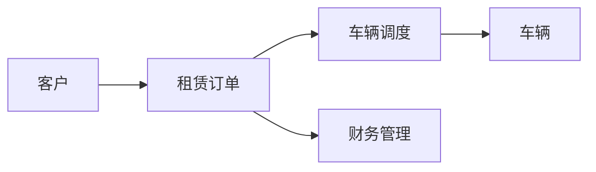

# 汽车租凭管理系统详细设计与具体代码实现

## 1. 背景介绍
在现代社会中,汽车已成为人们日常出行的重要交通工具之一。然而,并非每个人都拥有自己的汽车,或者在某些特定场合需要租赁不同类型的车辆。为了满足人们日益增长的用车需求,汽车租赁行业应运而生。
汽车租赁是指将车辆租借给客户使用一段时间,并在约定时间内归还车辆的服务。为了更好地管理汽车租赁业务,提高工作效率和客户满意度,开发一套功能完善、易于操作的汽车租凭管理系统势在必行。
本文将详细阐述汽车租凭管理系统的设计思路和具体实现过程,包括系统架构、核心功能模块、数据库设计、关键算法原理以及代码实现等方面。通过对系统的全面剖析,旨在为读者提供一个完整的汽车租凭管理系统开发指南。

## 2. 核心概念与联系
在汽车租凭管理系统中,涉及到以下几个核心概念:
- 车辆:指可供租赁的各类型汽车,包括轿车、SUV、商务车等。每辆车都有自己的属性,如车牌号、品牌、型号、座位数、燃料类型等。
- 客户:指租赁汽车的个人或企业。客户需要提供身份信息、联系方式等,以便系统进行管理和跟踪。
- 租赁订单:指客户租赁车辆的记录,包含租赁车辆信息、租赁时间、租金、保险等详细内容。
- 车辆调度:指根据客户的租赁需求,合理安排车辆的调度和分配,确保车辆的高效利用和及时供应。
- 财务管理:指对汽车租赁业务的收支情况进行记录和管理,包括租金结算、车辆维护费用、保险费用等。

这些核心概念之间存在着紧密的联系。客户通过租赁订单租赁车辆,系统根据订单信息进行车辆调度,并对相关财务数据进行管理。同时,车辆的属性和状态也会影响到订单的创建和执行。理解这些概念之间的关系,对于设计和开发汽车租凭管理系统至关重要。

以下是汽车租凭管理系统的核心概念和联系的 Mermaid 流程图:


## 3. 核心算法原理具体操作步骤
汽车租凭管理系统中的核心算法主要涉及车辆调度和优化。以下是一种基于贪心算法的车辆调度算法的具体操作步骤:
1. 收集当前所有待调度的租赁订单信息,包括租赁时间、地点、车型需求等。
2. 根据订单的租赁开始时间,对订单进行升序排序。
3. 遍历排序后的订单列表,对于每个订单:
   1. 在可用车辆列表中,找到符合订单车型需求且在订单租赁时间内空闲的车辆。
   2. 如果找到了可用车辆,将该车辆分配给当前订单,并将车辆标记为已占用。
   3. 如果没有找到可用车辆,则将当前订单加入到待调度订单队列中。
4. 对于待调度订单队列中的订单,可以考虑以下优化策略:
   1. 尝试调整已分配车辆的调度计划,看是否可以腾出车辆满足待调度订单。
   2. 考虑租赁外部车辆或与其他租赁公司合作,以满足订单需求。
   3. 与客户沟通,看是否可以调整租赁时间或接受其他车型,以匹配可用车辆。
5. 重复步骤3-4,直到所有订单都得到处理或无法找到可行的调度方案。

以上是车辆调度算法的基本操作步骤。在实际实现中,还需要考虑更多的约束条件和优化目标,如车辆的地理位置、路程安排、成本最小化等,以提高调度的效率和质量。

## 4. 数学模型和公式详细讲解举例说明
在汽车租凭管理系统中,可以使用数学模型来描述和优化车辆调度问题。以下是一个简化的车辆调度数学模型:

设有 $n$ 个租赁订单和 $m$ 辆可用车辆。对于第 $i$ 个订单,用 $(s_i, e_i)$ 表示其租赁开始时间和结束时间,用 $d_i$ 表示其车型需求。对于第 $j$ 辆车,用 $t_j$ 表示其车型。

定义决策变量 $x_{ij}$:
$$
x_{ij} = \begin{cases}
1, & \text{如果第 $j$ 辆车被分配给第 $i$ 个订单} \\
0, & \text{否则}
\end{cases}
$$

目标函数:
$$
\max \sum_{i=1}^n \sum_{j=1}^m x_{ij}
$$

约束条件:
$$
\sum_{j=1}^m x_{ij} \leq 1, \quad \forall i \in \{1,2,\dots,n\}
$$
$$
\sum_{i=1}^n x_{ij} \leq 1, \quad \forall j \in \{1,2,\dots,m\}
$$
$$
x_{ij} = 0, \quad \text{如果 } t_j \neq d_i, \quad \forall i \in \{1,2,\dots,n\}, \forall j \in \{1,2,\dots,m\}
$$
$$
x_{ij} = 0, \quad \text{如果 } [s_i, e_i] \cap [s_k, e_k] \neq \emptyset, \text{其中 } k \neq i \text{ 且 } x_{kj} = 1, \quad \forall i,k \in \{1,2,\dots,n\}, \forall j \in \{1,2,\dots,m\}
$$

目标函数表示最大化分配的订单数量。第一个约束条件确保每个订单最多分配一辆车,第二个约束条件确保每辆车最多分配给一个订单。第三个约束条件确保分配的车型与订单需求匹配。第四个约束条件确保同一辆车在同一时间段内不会被分配给多个订单。

以上数学模型可以使用整数规划求解器进行求解,得到最优的车辆调度方案。在实际应用中,还可以考虑更多的实际因素,如车辆的地理位置、道路网络、动态调度等,以进一步优化调度效果。

## 5. 项目实践:代码实例和详细解释说明
以下是使用 Python 实现的汽车租凭管理系统的部分代码示例:

```python
class Vehicle:
    def __init__(self, plate_number, brand, model, seats, fuel_type):
        self.plate_number = plate_number
        self.brand = brand
        self.model = model
        self.seats = seats
        self.fuel_type = fuel_type
        self.is_available = True

class Customer:
    def __init__(self, name, contact_info):
        self.name = name
        self.contact_info = contact_info

class RentalOrder:
    def __init__(self, customer, vehicle, start_time, end_time, rental_price, insurance):
        self.customer = customer
        self.vehicle = vehicle
        self.start_time = start_time
        self.end_time = end_time
        self.rental_price = rental_price
        self.insurance = insurance

class RentalSystem:
    def __init__(self):
        self.vehicles = []
        self.customers = []
        self.orders = []

    def add_vehicle(self, vehicle):
        self.vehicles.append(vehicle)

    def add_customer(self, customer):
        self.customers.append(customer)

    def create_order(self, customer, vehicle, start_time, end_time, rental_price, insurance):
        order = RentalOrder(customer, vehicle, start_time, end_time, rental_price, insurance)
        self.