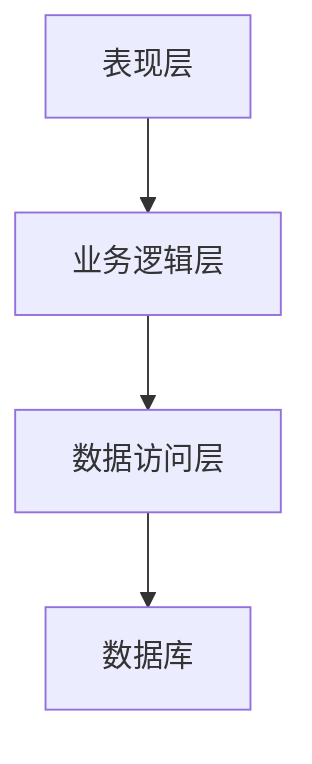
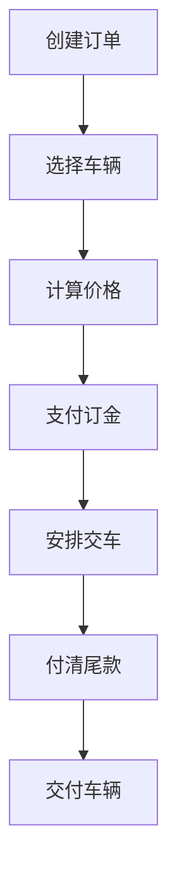

# 汽车销售管理系统的设计与开发

## 1. 背景介绍

### 1.1 汽车销售行业概述

汽车销售行业是一个巨大且不断增长的市场。随着人们生活水平的提高和对出行便利性的需求不断增加,汽车已经成为了现代生活中不可或缺的一部分。因此,高效、便捷的汽车销售管理系统对于汽车销售企业来说至关重要。

### 1.2 传统汽车销售管理的挑战

在传统的汽车销售管理模式下,企业通常依赖纸质文件和人工操作来管理庞大的车辆信息、客户资料、订单处理等繁杂流程。这种方式不仅效率低下,而且容易出现数据丢失、错误等问题,给企业的运营带来了巨大挑战。

### 1.3 现代化汽车销售管理系统的需求

为了提高运营效率、降低成本并提供更好的客户服务体验,汽车销售企业迫切需要一套现代化的汽车销售管理系统。该系统应该能够集中管理车辆信息、客户资料、订单处理、库存控制等各个环节,实现数据的高效共享和流转,从而优化企业的整体运营流程。

## 2. 核心概念与联系

### 2.1 系统架构概览

汽车销售管理系统通常采用分层架构设计,包括表现层(前端)、业务逻辑层(后端)和数据访问层。前端负责与用户交互,后端处理业务逻辑,数据访问层则负责与数据库进行交互。



### 2.2 核心功能模块

汽车销售管理系统的核心功能模块通常包括:

1. **车辆信息管理**:维护车辆详细信息、车型、配置等数据。
2. **客户管理**:记录客户基本信息、购买历史等数据。
3. **订单管理**:处理客户订单、跟踪订单状态。
4. **库存管理**:实时监控车辆库存,支持调拨等操作。
5. **财务管理**:记录销售收入、费用支出等财务数据。
6. **报表分析**:提供多维度的销售数据分析和报表生成。

### 2.3 系统用户角色

汽车销售管理系统通常包括以下主要用户角色:

1. **管理员**:拥有系统的最高权限,可以管理用户、维护基础数据等。
2. **销售顾问**:负责与客户沟通,处理订单等销售相关工作。
3. **财务人员**:记录和管理财务数据,生成报表等。
4. **库存管理员**:负责车辆库存的调拨、盘点等工作。

## 3. 核心算法原理具体操作步骤

### 3.1 订单处理流程

订单处理是汽车销售管理系统的核心流程之一,通常包括以下步骤:

1. **创建订单**:销售顾问在系统中为客户创建新订单,填写相关信息。
2. **选择车辆**:从可售车辆库存中为客户选择合适的车辆。
3. **计算价格**:根据车辆信息和折扣政策计算订单总价。
4. **支付订金**:客户支付一定比例的订金,订单进入已付订金状态。
5. **安排交车**:根据库存情况,为客户安排提车时间和地点。
6. **付清尾款**:客户付清尾款后,订单状态变更为已完成。
7. **交付车辆**:将实物车辆交付给客户,订单流程结束。



### 3.2 库存管理算法

为了高效管理车辆库存,系统需要采用合理的库存管理算法,例如:

1. **先进先出(FIFO)**:先售出先入库的车辆,确保车辆流转。
2. **缓冲库存**:根据历史销量数据,维护一定数量的缓冲库存,以应对峰值需求。
3. **库存盘点**:定期或不定期对实际库存进行盘点,发现并处理库存差异。
4. **库存调拨**:根据各地区销售情况,对库存进行适当调拨,以满足需求。

## 4. 数学模型和公式详细讲解举例说明

在汽车销售管理系统中,有一些常见的数学模型和公式需要了解和应用。

### 4.1 订单价格计算

订单价格的计算通常遵循以下公式:

$$
总价格 = 车辆价格 - 折扣 + 附加费用
$$

其中:

- $车辆价格$是该车型的建议零售价格
- $折扣$可能包括各种优惠政策,如现金折扣、贷款优惠等
- $附加费用$可能包括运费、保险费等

例如,某辆车的建议零售价为20万元,现金优惠2万元,另有1万元的运费,则最终订单价格为:

$$
总价格 = 200000 - 20000 + 10000 = 190000 (元)
$$

### 4.2 库存管理模型

在库存管理中,我们需要平衡库存水平和成本。一种常见的模型是经济订货量(EOQ)模型,用于确定最优订货量。EOQ模型的公式如下:

$$
EOQ = \sqrt{\frac{2DC}{H}}
$$

其中:

- $D$是年度需求量
- $C$是每次订货的固定成本
- $H$是每单位产品的年度存货成本

假设某车型年销量为1000辆,每次订货固定成本为5000元,每辆车的年度存货成本为1000元,则最优订货量为:

$$
EOQ = \sqrt{\frac{2 \times 1000 \times 5000}{1000}} = 100 (辆)
$$

### 4.3 销售预测模型

为了更好地管理库存和制定销售策略,我们需要对未来的销售情况进行预测。一种常见的预测模型是指数平滑模型,公式如下:

$$
F_{t+1} = \alpha Y_t + (1 - \alpha) F_t
$$

其中:

- $F_{t+1}$是下一期的预测值
- $Y_t$是本期的实际值
- $F_t$是本期的预测值
- $\alpha$是平滑常数,介于0和1之间

假设上个月某车型的实际销量为120辆,预测销量为100辆,平滑常数取0.3,则下个月的预测销量为:

$$
F_{t+1} = 0.3 \times 120 + (1 - 0.3) \times 100 = 106 (辆)
$$

## 5. 项目实践: 代码实例和详细解释说明

为了更好地理解汽车销售管理系统的实现,我们将提供一些核心模块的代码示例和详细解释。

### 5.1 车辆信息管理模块

该模块负责维护车辆的基本信息、配置等数据。以下是一个使用Python和SQLAlchemy实现的示例:

```python
from sqlalchemy import Column, Integer, String, Float, ForeignKey
from sqlalchemy.orm import relationship
from sqlalchemy.ext.declarative import declarative_base

Base = declarative_base()

class Vehicle(Base):
    __tablename__ = 'vehicles'

    id = Column(Integer, primary_key=True)
    make = Column(String)
    model = Column(String)
    year = Column(Integer)
    price = Column(Float)

    configurations = relationship('VehicleConfiguration', back_populates='vehicle')

class VehicleConfiguration(Base):
    __tablename__ = 'vehicle_configurations'

    id = Column(Integer, primary_key=True)
    vehicle_id = Column(Integer, ForeignKey('vehicles.id'))
    engine = Column(String)
    transmission = Column(String)
    color = Column(String)

    vehicle = relationship('Vehicle', back_populates='configurations')
```

在这个示例中,我们定义了两个模型类`Vehicle`和`VehicleConfiguration`。`Vehicle`类存储车辆的基本信息,如品牌、型号、年份和价格。`VehicleConfiguration`类则存储每辆车的具体配置,如发动机、变速箱和颜色。两个类通过一对多关系相关联。

使用SQLAlchemy的关系映射,我们可以方便地将这些模型持久化到数据库中,并进行增删改查等操作。

### 5.2 订单管理模块

该模块负责处理客户订单,包括创建订单、计算价格、更新订单状态等功能。以下是一个使用Python和Flask实现的示例:

```python
from flask import Flask, request, jsonify
from models import Order, Vehicle, db

app = Flask(__name__)

@app.route('/orders', methods=['POST'])
def create_order():
    data = request.get_json()
    vehicle_id = data['vehicle_id']
    customer_id = data['customer_id']

    vehicle = Vehicle.query.get(vehicle_id)
    if not vehicle:
        return jsonify({'error': 'Invalid vehicle ID'}), 400

    order = Order(vehicle=vehicle, customer_id=customer_id, status='pending')
    order.calculate_total_price()
    db.session.add(order)
    db.session.commit()

    return jsonify({'order_id': order.id}), 201

@app.route('/orders/<int:order_id>', methods=['PUT'])
def update_order(order_id):
    data = request.get_json()
    order = Order.query.get(order_id)
    if not order:
        return jsonify({'error': 'Invalid order ID'}), 404

    if 'status' in data:
        order.status = data['status']
    if 'down_payment' in data:
        order.down_payment = data['down_payment']

    db.session.commit()
    return jsonify({'message': 'Order updated successfully'})
```

在这个示例中,我们使用Flask框架构建了一个简单的RESTful API。`/orders`端点允许创建新订单,它接受车辆ID和客户ID作为输入,并根据车辆信息计算订单总价。`/orders/<int:order_id>`端点则允许更新现有订单的状态和订金金额。

这只是一个简单的示例,实际的订单管理模块可能需要处理更多的业务逻辑,如库存检查、付款处理等。

## 6. 实际应用场景

汽车销售管理系统在现实中有广泛的应用场景,可以为汽车销售企业带来诸多好处。

### 6.1 提高运营效率

通过将传统的手工操作流程转移到系统中,汽车销售管理系统可以显著提高企业的运营效率。员工无需再手动处理大量繁琐的文书工作,从而可以将更多精力集中在核心销售工作上。

### 6.2 优化库存管理

系统可以实时跟踪车辆库存情况,并根据销售数据和预测模型进行智能库存调度,避免库存积压或缺货的情况发生。这不仅可以减少资金占用,还能提高客户满意度。

### 6.3 改善客户服务体验

通过系统,销售顾问可以更高效地为客户提供个性化的服务,如快速查询车辆信息、实时跟踪订单状态等。同时,系统还可以帮助企业制定针对性的营销策略,提升客户粘性。

### 6.4 数据分析和决策支持

系统中汇集了大量的销售数据,企业可以基于这些数据进行多维度的分析,洞察市场趋势和客户需求,从而制定更加科学的经营策略和决策。

## 7. 工具和资源推荐

在设计和开发汽车销售管理系统时,可以利用一些优秀的工具和资源来提高效率和质量。

### 7.1 开发工具

- **IDE**: 推荐使用 Visual Studio Code、PyCharm 等功能强大的 IDE,它们可以提供代码编辑、调试、版本控制等全面的支持。
- **版本控制**: 使用 Git 等版本控制工具来管理代码,方便协作和追踪变更。
- **容器化**: 考虑使用 Docker 等容器技术,可以简化应用程序的部署和运行环境管理。

### 7.2 框架和库

- **Web 框架**: 对于后端开发,可以选择 Flask、Django(Python)、Spring Boot(Java)等成熟的 Web 框架。
- **前端框架**: 对于前端开发,可以使用 React、Angular、Vue.js 等现代前端框架。
- **ORM**: 使用 SQLAlchemy(Python)、Hibernate(Java)等对象关系映射(ORM)工具,可以简化数据库操作。