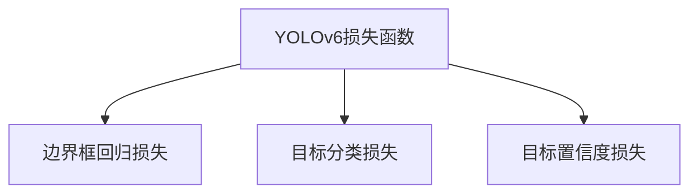

# 深入理解YOLOv6的损失函数：精准定位与分类的基石

## 1.背景介绍

### 1.1 目标检测任务概述

目标检测是计算机视觉领域的核心任务之一,旨在从给定图像或视频中定位和识别感兴趣的目标。它广泛应用于安防监控、自动驾驶、机器人导航等领域。目标检测任务需要同时解决目标的分类和定位两个子任务,即确定图像中存在哪些目标类别,并精确定位每个目标在图像中的位置和大小。

### 1.2 目标检测算法发展历程

早期的目标检测算法主要基于传统机器学习方法,如滑动窗口+手工特征+分类器的流程。该类算法存在计算复杂度高、泛化能力差等缺陷。2012年,Hinton团队提出的基于深度卷积神经网络(CNN)的AlexNet模型在ImageNet大赛中取得巨大成功,开启了深度学习在计算机视觉领域的新时代。

2014年,Girshick等人提出了基于区域的卷积神经网络(R-CNN)目标检测算法,将深度学习首次成功应用于目标检测任务,取得了里程碑式的进展。之后,Fast/Faster R-CNN、YOLO、SSD等一系列改进算法不断涌现,在速度和精度上都有了大幅提升。

### 1.3 YOLO系列算法概述  

YOLO(You Only Look Once)是一种基于单阶段的目标检测算法,具有速度快、端到端预测的优点。相比两阶段目标检测算法(如Faster R-CNN),YOLO算法的推理速度更快,更适合实时应用场景。YOLO将目标检测任务建模为回归问题,直接从全图预测目标边界框和类别概率。

YOLOv6是YOLO系列算法的最新版本,于2023年3月发布,在保持高速推理的同时,精度也有了大幅提升,在多个公开数据集上取得了新的最佳性能。本文将重点探讨YOLOv6的核心——损失函数,揭示它如何驱动网络精准定位和分类目标。

## 2.核心概念与联系

### 2.1 损失函数在目标检测中的作用

在目标检测任务中,损失函数扮演着至关重要的角色。它定义了模型预测与真实标注之间的差异,是优化目标函数的核心。模型在训练过程中,通过最小化损失函数,不断调整网络参数,从而提高定位和分类的准确性。

损失函数的设计直接影响了模型的收敛性和泛化能力。一个好的损失函数应当具备以下特性:

1. **精准度量**:能够准确度量预测结果与真实标注之间的差异。
2. **可微性**:对于深度学习模型,损失函数需要可导以支持基于梯度的优化算法。
3. **鲁棒性**:对异常值和噪声具有一定的鲁棒性,避免过度拟合。
4. **简单高效**:计算高效,避免过于复杂的设计增加计算开销。

### 2.2 YOLOv6损失函数概述

YOLOv6的损失函数由三部分组成:

1. **边界框回归损失(Box Regression Loss)**,用于度量预测边界框与真实边界框之间的几何差异。
2. **目标分类损失(Object Classification Loss)**,用于度量预测类别概率与真实类别之间的差异。
3. **目标置信度损失(Object Confidence Loss)**,用于度量预测目标存在与否的置信度与真实情况之间的差异。

这三部分损失函数的总和构成了YOLOv6的整体损失函数。在训练过程中,模型会通过梯度下降等优化算法,最小化总损失函数,从而提高定位和分类的精度。



## 3.核心算法原理具体操作步骤

### 3.1 边界框回归损失

边界框回归损失旨在最小化预测边界框与真实边界框之间的几何差异。YOLOv6采用了改进的GIoU(Generalized IoU)损失函数,即DIoU(Distance-IoU)损失。

DIoU损失在标准IoU损失的基础上,引入了两个新的项:

1. **中心点距离惩罚项(Penalty for Center Distance)**,鼓励预测边界框的中心点靠近真实边界框的中心点。
2. **长宽比惩罚项(Penalty for Aspect Ratio)**,鼓励预测边界框的长宽比接近真实边界框的长宽比。

DIoU损失的公式如下:

$$
L_{DIoU} = 1 - IoU + \frac{ρ^2(b,b^{gt})}{c^2} + \frac{ρ_{arctan}(w,h,w^{gt},h^{gt})}{π^2}
$$

其中:

- $IoU$是标准的交并比(Intersection over Union)
- $ρ(b,b^{gt})$是预测边界框中心点与真实边界框中心点之间的欧几里得距离
- $c$是对角线距离的最小值,用于归一化中心点距离惩罚项
- $ρ_{arctan}$是预测边界框与真实边界框长宽比之间的差异

通过引入这两个惩罚项,DIoU损失函数能够更好地约束预测边界框的位置和形状,从而提高定位精度。

### 3.2 目标分类损失

目标分类损失用于度量预测类别概率与真实类别之间的差异。YOLOv6采用了FocalLoss作为分类损失函数,以解决样本不平衡问题。

FocalLoss的公式如下:

$$
L_{FL}(p_t) = -(1-p_t)^{\gamma}\log(p_t)
$$

其中:

- $p_t$是预测的类别概率
- $\gamma$是调节因子,用于平衡简单样本和困难样本之间的权重

当$\gamma=0$时,FocalLoss等同于标准的交叉熵损失函数。当$\gamma>0$时,FocalLoss会对于正确分类的简单样本给予较小的损失权重,而对于错分的困难样本给予较大的损失权重,从而更加关注困难样本,提高模型的泛化能力。

### 3.3 目标置信度损失

目标置信度损失用于度量预测目标存在与否的置信度与真实情况之间的差异。YOLOv6采用了二值交叉熵损失函数(Binary Cross Entropy Loss)作为置信度损失。

二值交叉熵损失的公式如下:

$$
L_{BCE}(p,y) = -y\log(p) - (1-y)\log(1-p)
$$

其中:

- $p$是预测的目标存在置信度
- $y$是真实标签,取值为0或1,表示目标是否存在

通过最小化目标置信度损失,网络可以学习到更准确的目标存在与否的判断能力,从而减少假阳性和假阴性的情况。

### 3.4 总损失函数

YOLOv6的总损失函数是上述三个损失函数的加权和:

$$
L_{total} = L_{DIoU} + \lambda_{cls}L_{FL} + \lambda_{obj}L_{BCE}
$$

其中:

- $\lambda_{cls}$和$\lambda_{obj}$是分类损失和置信度损失的权重系数,用于平衡三个损失项的相对重要性。

在训练过程中,YOLOv6通过梯度下降等优化算法,最小化总损失函数,从而同时提高边界框回归、目标分类和目标置信度的精度。

## 4.数学模型和公式详细讲解举例说明

在本节中,我们将详细解释YOLOv6损失函数中涉及的数学模型和公式,并通过具体示例加深理解。

### 4.1 IoU(Intersection over Union)

IoU是衡量两个边界框之间重叠程度的常用指标。它计算两个边界框相交区域与并集区域的比值,范围在0到1之间。

$$
IoU = \frac{Area\ of\ Overlap}{Area\ of\ Union}
$$

例如,如果预测边界框为$b_p=(x_p,y_p,w_p,h_p)$,真实边界框为$b_g=(x_g,y_g,w_g,h_g)$,则它们的IoU可以计算如下:

```python
# 计算相交区域的坐标
x1 = max(x_p, x_g)
y1 = max(y_p, y_g)
x2 = min(x_p+w_p, x_g+w_g)
y2 = min(y_p+h_p, y_g+h_g)

# 计算相交区域面积
intersection = max(0, x2-x1+1) * max(0, y2-y1+1)

# 计算并集面积
area_p = w_p * h_p
area_g = w_g * h_g
union = area_p + area_g - intersection

# 计算IoU
iou = intersection / union
```

IoU值越大,表示两个边界框之间的重叠程度越高。

### 4.2 GIoU(Generalized IoU)

GIoU是IoU的改进版本,它在IoU的基础上引入了惩罚项,鼓励预测边界框的形状和位置更加接近真实边界框。

$$
GIoU = IoU - \frac{|C-\bigcup B|}{|C|}
$$

其中:

- $C$是两个边界框的最小外接矩形
- $\bigcup B$是两个边界框的并集区域

第二项是惩罚项,它衡量了两个边界框并集区域与最小外接矩形之间的差异。当预测边界框与真实边界框的形状和位置更加一致时,惩罚项会变小,从而提高GIoU的值。

例如,如果预测边界框为$b_p=(x_p,y_p,w_p,h_p)$,真实边界框为$b_g=(x_g,y_g,w_g,h_g)$,则它们的GIoU可以计算如下:

```python
# 计算IoU
# ... (同上)

# 计算最小外接矩形的坐标
x1_c = min(x_p, x_g)
y1_c = min(y_p, y_g)
x2_c = max(x_p+w_p, x_g+w_g)
y2_c = max(y_p+h_p, y_g+h_g)

# 计算最小外接矩形面积
area_c = (x2_c-x1_c+1) * (y2_c-y1_c+1)

# 计算惩罚项
penalty = (area_c - union) / area_c

# 计算GIoU
giou = iou - penalty
```

GIoU损失函数通常比标准IoU损失函数表现更好,因为它不仅考虑了重叠程度,还考虑了形状和位置的一致性。

### 4.3 DIoU(Distance-IoU)

DIoU是GIoU的进一步改进版本,它在GIoU的基础上引入了两个新的惩罚项:中心点距离惩罚项和长宽比惩罚项。

$$
L_{DIoU} = 1 - IoU + \frac{ρ^2(b,b^{gt})}{c^2} + \frac{ρ_{arctan}(w,h,w^{gt},h^{gt})}{π^2}
$$

**中心点距离惩罚项**鼓励预测边界框的中心点靠近真实边界框的中心点。它计算两个边界框中心点之间的欧几里得距离,并将其归一化到对角线距离的最小值。

$$
\frac{ρ^2(b,b^{gt})}{c^2} = \frac{(x_p-x_g)^2 + (y_p-y_g)^2}{c^2}
$$

其中$c=\sqrt{(w_g^2+h_g^2)}$。

**长宽比惩罚项**鼓励预测边界框的长宽比接近真实边界框的长宽比。它计算两个边界框长宽比之间的差异,并将其归一化到$π^2$。

$$
\frac{ρ_{arctan}(w,h,w^{gt},h^{gt})}{π^2} = \frac{4}{\pi^2}\arctan\left(\frac{w^{gt}}{h^{gt}}\right) - \arctan\left(\frac{w}{h}\right)
$$

通过引入这两个惩罚项,DIoU损失函数能够更好地约束预测边界框的位置和形状,从而提高定位精度。

### 4.4 FocalLoss

FocalLoss是一种改进的交叉