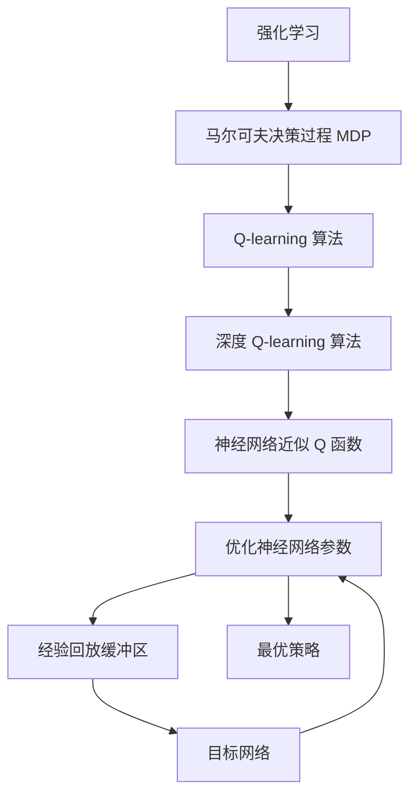

# 深度 Q-learning：优化算法的使用

## 1.背景介绍

### 1.1 强化学习概述

强化学习(Reinforcement Learning, RL)是机器学习的一个重要分支,旨在让智能体(Agent)通过与环境(Environment)的交互来学习如何采取最优策略,以最大化预期的累积奖励。与监督学习和无监督学习不同,强化学习没有提供标准的答案,智能体需要通过不断尝试和探索,从环境中获取反馈信号(Reward),并根据这些反馈调整自身的策略。

强化学习的核心思想是"试错与奖惩",智能体通过在环境中采取行动,获得相应的奖励或惩罚,从而学习到一种最优的行为策略。这种学习过程类似于人类或动物的学习方式,通过不断的实践和经验积累,逐步优化自身的行为决策。

### 1.2 Q-learning 算法简介

Q-learning 是强化学习中最著名和最成功的算法之一,它属于基于价值(Value-based)的无模型(Model-free)算法。Q-learning 的核心思想是估计一个行为价值函数 Q(s,a),表示在状态 s 下采取行动 a 后可获得的预期累积奖励。通过不断更新和优化这个 Q 函数,智能体可以逐步学习到一种最优的策略。

Q-learning 算法的优点在于,它不需要事先了解环境的转移概率模型,只需要通过与环境交互获取奖励信号,就可以逐步学习到最优策略。此外,Q-learning 算法具有收敛性和无偏性,在满足一定条件下,可以保证最终收敛到最优的 Q 函数。

然而,传统的 Q-learning 算法也存在一些局限性,例如在处理高维状态空间和连续动作空间时,性能会受到限制。为了解决这些问题,研究人员提出了深度 Q-learning 算法,将深度神经网络引入到 Q-learning 中,从而提高了算法的表现力和泛化能力。

### 1.3 深度 Q-learning 算法概述

深度 Q-learning(Deep Q-learning, DQN)是将深度神经网络与 Q-learning 算法相结合的一种强化学习算法。它利用神经网络来逼近和表示 Q 函数,从而克服了传统 Q-learning 算法在处理高维状态空间和连续动作空间时的困难。

深度 Q-learning 算法的核心思想是使用一个深度神经网络来近似 Q 函数,即 Q(s,a) ≈ Q(s,a;θ),其中 θ 表示神经网络的参数。在训练过程中,通过不断优化神经网络参数 θ,使得 Q(s,a;θ) 逐步逼近真实的 Q 函数。

与传统的 Q-learning 算法相比,深度 Q-learning 算法具有以下优点:

1. 强大的表现力和泛化能力,能够处理高维状态空间和连续动作空间。
2. 利用深度神经网络的近似能力,可以学习到更复杂的状态-行为映射关系。
3. 可以直接从原始数据(如图像、语音等)中学习,无需手工设计特征。

然而,深度 Q-learning 算法也面临一些挑战,例如训练不稳定、样本效率低下等问题。为了解决这些问题,研究人员提出了一系列优化算法和技巧,如经验回放(Experience Replay)、目标网络(Target Network)、双重 Q-learning(Double Q-learning)等,使得深度 Q-learning 算法在实际应用中表现更加出色。

## 2.核心概念与联系

### 2.1 马尔可夫决策过程(MDP)

马尔可夫决策过程(Markov Decision Process, MDP)是强化学习中的一个基本框架,用于描述智能体与环境之间的交互过程。MDP 由以下几个要素组成:

- 状态集合 S: 表示环境中可能出现的所有状态。
- 动作集合 A: 表示智能体可以采取的所有可能动作。
- 转移概率 P(s'|s,a): 表示在状态 s 下采取动作 a 后,转移到状态 s' 的概率。
- 奖励函数 R(s,a,s'): 表示在状态 s 下采取动作 a 后,转移到状态 s' 时获得的即时奖励。
- 折扣因子 γ: 用于权衡即时奖励和未来奖励的重要性,取值范围为 [0,1]。

在 MDP 框架下,强化学习的目标是找到一个最优策略 π*,使得在该策略下,智能体可以获得最大化的预期累积奖励。

### 2.2 Q-learning 算法原理

Q-learning 算法是一种基于价值函数的无模型强化学习算法,它通过估计行为价值函数 Q(s,a) 来学习最优策略。Q(s,a) 表示在状态 s 下采取动作 a 后,可获得的预期累积奖励。

Q-learning 算法的核心思想是通过不断更新 Q 函数,使其逐步逼近真实的 Q 函数。更新公式如下:

$$Q(s_t, a_t) \leftarrow Q(s_t, a_t) + \alpha \left[ r_t + \gamma \max_{a} Q(s_{t+1}, a) - Q(s_t, a_t) \right]$$

其中:

- $\alpha$ 是学习率,控制更新步长的大小。
- $r_t$ 是在状态 $s_t$ 下采取动作 $a_t$ 后获得的即时奖励。
- $\gamma$ 是折扣因子,用于权衡即时奖励和未来奖励的重要性。
- $\max_{a} Q(s_{t+1}, a)$ 是在下一状态 $s_{t+1}$ 下,所有可能动作的最大 Q 值,表示最优预期累积奖励。

通过不断更新 Q 函数,Q-learning 算法最终可以收敛到最优的 Q 函数,从而得到最优策略。

### 2.3 深度 Q-learning 算法

深度 Q-learning 算法是将深度神经网络引入到 Q-learning 算法中,用于近似和表示 Q 函数。它的核心思想是使用一个深度神经网络 Q(s,a;θ) 来逼近真实的 Q 函数,其中 θ 表示神经网络的参数。

在训练过程中,深度 Q-learning 算法通过不断优化神经网络参数 θ,使得 Q(s,a;θ) 逐步逼近真实的 Q 函数。优化目标是最小化以下损失函数:

$$L(\theta) = \mathbb{E}_{(s,a,r,s')\sim D} \left[ \left( r + \gamma \max_{a'} Q(s', a';\theta^-) - Q(s, a;\theta) \right)^2 \right]$$

其中:

- D 是经验回放缓冲区(Experience Replay Buffer),用于存储智能体与环境交互过程中获得的经验数据。
- $\theta^-$ 是目标网络(Target Network)的参数,用于计算目标 Q 值,以提高训练稳定性。
- $r$ 是即时奖励,$(s,a,r,s')$ 是从经验回放缓冲区中采样的一个转移样本。

通过梯度下降等优化算法,不断更新神经网络参数 θ,使得损失函数 L(θ) 最小化,从而逼近真实的 Q 函数。

深度 Q-learning 算法的优点在于,它利用了深度神经网络的强大表现力和泛化能力,可以处理高维状态空间和连续动作空间,并且可以直接从原始数据(如图像、语音等)中学习,无需手工设计特征。然而,它也面临一些挑战,如训练不稳定、样本效率低下等,需要采用一些优化技巧来提高算法的性能。

### 2.4 核心概念关系图

以下是深度 Q-learning 算法中核心概念之间的关系图:

上图展示了从强化学习到深度 Q-learning 算法的核心概念演化过程。强化学习基于马尔可夫决策过程(MDP)框架,Q-learning 算法通过估计 Q 函数来学习最优策略。深度 Q-learning 算法则利用神经网络来近似 Q 函数,通过优化神经网络参数来逼近真实的 Q 函数,从而获得最优策略。在优化过程中,引入了经验回放缓冲区和目标网络等技巧,以提高训练稳定性和样本效率。

## 3.核心算法原理具体操作步骤

深度 Q-learning 算法的具体操作步骤如下:

1. **初始化**
   - 初始化深度神经网络 Q(s,a;θ),用于近似 Q 函数,其中 θ 是网络参数。
   - 初始化目标网络 Q'(s,a;θ'),其参数 θ' 初始化为与 Q 网络相同。
   - 初始化经验回放缓冲区 D,用于存储智能体与环境交互过程中获得的经验数据。

2. **与环境交互并存储经验**
   - 从当前状态 s 出发,根据 ε-greedy 策略选择一个动作 a。
   - 在环境中执行动作 a,观测到下一状态 s'、获得即时奖励 r。
   - 将转移样本 (s,a,r,s') 存储到经验回放缓冲区 D 中。

3. **从经验回放缓冲区采样数据**
   - 从经验回放缓冲区 D 中随机采样一个批次的转移样本 (s,a,r,s')。

4. **计算目标 Q 值**
   - 对于每个转移样本中的下一状态 s',使用目标网络 Q'(s',a';θ') 计算所有可能动作的 Q 值。
   - 计算目标 Q 值 y = r + γ * max_a' Q'(s',a';θ')。

5. **更新 Q 网络参数**
   - 计算当前 Q 网络在当前状态 s 和动作 a 下的预测值 Q(s,a;θ)。
   - 计算损失函数 L(θ) = (y - Q(s,a;θ))^2。
   - 使用梯度下降等优化算法,根据损失函数的梯度更新 Q 网络参数 θ。

6. **更新目标网络参数**
   - 每隔一定步骤,将 Q 网络的参数 θ 复制到目标网络参数 θ'。

7. **重复步骤 2-6,直到算法收敛**
   - 算法收敛的条件可以是预设的最大迭代次数、平均奖励达到一定阈值等。

在上述过程中,引入了以下几个关键技巧:

- **经验回放缓冲区(Experience Replay Buffer)**: 通过存储智能体与环境交互过程中获得的经验数据,打破数据之间的相关性,提高数据利用效率。
- **目标网络(Target Network)**: 引入一个延迟更新的目标网络,用于计算目标 Q 值,提高训练稳定性。
- **ε-greedy 策略**: 在选择动作时,以一定概率 ε 选择随机动作,以探索环境;以概率 1-ε 选择当前 Q 值最大的动作,以利用已学习的知识。

通过上述步骤,深度 Q-learning 算法可以逐步优化神经网络参数,使得 Q(s,a;θ) 逼近真实的 Q 函数,从而获得最优策略。

## 4.数学模型和公式详细讲解举例说明

在深度 Q-learning 算法中,涉及到一些重要的数学模型和公式,下面将对它们进行详细讲解和举例说明。

### 4.1 马尔可夫决策过程(MDP)

马尔可夫决策过程(Markov Decision Process, MDP)是强化学习中的一个基本框架,用于描述智能体与环境之间的交互过程。MDP 由以下几个要素组成:

- 状态集合 S: 表示环境中可能出现的所有状态