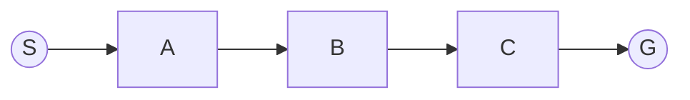

# 深度 Q-learning：在自然语言处理中的应用

## 1.背景介绍

### 1.1 自然语言处理概述

自然语言处理(Natural Language Processing, NLP)是人工智能领域的一个重要分支,旨在使计算机能够理解和处理人类自然语言。它涉及多个领域,包括计算机科学、语言学、认知科学等。NLP的应用非常广泛,包括机器翻译、问答系统、文本分类、信息抽取、自动摘要等。

随着深度学习技术的发展,NLP领域取得了长足的进步。传统的NLP方法主要依赖于规则和特征工程,而深度学习模型可以自动从大量数据中学习特征表示,避免了手工设计特征的繁琐过程。

### 1.2 强化学习与 Q-learning 简介

强化学习(Reinforcement Learning, RL)是机器学习的一个重要分支,它关注如何基于环境的反馈信号(reward)来学习一个最优策略(policy)。在强化学习中,智能体(agent)通过与环境(environment)进行交互,根据观测到的状态(state)选择行动(action),并获得相应的奖励(reward)。目标是最大化累积奖励。

Q-learning是强化学习中的一种经典算法,它属于无模型(model-free)的价值迭代(value iteration)方法。Q-learning通过学习状态-行动对(state-action pair)的价值函数(value function),来获得最优策略。

### 1.3 深度 Q-learning (Deep Q-Network, DQN)

传统的 Q-learning 算法在处理高维观测数据(如图像、语音等)时,由于需要维护一个巨大的 Q 表,会遇到维数灾难(curse of dimensionality)的问题。深度 Q-learning 通过将深度神经网络(Deep Neural Network, DNN)与 Q-learning 相结合,可以有效解决这一问题。

深度 Q-网络(Deep Q-Network, DQN)是第一个将深度学习成功应用于强化学习的范例。它使用一个深度神经网络来近似 Q 函数,输入是当前状态,输出是每个可能行动的 Q 值。通过训练该神经网络,可以获得一个有效的 Q 函数近似,从而解决高维状态空间的问题。

## 2.核心概念与联系

### 2.1 马尔可夫决策过程(Markov Decision Process, MDP)

马尔可夫决策过程(MDP)是强化学习的数学基础。它由以下几个要素组成:

- 状态集合(State Space) $\mathcal{S}$
- 行动集合(Action Space) $\mathcal{A}$
- 转移概率(Transition Probability) $\mathcal{P}_{ss'}^a = \Pr(s' | s, a)$
- 奖励函数(Reward Function) $\mathcal{R}_s^a = \mathbb{E}[r | s, a]$
- 折扣因子(Discount Factor) $\gamma \in [0, 1)$

目标是找到一个最优策略(Optimal Policy) $\pi^*$,使得在该策略下的期望累积折扣奖励最大化:

$$
\pi^* = \arg\max_\pi \mathbb{E}_\pi \left[ \sum_{t=0}^\infty \gamma^t r_t \right]
$$

### 2.2 Q-learning 算法

Q-learning 算法通过学习状态-行动对的价值函数 $Q(s, a)$ 来获得最优策略。$Q(s, a)$ 表示在状态 $s$ 下选择行动 $a$,之后能获得的期望累积折扣奖励。

Q-learning 算法的核心更新规则如下:

$$
Q(s_t, a_t) \leftarrow Q(s_t, a_t) + \alpha \left[ r_t + \gamma \max_{a'} Q(s_{t+1}, a') - Q(s_t, a_t) \right]
$$

其中 $\alpha$ 是学习率,用于控制新增信息对 $Q$ 值的影响程度。

在传统的 Q-learning 算法中,需要维护一个巨大的 Q 表来存储所有状态-行动对的 Q 值。这在高维状态空间下是不可行的。

### 2.3 深度 Q-网络(Deep Q-Network, DQN)

深度 Q-网络(DQN)将深度神经网络与 Q-learning 相结合,用于近似 Q 函数。它的核心思想是使用一个参数化的函数近似器(如神经网络) $Q(s, a; \theta) \approx Q^*(s, a)$ 来近似真实的最优 Q 函数 $Q^*(s, a)$。

DQN 算法的训练过程如下:

1. 初始化神经网络参数 $\theta$
2. 从经验回放池(Experience Replay Buffer)中采样一批数据 $(s_t, a_t, r_t, s_{t+1})$
3. 计算目标值 $y_t = r_t + \gamma \max_{a'} Q(s_{t+1}, a'; \theta^-)$,其中 $\theta^-$ 是目标网络(Target Network)的参数
4. 优化损失函数 $L(\theta) = \mathbb{E}_{(s_t, a_t) \sim \rho(\cdot)} \left[ \left( y_t - Q(s_t, a_t; \theta) \right)^2 \right]$,更新 $\theta$
5. 每隔一定步骤,将 $\theta$ 复制到 $\theta^-$

通过上述过程,DQN 可以学习到一个有效的 Q 函数近似,从而解决高维状态空间的问题。

## 3.核心算法原理具体操作步骤

在这一部分,我们将详细介绍深度 Q-学习算法(Deep Q-Learning)的具体操作步骤。

### 3.1 算法流程概览

深度 Q-学习算法的主要流程如下:

1. 初始化深度神经网络(DQN)和目标网络(Target Network)
2. 初始化经验回放池(Experience Replay Buffer)
3. 对于每一个Episode:
    - 初始化环境状态 $s_0$
    - 对于每一个时间步 $t$:
        - 使用 $\epsilon$-贪婪策略选择行动 $a_t$
        - 执行行动 $a_t$,获得奖励 $r_t$ 和新状态 $s_{t+1}$
        - 将转移 $(s_t, a_t, r_t, s_{t+1})$ 存入经验回放池
        - 从经验回放池中采样一批数据,更新 DQN 参数
        - 每隔一定步骤,将 DQN 参数复制到目标网络
4. 直到达到终止条件

接下来,我们将逐步解释上述步骤的细节。

### 3.2 初始化深度神经网络和目标网络

深度 Q-网络(DQN)是一个多层感知机(Multi-Layer Perceptron, MLP),用于近似 Q 函数。它的输入是当前状态 $s_t$,输出是每个可能行动的 Q 值 $Q(s_t, a; \theta)$,其中 $\theta$ 是网络参数。

目标网络(Target Network)是 DQN 的一个副本,用于计算目标值 $y_t$。它的参数 $\theta^-$ 会每隔一定步骤从 DQN 复制过来,以保持相对稳定。

初始化时,DQN 和目标网络的参数可以随机初始化,或者使用预训练模型进行初始化。

### 3.3 初始化经验回放池

经验回放池(Experience Replay Buffer)是一个存储过往转移 $(s_t, a_t, r_t, s_{t+1})$ 的数据结构,通常使用环形缓冲区(Circular Buffer)实现。它的作用是打破数据之间的相关性,提高数据的利用效率。

在初始化时,经验回放池为空。在训练过程中,每个转移都会被存储到经验回放池中。当经验回放池满了之后,新的转移会覆盖最早的转移。

### 3.4 训练过程

在每一个Episode中,智能体(Agent)与环境(Environment)进行交互。具体步骤如下:

1. 初始化环境状态 $s_0$
2. 对于每一个时间步 $t$:
    - 使用 $\epsilon$-贪婪策略选择行动 $a_t$
        - 以概率 $\epsilon$ 随机选择一个行动
        - 以概率 $1 - \epsilon$ 选择 $\arg\max_a Q(s_t, a; \theta)$
    - 执行行动 $a_t$,获得奖励 $r_t$ 和新状态 $s_{t+1}$
    - 将转移 $(s_t, a_t, r_t, s_{t+1})$ 存入经验回放池
    - 从经验回放池中采样一批数据 $(s_j, a_j, r_j, s_{j+1})$
    - 计算目标值 $y_j = r_j + \gamma \max_{a'} Q(s_{j+1}, a'; \theta^-)$
    - 优化损失函数 $L(\theta) = \mathbb{E}_{(s_j, a_j) \sim \rho(\cdot)} \left[ \left( y_j - Q(s_j, a_j; \theta) \right)^2 \right]$,更新 $\theta$
    - 每隔一定步骤,将 $\theta$ 复制到 $\theta^-$
3. 直到达到终止条件(如最大Episode数或收敛)

在上述过程中,有几个关键点需要注意:

1. $\epsilon$-贪婪策略:在训练初期,我们希望智能体多进行探索(Exploration),以发现更多有价值的状态-行动对。随着训练的进行,我们希望智能体逐渐向利用(Exploitation)转变,选择当前已知的最优行动。$\epsilon$ 是一个平衡探索和利用的超参数,通常会随着训练步骤的增加而逐渐减小。

2. 经验回放池:通过从经验回放池中采样数据进行训练,可以打破数据之间的相关性,提高数据的利用效率。同时,也可以避免偶发事件对训练的影响。

3. 目标网络:使用目标网络计算目标值 $y_j$,可以提高训练的稳定性。如果直接使用 DQN 计算目标值,会由于 DQN 参数的不断更新而导致目标值不稳定,影响训练效果。

4. 损失函数:我们使用均方误差(Mean Squared Error, MSE)作为损失函数,优化 DQN 参数 $\theta$,使得 $Q(s_j, a_j; \theta)$ 尽可能接近目标值 $y_j$。

通过上述步骤,DQN 可以逐步学习到一个有效的 Q 函数近似,从而获得最优策略。

## 4.数学模型和公式详细讲解举例说明

在这一部分,我们将详细讲解深度 Q-学习算法中涉及的数学模型和公式,并给出具体的例子说明。

### 4.1 马尔可夫决策过程(MDP)

如前所述,马尔可夫决策过程(MDP)是强化学习的数学基础。它由以下几个要素组成:

- 状态集合(State Space) $\mathcal{S}$
- 行动集合(Action Space) $\mathcal{A}$
- 转移概率(Transition Probability) $\mathcal{P}_{ss'}^a = \Pr(s' | s, a)$
- 奖励函数(Reward Function) $\mathcal{R}_s^a = \mathbb{E}[r | s, a]$
- 折扣因子(Discount Factor) $\gamma \in [0, 1)$

其中,转移概率 $\mathcal{P}_{ss'}^a$ 表示在状态 $s$ 下执行行动 $a$ 后,转移到状态 $s'$ 的概率。奖励函数 $\mathcal{R}_s^a$ 表示在状态 $s$ 下执行行动 $a$ 时,期望获得的即时奖励。折扣因子 $\gamma$ 用于平衡即时奖励和长期累积奖励的权重。

**例子:**

考虑一个简单的网格世界(Grid World)环境,如下图所示:

在这个环境中:

- 状态集合 $\mathcal{S} = \{S, A, B, C, D\}$
- 行动集合 $\mathcal{A} = \{\text{上}, \text{下}, \text{左}, \text{右}\}$
- 转移概率 $\mathcal{P}_{ss'}^a$:
    - 如果执行的行动可以使智能体移动到相邻状态,则转移概率为 1
    - 如果执行的行动会使智能体撞墙