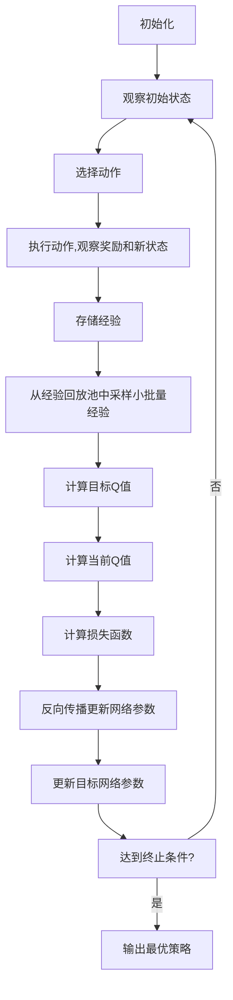

# 深度 Q-learning：在色彩推荐中的应用

## 1. 背景介绍

### 1.1 色彩推荐的重要性

在设计、艺术、时尚等领域中,色彩搭配是一个关键因素。合理的色彩组合不仅能够提升视觉吸引力,更能传达特定的情绪和氛围。然而,对于非专业人士来说,选择合适的色彩并将它们巧妙地结合在一起,往往是一个挑战。这就催生了色彩推荐系统的需求,旨在为用户提供个性化的颜色组合建议。

### 1.2 传统色彩推荐方法的局限性

早期的色彩推荐系统主要依赖于预定义的规则和色彩理论,例如色环、三色配色法则等。尽管这些方法在某些情况下有效,但它们缺乏灵活性和个性化,无法满足不同用户的偏好和需求。此外,这些系统通常无法处理复杂的视觉环境,难以捕捉色彩之间的微妙关系。

## 2. 核心概念与联系

### 2.1 强化学习概述

强化学习(Reinforcement Learning)是机器学习的一个重要分支,它关注智能体(Agent)如何通过与环境(Environment)的交互来学习并优化其行为策略,从而获得最大的累积奖励。在强化学习中,智能体会根据当前状态选择一个行动,然后观察环境的反馈(奖励或惩罚),并据此调整其策略。

### 2.2 Q-learning算法

Q-learning是强化学习中最著名和最广泛使用的算法之一。它旨在找到一个最优策略,使智能体在任何给定状态下采取的行动能够最大化其预期的未来奖励。Q-learning算法通过不断更新一个Q函数(Q-function)来实现这一目标,该函数估计在特定状态下采取特定行动所能获得的长期奖励。

### 2.3 深度 Q-learning (DQN)

尽管传统的Q-learning算法在许多问题上表现出色,但它仍然存在一些局限性,例如无法处理高维状态空间和连续动作空间。深度Q-网络(Deep Q-Network, DQN)则通过将深度神经网络与Q-learning相结合,克服了这些限制。在DQN中,Q函数由一个深度神经网络来近似,从而能够处理复杂的状态和动作空间。

## 3. 核心算法原理具体操作步骤

深度Q-learning算法的核心思想是使用深度神经网络来近似Q函数,并通过经验回放(Experience Replay)和目标网络(Target Network)等技术来提高算法的稳定性和收敛性。下面是深度Q-learning算法的具体操作步骤:



1. **初始化**:初始化评估网络(Q-Network)和目标网络(Target Network),两个网络的权重参数初始时相同。同时初始化经验回放池(Experience Replay Buffer)和其他超参数。

2. **观察初始状态**:从环境中获取初始状态。

3. **选择动作**:根据当前状态,使用评估网络输出所有可能动作的Q值,并根据一定的策略(如ε-贪婪策略)选择一个动作。

4. **执行动作,观察奖励和新状态**:在环境中执行选择的动作,观察到该动作带来的即时奖励和新的状态。

5. **存储经验**:将当前状态、选择的动作、获得的奖励和新状态作为一个经验(Experience)存储到经验回放池中。

6. **从经验回放池中采样小批量经验**:从经验回放池中随机采样一小批量经验,用于训练神经网络。

7. **计算目标Q值**:使用目标网络计算采样经验中新状态的Q值,并根据实际获得的奖励和折扣因子计算目标Q值。

8. **计算当前Q值**:使用评估网络计算采样经验中当前状态和动作对应的Q值。

9. **计算损失函数**:计算目标Q值与当前Q值之间的均方差作为损失函数。

10. **反向传播更新网络参数**:使用优化算法(如随机梯度下降)对评估网络的参数进行反向传播更新,以最小化损失函数。

11. **更新目标网络参数**:每隔一定步数,将评估网络的参数复制到目标网络,以提高算法的稳定性。

12. **达到终止条件?**:检查是否达到预定的终止条件,如最大训练步数或收敛条件。如果达到,则输出当前的最优策略;否则,返回步骤2,继续训练。

通过上述步骤,深度Q-learning算法可以逐步优化评估网络的参数,使其能够近似出最优的Q函数,从而得到最佳的行为策略。

## 4. 数学模型和公式详细讲解举例说明

### 4.1 Q-learning的数学模型

在强化学习中,我们通常将问题建模为一个马尔可夫决策过程(Markov Decision Process, MDP),它由一个元组 $(S, A, P, R, \gamma)$ 表示,其中:

- $S$ 是状态空间,表示环境可能的状态集合
- $A$ 是动作空间,表示智能体可以执行的动作集合
- $P(s'|s,a)$ 是状态转移概率,表示在状态 $s$ 下执行动作 $a$ 后,转移到状态 $s'$ 的概率
- $R(s,a,s')$ 是奖励函数,表示在状态 $s$ 下执行动作 $a$ 后,转移到状态 $s'$ 所获得的即时奖励
- $\gamma \in [0,1)$ 是折扣因子,用于权衡即时奖励和未来奖励的重要性

在 Q-learning 算法中,我们试图找到一个最优的行为策略 $\pi^*$,使得在任何状态 $s$ 下执行该策略所获得的预期累积奖励最大化,即:

$$
\pi^*(s) = \arg\max_\pi \mathbb{E}\left[\sum_{t=0}^\infty \gamma^t R(s_t, a_t, s_{t+1}) | s_0 = s\right]
$$

其中,$ \mathbb{E}[\cdot]$ 表示期望值。

为了找到最优策略,Q-learning 算法引入了 Q 函数 $Q(s,a)$,它表示在状态 $s$ 下执行动作 $a$,然后按照最优策略继续执行所能获得的预期累积奖励。Q 函数满足贝尔曼最优方程:

$$
Q^*(s,a) = \mathbb{E}_{s' \sim P(\cdot|s,a)}\left[R(s,a,s') + \gamma \max_{a'} Q^*(s',a')\right]
$$

通过不断更新 Q 函数,使其逼近最优 Q 函数 $Q^*$,我们就可以得到最优策略 $\pi^*$:

$$
\pi^*(s) = \arg\max_a Q^*(s,a)
$$

### 4.2 Q-learning算法更新规则

在 Q-learning 算法中,我们使用以下更新规则来逐步逼近最优 Q 函数:

$$
Q(s_t, a_t) \leftarrow Q(s_t, a_t) + \alpha \left[R(s_t, a_t, s_{t+1}) + \gamma \max_{a'} Q(s_{t+1}, a') - Q(s_t, a_t)\right]
$$

其中,$ \alpha $ 是学习率,用于控制更新步长的大小。

这个更新规则可以看作是在最小化以下损失函数:

$$
L(s_t, a_t) = \left(R(s_t, a_t, s_{t+1}) + \gamma \max_{a'} Q(s_{t+1}, a') - Q(s_t, a_t)\right)^2
$$

通过不断更新 Q 函数,使得损失函数最小化,我们就可以逐步逼近最优 Q 函数。

### 4.3 深度 Q-网络 (DQN)

在深度 Q-learning 算法中,我们使用一个深度神经网络 $Q(s,a;\theta)$ 来近似 Q 函数,其中 $\theta$ 表示网络的参数。我们的目标是找到一组最优参数 $\theta^*$,使得网络输出的 Q 值接近最优 Q 函数:

$$
\theta^* = \arg\min_\theta \mathbb{E}_{(s,a,r,s') \sim D}\left[\left(r + \gamma \max_{a'} Q(s',a';\theta^-) - Q(s,a;\theta)\right)^2\right]
$$

其中,$ D $ 是经验回放池,$ \theta^- $ 表示目标网络的参数。

我们可以使用随机梯度下降等优化算法来更新网络参数 $\theta$,最小化上述损失函数。同时,为了提高算法的稳定性和收敛性,我们引入了目标网络和经验回放等技术。

通过上述数学模型和公式,我们可以清晰地理解深度 Q-learning 算法的原理和实现细节。

## 5. 项目实践:代码实例和详细解释说明

在这一部分,我们将通过一个实际的代码示例来演示如何使用深度 Q-learning 算法解决色彩推荐问题。我们将使用 PyTorch 框架实现深度 Q-网络,并在一个简单的色彩推荐环境中进行训练和测试。

### 5.1 定义色彩推荐环境

首先,我们需要定义一个色彩推荐环境,用于模拟智能体与环境之间的交互过程。在这个环境中,智能体需要根据给定的目标颜色,从一系列颜色中选择一种或多种颜色进行组合,以最大化与目标颜色的相似度。

```python
import numpy as np

class ColorRecommendationEnv:
    def __init__(self, num_colors=10, target_color=(255, 0, 0)):
        self.num_colors = num_colors
        self.colors = np.random.randint(0, 256, size=(num_colors, 3))
        self.target_color = np.array(target_color)
        self.state = None
        self.reset()

    def reset(self):
        self.state = np.zeros(self.num_colors, dtype=np.int)
        return self.state

    def step(self, action):
        self.state[action] = 1
        reward = -np.sum(np.abs(self.target_color - np.mean(self.colors[self.state == 1], axis=0)))
        done = np.sum(self.state) == 3
        return self.state.copy(), reward, done, {}

    def render(self):
        print(f"Selected colors: {self.colors[self.state == 1]}")
        print(f"Target color: {self.target_color}")
```

在这个环境中,我们随机生成了一组颜色,并设置了一个目标颜色。智能体的状态表示为一个长度为 `num_colors` 的二进制向量,其中 `1` 表示选中该颜色,`0` 表示未选中。智能体的动作是选择一种颜色,奖励函数是根据选中颜色的平均值与目标颜色之间的差异计算得到的。当选中三种颜色时,episode 结束。

### 5.2 实现深度 Q-网络

接下来,我们使用 PyTorch 实现深度 Q-网络。

```python
import torch
import torch.nn as nn
import torch.optim as optim
import torch.nn.functional as F

class DQN(nn.Module):
    def __init__(self, state_dim, action_dim):
        super(DQN, self).__init__()
        self.fc1 = nn.Linear(state_dim, 128)
        self.fc2 = nn.Linear(128, 64)
        self.fc3 = nn.Linear(64, action_dim)

    def forward(self, x):
        x = F.relu(self.fc1(x))
        x = F.relu(self.fc2(x))
        return self.fc3(x)
```

这个深度 Q-网络包含三个全连接层,输入是环境状态,输出是每个动作对应的 Q 值。我们使用 ReLU 激活函数来引入非线性。

### 5.3 实现深度 Q-learning 算法