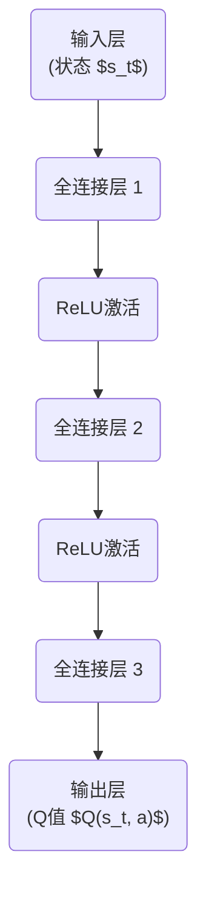

# 深度 Q-learning：未来人工智能法规的挑战

## 1. 背景介绍

### 1.1 人工智能的崛起

人工智能(AI)技术在过去几十年里取得了长足的进步,尤其是在深度学习和强化学习等领域的突破,使得AI系统能够在许多复杂任务中展现出超人类的能力。从计算机视觉、自然语言处理到游戏AI,人工智能正在渗透到我们生活的方方面面。

### 1.2 人工智能法规的必要性

随着人工智能系统在各行业的广泛应用,其决策过程的透明度和公平性受到了越来越多的质疑和关注。AI系统的决策过程往往是一个黑箱,很难被人类理解和解释。此外,一些AI系统可能会受到训练数据中存在的偏差和歧视的影响,从而做出不公平的决策。因此,制定人工智能法规以确保AI系统的可解释性、公平性和透明度变得迫在眉睫。

### 1.3 Q-learning在人工智能法规中的作用

Q-learning是一种强化学习算法,它通过试错和奖惩机制来学习最优策略。深度Q-learning(Deep Q-learning)则是将深度神经网络应用于Q-learning,使其能够处理高维、连续的状态空间。深度Q-learning在很多领域都取得了卓越的成绩,如游戏AI、机器人控制等。

在人工智能法规的背景下,深度Q-learning可以用于训练一个智能体(Agent),使其学习遵守相关法规的最优策略。通过设计合理的奖惩机制,智能体可以逐步优化其行为,最终达到符合法规要求的目标。这种方法不仅可以提高AI系统的可解释性和透明度,还能确保其决策过程的公平性和合法性。

## 2. 核心概念与联系

### 2.1 Q-learning基本概念

Q-learning是一种基于时间差分(Temporal Difference)的强化学习算法,它通过估计状态-动作对的长期回报(Q值)来学习最优策略。具体来说,Q-learning算法定义了一个Q函数,用于估计在当前状态执行某个动作后,可以获得的累计未来奖励。算法通过不断更新Q函数,逐步逼近最优Q值,从而得到最优策略。

Q-learning算法的核心更新规则如下:

$$Q(s_t, a_t) \leftarrow Q(s_t, a_t) + \alpha \left[ r_t + \gamma \max_{a} Q(s_{t+1}, a) - Q(s_t, a_t) \right]$$

其中:
- $s_t$表示当前状态
- $a_t$表示当前动作
- $r_t$表示执行动作$a_t$后获得的即时奖励
- $\alpha$是学习率
- $\gamma$是折现因子,用于权衡即时奖励和未来奖励的重要性

通过不断迭代更新Q值,Q-learning算法最终可以收敛到最优Q函数,从而得到最优策略。

### 2.2 深度Q-learning

传统的Q-learning算法在处理高维、连续状态空间时会遇到维数灾难的问题。为了解决这一问题,研究人员将深度神经网络引入到Q-learning中,提出了深度Q-learning(Deep Q-learning)算法。

在深度Q-learning中,Q函数由一个深度神经网络来拟合,其输入为当前状态,输出为各个动作对应的Q值。通过反向传播算法,神经网络可以不断调整其参数,使得输出的Q值逼近真实的Q值。

深度Q-learning的优点在于,神经网络具有强大的函数拟合能力,可以有效处理高维、连续的状态空间,同时也能捕捉状态和Q值之间的复杂非线性映射关系。

### 2.3 深度Q-learning与人工智能法规

将深度Q-learning应用于人工智能法规的核心思想是,将法规要求转化为奖惩机制,通过设计合理的奖惩函数,引导智能体学习遵守法规的最优策略。

具体来说,我们可以将法规要求转化为环境的状态,智能体的行为对应于动作。每当智能体执行一个动作,环境会根据该动作是否符合法规要求,给予相应的奖惩反馈。通过不断尝试和学习,智能体最终可以找到一个最优策略,使其在任何状态下执行的动作都能满足法规要求。

这种方法的优点在于,它不需要事先明确定义符合法规的决策规则,而是通过试错的方式自动学习出最优策略。同时,由于深度Q-learning算法的可解释性,我们可以分析神经网络的内部参数,了解智能体的决策过程,从而提高AI系统的透明度和可解释性。

## 3. 核心算法原理具体操作步骤

### 3.1 深度Q-learning算法流程

深度Q-learning算法的具体流程如下:

1. 初始化深度神经网络,用于拟合Q函数。
2. 初始化经验回放池(Experience Replay Buffer),用于存储智能体与环境的交互数据。
3. 对于每一个训练episode:
    - 初始化环境状态$s_0$
    - 对于每一个时间步$t$:
        - 根据当前状态$s_t$,使用神经网络输出各个动作对应的Q值
        - 使用$\epsilon$-贪婪策略选择动作$a_t$
        - 执行动作$a_t$,获得奖励$r_t$和新的状态$s_{t+1}$
        - 将$(s_t, a_t, r_t, s_{t+1})$存入经验回放池
        - 从经验回放池中采样一个批次的数据
        - 使用批次数据,通过反向传播算法更新神经网络参数
4. 重复步骤3,直到收敛或达到预定训练轮次

在上述流程中,关键步骤是使用经验回放池和小批量梯度下降来训练神经网络。经验回放池可以打破数据之间的相关性,提高训练效率;小批量梯度下降则可以加速收敛并提高泛化能力。

### 3.2 奖惩函数设计

在将深度Q-learning应用于人工智能法规时,奖惩函数的设计是一个关键环节。合理的奖惩函数可以有效引导智能体学习遵守法规的行为,而不当的奖惩函数则可能导致智能体学习到不合法或不公平的策略。

奖惩函数的设计需要充分考虑法规的具体要求,并将其转化为可量化的奖惩信号。一般来说,我们可以将违反法规的行为设置为受到负奖励,而遵守法规的行为则获得正奖励或无奖惩。

此外,奖惩函数还需要考虑法规违规的严重程度。例如,对于一些轻微违规行为,可以设置较小的负奖励;而对于严重违规行为,则需要给予较大的负奖励,以加强惩罚力度。

在设计奖惩函数时,我们还需要注意潜在的偏差和歧视问题。例如,如果训练数据中存在性别或种族偏差,那么智能体可能会学习到不公平的策略。因此,我们需要仔细审查训练数据,并在奖惩函数中加入相应的惩罚项,以减少偏差和歧视。

### 3.3 探索与利用的平衡

在强化学习中,探索与利用的平衡是一个重要问题。探索是指智能体尝试新的行为,以发现潜在的更好策略;而利用是指智能体根据已学习的知识,选择当前最优策略。

过多的探索可能会导致智能体花费大量时间尝试无效的行为,降低学习效率;而过多的利用则可能导致智能体陷入局部最优,无法找到全局最优策略。

在深度Q-learning算法中,我们通常采用$\epsilon$-贪婪策略来平衡探索与利用。具体来说,在每一个时间步,智能体有$\epsilon$的概率随机选择一个动作(探索),有$1-\epsilon$的概率选择当前Q值最大的动作(利用)。$\epsilon$的值通常会随着训练的进行而逐渐降低,以确保在初期有足够的探索,而在后期则更多地利用已学习的策略。

除了$\epsilon$-贪婪策略,还有其他一些方法可以用于平衡探索与利用,如软更新(Soft Updates)、熵正则化(Entropy Regularization)等。具体采用哪种方法,需要根据问题的特点和实际需求来权衡。

## 4. 数学模型和公式详细讲解举例说明

### 4.1 Q-learning更新规则

Q-learning算法的核心更新规则如下:

$$Q(s_t, a_t) \leftarrow Q(s_t, a_t) + \alpha \left[ r_t + \gamma \max_{a} Q(s_{t+1}, a) - Q(s_t, a_t) \right]$$

其中:
- $s_t$表示当前状态
- $a_t$表示当前动作
- $r_t$表示执行动作$a_t$后获得的即时奖励
- $\alpha$是学习率,控制着新信息对Q值更新的影响程度
- $\gamma$是折现因子,用于权衡即时奖励和未来奖励的重要性

让我们通过一个简单的例子来理解这个更新规则。

假设我们有一个简单的格子世界环境,智能体的目标是从起点移动到终点。每移动一步,智能体会获得-1的奖励;到达终点后,会获得+100的奖励。我们令$\gamma=0.9$,即未来奖励的权重为0.9。

在某一时刻,智能体处于状态$s_t$,执行动作$a_t$后,到达新状态$s_{t+1}$,获得即时奖励$r_t=-1$(因为只是移动了一步)。根据Q-learning更新规则,我们需要计算:

$$Q(s_t, a_t) \leftarrow Q(s_t, a_t) + \alpha \left[ -1 + 0.9 \max_{a} Q(s_{t+1}, a) - Q(s_t, a_t) \right]$$

其中,$\max_{a} Q(s_{t+1}, a)$表示在新状态$s_{t+1}$下,执行任意动作可获得的最大Q值。假设该值为80(距离终点只有一步之遥),那么上式可以进一步简化为:

$$Q(s_t, a_t) \leftarrow Q(s_t, a_t) + \alpha \left[ -1 + 0.9 \times 80 - Q(s_t, a_t) \right]$$

我们可以看到,Q值的更新不仅考虑了即时奖励$r_t$,还包括了未来可能获得的最大奖励的折现值$0.9 \times 80$。通过不断迭代这个更新过程,Q值会逐渐收敛到最优值,从而指导智能体选择最优策略。

### 4.2 深度Q网络结构

在深度Q-learning中,Q函数由一个深度神经网络来拟合。神经网络的输入是当前状态$s_t$,输出是各个动作对应的Q值$Q(s_t, a)$。

一个典型的深度Q网络结构如下所示:

在这个网络结构中,输入层接收当前状态$s_t$的特征向量。然后,数据经过多个全连接层和ReLU激活层的处理,最终在输出层得到各个动作对应的Q值$Q(s_t, a)$。

通过反向传播算法,我们可以根据Q值与目标Q值之间的差异,不断调整神经网络的参数,使得输出的Q值逼近真实的Q值。

需要注意的是,深度Q网络的具体结构(如层数、神经元数量等)需要根据问题的复杂程度和可用的计算资源来设计。一般来说,对于较简单的问题,浅层网络就可以取得不错的效果;而对于复杂问题,可能需要使用更深的网络结构。

### 4.3 经验回放池

在深度Q-learning算法