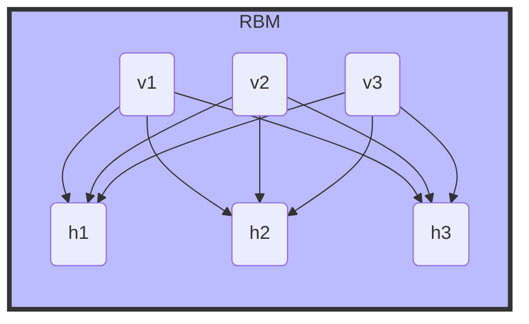
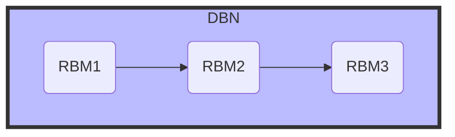

# 深度信念网络(DBN)原理与代码实战案例讲解

## 1.背景介绍

### 1.1 人工智能的发展历程

人工智能(Artificial Intelligence, AI)是当代科技发展的前沿领域,旨在使计算机系统能够模仿人类的认知功能,如学习、推理、感知、规划和问题解决等。人工智能的发展经历了几个重要阶段:

- 1950年代:人工智能的概念首次被提出,主要集中在博弈问题、逻辑推理和机器学习等领域。
- 1980年代:专家系统和知识库的兴起,推动了规则based系统的发展。
- 1990年代:机器学习算法的突破,如支持向量机(SVM)、决策树等,为数据驱动的人工智能系统奠定了基础。
- 2000年后:深度学习(Deep Learning)技术的兴起,特别是卷积神经网络(CNN)和递归神经网络(RNN)在计算机视觉和自然语言处理领域取得了巨大成功。

### 1.2 深度学习的兴起

深度学习是机器学习研究中的一个新的领域,它是一种试图通过数据建模高层抽象的方法。与传统的机器学习算法相比,深度学习可以自动从数据中学习出多层次的分层表示特征,而不需要人工设计特征。这种端到端(End-to-End)的学习方式大大降低了人工特征工程的工作量,使得人工智能系统能够处理更加复杂的问题。

深度学习的核心是构建由多个非线性处理层组成的深层次神经网络模型,并通过海量数据对网络进行训练,使之能够自动学习出有效的特征表示和模式映射。常见的深度学习模型包括卷积神经网络(CNN)、递归神经网络(RNN)、深度信念网络(DBN)等。

### 1.3 深度信念网络(DBN)概述

深度信念网络(Deep Belief Network, DBN)是一种由多个受限玻尔兹曼机(Restricted Boltzmann Machine, RBM)组成的概率生成模型。DBN由著名学者Geoffrey Hinton及其学生于2006年提出,它利用无监督的贪婪层次训练算法对深层网络进行高效的预训练,从而解决了传统神经网络训练时容易陷入局部最优的问题。

DBN具有以下优点:

- 能够从非标记数据中高效地学习出多层次的数据表示。
- 通过无监督预训练和监督微调相结合的方式,可以较好地解决深层网络训练困难的问题。
- 生成模型的特性使得DBN可以进行数据生成、异常检测等任务。
- DBN在语音识别、计算机视觉、信息检索等领域均有广泛应用。

## 2.核心概念与联系

### 2.1 受限玻尔兹曼机(RBM)

受限玻尔兹曼机(Restricted Boltzmann Machine, RBM)是DBN的基本构建单元。RBM是一种无向概率图模型,由一个可见层(Visible Layer)和一个隐藏层(Hidden Layer)组成,可见层用于表示输入数据,隐藏层则学习到输入数据的隐含特征表示。

RBM的核心思想是通过能量函数来定义可见层和隐藏层之间的联合概率分布,并利用对比散度(Contrastive Divergence)算法对模型参数进行有效训练。

在RBM中,可见层和隐藏层之间存在全连接,但同层内的节点之间没有连接,这就是"受限"的含义。这种结构使得RBM可以高效地对隐藏层的特征进行推理,并对可见层的输入数据进行重构。

### 2.2 DBN的层次结构

深度信念网络(DBN)是由多个RBM按层次结构堆叠而成的深层网络模型。DBN的基本思路是:首先使用无监督贪婪层次训练算法对DBN进行预训练,使每一层的RBM都能够较好地拟合上一层的输出;然后再对整个DBN进行有监督的微调训练,使之能够较好地完成分类或回归等任务。

在DBN中,第一层的RBM直接对原始输入数据进行建模,学习输入数据的底层特征表示;第二层的RBM则对第一层RBM的隐藏层特征进行建模,学习更高层次的特征表示;以此类推,直至构建出足够深度的网络。这种层次结构使得DBN能够从原始数据中逐层提取出越来越抽象的高层次特征表示。

### 2.3 DBN的训练过程

DBN的训练过程分为两个阶段:无监督预训练和有监督微调。

1. **无监督预训练**

   在这个阶段,DBN利用无监督的贪婪层次训练算法对每一层的RBM进行逐层预训练。具体步骤如下:
   
   a) 使用对比散度算法独立训练第一层RBM,使其能够较好地对原始输入数据进行建模。
   
   b) 将第一层RBM的隐藏层特征作为输入,训练第二层RBM的参数。
   
   c) 重复上一步,逐层训练更高层的RBM,直至最顶层。

2. **有监督微调**

   在预训练完成后,DBN将进入有监督微调阶段。这个阶段的目标是进一步优化DBN在特定任务上的性能,例如分类或回归。常用的方法是:
   
   a) 在DBN的顶层添加一个适当的输出层,如Softmax层用于分类任务。
   
   b) 使用标记数据,通过反向传播算法对整个DBN进行端到端的有监督训练。
   
   c) 在训练过程中,冻结较低层的权重,只微调较高层的权重,避免破坏预训练得到的底层特征表示。

通过无监督预训练和有监督微调相结合,DBN能够较好地解决深层网络训练困难的问题,同时利用大量未标记数据提高模型的泛化能力。

## 3.核心算法原理具体操作步骤

### 3.1 RBM的能量函数

在RBM中,可见层向量表示为\\(v\\),隐藏层向量表示为\\(h\\),则RBM的能量函数定义为:

$$E(v,h) = -\sum\limits_i\sum\limits_j W_{ij}v_ih_j - \sum\limits_i b_iv_i - \sum\limits_j c_jh_j$$

其中:
- \\(W_{ij}\\) 表示可见层节点 \\(v_i\\) 与隐藏层节点 \\(h_j\\) 之间的权重连接
- \\(b_i\\) 为可见层节点 \\(v_i\\) 的偏置项
- \\(c_j\\) 为隐藏层节点 \\(h_j\\) 的偏置项

根据能量函数,可见层与隐藏层的联合概率分布为:

$$P(v,h) = \frac{1}{Z}e^{-E(v,h)}$$

其中 \\(Z\\) 为配分函数,用于对概率进行归一化:

$$Z = \sum\limits_v\sum\limits_he^{-E(v,h)}$$

### 3.2 对比散度算法

对比散度(Contrastive Divergence, CD)算法是RBM中常用的参数估计方法,它通过构建马尔可夫链来近似最大化联合概率分布的对数似然函数。

具体的CD算法步骤如下:

1. 初始化RBM的权重矩阵 \\(W\\)、可见层偏置 \\(b\\) 和隐藏层偏置 \\(c\\)。

2. 对每个训练样本 \\(v^{(0)}\\) 执行以下操作:

   a) 基于当前参数,使用采样方法计算隐藏层条件概率 \\(P(h|v^{(0)})\\)。
   
   b) 从 \\(P(h|v^{(0)})\\) 中采样得到 \\(h^{(0)}\\)。
   
   c) 基于 \\(h^{(0)}\\),重构得到 \\(\tilde{v}^{(1)}\\),其中 \\(\tilde{v}^{(1)} \sim P(v|h^{(0)})\\)。
   
   d) 基于 \\(\tilde{v}^{(1)}\\),计算 \\(\tilde{h}^{(1)} \sim P(h|\tilde{v}^{(1)})\\)。

3. 更新参数:

   $$\begin{aligned}
   W &\leftarrow W + \alpha\left(\langle v^{(0)}h^{(0)T}\rangle - \langle\tilde{v}^{(1)}\tilde{h}^{(1)T}\rangle\right) \\
   b &\leftarrow b + \alpha\left(\langle v^{(0)}\rangle - \langle\tilde{v}^{(1)}\rangle\right) \\
   c &\leftarrow c + \alpha\left(\langle h^{(0)}\rangle - \langle\tilde{h}^{(1)}\rangle\right)
   \end{aligned}$$

   其中 \\(\alpha\\) 为学习率,\\(\langle\cdot\rangle\\) 表示数据集上的期望。

4. 重复步骤2和3,直至收敛或达到最大迭代次数。

CD算法通过构建马尔可夫链的方式,有效近似了最大化对数似然函数的梯度,从而使RBM的参数能够得到较好的估计。

### 3.3 DBN的贪婪层次训练

DBN的无监督预训练阶段采用贪婪层次训练算法,具体步骤如下:

1. 使用CD算法训练第一层RBM,将原始输入数据 \\(v\\) 作为可见层,学习到一个初始的隐藏层特征表示 \\(h^{(1)}\\)。

2. 对第二层RBM:
   - 将第一层RBM的隐藏层特征 \\(h^{(1)}\\) 作为可见层输入
   - 使用CD算法训练第二层RBM,学习到更高层次的隐藏层特征表示 \\(h^{(2)}\\)

3. 重复步骤2,逐层训练更高层的RBM,直至构建出足够深度的网络。

通过这种逐层贪婪训练的方式,DBN能够高效地从原始数据中学习出多层次的特征表示,为后续的有监督微调奠定基础。

### 3.4 DBN的有监督微调

在完成无监督预训练后,DBN将进入有监督微调阶段,以进一步提高模型在特定任务上的性能。具体步骤如下:

1. 在DBN的顶层添加一个适当的输出层,如对于分类任务,可以添加一个Softmax层。

2. 使用标记训练数据集 \\(\{(x^{(i)}, y^{(i)})\}\\),其中 \\(x^{(i)}\\) 为输入数据, \\(y^{(i)}\\) 为对应的标记。

3. 通过反向传播算法对整个DBN进行端到端的有监督训练,目标是最小化损失函数(如交叉熵损失):

   $$J(\theta) = -\frac{1}{m}\sum\limits_{i=1}^m\sum\limits_k y_k^{(i)}\log p_k(x^{(i)};\theta)$$

   其中 \\(\theta\\) 为DBN的所有可训练参数, \\(p_k(x;\theta)\\) 为输出层对样本 \\(x\\) 预测为第 \\(k\\) 类的概率。

4. 在训练过程中,冻结较低层的权重,只微调较高层的权重,避免破坏预训练得到的底层特征表示。

5. 使用验证集监控训练过程,防止过拟合。可以采用提前停止(Early Stopping)等正则化技术。

通过有监督微调,DBN能够在保留