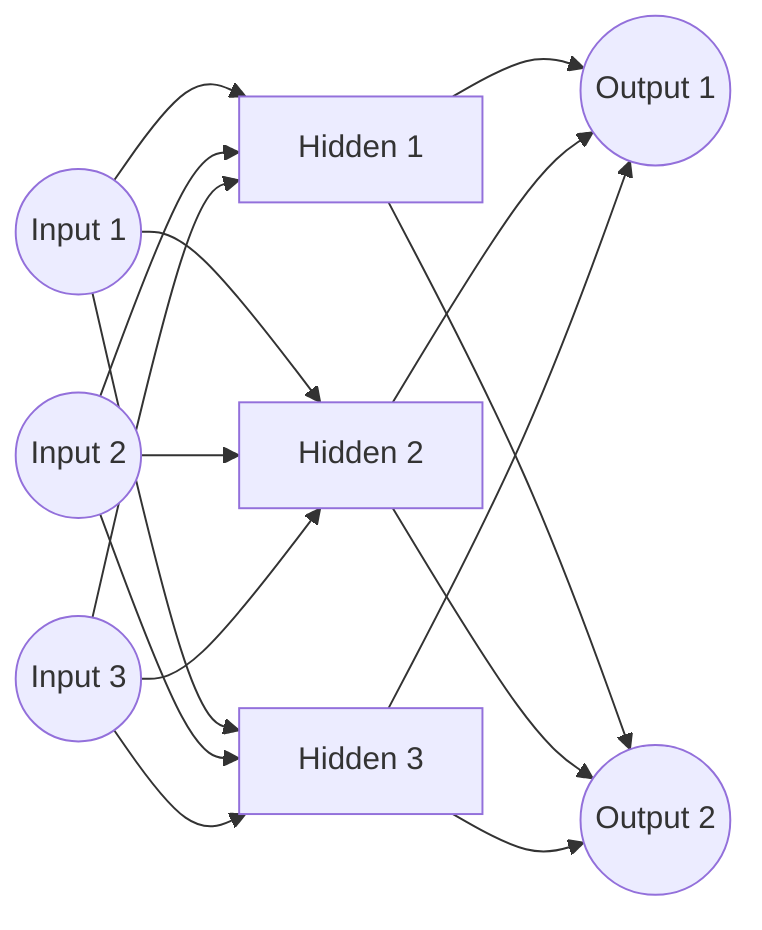
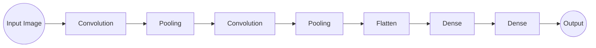
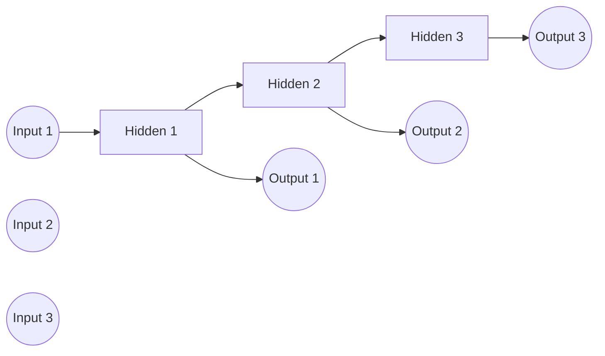

# 深度学习 原理与代码实例讲解

## 1. 背景介绍

### 1.1 什么是深度学习?

深度学习(Deep Learning)是机器学习的一个新兴热门领域,它是一种基于对数据的表示学习特征的机器学习算法。深度学习的动机在于构建、模拟人脑进行分析和学习的神经网络,它可以对庞大、高维、复杂的数据进行有效处理和学习。

### 1.2 深度学习的发展历程

深度学习的概念可以追溯到20世纪60年代,当时的神经网络研究工作为深度学习奠定了基础。然而,由于计算能力和训练数据的限制,神经网络一直未能得到有效发展。直到近年来,大数据时代的到来、硬件计算能力的飞速提升以及一些突破性算法的提出,深度学习才得以蓬勃发展并在多个领域取得了令人瞩目的成就。

### 1.3 深度学习的应用领域

深度学习在计算机视觉、自然语言处理、语音识别、推荐系统等领域表现出色,并被广泛应用于无人驾驶、医疗诊断、智能安防等各个行业。随着算力的不断增强和算法的持续优化,深度学习的应用场景将越来越广泛。

## 2. 核心概念与联系

### 2.1 神经网络

神经网络是深度学习的核心基础,它是一种模拟生物神经网络进行信息处理的数学模型。神经网络由大量互连的节点(神经元)组成,每个节点会接收输入信号,经过加权求和和激活函数处理后输出信号。

### 2.2 前馈神经网络

前馈神经网络(Feedforward Neural Network)是最基本的神经网络结构,信号只从输入层单向传递到输出层,中间可以包含一个或多个隐藏层。每个神经元只与上一层所有神经元相连,不存在同层或跨层连接。



### 2.3 卷积神经网络

卷积神经网络(Convolutional Neural Network, CNN)是一种专门用于处理网格结构数据(如图像)的神经网络。它通过卷积、池化等操作自动学习数据的特征表示,在计算机视觉等领域表现出色。



### 2.4 循环神经网络

循环神经网络(Recurrent Neural Network, RNN)是一种对序列数据(如文本、语音)建模的神经网络。它通过内部循环连接来处理序列信息,适用于自然语言处理、语音识别等领域。



### 2.5 长短期记忆网络

长短期记忆网络(Long Short-Term Memory, LSTM)是一种改进的RNN,通过设计特殊的门控机制来解决传统RNN存在的梯度消失/爆炸问题,在处理长序列数据时表现更加出色。

### 2.6 生成对抗网络

生成对抗网络(Generative Adversarial Network, GAN)由一个生成器网络和一个判别器网络组成。生成器从随机噪声中生成样本,判别器则判断样本是真实数据还是生成数据。两个网络相互对抗训练,最终使生成器能够生成逼真的数据。

## 3. 核心算法原理具体操作步骤  

### 3.1 前馈神经网络训练

1. **网络初始化**：根据输入、隐藏层和输出的维度随机初始化网络的权重和偏置。
2. **前向传播**：输入样本通过网络层层传递,每个神经元进行加权求和和激活函数计算,得到输出结果。
3. **计算损失**：将输出结果与真实标签计算损失函数(如均方误差)。
4. **反向传播**：根据链式法则,计算每个权重的损失梯度,自后向前层层传播。
5. **权重更新**：使用优化算法(如梯度下降)根据梯度更新网络权重。
6. **重复训练**：重复2-5步骤,直至网络收敛或达到最大迭代次数。

### 3.2 卷积神经网络训练

1. **输入处理**：将输入图像数据转换为适当的张量形式。
2. **卷积层**：在输入上应用多个卷积核,提取不同的特征图。
3. **池化层**：对特征图进行下采样,减小数据量,提取主要特征。
4. **全连接层**：将池化层的输出展平,连接到全连接层进行分类或回归。
5. **损失计算**：计算输出与真实标签之间的损失函数。
6. **反向传播**：计算每个权重的损失梯度,自后向前层层传播。
7. **权重更新**：使用优化算法根据梯度更新网络权重。
8. **重复训练**：重复2-7步骤,直至网络收敛或达到最大迭代次数。

### 3.3 循环神经网络训练

1. **输入处理**：将输入序列数据转换为适当的张量形式。
2. **序列输入**：将序列数据一个时间步一个时间步地输入到RNN中。
3. **前向计算**：在每个时间步,RNN根据当前输入和上一时间步的隐藏状态计算新的隐藏状态和输出。
4. **损失计算**：将最后一个时间步的输出与真实标签计算损失函数。
5. **反向传播**：通过反向传播算法计算每个时间步的梯度。
6. **权重更新**：使用优化算法根据梯度更新网络权重。
7. **重复训练**：重复2-6步骤,直至网络收敛或达到最大迭代次数。

### 3.4 生成对抗网络训练

1. **生成器初始化**：从随机噪声开始,生成器尝试生成逼真的样本数据。
2. **判别器训练**：将生成器生成的样本和真实数据输入到判别器,判别器学习区分真伪。
3. **生成器训练**：固定判别器权重,训练生成器使其生成的样本能够"欺骗"判别器。
4. **重复训练**：重复2-3步骤,生成器和判别器相互对抗,最终达到生成器生成逼真样本,判别器无法区分真伪的状态。

## 4. 数学模型和公式详细讲解举例说明

### 4.1 神经网络模型

对于单个神经元,输入向量$\vec{x} = (x_1, x_2, \ldots, x_n)$,权重向量$\vec{w} = (w_1, w_2, \ldots, w_n)$,偏置项$b$,激活函数$f$,则神经元的输出为:

$$o = f(\vec{w} \cdot \vec{x} + b)$$

对于含有$L$层的全连接神经网络,第$l$层的输出向量$\vec{h}^{(l)}$可表示为:

$$\vec{h}^{(l)} = f(\vec{W}^{(l)}\vec{h}^{(l-1)} + \vec{b}^{(l)})$$

其中$\vec{W}^{(l)}$为第$l$层的权重矩阵,$\vec{b}^{(l)}$为第$l$层的偏置向量。

常用的激活函数包括Sigmoid函数、Tanh函数和ReLU函数等:

$$
\text{Sigmoid}(x) = \frac{1}{1 + e^{-x}}
$$

$$
\tanh(x) = \frac{e^x - e^{-x}}{e^x + e^{-x}}
$$

$$
\text{ReLU}(x) = \max(0, x)
$$

### 4.2 卷积神经网络模型

在卷积神经网络中,卷积层的计算过程可表示为:

$$
\text{Conv}(X, W)_{x,y,c} = \sum_{i=1}^{H} \sum_{j=1}^{W} \sum_{k=1}^{C} X_{x+i-1, y+j-1, k} \cdot W_{i,j,k,c}
$$

其中$X$为输入特征图,$W$为卷积核权重张量,$H$、$W$、$C$分别为卷积核的高度、宽度和通道数。

池化层通常使用最大池化或平均池化操作,将特征图的尺寸缩小一半:

$$
\text{MaxPool}(X)_{x,y,c} = \max_{i=1 \ldots 2, j=1 \ldots 2} X_{2x+i-1, 2y+j-1, c}
$$

$$
\text{AvgPool}(X)_{x,y,c} = \frac{1}{4} \sum_{i=1}^{2} \sum_{j=1}^{2} X_{2x+i-1, 2y+j-1, c}
$$

### 4.3 循环神经网络模型

对于一个简单的RNN,在时间步$t$,输入为$x_t$,隐藏状态为$h_t$,则状态转移方程为:

$$h_t = f(U x_t + W h_{t-1})$$

其中$U$为输入到隐藏层的权重矩阵,$W$为隐藏层到隐藏层的权重矩阵,$f$为激活函数。

对于LSTM,它引入了三个门控单元(遗忘门、输入门和输出门)来控制信息的流动,状态转移方程为:

$$
\begin{aligned}
f_t &= \sigma(W_f \cdot [h_{t-1}, x_t] + b_f) \\
i_t &= \sigma(W_i \cdot [h_{t-1}, x_t] + b_i) \\
\tilde{C}_t &= \tanh(W_C \cdot [h_{t-1}, x_t] + b_C) \\
C_t &= f_t \odot C_{t-1} + i_t \odot \tilde{C}_t \\
o_t &= \sigma(W_o \cdot [h_{t-1}, x_t] + b_o) \\
h_t &= o_t \odot \tanh(C_t)
\end{aligned}
$$

其中$\sigma$为Sigmoid函数,$\odot$为元素wise乘积操作。

### 4.4 生成对抗网络模型

生成对抗网络由生成器$G$和判别器$D$组成,目标函数为:

$$\min_G \max_D V(D,G) = \mathbb{E}_{x \sim p_{\text{data}}(x)}[\log D(x)] + \mathbb{E}_{z \sim p_z(z)}[\log(1 - D(G(z)))]$$

其中$p_{\text{data}}(x)$为真实数据分布,$p_z(z)$为噪声先验分布。

对于生成器$G$,目标是最小化$\log(1 - D(G(z)))$,使生成的数据$G(z)$被判别器$D$判断为真实数据;对于判别器$D$,目标是最大化$\log D(x)$和$\log(1 - D(G(z)))$,正确区分真实数据和生成数据。

## 5. 项目实践: 代码实例和详细解释说明

### 5.1 前馈神经网络实现

以Python的Pytorch框架为例,实现一个简单的前馈神经网络:

```python
import torch
import torch.nn as nn

# 定义网络结构
class FeedforwardNet(nn.Module):
    def __init__(self, input_size, hidden_size, output_size):
        super(F