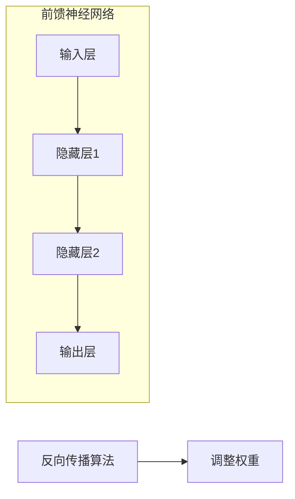
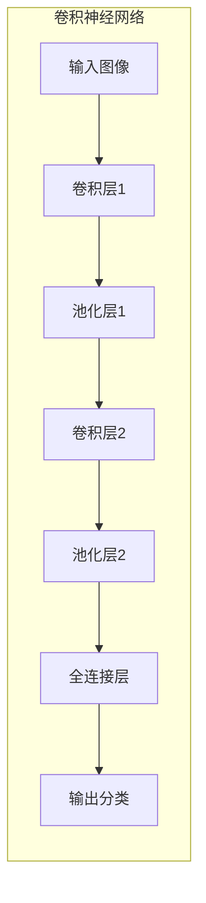
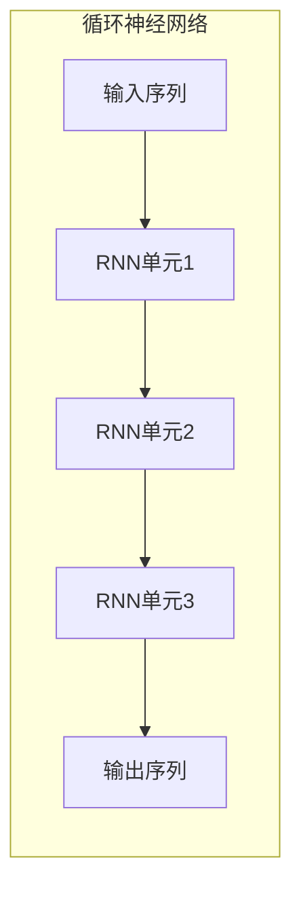
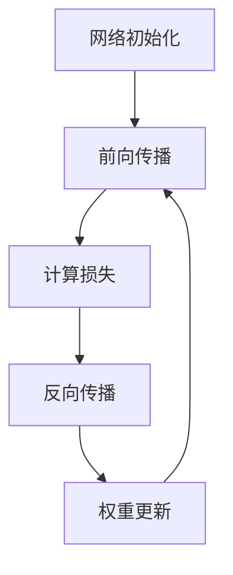
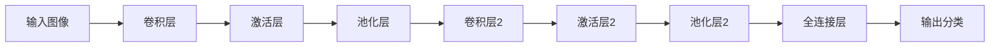

# 深度学习原理与代码实例讲解

## 1. 背景介绍

### 1.1 什么是深度学习?

深度学习(Deep Learning)是机器学习的一个新兴热门领域,它源于人工神经网络的研究,是一种试图通过数据建模来模拟人类大脑分析学习的方式。深度学习模型能够从大量数据中自动学习数据特征模式,并用于检测、分类、预测等任务。

### 1.2 深度学习的发展历程

深度学习的理论基础可以追溯到20世纪60年代提出的人工神经网络,但由于计算能力和训练数据的限制,很长时间里并未取得实质性突破。直到近年来,大数据时代的到来、硬件计算能力的飞速提升,以及一些新算法的提出(如反向传播算法的改进),才使得深度学习模型在语音识别、图像识别、自然语言处理等领域取得了突破性进展。

### 1.3 深度学习的应用前景

随着人工智能技术的不断发展,深度学习正在广泛应用于计算机视觉、自然语言处理、推荐系统、机器人控制等诸多领域,为人类生产生活带来了巨大变革。未来,深度学习必将成为推动人工智能发展的核心动力之一。

## 2. 核心概念与联系

### 2.1 人工神经网络

人工神经网络(Artificial Neural Network)是深度学习的理论基础,它是对生物神经网络的模拟和抽象。一个神经网络由大量的神经元(节点)和连接它们的带权重的边组成。每个神经元接收来自其他神经元的加权输入信号,并通过激活函数产生输出信号。

### 2.2 前馈神经网络与反向传播算法

前馈神经网络(Feedforward Neural Network)是最基本的神经网络结构,信号只从输入层单向传播到输出层,不存在环路。反向传播算法(Back Propagation)是训练多层前馈神经网络的核心算法,它通过计算损失函数对网络权重的梯度,利用梯度下降法不断调整网络参数,使网络输出逐渐逼近期望输出。



### 2.3 卷积神经网络

卷积神经网络(Convolutional Neural Network, CNN)是一种专门用于处理网格结构数据(如图像)的神经网络。它包含卷积层(用于提取局部特征)、池化层(用于降低特征维度)和全连接层。CNN在图像识别、视频分析等领域有着广泛应用。



### 2.4 循环神经网络

循环神经网络(Recurrent Neural Network, RNN)是一种专门用于处理序列数据(如语音、文本)的神经网络。与前馈网络不同,RNN中的节点之间存在环路,能够捕捉序列数据中的长期依赖关系。长短期记忆网络(Long Short-Term Memory, LSTM)是RNN的一种改进变体,通过门控机制解决了梯度消失/爆炸问题。



## 3. 核心算法原理具体操作步骤

### 3.1 前馈神经网络训练步骤

1. **网络初始化**：随机初始化网络权重和偏置。
2. **前向传播**：输入样本数据,计算网络每一层的输出。
3. **计算损失**：将网络最终输出与期望输出计算损失函数值。
4. **反向传播**：利用链式法则,计算损失函数对每个权重的梯度。
5. **权重更新**：利用梯度下降法,更新网络中所有权重和偏置。
6. **重复步骤2-5**:对训练数据重复上述过程,直至网络收敛。



### 3.2 卷积神经网络前向传播步骤

1. **输入层**：接收原始图像数据。
2. **卷积层**：通过滑动卷积核对图像进行卷积操作,提取局部特征。
3. **激活层**：对卷积结果应用非线性激活函数(如ReLU)。
4. **池化层**：通过最大/平均池化操作,降低特征维度。
5. **重复2-4**：堆叠多个卷积层和池化层,逐层提取更高级的特征。
6. **全连接层**：将最终特征映射到分类输出空间。



### 3.3 循环神经网络前向传播步骤

1. **输入层**：接收序列数据的第一个时间步输入。
2. **RNN单元**：计算当前时间步隐藏状态,并传递到下一时间步。
3. **重复步骤2**：对序列中的每个时间步重复上述过程。
4. **输出层**：根据最终时间步的隐藏状态,输出预测结果。


## 4. 数学模型和公式详细讲解举例说明

### 4.1 神经网络基本数学模型

神经网络的基本运算单元是人工神经元,它接收多个加权输入信号,并通过激活函数产生输出信号。设第 $j$ 个神经元的输入为 $x_1, x_2, \ldots, x_n$,对应的权重为 $w_1, w_2, \ldots, w_n$,偏置为 $b$,激活函数为 $f$,则该神经元的输出 $y_j$ 可表示为:

$$y_j = f\left(\sum_{i=1}^n w_i x_i + b\right)$$

常用的激活函数包括Sigmoid函数、tanh函数和ReLU函数等。

### 4.2 反向传播算法

反向传播算法是训练多层神经网络的核心算法,它通过计算损失函数对网络权重的梯度,并利用梯度下降法更新网络参数。设网络输出为 $\hat{y}$,期望输出为 $y$,损失函数为 $L(\hat{y}, y)$,则对于第 $l$ 层第 $j$ 个神经元的权重 $w_{ij}^{(l)}$,其梯度可表示为:

$$\frac{\partial L}{\partial w_{ij}^{(l)}} = \frac{\partial L}{\partial \hat{y}} \cdot \frac{\partial \hat{y}}{\partial z^{(l)}} \cdot \frac{\partial z^{(l)}}{\partial w_{ij}^{(l)}}$$

其中 $z^{(l)}$ 为第 $l$ 层神经元的加权输入。通过链式法则反向计算每一层的梯度,并利用梯度下降法更新网络参数。

### 4.3 卷积神经网络数学模型

卷积运算是CNN的核心操作,它通过在输入数据上滑动卷积核,提取局部特征。设输入特征图为 $X$,卷积核为 $K$,则卷积运算可表示为:

$$Y(i, j) = \sum_{m} \sum_{n} X(i+m, j+n) \cdot K(m, n)$$

其中 $(i, j)$ 为输出特征图的坐标,$(m, n)$ 为卷积核的坐标。通过堆叠多个卷积层和池化层,CNN能够逐层提取更高级的特征表示。

### 4.4 循环神经网络数学模型

RNN通过引入环路结构,能够捕捉序列数据中的长期依赖关系。设第 $t$ 时间步的输入为 $x_t$,隐藏状态为 $h_t$,则 RNN 单元的计算过程可表示为:

$$h_t = f(W_{hh} h_{t-1} + W_{xh} x_t + b_h)$$
$$y_t = g(W_{hy} h_t + b_y)$$

其中 $f$ 和 $g$ 分别为隐藏层和输出层的激活函数,各个权重矩阵 $W$ 和偏置向量 $b$ 是需要训练的参数。LSTM 通过引入门控机制,能够更好地捕捉长期依赖关系。

## 5. 项目实践:代码实例和详细解释说明

### 5.1 基于PyTorch的前馈神经网络实现

```python
import torch
import torch.nn as nn

# 定义网络结构
class FeedforwardNet(nn.Module):
    def __init__(self, input_size, hidden_size, output_size):
        super(FeedforwardNet, self).__init__()
        self.fc1 = nn.Linear(input_size, hidden_size)
        self.relu = nn.ReLU()
        self.fc2 = nn.Linear(hidden_size, output_size)

    def forward(self, x):
        out = self.fc1(x)
        out = self.relu(out)
        out = self.fc2(out)
        return out

# 创建网络实例
net = FeedforwardNet(input_size=10, hidden_size=20, output_size=5)

# 定义损失函数和优化器
criterion = nn.CrossEntropyLoss()
optimizer = torch.optim.SGD(net.parameters(), lr=0.01)

# 训练循环
for epoch in range(100):
    inputs = torch.randn(64, 10)  # 批量输入数据
    targets = torch.randint(5, (64,))  # 批量目标输出

    optimizer.zero_grad()
    outputs = net(inputs)
    loss = criterion(outputs, targets)
    loss.backward()
    optimizer.step()

    if (epoch + 1) % 10 == 0:
        print(f'Epoch [{epoch+1}/100], Loss: {loss.item():.4f}')
```

上述代码定义了一个简单的前馈神经网络,包含一个隐藏层。通过 PyTorch 的 `nn.Module` 和 `nn.Linear` 模块,我们可以方便地构建网络结构。在训练过程中,我们使用随机生成的输入数据和目标输出,计算损失函数(这里使用交叉熵损失),并通过反向传播和梯度下降法更新网络参数。

### 5.2 基于TensorFlow的卷积神经网络实现

```python
import tensorflow as tf
from tensorflow.keras.models import Sequential
from tensorflow.keras.layers import Conv2D, MaxPooling2D, Flatten, Dense

# 定义网络结构
model = Sequential([
    Conv2D(32, (3, 3), activation='relu', input_shape=(28, 28, 1)),
    MaxPooling2D((2, 2)),
    Conv2D(64, (3, 3), activation='relu'),
    MaxPooling2D((2, 2)),
    Flatten(),
    Dense(64, activation='relu'),
    Dense(10, activation='softmax')
])

# 编译模型
model.compile(optimizer='adam',
              loss='sparse_categorical_crossentropy',
              metrics=['accuracy'])

# 加载数据并训练
(x_train, y_train), (x_test, y_test) = tf.keras.datasets.mnist.load_data()
x_train = x_train.reshape(-1, 28, 28, 1) / 255.0
x_test = x_test.reshape(-1, 28, 28, 1) / 255.0

model.fit(x_train, y_train, epochs=5, batch_size=64, validation_data=(x_test, y_test))
```

上述代码使用 TensorFlow 的 Keras API 构建了一个用于手写数字识别的卷积神经网络。网络包含两个卷积层、两个池化层和两个全连接层。我们首先定义网络结构,然后编译模型并指定优化器、损失函数和